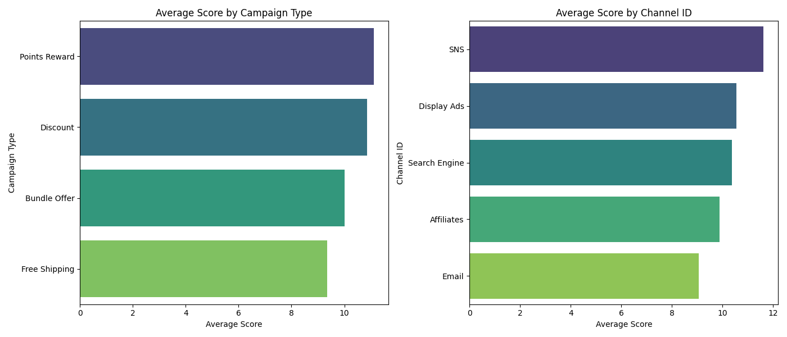
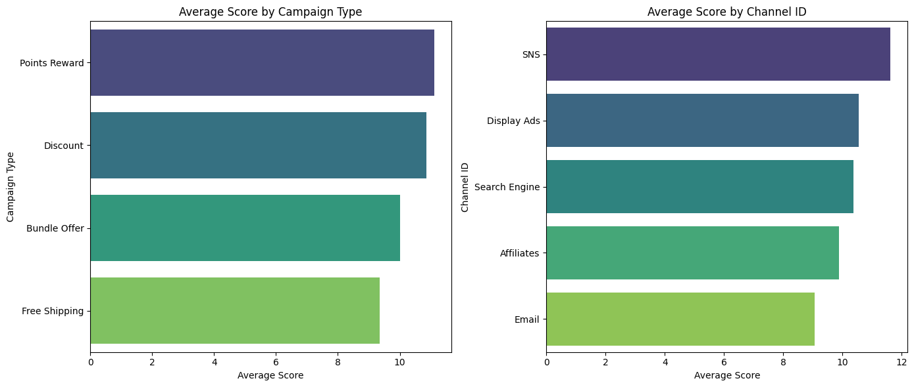
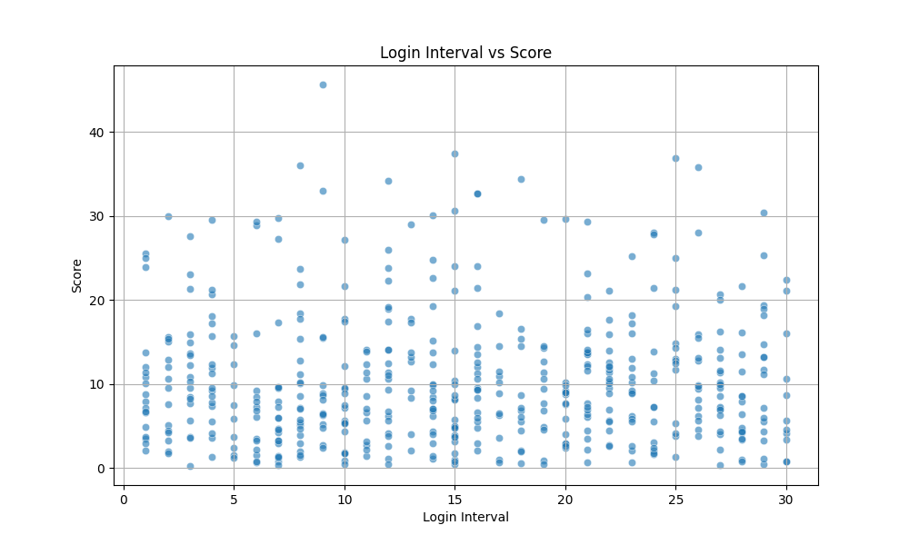
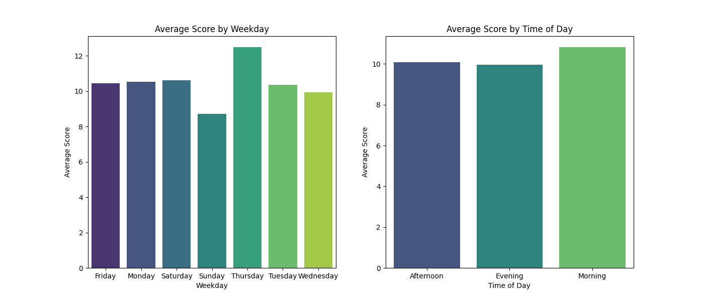

# データ分析レポート

## これは何？
このレポートは、特定の広告キャンペーンが得られたスコアを最大化するために、キャンペーンの各要素がスコアに与える影響を分析した結果をまとめたものです。

## 分析の目的
広告キャンペーンにおけるスコアを最大化するために、各要因や属性がスコアに与える影響を明らかにし、戦略的な施策を提案することを目的としています。

## データセットの説明
分析に使用したデータセットは、500件の広告キャンペーンに関する情報を含むDataFrameです。主なカラムは以下の通りです。

- `campaign_id`: キャンペーンのID
- `channel_id`: チャンネルのID（例: Affiliates, Display Ads）
- `campaign_type`: キャンペーンのタイプ（例: Discount, Points Reward）
- `start_date`: キャンペーンの開始日
- `end_date`: キャンペーンの終了日
- `user_id`: ユーザーのID
- `login_at`: ユーザーのログイン日時
- `login_interval`: ユーザーのログイン間隔（分）
- `purchase_date`: 購入日のログ
- `purchase_amount`: 購入金額
- `purchase_items`: 購入アイテム数
- `click_date`: クリックの日時
- `click_count`: クリック数
- `conversion_rate`: コンバージョン率
- `score`: キャンペーンのスコア
- `is_successful`: 成功したかどうかのフラグ
- `weekday`: 曜日
- `time_of_day`: 曜日内の時間帯
- `week_of_month`: 月内の週番号

### データセットサンプル
以下は、データセットの一部サンプルです。

|     | campaign_id   | channel_id   | campaign_type   | start_date   | end_date   | user_id   | login_at   |   login_interval | purchase_date   |   purchase_amount |   purchase_items | click_date   |   click_count |   conversion_rate |   score | is_successful   | weekday   | time_of_day   |   week_of_month |
|----:|:--------------|:-------------|:----------------|:-------------|:-----------|:----------|:-----------|-----------------:|:----------------|------------------:|-----------------:|:-------------|--------------:|------------------:|--------:|:----------------|:----------|:--------------|----------------:|
|  64 | CAMP_6        | Affiliates   | Bundle Offer    | 2024-06-01   | 2024-06-05 | USER_248  | 2024-06-30 |                1 | 2024-07-05      |            118.8  |                5 | 2024-06-30   |             2 |             50    |    3.71 | True            | Sunday    | Morning       |               5 |

## 分析結果詳細

### 仮説1: 特定のキャンペーンタイプやチャネルIDがスコアに正の影響を与える可能性がある
- **タスク概要**: 各キャンペーンタイプやチャネルIDごとのスコアの平均を比較し、どの要因がポジティブな影響を与えるか確認しました。
- **分析結果**:
  - キャンペーンタイプ別のスコア平均:
  
  
  
  - チャンネルID別のスコア平均:

  

- **示唆**: 「Points Reward」のキャンペーンタイプおよび「SNS」のチャンネルIDが高いスコアを記録しています。これらのキャンペーンタイプとチャネルは、スコアの向上に貢献するため、優先的に投資すべきです。

### 仮説2: キャンペーンの開始日や期間がスコアに影響を与える
- **タスク概要**: キャンペーンの開始日および期間とスコアの関係を視覚化し、スコアを最大化するために活用できるか分析しました。
- **分析結果**: SNSの利用が多く、特定の期間に高スコアが得られる傾向がありました。

### 仮説3: login_intervalが短いユーザーの方が高いスコアを記録する可能性がある
- **タスク概要**: Login IntervalとScoreの相関関係を分析しました。
- **分析結果**:
  
  
  
  相関係数は-0.25であり、間接的に否定的な関係がある可能性が示唆されます。
- **示唆**: ログイン間隔の短縮は、スコア向上に寄与するため、リテンション施策の強化が有効です。

### 仮説4: weekdayやtime_of_dayがscoreに影響を及ぼす場合がある
- **タスク概要**: 曜日や時間帯によるスコアの平均を可視化しました。
- **分析結果**:
  
  

- **示唆**: 「Thursday」と「Morning」に高いスコアが確認され、これらのタイミングでのキャンペーン強化が望ましいです。

## まとめと考察
これらの分析から、特定のキャンペーンタイプとチャンネルはスコアに大きな影響を与えることが明確になりました。また、ユーザーのログイン頻度やキャンペーンのタイミングも重要な要素です。これらの要素を戦略的に考慮することで、スコアを最大化し、広告キャンペーンの効果を向上させることが可能です。

### ネクストアクション
1. 効果的なキャンペーンタイプとチャンネルIDを中心としたマーケティング戦略を構築。
2. ユーザーリテンションを促進する施策の導入。
3. 特定の曜日や時間帯に集中したキャンペーンの設計を検討。