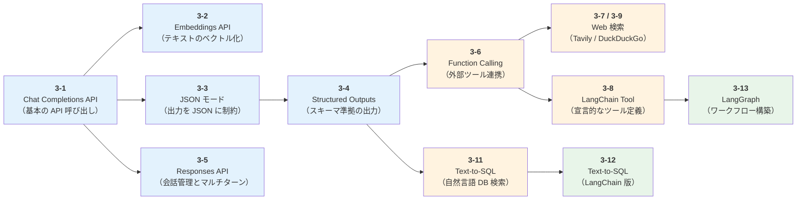
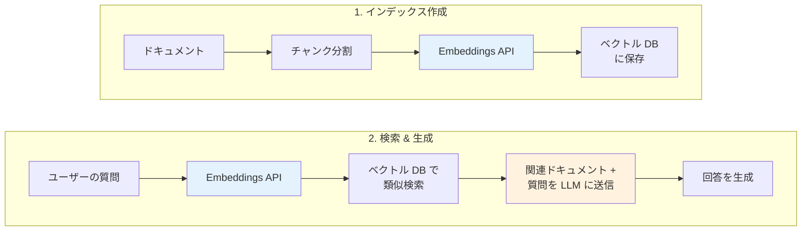
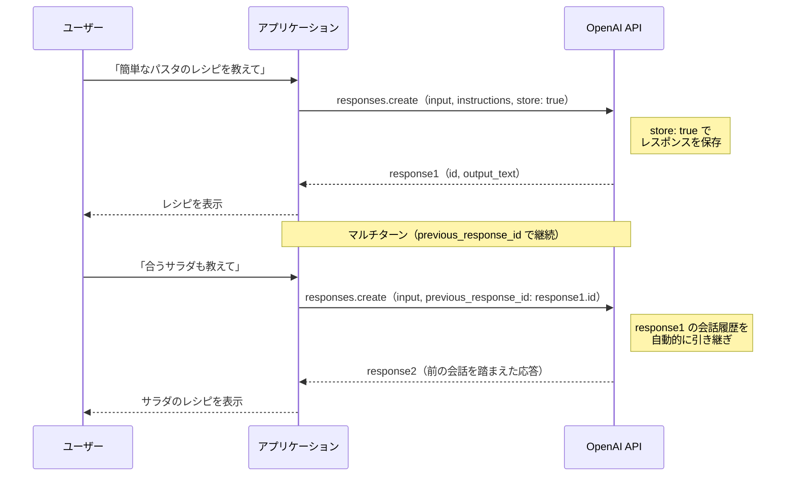
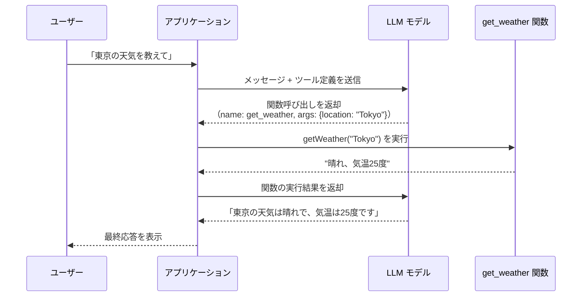
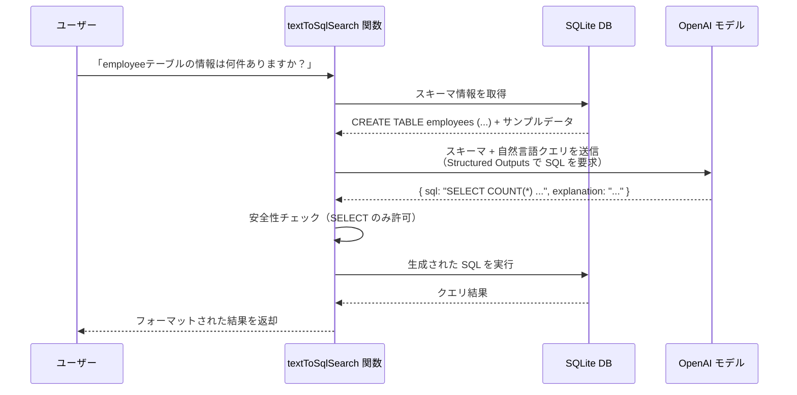
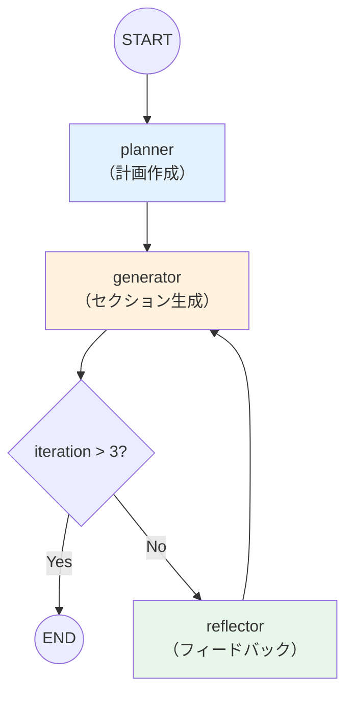
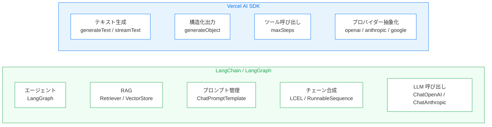

import Tabs from '@theme/Tabs';
import TabItem from '@theme/TabItem';

# Chapter 3: AIエージェントの開発準備

この章では、AI エージェントを構築するための土台となる LLM API の基本的な使い方を、実際のコードを動かしながら学んでいきます。主に OpenAI を中心に解説しますが、一部のセクション（3-1、3-2、3-4、3-6）では **Google Gemini** や **Anthropic Claude** の API も併せて紹介します。同じタスクを異なるプロバイダーで実装することで、API 設計の共通点や差異を実感できる構成です。
[Chapter 2](./chapter2.md) で解説した「プロフィール」「メモリ」「ツール」「プランニング」の各コンポーネントが、API レベルではどのように実現されるのかを体感できる内容になっています。

:::note この章で学ぶこと

- **Chat Completions API** の基本的な呼び出し方とトークン使用量の確認
- **Embeddings API** によるテキストのベクトル化とコサイン類似度の計算
- **JSON モード**と **Structured Outputs** による構造化された出力の取得
- **Responses API** による会話管理とマルチターン対話
- **Function Calling** を使った外部ツールとの連携パターン
- **Tavily API** を使った AI エージェント向けの Web 検索
- **LangChain** の `tool` ヘルパーによるカスタム Tool 定義
- **DuckDuckGo** を使った無料の Web 検索とページ取得
- **Text-to-SQL** による自然言語からの SQL クエリ生成と検索
- **LangChain** による Text-to-SQL の簡素化（`ChatPromptTemplate` + `withStructuredOutput`）
- **LangGraph** による有向グラフワークフローの構築（Plan-Generate-Reflect パターン）

:::

## 概要

### 学習の流れ

この章のセクションは、以下のように段階的に学べる構成になっています。前半で API の基本と出力形式を押さえ、後半でツール連携と実践的な活用に進みます。



:::info 前提条件

- 環境変数 `OPENAI_API_KEY` に OpenAI の API キーが設定されていること
- 3-1, 3-2, 3-4, 3-6 で Gemini の例を実行する場合、環境変数 `GOOGLE_API_KEY` に [Google AI Studio](https://aistudio.google.com/) の API キーが設定されていること
- 3-1, 3-4, 3-6 で Claude の例を実行する場合、環境変数 `ANTHROPIC_API_KEY` に [Anthropic Console](https://console.anthropic.com/) の API キーが設定されていること
- 3-7 のみ、環境変数 `TAVILY_API_KEY` に Tavily の API キーが設定されていること
- 3-11 のみ、`better-sqlite3` パッケージがインストールされていること（`pnpm install` で自動インストール）
- 3-12 のみ、`@langchain/openai` パッケージが追加で必要（`pnpm install` で自動インストール）
- 3-13 のみ、`@langchain/langgraph` および `@langchain/openai` パッケージが追加で必要（`pnpm install` で自動インストール）

:::

### サンプルコードの実行方法

各サンプルは、リポジトリのルートディレクトリから以下のコマンドで実行できます。

```bash
# ルートディレクトリで実行（pnpm tsx は @ai-suburi/core パッケージ内で tsx を実行するエイリアス）
pnpm tsx chapter3/<ファイル名>.ts
```

## 3-1. Chat Completions API

Chat Completions API（チャット API）は、LLM と対話するための最も基本的な API です。
AI エージェントを構築する際、すべての対話はこの API を通じて行われるため、まずここでの基本操作をしっかり押さえておくことが重要です。

`messages` 配列にロール（`system`, `user`, `assistant`）とメッセージを渡すことで、モデルからの応答を取得できます。各ロールの役割は以下のとおりです。

| ロール | 役割 |
| --- | --- |
| `system` | モデルの振る舞いやルールを設定する指示（例: 「あなたは親切なアシスタントです」） |
| `user` | ユーザーからの入力メッセージ |
| `assistant` | モデルからの応答。会話履歴として渡すことで、文脈を維持した対話が可能になる |

このサンプルでは以下を行います。

- モデルへのメッセージ送信
- 応答テキストの取得
- トークン使用量（プロンプト / 生成 / 合計）の確認

:::info トークンとは？
トークンは、モデルがテキストを処理する際の最小単位です。英語では 1 単語が約 1 トークン、日本語ではひらがな 1 文字が約 1 トークンに相当します。API の利用料金はトークン数に基づいて計算されるため、使用量の確認は重要です。
:::

### プロバイダー別の比較

| 項目 | OpenAI | Gemini | Claude |
| --- | --- | --- | --- |
| SDK | `openai` | `@google/genai` | `@anthropic-ai/sdk` |
| モデル | `gpt-4o` | `gemini-2.5-flash` | `claude-sonnet-4-5-20250929` |
| 入力形式 | `messages` 配列（ロール + メッセージ） | `contents`（文字列またはメッセージ配列） | `messages` 配列（ロール + メッセージ） |
| 応答の取得 | `response.choices[0].message.content` | `response.text` | `response.content[0].text` |
| トークン使用量 | `response.usage` | `response.usageMetadata` | `response.usage` |

<Tabs groupId="llm-provider">
<TabItem value="openai" label="OpenAI" default>

OpenAI では `client.chat.completions.create()` を使い、`messages` 配列にロールとメッセージを渡します。レスポンスの `choices[0].message.content` から応答テキストを取得できます。

```typescript title="chapter3/test3-1-chat-completions-api.ts"
import OpenAI from 'openai';

// クライアントを定義
const client = new OpenAI({
  apiKey: process.env.OPENAI_API_KEY,
});

// Chat Completion APIの呼び出し例
async function main() {
  const response = await client.chat.completions.create({
    model: 'gpt-4o',
    messages: [
      { role: 'user', content: 'こんにちは、今日はどんな天気ですか？' },
    ],
  });

  // 応答内容を出力
  console.log('Response:', response.choices[0]?.message.content, '\n');

  // 消費されたトークン数の表示
  const tokensUsed = response.usage;
  console.log('Prompt Tokens:', tokensUsed?.prompt_tokens);
  console.log('Completion Tokens:', tokensUsed?.completion_tokens);
  console.log('Total Tokens:', tokensUsed?.total_tokens);
  console.log(
    'Completion_tokens_details:',
    tokensUsed?.completion_tokens_details,
  );
  console.log('Prompt_tokens_details:', tokensUsed?.prompt_tokens_details);
}

main();
```

**実行方法:**

```bash
pnpm tsx chapter3/test3-1-chat-completions-api.ts
```

**実行結果の例:**

```text
Response: こんにちは！私はAIなので天気を直接確認する手段はありませんが、...

Prompt Tokens: 25
Completion Tokens: 80
Total Tokens: 105
Completion_tokens_details: { reasoning_tokens: 0, ... }
Prompt_tokens_details: { cached_tokens: 0, ... }
```

</TabItem>
<TabItem value="gemini" label="Gemini">

Gemini では `ai.models.generateContent()` を使い、`contents` に文字列を直接渡すシンプルな API です。トークン使用量は `response.usageMetadata` から取得できます。

```typescript title="chapter3/test3-1-chat-completions-api-gemini.ts"
import { GoogleGenAI } from '@google/genai';

// クライアントを定義
const ai = new GoogleGenAI({ apiKey: process.env.GOOGLE_API_KEY ?? '' });

/**
 * Gemini APIを使ってテキスト生成を行い、トークン使用量を表示する
 */
async function main() {
  const response = await ai.models.generateContent({
    model: 'gemini-2.5-flash',
    contents: 'こんにちは、今日はどんな天気ですか？',
  });

  // 応答内容を出力
  console.log('Response:', response.text, '\n');

  // 消費されたトークン数の表示
  const usage = response.usageMetadata;
  console.log('Prompt Tokens:', usage?.promptTokenCount);
  console.log('Completion Tokens:', usage?.candidatesTokenCount);
  console.log('Total Tokens:', usage?.totalTokenCount);
}

main();
```

**実行方法:**

```bash
pnpm tsx chapter3/test3-1-chat-completions-api-gemini.ts
```

**実行結果の例:**

```text
Response: こんにちは！残念ながら、私はAIなのでリアルタイムの天気情報にアクセスできません。...

Prompt Tokens: 10
Completion Tokens: 65
Total Tokens: 75
```

</TabItem>
<TabItem value="claude" label="Claude">

Claude では `client.messages.create()` を使います。`max_tokens`（最大生成トークン数）が必須パラメータである点が OpenAI との違いです。応答は `response.content` 配列の最初の要素から取得します。

```typescript title="chapter3/test3-1-chat-completions-api-claude.ts"
import Anthropic from '@anthropic-ai/sdk';

// クライアントを定義
const client = new Anthropic({
  apiKey: process.env.ANTHROPIC_API_KEY,
});

/**
 * Claude Messages APIを使ってテキスト生成を行い、トークン使用量を表示する
 */
async function main() {
  const response = await client.messages.create({
    model: 'claude-sonnet-4-5-20250929',
    max_tokens: 1024,
    messages: [
      { role: 'user', content: 'こんにちは、今日はどんな天気ですか？' },
    ],
  });

  // 応答内容を出力
  const textBlock = response.content[0];
  console.log(
    'Response:',
    textBlock?.type === 'text' ? textBlock.text : '',
    '\n',
  );

  // 消費されたトークン数の表示
  console.log('Input Tokens:', response.usage.input_tokens);
  console.log('Output Tokens:', response.usage.output_tokens);
}

main();
```

**実行方法:**

```bash
pnpm tsx chapter3/test3-1-chat-completions-api-claude.ts
```

**実行結果の例:**

```text
Response: こんにちは！申し訳ありませんが、私はリアルタイムの天気情報にアクセスできません。...

Input Tokens: 20
Output Tokens: 70
```

</TabItem>
</Tabs>

## 3-2. Embeddings API

3-1 の Chat Completions API はテキストを**生成**するための API でしたが、Embeddings API はテキストを**理解**するための API です。具体的には、テキストを数値ベクトル（埋め込み）に変換し、テキスト同士の意味的な近さを数値として扱えるようにします。

たとえば、キーワード検索では「犬」と「ペット」は異なる単語として扱われ、一致しません。しかし Embeddings を使えば、これらの単語が意味的に近いことをベクトルの類似度として捉えられます。この仕組みは、[Chapter 2](./chapter2.md) で解説した長期メモリのベクトルデータベースや、後述する RAG（検索拡張生成）の基盤技術です。

Chapter 2 では、ベクトルデータベースを用いた長期メモリの概念例として `createEmbedding` 関数を紹介しました。そこでは「テキストを埋め込みベクトルに変換し、類似検索で関連情報を取得する」という流れを概念的に説明しました。このセクションでは、実際に Embeddings API を呼び出してベクトルを取得し、コサイン類似度で類似度を数値として確認します。

### Chat Completions API（3-1）との違い

| 項目 | Chat Completions API（3-1） | Embeddings API（3-2） |
| --- | --- | --- |
| 目的 | テキストの生成（対話・要約・翻訳など） | テキストのベクトル表現への変換 |
| 入力 | `messages` 配列（ロール + メッセージ） | `input`（文字列または文字列の配列） |
| 出力 | 自然言語テキスト | 数値ベクトル（例: 1536 次元の `number[]`） |
| 主な用途 | チャット、文章作成、コード生成 | 類似検索、クラスタリング、RAG |

### Embeddings API の主なパラメータ

| パラメータ | 説明 |
| --- | --- |
| `model` | 使用するモデル。`text-embedding-3-small`（高速・低コスト）または `text-embedding-3-large`（高精度） |
| `input` | 埋め込みを生成するテキスト。文字列または文字列の配列を指定可能 |
| `dimensions` | 出力ベクトルの次元数を削減する（`text-embedding-3` 系のみ対応）。デフォルトは `text-embedding-3-small` で 1536 次元 |

### コサイン類似度とは？

コサイン類似度は、2 つのベクトルの方向がどれだけ近いかを測る指標です。値は -1 から 1 の範囲で、1 に近いほど意味が類似していることを表します。

| 値の範囲 | 意味 | 例 |
| --- | --- | --- |
| 0.9 〜 1.0 | 非常に類似 | 「犬が走る」と「犬が駆ける」 |
| 0.7 〜 0.9 | やや類似 | 「犬が走る」と「猫が走る」 |
| 0.3 〜 0.7 | あまり関連なし | 「犬が走る」と「今日は晴れ」 |
| -1.0 〜 0.3 | ほぼ無関係 | 「犬が走る」と「経済指標の推移」 |

計算式は以下の通りです。

```text
cos(A, B) = (A・B) / (|A| × |B|)
```

- `A・B` はベクトル A と B の内積（各要素の積の合計）
- `|A|`、`|B|` はそれぞれのベクトルのノルム（大きさ）

このサンプルでは、コサイン類似度を自前で実装し、3 つのテキストと基準テキストの類似度を比較します。

:::info dimensions パラメータによる次元数の削減
`text-embedding-3-small` のデフォルト次元数は 1536 ですが、`dimensions` パラメータを指定することで、出力ベクトルの次元数を削減できます（例: `dimensions: 256`）。次元数を減らすとベクトルデータベースのストレージコストや検索速度が改善しますが、精度はやや低下します。用途に応じて適切な次元数を選択してください。
:::

### サンプルで行うこと

このサンプルでは以下を行います。

- Embeddings API で単一テキストをベクトル化し、次元数・トークン使用量を確認
- 3 つのテキスト（ほぼ同じ意味 / やや関連 / 無関係）をベクトル化
- 基準テキストとのコサイン類似度を計算し、意味の近さを数値で比較

:::info Claude の Embeddings API について
Anthropic（Claude）は独自の Embeddings API を提供していません。これは技術的な制約ではなく、戦略的な判断によるものです。

**Anthropic が Embeddings API を提供しない背景:**

- **LLM の安全性と性能への集中** — Anthropic は大規模言語モデル（LLM）の安全性研究と性能向上にリソースを集中させる戦略を取っています。Embedding モデルは LLM とは異なる専門領域であり、学習目的・データ・最適化手法がそれぞれ異なるため、専門のプロバイダーに任せる方が高品質なものを提供できるという判断です
- **Voyage AI との連携** — Anthropic は Embedding に特化した [Voyage AI](https://www.voyageai.com/) を公式に推奨しています（Voyage AI は 2024 年に Anthropic が買収）。Voyage AI は法律（`voyage-law-2`）、金融（`voyage-finance-2`）、コード（`voyage-code-3`）など、ドメイン特化のモデルも提供しており、汎用的な Embedding モデルよりも高い精度が期待できます
- **自由な組み合わせが可能** — Embedding モデルと LLM は独立して動作するため、Claude で生成を行い、Embedding には OpenAI・Gemini・Voyage AI など最適なプロバイダーを選択する構成が一般的です

Claude を使ったシステムで Embeddings が必要な場合は、本セクションで紹介する OpenAI や Google の Embeddings API のほか、Voyage AI やオープンソースのモデル（Sentence Transformers など）を組み合わせて使用してください。
:::

### プロバイダー別の比較

| 項目 | OpenAI | Gemini |
| --- | --- | --- |
| SDK | `openai` | `@google/genai` |
| モデル | `text-embedding-3-small` | `gemini-embedding-001` |
| デフォルト次元数 | 1536 | 3072 |
| バッチ処理 | `input` に文字列配列を指定 | 1 件ずつ `embedContent` を呼び出し |
| 応答の取得 | `response.data[i].embedding` | `response.embeddings[i].values` |

<Tabs groupId="llm-provider">
<TabItem value="openai" label="OpenAI" default>

OpenAI では `input` に文字列配列を渡すことで、複数テキストを 1 回の API コールでまとめてベクトル化（バッチ処理）できます。レスポンスの `response.data` は埋め込みオブジェクトの配列で、各要素の `.embedding` プロパティに `number[]` 型のベクトルが格納されています。

```typescript title="chapter3/test3-2-embeddings-api.ts"
import OpenAI from 'openai';

// クライアントを定義
const client = new OpenAI({
  apiKey: process.env.OPENAI_API_KEY,
});

// コサイン類似度を計算する関数
function cosineSimilarity(vecA: number[], vecB: number[]): number {
  if (vecA.length !== vecB.length) {
    throw new Error('ベクトルの次元数が一致しません');
  }
  let dotProduct = 0;
  let normA = 0;
  let normB = 0;
  for (let i = 0; i < vecA.length; i++) {
    dotProduct += vecA[i]! * vecB[i]!;
    normA += vecA[i]! * vecA[i]!;
    normB += vecB[i]! * vecB[i]!;
  }
  return dotProduct / (Math.sqrt(normA) * Math.sqrt(normB));
}

async function main() {
  // --- 1. 基本的な Embeddings API 呼び出し ---
  const response = await client.embeddings.create({
    model: 'text-embedding-3-small',
    input: 'AIエージェントは自律的にタスクを実行するシステムです',
  });

  const embedding = response.data[0]!.embedding;
  console.log('--- Embeddings API 基本呼び出し ---');
  console.log('モデル:', response.model);
  console.log('ベクトルの次元数:', embedding.length);
  console.log('ベクトルの先頭5要素:', embedding.slice(0, 5));
  console.log('トークン使用量:', response.usage);
  console.log();

  // --- 2. 複数テキストの埋め込みとコサイン類似度 ---
  const texts = [
    'AIエージェントは自律的にタスクを実行するプログラムです', // 類似テキスト
    '機械学習モデルを使って自動化されたワークフローを構築する', // やや類似
    '今日の東京の天気は晴れで、気温は25度です', // 無関係なテキスト
  ];

  const batchResponse = await client.embeddings.create({
    model: 'text-embedding-3-small',
    input: texts,
  });

  console.log('--- コサイン類似度の比較 ---');
  console.log(
    '基準テキスト: "AIエージェントは自律的にタスクを実行するシステムです"',
  );
  console.log();
  for (let i = 0; i < batchResponse.data.length; i++) {
    const similarity = cosineSimilarity(
      embedding,
      batchResponse.data[i]!.embedding,
    );
    console.log(`テキスト: "${texts[i]}"`);
    console.log(`類似度:   ${similarity.toFixed(4)}`);
    console.log();
  }
}

main();
```

**実行方法:**

```bash
pnpm tsx chapter3/test3-2-embeddings-api.ts
```

**実行結果の例:**

```text
--- Embeddings API 基本呼び出し ---
モデル: text-embedding-3-small
ベクトルの次元数: 1536
ベクトルの先頭5要素: [ -0.0123, 0.0456, -0.0789, 0.0234, -0.0567 ]
トークン使用量: { prompt_tokens: 19, total_tokens: 19 }

--- コサイン類似度の比較 ---
基準テキスト: "AIエージェントは自律的にタスクを実行するシステムです"

テキスト: "AIエージェントは自律的にタスクを実行するプログラムです"
類似度:   0.9234

テキスト: "機械学習モデルを使って自動化されたワークフローを構築する"
類似度:   0.7456

テキスト: "今日の東京の天気は晴れで、気温は25度です"
類似度:   0.3891
```

</TabItem>
<TabItem value="gemini" label="Gemini">

Gemini では `ai.models.embedContent()` を使います。デフォルトの次元数は 3072 で、OpenAI（1536）より高次元です。複数テキストのバッチ処理は 1 件ずつ呼び出す形になります。

```typescript title="chapter3/test3-2-embeddings-api-gemini.ts"
import { GoogleGenAI } from '@google/genai';

// クライアントを定義
const ai = new GoogleGenAI({ apiKey: process.env.GOOGLE_API_KEY ?? '' });

/**
 * 2つのベクトル間のコサイン類似度を計算する
 * @param vecA - 比較元のベクトル
 * @param vecB - 比較先のベクトル
 * @returns コサイン類似度（-1〜1の値）
 */
function cosineSimilarity(vecA: number[], vecB: number[]): number {
  if (vecA.length !== vecB.length) {
    throw new Error('ベクトルの次元数が一致しません');
  }
  let dotProduct = 0;
  let normA = 0;
  let normB = 0;
  for (let i = 0; i < vecA.length; i++) {
    dotProduct += (vecA[i] ?? 0) * (vecB[i] ?? 0);
    normA += (vecA[i] ?? 0) * (vecA[i] ?? 0);
    normB += (vecB[i] ?? 0) * (vecB[i] ?? 0);
  }
  return dotProduct / (Math.sqrt(normA) * Math.sqrt(normB));
}

/**
 * Gemini Embeddings APIでテキストをベクトル化し、コサイン類似度を比較する
 */
async function main() {
  // --- 1. 基本的な Embeddings API 呼び出し ---
  const response = await ai.models.embedContent({
    model: 'gemini-embedding-001',
    contents: 'AIエージェントは自律的にタスクを実行するシステムです',
  });

  const embedding = response.embeddings?.[0]?.values ?? [];
  console.log('--- Embeddings API 基本呼び出し ---');
  console.log('ベクトルの次元数:', embedding.length);
  console.log('ベクトルの先頭5要素:', embedding.slice(0, 5));
  console.log();

  // --- 2. 複数テキストの埋め込みとコサイン類似度 ---
  const texts = [
    'AIエージェントは自律的にタスクを実行するプログラムです', // 類似テキスト
    '機械学習モデルを使って自動化されたワークフローを構築する', // やや類似
    '今日の東京の天気は晴れで、気温は25度です', // 無関係なテキスト
  ];

  console.log('--- コサイン類似度の比較 ---');
  console.log(
    '基準テキスト: "AIエージェントは自律的にタスクを実行するシステムです"',
  );
  console.log();

  for (let i = 0; i < texts.length; i++) {
    const batchResponse = await ai.models.embedContent({
      model: 'gemini-embedding-001',
      contents: texts[i] ?? '',
    });
    const similarity = cosineSimilarity(
      embedding,
      batchResponse.embeddings?.[0]?.values ?? [],
    );
    console.log(`テキスト: "${texts[i]}"`);
    console.log(`類似度:   ${similarity.toFixed(4)}`);
    console.log();
  }
}

main();
```

**実行方法:**

```bash
pnpm tsx chapter3/test3-2-embeddings-api-gemini.ts
```

**実行結果の例:**

```text
--- Embeddings API 基本呼び出し ---
ベクトルの次元数: 3072
ベクトルの先頭5要素: [ 0.0012, -0.0345, 0.0678, -0.0123, 0.0456 ]

--- コサイン類似度の比較 ---
基準テキスト: "AIエージェントは自律的にタスクを実行するシステムです"

テキスト: "AIエージェントは自律的にタスクを実行するプログラムです"
類似度:   0.9312

テキスト: "機械学習モデルを使って自動化されたワークフローを構築する"
類似度:   0.7523

テキスト: "今日の東京の天気は晴れで、気温は25度です"
類似度:   0.3745
```

</TabItem>
</Tabs>

意味が近いテキストほどコサイン類似度が高くなっていることが確認できます。「システム」と「プログラム」のように表現が異なっていても、意味が近ければ高い類似度を示すのが Embeddings の特徴です。

### RAG（Retrieval-Augmented Generation）の概要

LLM は学習データに含まれない情報（社内ドキュメント、最新ニュース、個人のメモなど）については回答できません。RAG（検索拡張生成）は、この制約を補うための手法です。

仕組みはシンプルです。ユーザーの質問に関連する情報を外部データからベクトル検索で取得し、それをコンテキストとして LLM に渡します。これにより、LLM の学習データに含まれない知識を活用した回答を生成できます。

Embeddings API は、この RAG パイプラインの中核技術として以下の 2 つの場面で使われます。

1. **インデックス作成時** — ドキュメントをチャンク（数百〜数千文字の断片）に分割してベクトル化し、ベクトルデータベースに保存
2. **検索時** — ユーザーの質問をベクトル化し、類似度の高いチャンクを検索



:::tip RAG と長期メモリの関係
Chapter 2 で紹介したベクトルデータベースを用いた長期メモリは、RAG の一形態と捉えることができます。エージェントが過去の会話や学習した知識をベクトル DB に保存し、新しい質問に対して関連情報を検索して活用する仕組みは、RAG のパイプラインそのものです。RAG の詳しい実装については、後続の章で扱います。
:::

## 3-3. JSON Outputs

3-1 の Chat Completions API では、モデルは自由形式のテキストを返します。しかし、実際のアプリケーション開発では、モデルの出力をプログラムで処理したいケースが多くあります。たとえば、抽出した情報をデータベースに保存したり、別の API に渡したりする場合です。このような場面で役立つのが JSON モードです。

JSON モードを使うと、モデルの出力を有効な JSON 形式に制約できます。
`response_format: { type: "json_object" }` を指定することで、モデルは必ず JSON として解析可能な文字列を返します。

このサンプルでは以下のポイントを示しています。

- `response_format` に `json_object` を指定して JSON 出力を強制
- `system` メッセージで JSON 出力を指示
- `assistant` メッセージで出力スキーマのヒントを提供（期待する JSON の構造を例示することで、モデルが同じキー名・構造で応答するよう誘導できます）

:::tip
JSON モードを使用する際は、システムメッセージで「JSON を出力してください」と明示的に指示する必要があります。指示がない場合、モデルが無限にホワイトスペースを生成する可能性があります。
:::

```typescript title="chapter3/test3-3-json-outputs.ts"
import OpenAI from 'openai';

const client = new OpenAI({
  apiKey: process.env.OPENAI_API_KEY,
});

async function main() {
  const response = await client.chat.completions.create({
    model: 'gpt-4o',
    response_format: { type: 'json_object' },
    messages: [
      {
        role: 'system',
        content:
          'あなたは JSON を出力するように設計された便利なアシスタントです。',
      },
      { role: 'assistant', content: '{"winner": "String"}' },
      {
        role: 'user',
        content: '2020 年のワールド シリーズの優勝者は誰ですか?',
      },
    ],
  });

  console.log(response.choices[0]?.message.content);
}

main();
```

**実行方法:**

```bash
pnpm tsx chapter3/test3-3-json-outputs.ts
```

**実行結果の例:**

```text
{"winner": "ロサンゼルス・ドジャース"}
```

:::info JSON モードの制約
JSON モードでは出力が有効な JSON であることは保証されますが、特定のスキーマに従うことは保証されません。たとえば、キー名が `"winner"` ではなく `"champion"` になる可能性があります。スキーマへの厳密な準拠が必要な場合は、次のセクション（3-4）の Structured Outputs を使用してください。
:::

:::tip assistant ロールによるスキーマヒント
このサンプルでは `role: "assistant"` のメッセージで `{"winner": "String"}` を渡しています。これは会話履歴として「モデルが過去にこの形式で応答した」という文脈を作ることで、同じキー名・構造で応答するようモデルを誘導するテクニックです。JSON モードではスキーマの厳密な保証がないため、このようなヒントが有効です。
:::

## 3-4. Structured Outputs

Structured Outputs は、3-3 で紹介した JSON モードの進化版です。
JSON モードではスキーマの遵守が保証されませんでしたが、Structured Outputs ではスキーマを定義してモデルに渡すことで、出力がスキーマに準拠することが保証されます。
型安全なデータ抽出や、構造化された情報の取得に最適です。

### 出力形式の比較: テキスト vs JSON モード vs Structured Outputs

ここまでの 3 つの出力形式を比較すると、以下のようになります。

| 項目 | テキスト（3-1） | JSON モード（3-3） | Structured Outputs（3-4） |
| --- | --- | --- | --- |
| 出力形式 | 自由形式テキスト | 有効な JSON | スキーマ準拠の JSON |
| スキーマ保証 | なし | JSON として有効なことのみ | 100% スキーマ準拠 |
| 型安全性 | なし | なし（手動パースが必要） | あり（型付きオブジェクトを取得可能） |
| 主なユースケース | 自然言語の応答生成 | 簡易的な構造化データ取得 | 厳密な構造化データ抽出 |

このサンプルでは、レシピのスキーマ（名前・人数・材料・手順）を定義し、モデルからスキーマに準拠した構造化データを取得します。

### temperature パラメータとは？

`temperature` は、モデルの出力の **ランダム性（創造性）** を制御するパラメータで、`0` から `2` の範囲で指定します。

| 値 | 特徴 | ユースケース |
| --- | --- | --- |
| `0` | 最も決定的（同じ入力に対してほぼ同じ出力） | 構造化データ抽出、分類、事実に基づく回答 |
| `0.5〜0.7` | バランスの取れた出力 | 一般的な会話、要約 |
| `1.0`（デフォルト） | 適度なランダム性 | 創作、ブレインストーミング |
| `1.5〜2.0` | 非常にランダム（予測しにくい出力） | 実験的な用途 |

内部的には、モデルが次のトークン（単語の断片）を選ぶ際の確率分布を調整しています。`temperature` が低いほど確率の高いトークンが選ばれやすくなり、高いほど確率の低いトークンも選ばれる可能性が増します。

このサンプルでは `temperature: 0` を指定しているため、毎回ほぼ同じレシピが生成されます。レシピの構造化データを安定して取得したい場合に適した設定です。

### プロバイダー別のスキーマ指定方法

| 項目 | OpenAI | Gemini | Claude |
| --- | --- | --- | --- |
| SDK | `openai` | `@google/genai` | `@anthropic-ai/sdk` |
| スキーマ形式 | Zod + `zodResponseFormat` | `Type` enum による JSON Schema 風定義 | JSON Schema を直接指定 |
| 設定方法 | `response_format: zodResponseFormat(schema, name)` | `config.responseMimeType` + `config.responseSchema` | `output_config.format` に `json_schema` を指定 |
| パース方法 | `message.parsed` で型付きオブジェクト取得 | `JSON.parse(response.text ?? '{}')` で手動パース | `JSON.parse(content[0].text)` で手動パース |

<Tabs groupId="llm-provider">
<TabItem value="openai" label="OpenAI" default>

OpenAI では [Zod](https://zod.dev/)（TypeScript ファーストのスキーマバリデーションライブラリ）でスキーマを定義し、`zodResponseFormat` ヘルパーを使います。`client.chat.completions.parse()` を使うと、レスポンスの `message.parsed` から型付きオブジェクトを直接取得できます。

:::tip create() と parse() の違い
3-1 や 3-3 では `client.chat.completions.create()` を使いましたが、Structured Outputs では `client.chat.completions.parse()` を使います。`parse()` は OpenAI SDK が提供する拡張メソッドで、レスポンスの `message.parsed` プロパティから Zod スキーマに基づいた**型付きオブジェクト**を直接取得できます。`create()` では `message.content` が文字列として返されるため、手動で `JSON.parse()` する必要があります。
:::

```typescript title="chapter3/test3-4-structured-outputs.ts"
import OpenAI from 'openai';
import { zodResponseFormat } from 'openai/helpers/zod';
import { z } from 'zod/v4';

const client = new OpenAI({
  apiKey: process.env.OPENAI_API_KEY,
});

// Zodスキーマを定義
const Recipe = z.object({
  name: z.string(),
  servings: z.number().int(),
  ingredients: z.array(z.string()),
  steps: z.array(z.string()),
});

async function main() {
  // Structured Outputsに対応するZodスキーマを指定して呼び出し
  const response = await client.chat.completions.parse({
    model: 'gpt-4o',
    messages: [{ role: 'user', content: 'タコライスのレシピを教えてください' }],
    temperature: 0,
    response_format: zodResponseFormat(Recipe, 'Recipe'),
  });

  // 生成されたレシピ情報の表示
  const recipe = response.choices[0]?.message.parsed;

  console.log('Recipe Name:', recipe?.name);
  console.log('Servings:', recipe?.servings);
  console.log('Ingredients:', recipe?.ingredients);
  console.log('Steps:', recipe?.steps);
}

main();
```

**実行方法:**

```bash
pnpm tsx chapter3/test3-4-structured-outputs.ts
```

**実行結果の例:**

```text
Recipe Name: タコライス
Servings: 2
Ingredients: [ 'ひき肉 200g', 'レタス 2枚', 'トマト 1個', 'チーズ 適量', ... ]
Steps: [ '1. ひき肉をフライパンで炒める', '2. タコスシーズニングを加える', ... ]
```

</TabItem>
<TabItem value="gemini" label="Gemini">

Gemini では `config.responseMimeType` を `'application/json'` に設定し、`config.responseSchema` で `Type` enum を使ってスキーマを定義します。レスポンスは `JSON.parse(response.text ?? '{}')` で手動パースします。

```typescript title="chapter3/test3-4-structured-outputs-gemini.ts"
import { GoogleGenAI, Type } from '@google/genai';

// クライアントを定義
const ai = new GoogleGenAI({ apiKey: process.env.GOOGLE_API_KEY ?? '' });

/**
 * Gemini APIのStructured Outputsを使ってJSON形式でレシピ情報を取得する
 */
async function main() {
  // Structured Outputsに対応するスキーマを指定して呼び出し
  const response = await ai.models.generateContent({
    model: 'gemini-2.5-flash',
    contents: 'タコライスのレシピを教えてください',
    config: {
      temperature: 0,
      responseMimeType: 'application/json',
      responseSchema: {
        type: Type.OBJECT,
        properties: {
          name: { type: Type.STRING, description: 'レシピ名' },
          servings: { type: Type.INTEGER, description: '何人前か' },
          ingredients: {
            type: Type.ARRAY,
            items: { type: Type.STRING },
            description: '材料リスト',
          },
          steps: {
            type: Type.ARRAY,
            items: { type: Type.STRING },
            description: '手順リスト',
          },
        },
        required: ['name', 'servings', 'ingredients', 'steps'],
      },
    },
  });

  // 生成されたレシピ情報の表示
  const recipe = JSON.parse(response.text ?? '{}');

  console.log('Recipe Name:', recipe.name);
  console.log('Servings:', recipe.servings);
  console.log('Ingredients:', recipe.ingredients);
  console.log('Steps:', recipe.steps);
}

main();
```

**実行方法:**

```bash
pnpm tsx chapter3/test3-4-structured-outputs-gemini.ts
```

**実行結果の例:**

```text
Recipe Name: タコライス
Servings: 2
Ingredients: [ '合い挽き肉 200g', 'レタス 3枚', 'トマト 1個', 'チーズ 50g', ... ]
Steps: [ 'フライパンで合い挽き肉を炒める', 'タコスシーズニングで味付けする', ... ]
```

</TabItem>
<TabItem value="claude" label="Claude">

Claude では `output_config.format` に `json_schema` タイプと JSON Schema を直接指定します。レスポンスは `JSON.parse()` で手動パースします。

```typescript title="chapter3/test3-4-structured-outputs-claude.ts"
import Anthropic from '@anthropic-ai/sdk';

// クライアントを定義
const client = new Anthropic({
  apiKey: process.env.ANTHROPIC_API_KEY,
});

/**
 * Claude APIのStructured Outputsを使ってJSON形式でレシピ情報を取得する
 */
async function main() {
  // Structured Outputsに対応するJSON Schemaを指定して呼び出し
  const response = await client.messages.create({
    model: 'claude-sonnet-4-5-20250929',
    max_tokens: 1024,
    messages: [{ role: 'user', content: 'タコライスのレシピを教えてください' }],
    output_config: {
      format: {
        type: 'json_schema',
        schema: {
          type: 'object',
          properties: {
            name: { type: 'string', description: 'レシピ名' },
            servings: { type: 'integer', description: '何人前か' },
            ingredients: {
              type: 'array',
              items: { type: 'string' },
              description: '材料リスト',
            },
            steps: {
              type: 'array',
              items: { type: 'string' },
              description: '手順リスト',
            },
          },
          required: ['name', 'servings', 'ingredients', 'steps'],
        },
      },
    },
  });

  // 生成されたレシピ情報の表示
  const textBlock = response.content[0];
  const recipe = JSON.parse(
    textBlock?.type === 'text' ? textBlock.text : '{}',
  );

  console.log('Recipe Name:', recipe.name);
  console.log('Servings:', recipe.servings);
  console.log('Ingredients:', recipe.ingredients);
  console.log('Steps:', recipe.steps);
}

main();
```

**実行方法:**

```bash
pnpm tsx chapter3/test3-4-structured-outputs-claude.ts
```

**実行結果の例:**

```text
Recipe Name: タコライス
Servings: 2
Ingredients: [ '合いびき肉 200g', 'レタス 2枚', 'トマト 1個', 'ピザ用チーズ 50g', ... ]
Steps: [ 'ひき肉をフライパンで炒め、タコスシーズニングで味付けする', ... ]
```

</TabItem>
</Tabs>

## 3-5. Responses API

3-1 の Chat Completions API では、1 回のリクエストごとに会話履歴を `messages` 配列としてアプリケーション側で管理し、毎回すべての履歴を送信する必要がありました。たとえば、ユーザーとの会話が 10 ターン続くと、11 回目のリクエストにはそれまでの 10 ターン分のメッセージをすべて含める必要があります。これは [Chapter 2](./chapter2.md) で解説した「短期メモリ」の管理をアプリケーション側で行っていることに相当します。

Responses API は、OpenAI が新たに提供する**次世代の API** です。`previous_response_id` を指定するだけで、サーバー側に保存された過去の会話を自動的に引き継げるため、マルチターン（複数回のやりとりで文脈を維持する対話）をシンプルに実装できます。

さらに、`instructions` パラメータでシステム指示をトップレベルに記述でき、Web 検索やファイル検索などの**ビルトインツール**（API に組み込まれた標準ツール）にも対応しています。

:::info Responses API と Chat Completions API の関係
Responses API は Chat Completions API を**置き換える**ものではなく、より高レベルな機能を提供する API です。Chat Completions API は引き続きサポートされますが、ビルトインツールや `previous_response_id` による会話管理などの新機能は Responses API でのみ利用可能です。新規プロジェクトでは Responses API の利用が推奨されています。
:::

### Chat Completions API（3-1）との比較

| 項目 | Chat Completions API（3-1） | Responses API（3-5） |
| --- | --- | --- |
| 会話履歴の管理 | アプリケーション側で `messages` 配列を保持・送信 | `previous_response_id` でサーバー側の履歴を参照 |
| システム指示 | `system` ロールのメッセージとして送信 | トップレベルの `instructions` パラメータで指定 |
| 入力形式 | `messages` 配列（ロール + メッセージ） | `input`（文字列またはメッセージ配列） |
| 応答の取得 | `response.choices[0].message.content` | `response.output_text` |
| ビルトインツール | なし（Function Calling のみ） | Web 検索、ファイル検索、Code Interpreter などを `tools` で指定可能 |
| 主なユースケース | シンプルな質問応答、単発の生成 | マルチターン対話、ビルトインツール連携 |

3-6 以降で学ぶ Function Calling は、Responses API でも `tools` パラメータで利用できます。Responses API はこれらのツール連携機能を統合的に扱える設計になっています。

### Responses API の主要パラメータ

| パラメータ | 説明 |
| --- | --- |
| `model` | 使用するモデル（例: `gpt-4o`） |
| `input` | ユーザーの入力。文字列またはメッセージ配列を指定可能 |
| `instructions` | モデルへのシステム指示。Chat Completions API の `system` ロールに相当 |
| `previous_response_id` | 前回のレスポンス ID を指定して会話を継続する |
| `store` | `true` に設定すると、レスポンスをサーバー側に保存する（`previous_response_id` で参照するために必要） |
| `tools` | 使用するツールの配列（`web_search`、`file_search`、`function` など） |

### レスポンスオブジェクトの主要プロパティ

`client.responses.create()` が返すレスポンスオブジェクトの主要なプロパティは以下のとおりです。

| プロパティ | 説明 |
| --- | --- |
| `id` | レスポンスの一意な ID（例: `resp_abc123`）。`previous_response_id` で参照する際に使用 |
| `output_text` | モデルが生成したテキスト応答。Chat Completions API の `choices[0].message.content` に相当 |
| `status` | レスポンスの状態（`completed`、`failed`、`in_progress` など） |
| `usage` | トークン使用量（`input_tokens`、`output_tokens`、`total_tokens`） |

### Responses API の処理の流れ

このサンプルでは以下の流れを実装しています。

1. **最初のリクエスト** — `client.responses.create()` で `instructions` と `input` を送信し、`store: true` で保存
2. **応答の取得** — `response.output_text` で応答テキストを取得
3. **マルチターン** — `previous_response_id` に前回の `response.id` を指定して会話を継続
4. **トークン使用量の確認** — `response.usage` で各リクエストのトークン消費量を確認



このサンプルでは以下を行います。

- `gpt-4o` モデルに `instructions`（システム指示）と `input`（ユーザーメッセージ）を送信
- `store: true` でレスポンスをサーバー側に保存
- `output_text` プロパティで応答テキストを取得
- `previous_response_id` で 1 回目の会話を参照し、マルチターン対話を実現
- `usage` プロパティでトークン使用量を確認

```typescript title="chapter3/test3-5-responses-api.ts"
import OpenAI from 'openai';

// クライアントを定義
const client = new OpenAI({
  apiKey: process.env.OPENAI_API_KEY,
});

async function main() {
  // 1. Responses API で最初のメッセージを送信
  const response1 = await client.responses.create({
    model: 'gpt-4o',
    instructions:
      'あなたは親切な料理アドバイザーです。ユーザーの質問に対して、簡潔で実用的なアドバイスを日本語で提供してください。',
    input: '初心者でも作れる簡単なパスタのレシピを教えてください',
    store: true, // 会話履歴をサーバー側に保存（マルチターンに必要）
  });

  console.log('Response ID:', response1.id);
  console.log('ステータス:', response1.status);
  console.log('\nアシスタントの応答:');
  console.log(response1.output_text);

  // --- マルチターン会話 ---
  console.log('\n--- マルチターン会話 ---\n');

  // 2. previous_response_id を指定して会話を継続
  const response2 = await client.responses.create({
    model: 'gpt-4o',
    instructions:
      'あなたは親切な料理アドバイザーです。ユーザーの質問に対して、簡潔で実用的なアドバイスを日本語で提供してください。',
    input: 'そのパスタに合うサラダも教えてください',
    previous_response_id: response1.id, // 前の会話を参照
    store: true,
  });

  console.log('Response ID:', response2.id);
  console.log('ステータス:', response2.status);
  console.log('\nアシスタントの応答:');
  console.log(response2.output_text);

  // 3. トークン使用量の確認
  console.log('\n--- トークン使用量 ---');
  console.log('1回目:', response1.usage);
  console.log('2回目:', response2.usage);
}

main();
```

**実行方法:**

```bash
pnpm tsx chapter3/test3-5-responses-api.ts
```

**実行結果の例:**

```text
Response ID: resp_abc123
ステータス: completed

アシスタントの応答:
初心者でも簡単に作れるペペロンチーノのレシピをご紹介します！

【材料（1人前）】
- パスタ 100g
- にんにく 2片
- 鷹の爪 1本
- オリーブオイル 大さじ3
- 塩 適量
...

--- マルチターン会話 ---

Response ID: resp_def456
ステータス: completed

アシスタントの応答:
ペペロンチーノに合うシンプルなサラダをご紹介します！
...

--- トークン使用量 ---
1回目: { input_tokens: 45, output_tokens: 180, total_tokens: 225, ... }
2回目: { input_tokens: 260, output_tokens: 150, total_tokens: 410, ... }
```

:::tip store と previous_response_id について
`store: true` を設定すると、レスポンスが OpenAI のサーバー側に保存されます。保存されたレスポンスは `previous_response_id` で参照でき、過去の会話コンテキストを自動的に引き継ぎます。`store` を指定しない場合、レスポンスは保存されず `previous_response_id` で参照できません。
:::

:::info マルチターン会話のトークン使用量
2 回目のリクエストでは `previous_response_id` を指定するだけで 1 回目の会話コンテキストが自動的に引き継がれます。ただし、2 回目のトークン使用量（`input_tokens`）が 1 回目より多くなるのは、サーバー側で 1 回目の会話履歴も含めてモデルに渡しているためです。会話が長くなるほど入力トークンが増加する点は、Chat Completions API（3-1）で `messages` 配列を手動管理する場合と同様です。
:::

## 3-6. Function Calling

ここまでの 3-1 〜 3-4 では、モデルへの入出力形式について学びました。ここからは、モデルが **外部の世界と連携する** 方法を見ていきます。

Function Calling（ツール使用）は、モデルが外部の関数（ツール）を呼び出せるようにする仕組みです。
[Chapter 2](./chapter2.md) で解説した「ツール」コンポーネントを API レベルで実現するための中核的な機能であり、AI エージェント開発において最も重要な概念の 1 つです。

モデル自体が関数を実行するわけではなく、「この関数をこの引数で呼ぶべき」という指示を JSON 形式で返します。アプリケーション側で実際の関数を実行し、その結果をモデルに返すことで、外部データを活用した応答を生成できます。

たとえば、「東京の天気を教えて」というユーザーの質問に対して、モデルは `get_weather` 関数を `{"location": "Tokyo"}` という引数で呼ぶべきだと判断します。アプリケーションが実際に天気情報を取得してモデルに返すと、モデルはその情報を元に自然言語で応答を生成します。

### 処理の流れ

このサンプルでは以下の流れを実装しています。

1. **ツールの定義** - `get_weather` 関数のスキーマを定義
2. **初回リクエスト** - ユーザーメッセージを送信し、モデルが関数呼び出しを返す
3. **関数の実行** - モデルが指定した引数で `getWeather()` を実行
4. **結果の返却** - 関数の実行結果をモデルに返す
5. **最終応答** - モデルが関数の結果を踏まえた自然言語の応答を生成



:::caution ツール定義の description の重要性
各プロバイダー共通で、ツール定義の `description`（説明文）はモデルがどの関数を呼ぶか判断する際に参照されます。「いつ・何のために使われるか」を具体的に記述することが、適切な関数選択の精度に大きく影響します。曖昧な説明ではモデルが誤った関数を選ぶ可能性があるため、丁寧に記述してください。
:::

### プロバイダー別の比較

| 項目 | OpenAI | Gemini | Claude |
| --- | --- | --- | --- |
| SDK | `openai` | `@google/genai` | `@anthropic-ai/sdk` |
| ツール定義 | `tools` 配列（`type: "function"` + JSON Schema） | `config.tools`（`functionDeclarations` + `Type` enum） | `tools` 配列（`name` + `input_schema`） |
| 呼び出し検出 | `message.tool_calls` の有無 | `response.functionCalls` の有無 | `stop_reason === 'tool_use'` |
| 結果の返却 | `role: "tool"` + `tool_call_id` | `functionResponse` パート | `type: "tool_result"` + `tool_use_id` |

:::tip tool_choice の使い分け
各プロバイダーでモデルの関数呼び出し動作を制御するパラメータが用意されています。

| 動作 | OpenAI | Gemini | Claude |
| --- | --- | --- | --- |
| 自動判断（デフォルト） | `"auto"` | `AUTO` | `{ type: "auto" }` |
| 必ず呼ぶ | `"required"` | `ANY` | `{ type: "any" }` |
| 特定の関数を強制 | `{"type": "function", "function": {"name": "..."}}` | `allowedFunctionNames` で指定 | `{ type: "tool", name: "..." }` |
| 呼ばない | `"none"` | `NONE` | `{ type: "none" }` |

:::

<Tabs groupId="llm-provider">
<TabItem value="openai" label="OpenAI" default>

OpenAI では `tools` パラメータに `type: "function"` と JSON Schema 形式のパラメータ定義を渡します。モデルが関数を呼ぶと `message.tool_calls` に呼び出し情報が入り、結果は `role: "tool"` メッセージで返します。

```typescript title="chapter3/test3-6-function-calling.ts"
import OpenAI from 'openai';

// クライアントを定義
const client = new OpenAI({
  apiKey: process.env.OPENAI_API_KEY,
});

// 天気情報を取得するダミー関数
function getWeather(location: string): string {
  const weatherInfo: Record<string, string> = {
    Tokyo: '晴れ、気温25度',
    Osaka: '曇り、気温22度',
    Kyoto: '雨、気温18度',
  };
  return weatherInfo[location] ?? '天気情報が見つかりません';
}

// モデルに提供するToolの定義
const tools: OpenAI.ChatCompletionTool[] = [
  {
    type: 'function',
    function: {
      name: 'get_weather',
      description: '指定された場所の天気情報を取得します',
      parameters: {
        type: 'object',
        properties: {
          location: {
            type: 'string',
            description: '都市名（例: Tokyo）',
          },
        },
        required: ['location'],
      },
    },
  },
];

async function main() {
  // 初回のユーザーメッセージ
  const messages: OpenAI.ChatCompletionMessageParam[] = [
    { role: 'user', content: '東京の天気を教えてください' },
  ];

  // モデルへの最初のAPIリクエスト
  const response = await client.chat.completions.create({
    model: 'gpt-4o',
    messages,
    temperature: 0,
    tools,
    tool_choice: 'auto',
  });

  // モデルの応答を処理
  const responseMessage = response.choices[0]?.message;
  if (!responseMessage) {
    throw new Error('No response message from the model');
  }
  messages.push(responseMessage);

  console.log('モデルからの応答:');
  console.log(responseMessage);

  // 関数呼び出しを処理
  if (responseMessage.tool_calls) {
    for (const toolCall of responseMessage.tool_calls) {
      if (
        toolCall.type === 'function' &&
        toolCall.function.name === 'get_weather'
      ) {
        const functionArgs = JSON.parse(toolCall.function.arguments);
        console.log('関数の引数:', functionArgs);
        const weatherResponse = getWeather(functionArgs.location);
        messages.push({
          role: 'tool',
          tool_call_id: toolCall.id,
          content: weatherResponse,
        });
      }
    }
  } else {
    console.log('モデルによるツール呼び出しはありませんでした。');
  }

  // モデルへの最終的なAPIリクエスト
  const finalResponse = await client.chat.completions.create({
    model: 'gpt-4o',
    messages,
    temperature: 0,
  });

  console.log('Final Response:', finalResponse.choices[0]?.message.content);
}

main();
```

**実行方法:**

```bash
pnpm tsx chapter3/test3-6-function-calling.ts
```

**実行結果の例:**

```text
モデルからの応答:
{
  role: 'assistant',
  content: null,
  tool_calls: [
    {
      id: 'call_xxx',
      type: 'function',
      function: { name: 'get_weather', arguments: '{"location":"Tokyo"}' }
    }
  ]
}
関数の引数: { location: 'Tokyo' }
Final Response: 東京の天気は晴れで、気温は25度です。
```

</TabItem>
<TabItem value="gemini" label="Gemini">

Gemini では `config.tools` に `functionDeclarations` を渡し、`Type` enum でパラメータを定義します。モデルが関数を呼ぶと `response.functionCalls` に呼び出し情報が入り、結果は `functionResponse` パートで返します。

```typescript title="chapter3/test3-6-function-calling-gemini.ts"
import type { Content } from '@google/genai';
import { GoogleGenAI, Type } from '@google/genai';

// クライアントを定義
const ai = new GoogleGenAI({ apiKey: process.env.GOOGLE_API_KEY ?? '' });

/**
 * 指定された都市の天気情報を返すダミー関数
 * @param location - 都市名（例: Tokyo, Osaka, Kyoto）
 * @returns 天気情報の文字列
 */
function getWeather(location: string): string {
  const weatherInfo: Record<string, string> = {
    Tokyo: '晴れ、気温25度',
    Osaka: '曇り、気温22度',
    Kyoto: '雨、気温18度',
  };
  return weatherInfo[location] ?? '天気情報が見つかりません';
}

// モデルに提供するToolの定義
const getWeatherDeclaration = {
  name: 'get_weather',
  description: '指定された場所の天気情報を取得します',
  parameters: {
    type: Type.OBJECT,
    properties: {
      location: {
        type: Type.STRING,
        description: '都市名（例: Tokyo）',
      },
    },
    required: ['location'],
  },
};

const tools = [{ functionDeclarations: [getWeatherDeclaration] }];

/**
 * Gemini APIのFunction Callingを使って天気情報を取得する
 */
async function main() {
  // モデルへの最初のAPIリクエスト
  const response = await ai.models.generateContent({
    model: 'gemini-2.5-flash',
    contents: '東京の天気を教えてください',
    config: {
      temperature: 0,
      tools,
    },
  });

  console.log('モデルからの応答:');

  // 関数呼び出しを処理
  const functionCalls = response.functionCalls;
  if (functionCalls && functionCalls.length > 0) {
    const functionCall = functionCalls[0];
    if (!functionCall) return;
    console.log('関数名:', functionCall.name);
    console.log('関数の引数:', functionCall.args);

    const weatherResponse = getWeather(functionCall.args?.location as string);

    // 関数の実行結果をモデルに返す
    const contents: Content[] = [
      { role: 'user', parts: [{ text: '東京の天気を教えてください' }] },
      {
        role: 'model',
        parts: [
          {
            functionCall: {
              name: functionCall.name ?? '',
              args: functionCall.args ?? {},
            },
          },
        ],
      },
      {
        role: 'user',
        parts: [
          {
            functionResponse: {
              name: functionCall.name ?? '',
              response: { result: weatherResponse },
            },
          },
        ],
      },
    ];
    const finalResponse = await ai.models.generateContent({
      model: 'gemini-2.5-flash',
      contents,
      config: {
        temperature: 0,
        tools,
      },
    });

    console.log('Final Response:', finalResponse.text);
  } else {
    console.log('モデルによるツール呼び出しはありませんでした。');
    console.log('Response:', response.text);
  }
}

main();
```

**実行方法:**

```bash
pnpm tsx chapter3/test3-6-function-calling-gemini.ts
```

**実行結果の例:**

```text
モデルからの応答:
関数名: get_weather
関数の引数: { location: 'Tokyo' }
Final Response: 東京の天気は晴れで、気温は25度です。
```

</TabItem>
<TabItem value="claude" label="Claude">

Claude では `tools` 配列に `name`、`description`、`input_schema` を持つオブジェクトを渡します。モデルが関数を呼ぶと `stop_reason` が `'tool_use'` になり、`content` 配列内の `tool_use` ブロックに呼び出し情報が入ります。結果は `tool_result` メッセージで返します。

```typescript title="chapter3/test3-6-function-calling-claude.ts"
import Anthropic from '@anthropic-ai/sdk';

// クライアントを定義
const client = new Anthropic({
  apiKey: process.env.ANTHROPIC_API_KEY,
});

/**
 * 指定された都市の天気情報を返すダミー関数
 * @param location - 都市名（例: Tokyo, Osaka, Kyoto）
 * @returns 天気情報の文字列
 */
function getWeather(location: string): string {
  const weatherInfo: Record<string, string> = {
    Tokyo: '晴れ、気温25度',
    Osaka: '曇り、気温22度',
    Kyoto: '雨、気温18度',
  };
  return weatherInfo[location] ?? '天気情報が見つかりません';
}

// モデルに提供するToolの定義
const tools: Anthropic.Messages.Tool[] = [
  {
    name: 'get_weather',
    description: '指定された場所の天気情報を取得します',
    input_schema: {
      type: 'object' as const,
      properties: {
        location: {
          type: 'string',
          description: '都市名（例: Tokyo）',
        },
      },
      required: ['location'],
    },
  },
];

/**
 * Claude APIのFunction Callingを使って天気情報を取得する
 */
async function main() {
  // 初回のユーザーメッセージ
  const messages: Anthropic.Messages.MessageParam[] = [
    { role: 'user', content: '東京の天気を教えてください' },
  ];

  // モデルへの最初のAPIリクエスト
  const response = await client.messages.create({
    model: 'claude-sonnet-4-5-20250929',
    max_tokens: 1024,
    messages,
    tools,
  });

  console.log('モデルからの応答:');
  console.log('stop_reason:', response.stop_reason);

  // 関数呼び出しを処理
  if (response.stop_reason === 'tool_use') {
    const toolUseBlock = response.content.find(
      (block) => block.type === 'tool_use',
    );

    if (toolUseBlock && toolUseBlock.type === 'tool_use') {
      console.log('関数名:', toolUseBlock.name);
      console.log('関数の引数:', toolUseBlock.input);

      const weatherResponse = getWeather(
        (toolUseBlock.input as { location: string }).location,
      );

      // 関数の実行結果をモデルに返す
      const finalResponse = await client.messages.create({
        model: 'claude-sonnet-4-5-20250929',
        max_tokens: 1024,
        messages: [
          ...messages,
          { role: 'assistant', content: response.content },
          {
            role: 'user',
            content: [
              {
                type: 'tool_result',
                tool_use_id: toolUseBlock.id,
                content: weatherResponse,
              },
            ],
          },
        ],
        tools,
      });

      const textBlock = finalResponse.content.find(
        (block) => block.type === 'text',
      );
      console.log(
        'Final Response:',
        textBlock?.type === 'text' ? textBlock.text : '',
      );
    }
  } else {
    console.log('モデルによるツール呼び出しはありませんでした。');
  }
}

main();
```

**実行方法:**

```bash
pnpm tsx chapter3/test3-6-function-calling-claude.ts
```

**実行結果の例:**

```text
モデルからの応答:
stop_reason: tool_use
関数名: get_weather
関数の引数: { location: 'Tokyo' }
Final Response: 東京の天気は晴れで、気温は25度です。
```

</TabItem>
</Tabs>

## 3-7. Tavily Search

3-6 では Function Calling を使って外部関数を呼び出す方法を学びました。ここからは、AI エージェントが利用する具体的な外部ツールの例として、Web 検索 API を紹介します。

[Tavily](https://tavily.com/) は、AI エージェント向けに最適化された Web 検索 API です。
通常の検索エンジンとは異なり、検索結果のスニペット（検索結果に表示される短い抜粋テキスト）だけでなく、ページの主要コンテンツを抽出して返すため、LLM が直接活用しやすい形式になっています。

### なぜ Tavily が必要なのか？

AI エージェントが Web 検索を行う場合、Google 検索のような一般的な検索エンジンでは以下の課題があります。

- 検索結果は URL とスニペット（短い抜粋）のみで、詳細な情報を得るには各ページをスクレイピングする必要がある
- 広告やナビゲーションなどのノイズが多く、LLM に渡す情報として最適化されていない
- API の利用料金が高く、レート制限も厳しい

Tavily はこれらの課題を解決するために設計されており、**1 回の API コールで検索結果とページコンテンツの両方を取得**できます。

### Tavily の主な特徴

| 特徴 | 説明 |
| --- | --- |
| **コンテンツ抽出** | 検索結果の各ページから本文を自動抽出し、広告やナビゲーションなどのノイズを除去 |
| **検索深度の選択** | `basic`（高速）と `advanced`（高精度）の 2 つの検索モードを提供 |
| **トピック指定** | `general`、`news` などのトピックを指定して検索対象を絞り込み可能 |
| **ドメインフィルタ** | `includeDomains` / `excludeDomains` で検索対象のドメインを制御 |
| **日付フィルタ** | `days` パラメータで指定日数以内の結果に限定可能 |

### search メソッドの主なオプション

```typescript
const response = await client.search(query, {
  searchDepth: "basic",    // "basic" | "advanced"（デフォルト: "basic"）
  topic: "general",        // "general" | "news"（デフォルト: "general"）
  maxResults: 5,           // 取得する検索結果の最大件数（デフォルト: 5）
  includeDomains: [],      // 検索対象に含めるドメインのリスト
  excludeDomains: [],      // 検索対象から除外するドメインのリスト
  days: 7,                 // 指定日数以内の結果に限定
});
```

### サンプルの内容

このサンプルでは以下を行います。

- Tavily クライアントの初期化（API キーの設定）
- 検索クエリの実行（`maxResults: 3` で上位 3 件を取得）
- 検索結果（タイトル・URL・コンテンツ）の表示

:::note
Tavily API を利用するには、[Tavily](https://tavily.com/) でアカウントを作成し、API キーを取得する必要があります。無料プランでは月 1,000 回の API コールが利用できます。
:::

```typescript title="chapter3/test3-7-tavily-search.ts"
import { tavily } from '@tavily/core';

// Tavily検索クライアントを初期化
const client = tavily({ apiKey: process.env.TAVILY_API_KEY ?? '' });

// 検索の実行例
const query = 'AIエージェント 実践本';
const response = await client.search(query, { maxResults: 3 });
const results = response.results;

console.log(`検索クエリ: ${query}`);
console.log(`検索結果数: ${results.length}`);
console.log('\n検索結果:');
results.forEach((result, i) => {
  console.log(`\n${i + 1}. タイトル: ${result.title ?? 'N/A'}`);
  console.log(`   URL: ${result.url ?? 'N/A'}`);
  console.log(`   内容: ${(result.content ?? 'N/A').slice(0, 100)}...`);
});
```

**実行方法:**

```bash
pnpm tsx chapter3/test3-7-tavily-search.ts
```

**実行結果の例:**

```text
検索クエリ: AIエージェント 実践本
検索結果数: 3

検索結果:

1. タイトル: AIエージェント入門 ― 実践ガイド
   URL: https://example.com/ai-agent-book
   内容: AIエージェントの基礎から実践までを解説した書籍...
```

## 3-8. LangChain カスタム Tool 定義

3-6 の Function Calling では、OpenAI API の JSON Schema 形式でツールのスキーマを手動で記述しました。この方法は API の仕組みを理解するには最適ですが、スキーマ定義と関数実装が分離しているため、ツールの数が増えるとメンテナンスが煩雑になります。

[LangChain](https://js.langchain.com/) の `tool` ヘルパーを使うと、この問題を解決できます。Zod スキーマと関数本体をまとめて定義できるため、型安全性を維持しながら宣言的に Tool を作成でき、定義の重複やミスを減らせます。

### Function Calling（3-6）との比較

| 項目 | Function Calling（3-6） | LangChain Tool（3-8） |
| --- | --- | --- |
| スキーマ定義 | JSON Schema を手動で記述 | Zod スキーマで型安全に定義 |
| 関数との紐付け | スキーマと関数実装が分離 | スキーマ・関数・メタデータを一体で定義 |
| 型安全性 | 引数の手動パース（`JSON.parse`）が必要 | Zod による自動バリデーション |
| 実行方法 | 自前でディスパッチ処理を実装 | `invoke()` メソッドで統一的に実行 |
| 適したケース | API の仕組みの理解、軽量な実装 | 本格的なエージェント開発、ツールの再利用 |

### LangChain の Tool とは？

LangChain の Tool は、AI エージェントが外部の機能を呼び出すための統一的なインターフェースです。`@langchain/core/tools` が提供する `tool` ヘルパー関数を使うことで、以下の要素を 1 つにまとめて定義できます。

| 要素 | 説明 |
| --- | --- |
| `name` | Tool の名前。エージェントが呼び出す際の識別子 |
| `description` | Tool の説明。エージェントがどの Tool を使うか判断する際に参照される |
| `schema` | Zod スキーマで定義する引数の型とバリデーション |
| 関数本体 | 実際に実行される処理（非同期関数） |

:::info Zod のバージョンについて
このサンプルでは `import { z } from "zod"` としていますが、3-4 や 3-11 では `import { z } from "zod/v4"` を使っています。これは LangChain が Zod v3 系 API を前提としているためです。OpenAI SDK の `zodResponseFormat` は Zod v4 のエントリポイント（`zod/v4`）に対応しています。同じプロジェクト内で両方を使う場合は、インポートパスに注意してください。
:::

### サンプルで行うこと

このサンプルでは以下を行います。

- Zod で引数スキーマ（2 つの整数）を定義
- `tool` ヘルパーで加算 Tool を作成
- `invoke()` メソッドで Tool を実行
- Tool に関連付けられた属性（`name`、`description`、`schema`）の確認

```typescript title="chapter3/test3-8-custom-tool-definition.ts"
import { tool } from '@langchain/core/tools';
import { z } from 'zod';

// 引数スキーマを定義
const AddArgs = z.object({
  a: z.number().int().describe('加算する最初の整数。'),
  b: z.number().int().describe('加算する2つ目の整数。'),
});

// Tool定義
const add = tool(
  async ({ a, b }): Promise<string> => {
    return String(a + b);
  },
  {
    name: 'add',
    description: [
      'このToolは2つの整数を引数として受け取り、それらの合計を返します。',
      '',
      '使用例:',
      '  例:',
      '    入力: {"a": 3, "b": 5}',
      '    出力: 8',
    ].join('\n'),
    schema: AddArgs,
  },
);

// 実行例
const args = { a: 5, b: 10 };
const result = await add.invoke(args); // Toolを呼び出す
console.log(`Result: ${result}`); // Result: 15

// Toolに関連付けられている属性の確認
console.log(add.name);
console.log(add.description);
console.log(add.schema);
```

**実行方法:**

```bash
pnpm tsx chapter3/test3-8-custom-tool-definition.ts
```

**実行結果の例:**

```text
Result: 15
add
このToolは2つの整数を引数として受け取り、それらの合計を返します。

使用例:
  例:
    入力: {"a": 3, "b": 5}
    出力: 8
ZodObject { ... }
```

## 3-9. DuckDuckGo Web 検索

3-7 では AI エージェント向けに最適化された Tavily を紹介しましたが、API キーの取得が必要でした。ここでは、より手軽に Web 検索を試せる代替手段を紹介します。

[duck-duck-scrape](https://www.npmjs.com/package/duck-duck-scrape) は、DuckDuckGo の検索結果をプログラムから取得できるライブラリです。
Tavily とは異なり、**API キー不要・無料**で利用できるため、手軽に Web 検索機能を組み込みたい場合に便利です。

### Tavily との比較

| 項目 | Tavily（3-7） | DuckDuckGo（3-9） |
| --- | --- | --- |
| API キー | 必要 | 不要 |
| 料金 | 無料枠あり（月 1,000 回） | 完全無料 |
| コンテンツ抽出 | 自動抽出（ノイズ除去済み） | なし（HTML を自前で取得・パースする必要あり） |
| LLM 向け最適化 | あり | なし |

### サンプルの処理ステップ

このサンプルでは以下の 2 ステップを実装しています。

1. **DuckDuckGo 検索** - `search()` 関数でキーワード検索を実行し、上位 3 件の結果（タイトル・概要・URL）を表示
2. **Web ページ取得** - 最初の検索結果の URL に対して `fetch` で HTTP リクエストを送り、HTML コンテンツのサイズと冒頭部分を表示

ステップ 2 で取得されるのは生の HTML です。AI エージェントで実際に活用するには、HTML パーサー（[cheerio](https://www.npmjs.com/package/cheerio) など）を使って本文を抽出する追加処理が必要です。この点が、コンテンツ抽出まで自動で行う Tavily（3-7）との大きな違いです。

:::tip
DuckDuckGo 検索は API キーが不要なため、環境変数の設定なしですぐに試せます。開発の初期段階でサクッと Web 検索を組み込みたいときに最適です。
:::

:::info Web 検索ツールの選択基準
プロトタイピングや学習目的であれば DuckDuckGo で十分です。一方、本番環境の AI エージェントでは、コンテンツ抽出の品質や安定性の面から Tavily の利用を推奨します。
:::

:::caution レート制限について
`duck-duck-scrape` は DuckDuckGo の Web ページをスクレイピングして検索結果を取得しています。そのため、短時間に連続してリクエストを送ると **「DDG detected an anomaly in the request」** エラーが発生することがあります。このエラーが発生した場合は、しばらく時間を空けてから再実行してください。サンプルコードにはリトライ機能（最大 3 回、指数バックオフ）を組み込んでいますが、それでも失敗する場合があります。
:::

```typescript title="chapter3/test3-9-duckduckgo-search.ts"
import { SafeSearchType, search } from 'duck-duck-scrape';

// リトライ付きで検索を実行する関数
async function searchWithRetry(
  query: string,
  maxRetries = 3,
  baseDelay = 2000,
) {
  for (let attempt = 1; attempt <= maxRetries; attempt++) {
    try {
      return await search(query, {
        safeSearch: SafeSearchType.OFF,
        locale: 'ja-JP',
      });
    } catch (e) {
      if (attempt === maxRetries) throw e;
      const delay = baseDelay * attempt;
      console.log(
        `検索リクエストがブロックされました。${delay}ms 待機してリトライします... (${attempt}/${maxRetries})`,
      );
      await new Promise((resolve) => setTimeout(resolve, delay));
    }
  }
  throw new Error('検索に失敗しました');
}

// DuckDuckGo検索を実行（リトライ付き）
const searchQuery = 'AIエージェント 実践本';
const searchResponse = await searchWithRetry(searchQuery);
const searchResults = searchResponse.results.slice(0, 3);

// 検索結果を表示
console.log('\n検索結果:');
searchResults.forEach((result, i) => {
  console.log(`\n${i + 1}. ${result.title}`);
  console.log(`   概要: ${(result.description ?? '').slice(0, 100)}...`);
  console.log(`   URL: ${result.url}`);
});

// 最初の検索結果のURLを取得
if (searchResults.length > 0) {
  const url = searchResults[0]?.url ?? '';
  console.log(`\n最初の検索結果のURLにアクセスしています: ${url}`);

  // Webページを取得
  try {
    const response = await fetch(url);
    const htmlContent = await response.text();
    console.log(`\nHTTPステータスコード: ${response.status}`);
    console.log(
      `\nHTMLコンテンツの大きさ: ${new Blob([htmlContent]).size} bytes`,
    );
    console.log(
      `\nHTMLコンテンツの最初の部分: \n${htmlContent.slice(0, 500)}...`,
    );
  } catch (e) {
    console.log(`\nエラーが発生しました: ${e}`);
  }
} else {
  console.log('\n検索結果はありませんでした');
}
```

**実行方法:**

```bash
pnpm tsx chapter3/test3-9-duckduckgo-search.ts
```

**実行結果の例:**

```text
検索結果:

1. AIエージェント入門 ― 実践ガイド
   概要: AIエージェントの基礎から実践までを解説...
   URL: https://example.com/ai-agent-book

最初の検索結果のURLにアクセスしています: https://example.com/ai-agent-book

HTTPステータスコード: 200

HTMLコンテンツの大きさ: 45678 bytes

HTMLコンテンツの最初の部分:
<!DOCTYPE html><html lang="ja">...
```

## 3-11. Text-to-SQL による自然言語 DB 検索

3-6 の Function Calling では天気取得というシンプルなツールを実装しましたが、実際のアプリケーションではもっと複雑なデータソースとの連携が求められます。ここでは、**自然言語の質問を SQL クエリに変換してデータベース検索を行う「Text-to-SQL」ツール** を実装します。
3-4 で学んだ Structured Outputs を活用し、LLM が生成する SQL を型安全に取得するのがポイントです。

### Text-to-SQL とは？

Text-to-SQL は、ユーザーが自然言語で入力した質問を SQL クエリに自動変換し、データベースから情報を取得する技術です。AI エージェントのツールとして組み込むことで、ユーザーは SQL を知らなくてもデータベースを検索できるようになります。

### Text-to-SQL の処理フロー

このサンプルでは以下の流れで処理を行います。

1. **データベース初期化** - インメモリ SQLite データベースに `employees` テーブルを作成し、サンプルデータを投入
2. **スキーマ情報の抽出** - テーブル定義とサンプルデータを取得し、LLM のコンテキストとして利用
3. **SQL 生成（Structured Outputs）** - 自然言語のキーワードを元に、LLM が SQL クエリを Zod スキーマに準拠した形式で生成
4. **安全性チェック** - 生成された SQL が `SELECT` クエリであることを確認（INSERT / UPDATE / DELETE を拒否）
5. **SQL 実行と結果フォーマット** - 生成された SQL を実行し、結果をテーブル形式の文字列で返却



### 既存テクニックとの関連

このサンプルでは、これまでの章で学んだ複数のテクニックを組み合わせています。

| 使用テクニック | セクション | 本サンプルでの活用 |
| --- | --- | --- |
| Structured Outputs | 3-4 | Zod スキーマで SQL クエリと説明を型安全に取得 |
| system ロール | 3-1 | SQL 専門家としてのプロンプト設定 |
| temperature: 0 | 3-4 | 安定した SQL 生成のためのパラメータ設定 |

### 実装のポイント

このサンプルでは以下を行います。

- `better-sqlite3` でインメモリ SQLite データベースを構築し、従業員データを投入
- データベースのスキーマ情報（テーブル定義 + サンプルデータ 3 行）を自動抽出して LLM に提供
- Zod スキーマ（`sql` と `explanation`）を使った Structured Outputs で SQL クエリを生成
- 安全性チェックにより `SELECT` 以外のクエリを拒否
- 生成された SQL を実行し、結果をマークダウン風テーブル形式でフォーマット

```typescript title="chapter3/test3-11-text-to-sql.ts"
import Database from 'better-sqlite3';
import OpenAI from 'openai';
import { zodResponseFormat } from 'openai/helpers/zod';
import { z } from 'zod/v4';

// --- Zodスキーマ: LLMの構造化出力用 ---
const SQLQuery = z.object({
  sql: z.string().describe('実行するSQLクエリ'),
  explanation: z.string().describe('クエリの簡単な説明'),
});

// --- データベース初期化 ---
function initializeDatabase(): Database.Database {
  const db = new Database(':memory:');

  db.exec(`
    CREATE TABLE IF NOT EXISTS employees (
      id INTEGER PRIMARY KEY AUTOINCREMENT,
      name TEXT NOT NULL,
      department TEXT,
      salary INTEGER,
      hire_date TEXT
    )
  `);

  const insert = db.prepare(
    'INSERT INTO employees (name, department, salary, hire_date) VALUES (?, ?, ?, ?)',
  );

  const insertMany = db.transaction(
    (rows: Array<[string, string, number, string]>) => {
      for (const row of rows) {
        insert.run(...row);
      }
    },
  );

  insertMany([
    ['Tanaka Taro', 'IT', 600000, '2020-04-01'],
    ['Yamada Hanako', 'HR', 550000, '2019-03-15'],
    ['Suzuki Ichiro', 'Finance', 700000, '2021-01-20'],
    ['Watanabe Yuki', 'IT', 650000, '2020-07-10'],
    ['Kato Akira', 'Marketing', 580000, '2022-02-01'],
    ['Nakamura Yui', 'IT', 620000, '2021-05-15'],
    ['Yoshida Saki', 'Finance', 680000, '2020-12-01'],
    ['Matsumoto Ryu', 'HR', 540000, '2022-08-20'],
    ['Inoue Kana', 'Marketing', 590000, '2021-11-10'],
    ['Takahashi Ken', 'IT', 710000, '2019-09-05'],
  ]);

  return db;
}

// --- スキーマ情報の取得 ---
function getSchemaInfo(db: Database.Database): string {
  const tables = db
    .prepare(
      "SELECT name FROM sqlite_master WHERE type='table' AND name NOT LIKE 'sqlite_%'",
    )
    .all() as Array<{ name: string }>;

  const schemaLines: string[] = [];

  for (const table of tables) {
    const columns = db
      .prepare(`PRAGMA table_info('${table.name}')`)
      .all() as Array<{
      cid: number;
      name: string;
      type: string;
      notnull: number;
      dflt_value: string | null;
      pk: number;
    }>;

    const columnDefs = columns
      .map((col) => {
        const parts = [col.name, col.type];
        if (col.pk) parts.push('PRIMARY KEY');
        if (col.notnull) parts.push('NOT NULL');
        return parts.join(' ');
      })
      .join(', ');

    schemaLines.push(`CREATE TABLE ${table.name} (${columnDefs})`);

    // サンプルデータ（3行）をLLMのコンテキストとして追加
    const sampleRows = db
      .prepare(`SELECT * FROM "${table.name}" LIMIT 3`)
      .all();
    if (sampleRows.length > 0) {
      schemaLines.push(`/* Sample rows from ${table.name}: */`);
      schemaLines.push(`/* ${JSON.stringify(sampleRows)} */`);
    }
  }

  return schemaLines.join('\n');
}

// --- OpenAIでSQL生成 ---
async function generateSQL(
  client: OpenAI,
  schema: string,
  keywords: string,
): Promise<z.infer<typeof SQLQuery>> {
  const response = await client.chat.completions.parse({
    model: 'gpt-4o-mini',
    temperature: 0,
    messages: [
      {
        role: 'system',
        content: `あなたはSQLの専門家です。以下のSQLiteデータベーススキーマに基づいて、ユーザーの自然言語リクエストからSQLクエリを生成してください。

データベーススキーマ:
${schema}

ルール:
- 有効なSQLite SQL構文を生成すること
- SELECTクエリのみ生成すること（INSERT, UPDATE, DELETE, DROPなどは不可）
- PostgreSQL固有の構文は使用しないこと
- 上記のスキーマに対してそのまま実行可能なクエリを生成すること`,
      },
      {
        role: 'user',
        content: keywords,
      },
    ],
    response_format: zodResponseFormat(SQLQuery, 'sql_query'),
  });

  const parsed = response.choices[0]?.message.parsed;
  if (!parsed) {
    const refusal = response.choices[0]?.message.refusal;
    if (refusal) {
      throw new Error(`LLMがリクエストを拒否しました: ${refusal}`);
    }
    throw new Error('LLMからの構造化出力のパースに失敗しました');
  }
  return parsed;
}

// --- SQL実行 ---
function executeQuery(
  db: Database.Database,
  sql: string,
): { columns: string[]; rows: unknown[][] } {
  // 安全性チェック: SELECTクエリのみ許可
  const normalized = sql.trim().toUpperCase();
  if (!normalized.startsWith('SELECT')) {
    throw new Error(
      `安全性チェック: SELECTクエリのみ許可されています。受信: ${sql.substring(0, 50)}...`,
    );
  }

  const rows = db.prepare(sql).all() as Array<Record<string, unknown>>;

  if (rows.length === 0) {
    return { columns: [], rows: [] };
  }

  const columns = Object.keys(rows[0]!);
  const rowArrays = rows.map((row) => columns.map((col) => row[col]));

  return { columns, rows: rowArrays };
}

// --- 結果フォーマット ---
function formatResults(columns: string[], rows: unknown[][]): string {
  if (rows.length === 0) {
    return '結果が見つかりませんでした。';
  }

  const header = columns.join(' | ');
  const separator = columns.map(() => '---').join(' | ');
  const dataRows = rows.map((row) => row.map(String).join(' | '));

  return [header, separator, ...dataRows].join('\n');
}

// --- text_to_sql_search ツール関数 ---
/**
 * 自然言語でのクエリをSQLクエリに変換し、SQLデータベースで検索を実行します。
 *
 * 機能:
 * - このToolは、与えられた自然言語形式のキーワードをもとに、SQLクエリを生成します。
 * - LLMを使用してSQL文を生成し、インメモリSQLiteデータベースで検索を実行します。
 * - 取得した検索結果を返します。
 *
 * @param keywords - 実行したいクエリの自然言語キーワード
 *   例: "employeeテーブルの情報は何件ありますか？"
 * @returns データベース検索結果の文字列
 */
async function textToSqlSearch(keywords: string): Promise<string> {
  try {
    const client = new OpenAI({
      apiKey: process.env.OPENAI_API_KEY,
    });

    const db = initializeDatabase();

    try {
      const schema = getSchemaInfo(db);
      console.log('Database Schema:\n', schema, '\n');

      console.log('Query:', keywords);
      const { sql, explanation } = await generateSQL(client, schema, keywords);
      console.log('Generated SQL:', sql);
      console.log('Explanation:', explanation);

      const { columns, rows } = executeQuery(db, sql);

      const result = formatResults(columns, rows);
      console.log('\nResults:');
      console.log(result);

      return result;
    } finally {
      db.close();
    }
  } catch (e) {
    const message = e instanceof Error ? e.message : String(e);
    console.error(`エラー: ${message}`);
    return `エラー: ${message}`;
  }
}

// --- 実行例 ---
const args = { keywords: 'employeeテーブルの情報は何件ありますか？' };
await textToSqlSearch(args.keywords);
```

**実行方法:**

```bash
pnpm tsx chapter3/test3-11-text-to-sql.ts
```

**実行結果の例:**

```text
Database Schema:
 CREATE TABLE employees (id INTEGER PRIMARY KEY, name TEXT NOT NULL, department TEXT, salary INTEGER, hire_date TEXT)
/* Sample rows from employees: */
/* [{"id":1,"name":"Tanaka Taro","department":"IT","salary":600000,"hire_date":"2020-04-01"},{"id":2,"name":"Yamada Hanako","department":"HR","salary":550000,"hire_date":"2019-03-15"},{"id":3,"name":"Suzuki Ichiro","department":"Finance","salary":700000,"hire_date":"2021-01-20"}] */

Query: employeeテーブルの情報は何件ありますか？
Generated SQL: SELECT COUNT(*) AS employee_count FROM employees
Explanation: employeesテーブルの全レコード数を取得するクエリです。

Results:
employee_count
---
10
```

:::tip LLM にスキーマ情報を渡すコツ
このサンプルでは、テーブル定義（`CREATE TABLE ...`）だけでなく、サンプルデータ（3 行）も LLM に渡しています。これにより、LLM はカラムに格納されるデータの形式（日付のフォーマット、部署名の種類など）を理解し、より正確な SQL を生成できます。
:::

:::caution 安全性について
このサンプルでは `SELECT` クエリのみを許可する簡易的な安全性チェックを実装していますが、本番環境では以下の追加対策を検討してください。

- パラメータ化クエリの使用（SQL インジェクション対策）
- 読み取り専用のデータベース接続の使用
- クエリのタイムアウト設定
- 取得行数の制限

:::

## 3-12. Text-to-SQL（LangChain 版）

3-11 では OpenAI SDK を直接使って Text-to-SQL を実装しましたが、LLM の呼び出し部分にはボイラープレートコード（レスポンスのパース処理、refusal チェック、messages 配列の手動構築など）が多く含まれていました。
ここでは、LangChain の `ChatOpenAI` + `ChatPromptTemplate` + `withStructuredOutput()` を使って、同じ機能をより簡潔に実装します。

### OpenAI SDK 版（3-11）との比較

| 項目 | OpenAI SDK（3-11） | LangChain（3-12） |
| --- | --- | --- |
| LLM クライアント | `new OpenAI()` | `new ChatOpenAI()` |
| プロンプト構築 | `messages` 配列を手動構築 | `ChatPromptTemplate.fromMessages()` でテンプレート化 |
| 構造化出力の指定 | `zodResponseFormat()` + `parse()` | `.withStructuredOutput(ZodSchema)` |
| レスポンス処理 | `message.parsed` の null チェック + refusal チェック | `chain.invoke()` の戻り値がそのまま型付きオブジェクト |
| 処理の合成 | 各ステップを手動で連結 | `prompt.pipe(structuredLlm)` でチェーンとして合成 |

### LangChain による簡素化のポイント

LangChain を使うことで、SQL 生成の中核部分が大幅に簡素化されます。

**OpenAI SDK 版（3-11）では `generateSQL` 関数として約 30 行のコード** が必要でしたが、**LangChain 版では以下の 3 ステップに集約** されます。

1. **`ChatPromptTemplate.fromMessages()`** - system / human メッセージをテンプレート変数（`{schema}`, `{keywords}`）付きで定義
2. **`llm.withStructuredOutput(SQLQuery)`** - Zod スキーマを渡すだけで、LLM の出力が自動的にパース・バリデーションされる
3. **`prompt.pipe(structuredLlm)`** - プロンプトと構造化 LLM をチェーンとして合成し、`invoke()` で実行

これにより、refusal チェックや null チェック、`zodResponseFormat` の設定といったボイラープレートが不要になります。

### LangChain 版の実装内容

このサンプルでは以下を行います。

- `ChatOpenAI` + `ChatPromptTemplate` + `withStructuredOutput()` を使った SQL 生成チェーンの構築
- `prompt.pipe(structuredLlm)` によるプロンプトと LLM のチェーン合成
- `chain.invoke()` による型安全な構造化出力の取得
- データベース周りの処理（初期化・スキーマ抽出・SQL 実行）は 3-11 と同一

```typescript title="chapter3/test3-11-text-to-sql-langchain.ts"
import { ChatPromptTemplate } from '@langchain/core/prompts';
import { ChatOpenAI } from '@langchain/openai';
import Database from 'better-sqlite3';
import { z } from 'zod/v4';

// --- Zodスキーマ: LLMの構造化出力用 ---
const SQLQuery = z.object({
  sql: z.string().describe('実行するSQLクエリ'),
  explanation: z.string().describe('クエリの簡単な説明'),
});

// --- データベース初期化 ---
function initializeDatabase(): Database.Database {
  const db = new Database(':memory:');

  db.exec(`
    CREATE TABLE IF NOT EXISTS employees (
      id INTEGER PRIMARY KEY AUTOINCREMENT,
      name TEXT NOT NULL,
      department TEXT,
      salary INTEGER,
      hire_date TEXT
    )
  `);

  const insert = db.prepare(
    'INSERT INTO employees (name, department, salary, hire_date) VALUES (?, ?, ?, ?)',
  );

  const insertMany = db.transaction(
    (rows: Array<[string, string, number, string]>) => {
      for (const row of rows) {
        insert.run(...row);
      }
    },
  );

  insertMany([
    ['Tanaka Taro', 'IT', 600000, '2020-04-01'],
    ['Yamada Hanako', 'HR', 550000, '2019-03-15'],
    ['Suzuki Ichiro', 'Finance', 700000, '2021-01-20'],
    ['Watanabe Yuki', 'IT', 650000, '2020-07-10'],
    ['Kato Akira', 'Marketing', 580000, '2022-02-01'],
    ['Nakamura Yui', 'IT', 620000, '2021-05-15'],
    ['Yoshida Saki', 'Finance', 680000, '2020-12-01'],
    ['Matsumoto Ryu', 'HR', 540000, '2022-08-20'],
    ['Inoue Kana', 'Marketing', 590000, '2021-11-10'],
    ['Takahashi Ken', 'IT', 710000, '2019-09-05'],
  ]);

  return db;
}

// --- スキーマ情報の取得 ---
function getSchemaInfo(db: Database.Database): string {
  const tables = db
    .prepare(
      "SELECT name FROM sqlite_master WHERE type='table' AND name NOT LIKE 'sqlite_%'",
    )
    .all() as Array<{ name: string }>;

  const schemaLines: string[] = [];

  for (const table of tables) {
    const columns = db
      .prepare(`PRAGMA table_info('${table.name}')`)
      .all() as Array<{
      cid: number;
      name: string;
      type: string;
      notnull: number;
      dflt_value: string | null;
      pk: number;
    }>;

    const columnDefs = columns
      .map((col) => {
        const parts = [col.name, col.type];
        if (col.pk) parts.push('PRIMARY KEY');
        if (col.notnull) parts.push('NOT NULL');
        return parts.join(' ');
      })
      .join(', ');

    schemaLines.push(`CREATE TABLE ${table.name} (${columnDefs})`);

    const sampleRows = db
      .prepare(`SELECT * FROM "${table.name}" LIMIT 3`)
      .all();
    if (sampleRows.length > 0) {
      schemaLines.push(`/* Sample rows from ${table.name}: */`);
      schemaLines.push(`/* ${JSON.stringify(sampleRows)} */`);
    }
  }

  return schemaLines.join('\n');
}

// --- SQL実行 ---
function executeQuery(
  db: Database.Database,
  sql: string,
): { columns: string[]; rows: unknown[][] } {
  const normalized = sql.trim().toUpperCase();
  if (!normalized.startsWith('SELECT')) {
    throw new Error(
      `安全性チェック: SELECTクエリのみ許可されています。受信: ${sql.substring(0, 50)}...`,
    );
  }

  const rows = db.prepare(sql).all() as Array<Record<string, unknown>>;

  if (rows.length === 0) {
    return { columns: [], rows: [] };
  }

  const columns = Object.keys(rows[0]!);
  const rowArrays = rows.map((row) => columns.map((col) => row[col]));

  return { columns, rows: rowArrays };
}

// --- 結果フォーマット ---
function formatResults(columns: string[], rows: unknown[][]): string {
  if (rows.length === 0) {
    return '結果が見つかりませんでした。';
  }

  const header = columns.join(' | ');
  const separator = columns.map(() => '---').join(' | ');
  const dataRows = rows.map((row) => row.map(String).join(' | '));

  return [header, separator, ...dataRows].join('\n');
}

// --- LangChainでSQL生成チェーンを構築 ---
function createSqlGenerationChain() {
  const llm = new ChatOpenAI({
    model: 'gpt-4o-mini',
    temperature: 0,
  });

  const prompt = ChatPromptTemplate.fromMessages([
    [
      'system',
      `あなたはSQLの専門家です。以下のSQLiteデータベーススキーマに基づいて、ユーザーの自然言語リクエストからSQLクエリを生成してください。

データベーススキーマ:
{schema}

ルール:
- 有効なSQLite SQL構文を生成すること
- SELECTクエリのみ生成すること（INSERT, UPDATE, DELETE, DROPなどは不可）
- PostgreSQL固有の構文は使用しないこと
- 上記のスキーマに対してそのまま実行可能なクエリを生成すること`,
    ],
    ['human', '{keywords}'],
  ]);

  // withStructuredOutput で Zod スキーマに基づいた構造化出力を取得
  const structuredLlm = llm.withStructuredOutput(SQLQuery);

  return prompt.pipe(structuredLlm);
}

// --- text_to_sql_search ツール関数 ---
async function textToSqlSearch(keywords: string): Promise<string> {
  try {
    const db = initializeDatabase();

    try {
      const schema = getSchemaInfo(db);
      console.log('Database Schema:\n', schema, '\n');

      console.log('Query:', keywords);

      // LangChain チェーンでSQL生成
      const chain = createSqlGenerationChain();
      const { sql, explanation } = await chain.invoke({ schema, keywords });
      console.log('Generated SQL:', sql);
      console.log('Explanation:', explanation);

      const { columns, rows } = executeQuery(db, sql);

      const result = formatResults(columns, rows);
      console.log('\nResults:');
      console.log(result);

      return result;
    } finally {
      db.close();
    }
  } catch (e) {
    const message = e instanceof Error ? e.message : String(e);
    console.error(`エラー: ${message}`);
    return `エラー: ${message}`;
  }
}

// --- 実行例 ---
const args = { keywords: 'employeeテーブルの情報は何件ありますか？' };
await textToSqlSearch(args.keywords);
```

**実行方法:**

```bash
pnpm tsx chapter3/test3-11-text-to-sql-langchain.ts
```

**実行結果の例:**

```text
Database Schema:
 CREATE TABLE employees (id INTEGER PRIMARY KEY, name TEXT NOT NULL, department TEXT, salary INTEGER, hire_date TEXT)
/* Sample rows from employees: */
/* [{"id":1,"name":"Tanaka Taro","department":"IT","salary":600000,"hire_date":"2020-04-01"},{"id":2,"name":"Yamada Hanako","department":"HR","salary":550000,"hire_date":"2019-03-15"},{"id":3,"name":"Suzuki Ichiro","department":"Finance","salary":700000,"hire_date":"2021-01-20"}] */

Query: employeeテーブルの情報は何件ありますか？
Generated SQL: SELECT COUNT(*) AS employee_count FROM employees
Explanation: employeesテーブルの全レコード数を取得するクエリです。

Results:
employee_count
---
10
```

:::tip LangChain のチェーン（LCEL）とは？
このサンプルで使用している `prompt.pipe(structuredLlm)` は、LangChain の **LCEL（LangChain Expression Language）** と呼ばれるパターンです。`pipe()` メソッドで複数の処理ステップを連結し、データが順番に流れるパイプラインを構築します。Unix のパイプ（`|`）と同じ発想で、各ステップの出力が次のステップの入力になります。
:::

:::info withStructuredOutput と zodResponseFormat の違い
3-11 の OpenAI SDK 版では `zodResponseFormat(SQLQuery, 'sql_query')` を `response_format` に渡し、レスポンスの `message.parsed` から手動で結果を取得していました。一方、LangChain の `withStructuredOutput(SQLQuery)` は Zod スキーマを渡すだけで、パース・バリデーション・エラーハンドリングをすべて内部で処理します。戻り値は直接型付きオブジェクトとして返されるため、null チェックや refusal チェックが不要になります。
:::

:::caution LangChain.js の SQL Database ユーティリティについて
LangChain.js には `SqlDatabase` クラス（スキーマの自動抽出や `getTableInfo()` メソッドを提供）が存在しますが、これは [`@langchain/classic`](https://www.npmjs.com/package/@langchain/classic) パッケージに含まれており、公式の説明では **"Old abstractions from LangChain.js"** とレガシー扱いになっています。さらに、内部で [TypeORM](https://typeorm.io/) に依存しているため、導入するとプロジェクトの依存関係が大幅に増加します。

一方、最新の `langchain` や `@langchain/community` パッケージには SQL Database ユーティリティが移植されていません（2025 年 5 月時点）。[公式ドキュメントの SQL Agent ガイド](https://docs.langchain.com/oss/javascript/langchain/sql-agent)でも依然として `@langchain/classic/sql_db` を使用しており、現状ではこれが唯一の選択肢です。

このサンプルでは、レガシーパッケージへの依存を避けるため、スキーマ抽出は `better-sqlite3` を直接使って実装し、LangChain の活用は LLM 呼び出し部分（`ChatOpenAI` + `ChatPromptTemplate` + `withStructuredOutput`）に絞っています。
:::

## 3-13. LangGraph ワークフロー

3-12 までは LangChain のプロンプトやチェーンを使った直線的な処理を扱いましたが、実際の AI エージェントでは「計画 → 生成 → 振り返り → 再生成」のような**ループや条件分岐を含むワークフロー**が必要になります。
[LangGraph](https://langchain-ai.github.io/langgraphjs/) は、こうした複雑なワークフローを**有向グラフ**（ノード間を方向付きのエッジで結んだグラフ構造）として定義・実行するためのフレームワークです。

### LangGraph の基本概念

LangGraph では、ワークフローを以下の 3 つの要素で構成します。

| 要素 | 説明 |
| --- | --- |
| **State（状態）** | ワークフロー全体で共有されるデータ。`Annotation.Root()` で定義し、各ノードが読み書きする |
| **Node（ノード）** | 処理を行う関数。State を受け取り、更新する部分的な State を返す |
| **Edge（エッジ）** | ノード間の接続。無条件エッジ（`addEdge`）と条件付きエッジ（`addConditionalEdges`）がある |

### Annotation による State 定義

`Annotation.Root()` でワークフローの State を定義します。配列型のフィールドには `reducer` を指定でき、ノードが返す値を既存の配列に自動的にマージできます。

```typescript
const AgentState = Annotation.Root({
  input: Annotation<string>(),
  plans: Annotation<string[]>({
    reducer: (left, right) => left.concat(right), // 配列を結合
    default: () => [],
  }),
  output: Annotation<string>(),
  iteration: Annotation<number>(),
});
```

### Plan-Generate-Reflect パターン

このサンプルでは、ブログ記事の自動生成を題材に **Plan-Generate-Reflect** パターンを実装しています。



1. **planner** - ユーザーの入力に基づいてブログ記事の構成を計画
2. **generator** - LLM（`ChatOpenAI`）を使い、計画とフィードバックに基づいてセクションを生成
3. **reflector** - LLM を使って生成された出力を評価し、改善フィードバックを提供
4. `shouldContinue` 関数で 3 回イテレーションしたら終了

LangGraph では、**ワークフローの流れ（グラフ構造）は開発者が事前に設計**し、**各ノード内の処理ロジックで LLM を活用**するという二層構造になっています。このサンプルでは `planner` はシンプルな静的計画を返しますが、`generator` と `reflector` は `ChatOpenAI` を使って動的にコンテンツを生成・評価します。グラフ構造（ノードの接続やループ条件）は固定のまま、ノード内のロジックだけを柔軟に変更できるのが LangGraph の強みです。

### サンプルの実装内容

このサンプルでは以下を行います。

- `Annotation.Root()` で `reducer` 付きの State を定義
- `ChatOpenAI` を使い、`generator` ノードと `reflector` ノードで LLM を呼び出し
- `StateGraph` にノード（`planner`, `generator`, `reflector`）を登録
- `addEdge` で無条件エッジ、`addConditionalEdges` で条件付きエッジを定義
- `compile()` でワークフローをコンパイルし、`stream()` で各ステップの出力をストリーミング
- `getGraphAsync().drawMermaid()` でワークフローの Mermaid 図を生成

```typescript title="chapter3/test3-13-langgraph-workflow.ts"
import { Annotation, END, START, StateGraph } from '@langchain/langgraph';
import { ChatOpenAI } from '@langchain/openai';

const llm = new ChatOpenAI({ model: 'gpt-4o-mini', temperature: 0.7 });

// ワークフロー全体の状態を記録するためのAnnotation
// 基本的に各ノードにこの型の状態が引数に渡される
const AgentState = Annotation.Root({
  input: Annotation<string>(),
  plans: Annotation<string[]>({
    reducer: (left, right) => left.concat(right),
    default: () => [],
  }),
  feedbacks: Annotation<string[]>({
    reducer: (left, right) => left.concat(right),
    default: () => [],
  }),
  output: Annotation<string>(),
  iteration: Annotation<number>(),
});

type AgentStateType = typeof AgentState.State;

/**
 * 計画ノード: ユーザーの入力に基づいてブログ記事の作成計画を生成する
 * @param state - ワークフローの現在の状態
 * @returns plans フィールドを含む部分的な状態更新
 */
function planNode(state: AgentStateType) {
  // 現在の入力に基づいて計画を作成
  return {
    plans: [
      `ブログ記事「${state.input}」の作成計画:`,
      '1. イントロダクション',
      '2. 基本概念',
      '3. シンプルなワークフロー例',
      '4. まとめ',
    ],
  };
}

/**
 * 生成ノード: LLM を使って計画とフィードバックに基づきブログ記事のセクションを生成する
 * @param state - ワークフローの現在の状態
 * @returns output と iteration フィールドを含む部分的な状態更新
 */
async function generationNode(state: AgentStateType) {
  const iteration = state.iteration + 1;

  const feedbackContext =
    state.feedbacks.length > 0
      ? `\n\n過去のフィードバック:\n${state.feedbacks.join('\n')}`
      : '';

  const previousOutput = state.output ? `\n\n前回の出力:\n${state.output}` : '';

  const response = await llm.invoke([
    {
      role: 'system',
      content:
        'あなたはブログ記事のライターです。計画に基づいてブログ記事のセクションを執筆してください。マークダウン形式で出力してください。',
    },
    {
      role: 'user',
      content: `以下の計画に基づいて、イテレーション ${iteration} のブログ記事セクションを書いてください。

計画:
${state.plans.join('\n')}${previousOutput}${feedbackContext}

フィードバックがある場合はそれを反映して改善してください。`,
    },
  ]);

  const output = `イテレーション ${iteration} の出力:\n${response.content}`;
  return { output, iteration };
}

/**
 * 振り返りノード: LLM を使って生成された出力を評価し、改善のためのフィードバックを生成する
 * @param state - ワークフローの現在の状態
 * @returns feedbacks フィールドを含む部分的な状態更新
 */
async function reflectionNode(state: AgentStateType) {
  const response = await llm.invoke([
    {
      role: 'system',
      content:
        'あなたはブログ記事の編集者です。与えられたブログ記事のセクションを批評し、具体的な改善点をフィードバックしてください。良い点も指摘してください。',
    },
    {
      role: 'user',
      content: `以下のブログ記事セクション（イテレーション ${state.iteration}）を評価してフィードバックしてください。

${state.output}`,
    },
  ]);

  const feedback = `フィードバック (イテレーション ${state.iteration}):\n${response.content}`;
  return { feedbacks: [feedback] };
}

/**
 * 条件付きエッジの判定関数: イテレーション回数に応じてワークフローの継続・終了を決定する
 * @param state - ワークフローの現在の状態
 * @returns 3回を超えた場合は END、それ以外は 'reflector' を返す
 */
function shouldContinue(state: AgentStateType): typeof END | 'reflector' {
  if (state.iteration > 3) {
    return END;
  }
  return 'reflector';
}

// Graph全体を定義
const workflow = new StateGraph(AgentState)
  // 使用するノードを追加。ノード名と対応する関数を書く
  .addNode('planner', planNode)
  .addNode('generator', generationNode)
  .addNode('reflector', reflectionNode)
  // エントリーポイントを定義。これが最初に呼ばれるノード
  .addEdge(START, 'planner')
  // ノードをつなぐエッジを追加
  .addEdge('planner', 'generator')
  .addConditionalEdges('generator', shouldContinue, ['reflector', END])
  .addEdge('reflector', 'generator');

// 最後にworkflowをコンパイルする。これでinvokeやstreamが使用できるようになる
const app = workflow.compile();

/**
 * エージェントワークフローを実行し、各ステップの出力とMermaidグラフを表示する
 */
async function main() {
  const inputs = {
    input:
      'LangGraphを用いたエージェントワークフロー構築方法のブログ記事を作成して',
    iteration: 0,
    plans: [],
    feedbacks: [],
    output: '',
  };

  for await (const s of await app.stream(inputs)) {
    console.log(Object.values(s)[0]);
    console.log('----');
  }

  // mermaidのグラフ定義を表示
  const mermaidGraph = (await app.getGraphAsync()).drawMermaid();
  console.log(mermaidGraph);
}

main();
```

**実行方法:**

```bash
pnpm tsx chapter3/test3-13-langgraph-workflow.ts
```

:::tip StateGraph の stream() と invoke() の違い
`stream()` は各ノードの実行結果をステップごとに逐次出力します。デバッグやリアルタイム表示に便利です。一方 `invoke()` はワークフロー全体の実行が完了した後に最終的な State を返します。用途に応じて使い分けましょう。
:::

:::info Annotation の reducer について
`reducer` は、ノードが State フィールドに値を書き込む際の結合ルールを定義する関数です。たとえば `plans` フィールドに `reducer: (left, right) => left.concat(right)` を指定すると、ノードが返した配列が既存の配列の末尾に自動で結合されます。

このサンプルの `planNode` では、計画を **個別の配列要素** として返しています。

```typescript
return {
  plans: [
    `ブログ記事「${state.input}」の作成計画:`,
    '1. イントロダクション',
    '2. 基本概念',
    '3. シンプルなワークフロー例',
    '4. まとめ',
  ],
};
```

`reducer` が `left.concat(right)` なので、この 5 つの要素は既存の `plans`（初期値 `[]`）に結合され、`state.plans` は要素数 5 の配列になります。もし将来別のノードからも `plans` を返すと、さらに末尾に追加されます。

一方、`reducer` を指定しないフィールド（`output` や `iteration`）は、ノードが返した値で**上書き**されます。「蓄積したいデータには `reducer`、最新値だけ保持したいデータには `reducer` なし」と使い分けるのがポイントです。
:::

## コラム: LLM API を統一的に扱うためのライブラリ比較

この章では OpenAI・Gemini・Claude の 3 つのプロバイダーを個別に実装してきました。各プロバイダーの SDK はインポートパス・レスポンス構造・エラーハンドリングがそれぞれ異なるため、プロバイダーごとに個別のコードを書く必要がありました。しかし、実際のプロダクト開発では「コスト比較のためにモデルを差し替えたい」「特定のプロバイダーが障害時に別のプロバイダーへフォールバックしたい」といったニーズが出てきます。

ここでは、複数の LLM API を統一的に扱うための代表的なライブラリとして **Vercel AI SDK** と **LangChain** を比較します。なお、LangChain については 3-8・3-12・3-13 ですでに実装例を紹介しているため、ここでは Vercel AI SDK との設計思想の違いに焦点を当てます。

### 設計思想の違い

| | **Vercel AI SDK** | **LangChain** |
| --- | --- | --- |
| **コンセプト** | LLM 呼び出しの**統一インターフェース** | AI アプリ開発の**フルスタックフレームワーク** |
| **スコープ** | テキスト生成・ストリーミング・ツール呼び出し・構造化出力 | プロンプト管理・メモリ・RAG・ベクトル DB 連携・エージェント・ワークフロー（LangGraph） |

2 つのライブラリはカバーする範囲が大きく異なります。以下の図は、それぞれが担う**レイヤー**のイメージです。



**Vercel AI SDK** は「LLM の呼び出し部分だけを薄くラップする」ことに特化しています。TypeScript の型推論と相性がよく、学習コストが低いのが特徴です。一方 **LangChain** は、プロンプトテンプレート・メモリ・RAG パイプライン・エージェントなど、AI アプリ開発に必要な部品を幅広くカバーするフレームワークです。

### コードの比較

同じ「LLM にテキストを生成させる」処理を、それぞれのライブラリでどう書くか見比べてみます。

#### Vercel AI SDK — 関数ベースのシンプルな API

```typescript
import { generateText } from 'ai';
import { openai } from '@ai-sdk/openai';
import { anthropic } from '@ai-sdk/anthropic';
import { google } from '@ai-sdk/google';

// プロバイダーを変えるだけで同じコードが動く
const { text } = await generateText({
  model: openai('gpt-4o'),
  // model: anthropic('claude-sonnet-4-5-20250929'),
  // model: google('gemini-2.5-flash'),
  prompt: 'TypeScriptの魅力を教えて',
});
```

Vercel AI SDK は用途ごとに関数が用意されています。

- `generateText` — テキスト生成（非ストリーミング）
- `streamText` — テキスト生成（ストリーミング）
- `generateObject` — Zod スキーマに準拠した構造化出力（3-4 の Structured Outputs に相当）

いずれの関数も `model` 引数を差し替えるだけでプロバイダーを切り替えられます。プロバイダーごとの SDK（`@ai-sdk/openai` など）が差異を吸収するため、呼び出し側のコードを変更する必要がありません。

#### LangChain — Chain / Runnable による合成

```typescript
import { ChatOpenAI } from '@langchain/openai';
import { ChatPromptTemplate } from '@langchain/core/prompts';
import { StringOutputParser } from '@langchain/core/output_parsers';
import { RunnableSequence } from '@langchain/core/runnables';

const chain = RunnableSequence.from([
  ChatPromptTemplate.fromMessages([
    ['system', 'あなたは{role}です'],
    ['human', '{input}'],
  ]),
  new ChatOpenAI({ model: 'gpt-4o' }),
  new StringOutputParser(),
]);

const result = await chain.invoke({ role: 'エンジニア', input: 'こんにちは' });
```

LangChain では `RunnableSequence`（3-12 の LCEL で紹介）を使い、「プロンプトテンプレート → LLM 呼び出し → 出力パーサー」を**パイプラインとして合成**します。各ステップが独立した `Runnable` オブジェクトなので、途中のステップを差し替えたり、分岐を追加したりしやすい設計です。学習コストはやや高いですが、複雑な処理フローを宣言的に記述できる点が強みです。

### エージェント開発における違い

3-6 で学んだ Function Calling のように、エージェントが外部ツールを呼び出す仕組みも、両ライブラリでアプローチが異なります。

**Vercel AI SDK** はシンプルなツールループを `maxSteps` パラメータだけで実現できます。LLM がツール呼び出しを返した場合、SDK が自動的にツールを実行し、結果を LLM に返すループを最大 `maxSteps` 回まで繰り返します。

```typescript
const { text } = await generateText({
  model: openai('gpt-4o'),
  tools: { weather: weatherTool },
  maxSteps: 5,
  prompt: '東京の天気を教えて',
});
```

一方 **LangGraph**（LangChain エコシステム）では、3-13 で実装した Plan-Generate-Reflect パターンのように、分岐・条件付きループ・並列実行などの複雑な制御フローをグラフとして定義できます。さらに、Human-in-the-loop（重要な判断の前に人間の承認を挟む仕組み）にも対応しており、本番運用を見据えたエージェント開発に適しています。

### 比較まとめ

ここまでの内容を整理します。プロジェクトの要件に応じて適切なライブラリを選択してください。

| 観点 | **Vercel AI SDK** | **LangChain** |
| --- | --- | --- |
| 学習コスト | 低い（関数を呼ぶだけ） | やや高い（独自概念の理解が必要） |
| 抽象化の厚さ | 薄い（素の API に近い） | 厚い（Chain / Runnable / Parser 等） |
| TypeScript 型安全性 | 強い（ジェネリクスで型推論が効く） | 普通 |
| ストリーミング対応 | `streamText` で簡潔に実現 | `stream()` メソッドで対応 |
| RAG パイプライン構築 | 自前で組む | Retriever・VectorStore 等の部品が揃っている |
| 複雑なエージェント | シンプルなものに向く | LangGraph で高度な制御が可能 |
| フロントエンド連携 | Next.js / React との統合が強力 | 特化した統合はなし |

:::caution ライブラリ選定時の注意点
どちらのライブラリも活発に開発されており、API の破壊的変更が入ることがあります。特に LangChain はバージョンアップ時にインポートパスの変更が発生しやすいため、公式のマイグレーションガイドを確認してください。
:::

:::tip 使い分けの目安

- **LLM API 呼び出しを統一したいだけ** → Vercel AI SDK がシンプルでおすすめ
- **RAG やベクトル DB など多くの部品を組み合わせたい** → LangChain のエコシステムが便利
- **複雑なエージェントワークフローを構築したい** → LangGraph（LangChain 拡張）が強力
- **両方併用する** → Vercel AI SDK で基本の LLM 呼び出しを統一しつつ、必要な部分だけ LangChain / LangGraph を使うことも可能

:::

## まとめ

この章では、AI エージェントを構築するために必要な LLM API の基本操作を、OpenAI を中心に Google Gemini・Anthropic Claude も交えながら段階的に学びました。

| カテゴリ | セクション | 学んだこと |
| --- | --- | --- |
| **入出力の基礎** | 3-1, 3-2, 3-3, 3-4, 3-5 | テキスト生成・ベクトル化 → JSON → スキーマ準拠 JSON と、API の基本操作と出力の構造化レベルを段階的に引き上げる方法。Responses API による会話管理とマルチターン対話 |
| **ツール連携** | 3-6, 3-8 | Function Calling による外部関数の呼び出しと、LangChain による宣言的なツール定義 |
| **実践的なツール** | 3-7, 3-9, 3-11 | Web 検索（Tavily / DuckDuckGo）やデータベース検索（Text-to-SQL）など、エージェントが活用する具体的なツールの実装 |
| **LangChain 活用** | 3-8, 3-12 | LangChain によるカスタム Tool 定義や、`ChatPromptTemplate` + `withStructuredOutput` を使った処理の簡素化 |
| **ワークフロー構築** | 3-13 | LangGraph による有向グラフワークフローの構築と、Plan-Generate-Reflect パターンの実装 |

これらの要素は、次章以降で構築する AI エージェントの土台となります。特に **Function Calling**（3-6）と **Structured Outputs**（3-4）は、エージェントがツールを呼び出し、その結果を構造化データとして扱うための中核的な仕組みであり、**Responses API**（3-5）はマルチターン対話と会話管理のパターンとして、**Embeddings API**（3-2）は RAG やベクトル検索の基盤技術として、今後も繰り返し登場します。

---

## 参考文献

- OpenAI. [Chat Completions API](https://platform.openai.com/docs/guides/text-generation) - Chat Completions API の公式ガイド（3-1）
- OpenAI. [Embeddings](https://platform.openai.com/docs/guides/embeddings) - Embeddings API の公式ガイド（3-2）
- OpenAI. [Structured Outputs](https://platform.openai.com/docs/guides/structured-outputs) - JSON モードおよび Structured Outputs の公式ドキュメント（3-3, 3-4）
- OpenAI. [Responses API](https://platform.openai.com/docs/api-reference/responses) - Responses API の公式リファレンス（3-5）
- OpenAI. [Responses vs Chat Completions](https://platform.openai.com/docs/guides/responses-vs-chat-completions) - Responses API と Chat Completions API の比較ガイド（3-5 参考）
- OpenAI. [Function Calling](https://platform.openai.com/docs/guides/function-calling) - Function Calling の公式ドキュメント（3-6）
- [openai (npm)](https://www.npmjs.com/package/openai) - OpenAI 公式 Node.js / TypeScript SDK（3-1, 3-3, 3-4, 3-5, 3-6, 3-11）
- Google. [Gemini API ドキュメント](https://ai.google.dev/gemini-api/docs) - Gemini API の公式ガイド（3-1, 3-2, 3-4, 3-6）
- [@google/genai (npm)](https://www.npmjs.com/package/@google/genai) - Google AI 公式 Node.js / TypeScript SDK（3-1, 3-2, 3-4, 3-6）
- Anthropic. [Messages API](https://docs.anthropic.com/en/api/messages) - Claude Messages API の公式リファレンス（3-1, 3-4, 3-6）
- Anthropic. [Tool use](https://docs.anthropic.com/en/docs/build-with-claude/tool-use) - Claude のツール使用（Function Calling）ガイド（3-6）
- [@anthropic-ai/sdk (npm)](https://www.npmjs.com/package/@anthropic-ai/sdk) - Anthropic 公式 Node.js / TypeScript SDK（3-1, 3-4, 3-6）
- [Zod](https://zod.dev/) - TypeScript ファーストのスキーマバリデーションライブラリ（3-4, 3-8, 3-11）
- [Tavily](https://docs.tavily.com/) - AI エージェント向け Web 検索 API の公式ドキュメント（3-7）
- [LangChain Tools](https://js.langchain.com/docs/how_to/custom_tools/) - LangChain カスタム Tool の公式ドキュメント（3-8）
- [duck-duck-scrape](https://www.npmjs.com/package/duck-duck-scrape) - DuckDuckGo 検索結果を取得する npm パッケージ（3-9）
- [cheerio](https://www.npmjs.com/package/cheerio) - サーバーサイドで HTML をパース・操作するための軽量ライブラリ（3-9 の補足）
- [better-sqlite3](https://www.npmjs.com/package/better-sqlite3) - Node.js 向けの高速な SQLite3 ライブラリ（3-11, 3-12）
- [@langchain/openai](https://www.npmjs.com/package/@langchain/openai) - LangChain の OpenAI モデル統合パッケージ（3-12, 3-13）
- [LangChain LCEL](https://js.langchain.com/docs/concepts/lcel/) - LangChain Expression Language（チェーン合成）の公式ドキュメント（3-12）
- [LangGraph.js](https://langchain-ai.github.io/langgraphjs/) - LangGraph の公式ドキュメント（3-13）
- [@langchain/langgraph (npm)](https://www.npmjs.com/package/@langchain/langgraph) - LangGraph の npm パッケージ（3-13）
- [Vercel AI SDK](https://ai-sdk.dev/) - 複数の LLM プロバイダーを統一的に扱える TypeScript SDK の公式ドキュメント（コラム）
