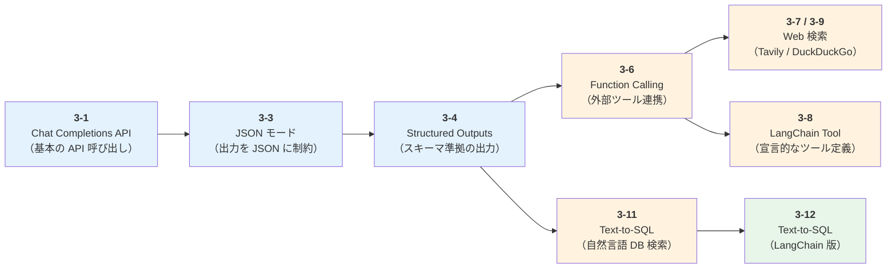
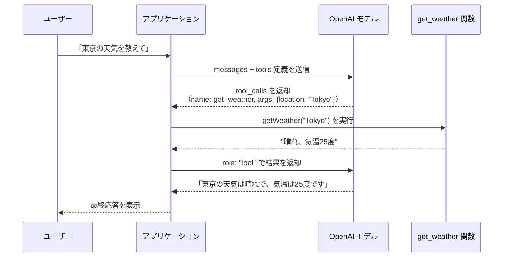
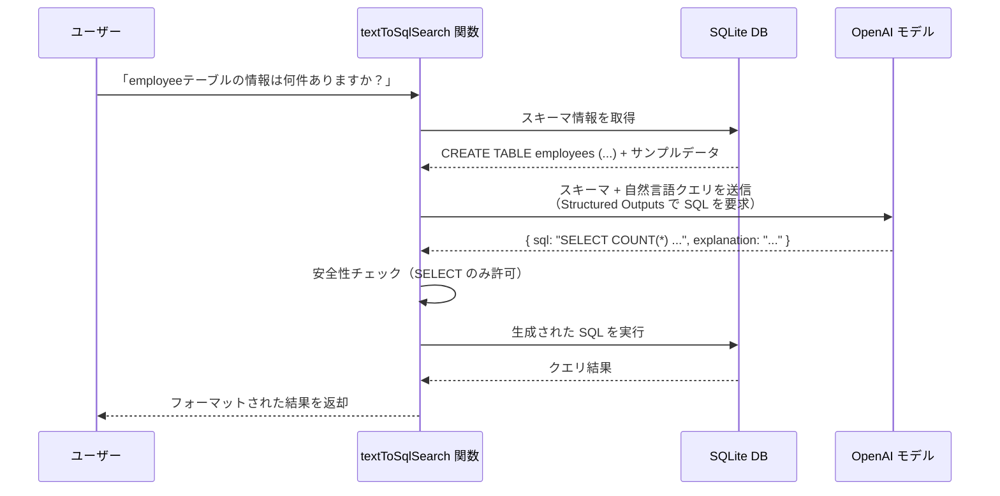

# Chapter 3: AIエージェントの開発準備

この章では、AI エージェントを構築するための土台となる OpenAI API の基本的な使い方を、実際のコードを動かしながら学んでいきます。
[Chapter 2](../chapter2/index.md) で解説した「プロフィール」「メモリ」「ツール」「プランニング」の各コンポーネントが、API レベルではどのように実現されるのかを体感できる内容になっています。

:::note この章で学ぶこと

- **Chat Completions API** の基本的な呼び出し方とトークン使用量の確認
- **JSON モード**と **Structured Outputs** による構造化された出力の取得
- **Function Calling** を使った外部ツールとの連携パターン
- **Tavily API** を使った AI エージェント向けの Web 検索
- **LangChain** の `tool` ヘルパーによるカスタム Tool 定義
- **DuckDuckGo** を使った無料の Web 検索とページ取得
- **Text-to-SQL** による自然言語からの SQL クエリ生成と検索
- **LangChain** による Text-to-SQL の簡素化（`ChatPromptTemplate` + `withStructuredOutput`）

:::

## 概要

### 学習の流れ

この章のセクションは、以下のように段階的に学べる構成になっています。前半で API の基本と出力形式を押さえ、後半でツール連携と実践的な活用に進みます。



:::info 前提条件

- 環境変数 `OPENAI_API_KEY` に OpenAI の API キーが設定されていること
- 3-7 のみ、環境変数 `TAVILY_API_KEY` に Tavily の API キーが設定されていること
- 3-11 のみ、`better-sqlite3` パッケージがインストールされていること（`pnpm install` で自動インストール）
- 3-12 のみ、`@langchain/openai` パッケージが追加で必要（`pnpm install` で自動インストール）

:::

### サンプルコードの実行方法

各サンプルは、リポジトリのルートディレクトリから以下のコマンドで実行できます。

```bash
# ルートディレクトリで実行（pnpm tsx は @ai-suburi/core パッケージ内で tsx を実行するエイリアス）
pnpm tsx chapter3/<ファイル名>.ts
```

## 3-1. Chat Completions API

Chat Completions API は、OpenAI のチャットモデルと対話するための最も基本的な API です。
AI エージェントを構築する際、すべての対話はこの API を通じて行われるため、まずここでの基本操作をしっかり押さえておくことが重要です。

`messages` 配列にロール（`system`, `user`, `assistant`）とメッセージを渡すことで、モデルからの応答を取得できます。各ロールの役割は以下のとおりです。

| ロール | 役割 |
| --- | --- |
| `system` | モデルの振る舞いやルールを設定する指示（例: 「あなたは親切なアシスタントです」） |
| `user` | ユーザーからの入力メッセージ |
| `assistant` | モデルからの応答。会話履歴として渡すことで、文脈を維持した対話が可能になる |

このサンプルでは以下を行います。

- `gpt-4o` モデルへのメッセージ送信
- 応答テキストの取得
- トークン使用量（プロンプト / 生成 / 合計）の確認

:::info トークンとは？
トークンは、モデルがテキストを処理する際の最小単位です。英語では 1 単語が約 1 トークン、日本語ではひらがな 1 文字が約 1 トークンに相当します。API の利用料金はトークン数に基づいて計算されるため、使用量の確認は重要です。
:::

```typescript title="chapter3/test3-1-chat-completions-api.ts"
import OpenAI from "openai";

// クライアントを定義
const client = new OpenAI({
  apiKey: process.env.OPENAI_API_KEY,
});

// Chat Completion APIの呼び出し例
async function main() {
  const response = await client.chat.completions.create({
    model: "gpt-4o",
    messages: [
      { role: "user", content: "こんにちは、今日はどんな天気ですか？" },
    ],
  });

  // 応答内容を出力
  console.log("Response:", response.choices[0]?.message.content, "\n");

  // 消費されたトークン数の表示
  const tokensUsed = response.usage;
  console.log("Prompt Tokens:", tokensUsed?.prompt_tokens);
  console.log("Completion Tokens:", tokensUsed?.completion_tokens);
  console.log("Total Tokens:", tokensUsed?.total_tokens);
  console.log(
    "Completion_tokens_details:",
    tokensUsed?.completion_tokens_details,
  );
  console.log("Prompt_tokens_details:", tokensUsed?.prompt_tokens_details);
}

main();
```

**実行方法:**

```bash
pnpm tsx chapter3/test3-1-chat-completions-api.ts
```

**実行結果の例:**

```text
Response: こんにちは！私はAIなので天気を直接確認する手段はありませんが、...

Prompt Tokens: 25
Completion Tokens: 80
Total Tokens: 105
Completion_tokens_details: { reasoning_tokens: 0, ... }
Prompt_tokens_details: { cached_tokens: 0, ... }
```

## 3-3. JSON Outputs

3-1 の Chat Completions API では、モデルは自由形式のテキストを返します。しかし、実際のアプリケーション開発では、モデルの出力をプログラムで処理したいケースが多くあります。たとえば、抽出した情報をデータベースに保存したり、別の API に渡したりする場合です。このような場面で役立つのが JSON モードです。

JSON モードを使うと、モデルの出力を有効な JSON 形式に制約できます。
`response_format: { type: "json_object" }` を指定することで、モデルは必ず JSON として解析可能な文字列を返します。

このサンプルでは以下のポイントを示しています。

- `response_format` に `json_object` を指定して JSON 出力を強制
- `system` メッセージで JSON 出力を指示
- `assistant` メッセージで出力スキーマのヒントを提供（期待する JSON の構造を例示することで、モデルが同じキー名・構造で応答するよう誘導できます）

:::tip
JSON モードを使用する際は、システムメッセージで「JSON を出力してください」と明示的に指示する必要があります。指示がない場合、モデルが無限にホワイトスペースを生成する可能性があります。
:::

```typescript title="chapter3/test3-3-json-outputs.ts"
import OpenAI from "openai";

const client = new OpenAI({
  apiKey: process.env.OPENAI_API_KEY,
});

async function main() {
  const response = await client.chat.completions.create({
    model: "gpt-4o",
    response_format: { type: "json_object" },
    messages: [
      {
        role: "system",
        content:
          "あなたは JSON を出力するように設計された便利なアシスタントです。",
      },
      { role: "assistant", content: '{"winner": "String"}' },
      {
        role: "user",
        content: "2020 年のワールド シリーズの優勝者は誰ですか?",
      },
    ],
  });

  console.log(response.choices[0]?.message.content);
}

main();
```

**実行方法:**

```bash
pnpm tsx chapter3/test3-3-json-outputs.ts
```

**実行結果の例:**

```text
{"winner": "ロサンゼルス・ドジャース"}
```

:::info JSON モードの制約
JSON モードでは出力が有効な JSON であることは保証されますが、特定のスキーマに従うことは保証されません。たとえば、キー名が `"winner"` ではなく `"champion"` になる可能性があります。スキーマへの厳密な準拠が必要な場合は、次のセクション（3-4）の Structured Outputs を使用してください。
:::

:::tip assistant ロールによるスキーマヒント
このサンプルでは `role: "assistant"` のメッセージで `{"winner": "String"}` を渡しています。これは会話履歴として「モデルが過去にこの形式で応答した」という文脈を作ることで、同じキー名・構造で応答するようモデルを誘導するテクニックです。JSON モードではスキーマの厳密な保証がないため、このようなヒントが有効です。
:::

## 3-4. Structured Outputs

Structured Outputs は、3-3 で紹介した JSON モードの進化版です。
JSON モードではスキーマの遵守が保証されませんでしたが、Structured Outputs では [Zod](https://zod.dev/)（TypeScript ファーストのスキーマバリデーションライブラリ）でスキーマを定義し、`zodResponseFormat` ヘルパーを使うことで、モデルの出力がスキーマに 100% 準拠することが保証されます。
型安全なデータ抽出や、構造化された情報の取得に最適です。

### 出力形式の比較: テキスト vs JSON モード vs Structured Outputs

ここまでの 3 つの出力形式を比較すると、以下のようになります。

| 項目 | テキスト（3-1） | JSON モード（3-3） | Structured Outputs（3-4） |
| --- | --- | --- | --- |
| 出力形式 | 自由形式テキスト | 有効な JSON | スキーマ準拠の JSON |
| スキーマ保証 | なし | JSON として有効なことのみ | 100% スキーマ準拠 |
| 型安全性 | なし | なし（手動パースが必要） | あり（`parsed` から型付きオブジェクトを取得） |
| 主なユースケース | 自然言語の応答生成 | 簡易的な構造化データ取得 | 厳密な構造化データ抽出 |
| 設定方法 | 指定不要 | `response_format: { type: "json_object" }` | `zodResponseFormat(schema, name)` |

このサンプルでは以下のポイントを示しています。

- Zod でレシピのスキーマ（名前・人数・材料・手順）を定義
- `client.chat.completions.parse()` で型安全なパース結果を取得
- `response.choices[0].message.parsed` から直接型付きオブジェクトにアクセス

### temperature パラメータとは？

`temperature` は、モデルの出力の **ランダム性（創造性）** を制御するパラメータで、`0` から `2` の範囲で指定します。

| 値 | 特徴 | ユースケース |
| --- | --- | --- |
| `0` | 最も決定的（同じ入力に対してほぼ同じ出力） | 構造化データ抽出、分類、事実に基づく回答 |
| `0.5〜0.7` | バランスの取れた出力 | 一般的な会話、要約 |
| `1.0`（デフォルト） | 適度なランダム性 | 創作、ブレインストーミング |
| `1.5〜2.0` | 非常にランダム（予測しにくい出力） | 実験的な用途 |

内部的には、モデルが次のトークン（単語の断片）を選ぶ際の確率分布を調整しています。`temperature` が低いほど確率の高いトークンが選ばれやすくなり、高いほど確率の低いトークンも選ばれる可能性が増します。

このサンプルでは `temperature: 0` を指定しているため、毎回ほぼ同じレシピが生成されます。レシピの構造化データを安定して取得したい場合に適した設定です。

:::tip create() と parse() の違い
3-1 や 3-3 では `client.chat.completions.create()` を使いましたが、Structured Outputs では `client.chat.completions.parse()` を使います。`parse()` は OpenAI SDK が提供する拡張メソッドで、レスポンスの `message.parsed` プロパティから Zod スキーマに基づいた**型付きオブジェクト**を直接取得できます。`create()` では `message.content` が文字列として返されるため、手動で `JSON.parse()` する必要があります。
:::

```typescript title="chapter3/test3-4-structured-outputs.ts"
import OpenAI from "openai";
import { zodResponseFormat } from "openai/helpers/zod";
import { z } from "zod/v4";

const client = new OpenAI({
  apiKey: process.env.OPENAI_API_KEY,
});

// Zodスキーマを定義
const Recipe = z.object({
  name: z.string(),
  servings: z.number().int(),
  ingredients: z.array(z.string()),
  steps: z.array(z.string()),
});

async function main() {
  // Structured Outputsに対応するZodスキーマを指定して呼び出し
  const response = await client.chat.completions.parse({
    model: "gpt-4o",
    messages: [{ role: "user", content: "タコライスのレシピを教えてください" }],
    temperature: 0,
    response_format: zodResponseFormat(Recipe, "Recipe"),
  });

  // 生成されたレシピ情報の表示
  const recipe = response.choices[0]?.message.parsed;

  console.log("Recipe Name:", recipe?.name);
  console.log("Servings:", recipe?.servings);
  console.log("Ingredients:", recipe?.ingredients);
  console.log("Steps:", recipe?.steps);
}

main();
```

**実行方法:**

```bash
pnpm tsx chapter3/test3-4-structured-outputs.ts
```

**実行結果の例:**

```text
Recipe Name: タコライス
Servings: 2
Ingredients: [ 'ひき肉 200g', 'レタス 2枚', 'トマト 1個', 'チーズ 適量', ... ]
Steps: [ '1. ひき肉をフライパンで炒める', '2. タコスシーズニングを加える', ... ]
```

## 3-6. Function Calling

ここまでの 3-1 〜 3-4 では、モデルへの入出力形式について学びました。ここからは、モデルが **外部の世界と連携する** 方法を見ていきます。

Function Calling は、モデルが外部の関数（ツール）を呼び出せるようにする仕組みです。
[Chapter 2](../chapter2/index.md) で解説した「ツール」コンポーネントを API レベルで実現するための中核的な機能であり、AI エージェント開発において最も重要な概念の 1 つです。

モデル自体が関数を実行するわけではなく、「この関数をこの引数で呼ぶべき」という指示を JSON 形式で返します。アプリケーション側で実際の関数を実行し、その結果をモデルに返すことで、外部データを活用した応答を生成できます。

たとえば、「東京の天気を教えて」というユーザーの質問に対して、モデルは `get_weather` 関数を `{"location": "Tokyo"}` という引数で呼ぶべきだと判断します。アプリケーションが実際に天気情報を取得してモデルに返すと、モデルはその情報を元に自然言語で応答を生成します。

### tools パラメータの構造

`tools` パラメータには、モデルに提供する関数の定義を配列で渡します。各関数の定義は以下の構造を持ちます。

| フィールド | 説明 |
| --- | --- |
| `type` | ツールの種類。現在は `"function"` のみ |
| `function.name` | 関数名。モデルが呼び出す際の識別子として使用 |
| `function.description` | 関数の説明。モデルがどの関数を呼ぶか判断する際に参照される |
| `function.parameters` | JSON Schema 形式で定義する引数のスキーマ |

`description` はモデルの判断精度に大きく影響します。関数が「いつ・何のために使われるか」を具体的に記述することが重要です。

### 処理の流れ

このサンプルでは以下の流れを実装しています。

1. **ツールの定義** - `get_weather` 関数のスキーマを `tools` パラメータで定義
2. **初回リクエスト** - ユーザーメッセージを送信し、モデルが `tool_calls` を返す
3. **関数の実行** - モデルが指定した引数で `getWeather()` を実行
4. **結果の返却** - 関数の実行結果を `role: "tool"` メッセージとして返す
5. **最終応答** - モデルが関数の結果を踏まえた自然言語の応答を生成



:::tip tool_choice の使い分け
`tool_choice` パラメータで、モデルの関数呼び出し動作を制御できます。

| 値 | 動作 | ユースケース |
| --- | --- | --- |
| `"auto"` | モデルが呼ぶかどうかを自動判断 | 通常の対話（関数が不要な質問もある場合） |
| `"required"` | 必ずいずれかの関数を呼ぶ | ツール利用が前提のワークフロー |
| `{"type": "function", "function": {"name": "..."}}` | 特定の関数を強制呼び出し | テストや特定の処理を確実に実行したい場合 |
| `"none"` | 関数を呼ばない | ツール定義を渡しつつも通常の応答がほしい場合 |

:::

```typescript title="chapter3/test3-6-function-calling.ts"
import OpenAI from "openai";

// クライアントを定義
const client = new OpenAI({
  apiKey: process.env.OPENAI_API_KEY,
});

// 天気情報を取得するダミー関数
function getWeather(location: string): string {
  const weatherInfo: Record<string, string> = {
    Tokyo: "晴れ、気温25度",
    Osaka: "曇り、気温22度",
    Kyoto: "雨、気温18度",
  };
  return weatherInfo[location] ?? "天気情報が見つかりません";
}

// モデルに提供するToolの定義
const tools: OpenAI.ChatCompletionTool[] = [
  {
    type: "function",
    function: {
      name: "get_weather",
      description: "指定された場所の天気情報を取得します",
      parameters: {
        type: "object",
        properties: {
          location: {
            type: "string",
            description: "都市名（例: Tokyo）",
          },
        },
        required: ["location"],
      },
    },
  },
];

async function main() {
  // 初回のユーザーメッセージ
  const messages: OpenAI.ChatCompletionMessageParam[] = [
    { role: "user", content: "東京の天気を教えてください" },
  ];

  // モデルへの最初のAPIリクエスト
  const response = await client.chat.completions.create({
    model: "gpt-4o",
    messages,
    temperature: 0,
    tools,
    tool_choice: "auto",
  });

  // モデルの応答を処理
  const responseMessage = response.choices[0]?.message;
  if (!responseMessage) {
    throw new Error("No response message from the model");
  }
  messages.push(responseMessage);

  console.log("モデルからの応答:");
  console.log(responseMessage);

  // 関数呼び出しを処理
  if (responseMessage.tool_calls) {
    for (const toolCall of responseMessage.tool_calls) {
      if (
        toolCall.type === "function" &&
        toolCall.function.name === "get_weather"
      ) {
        const functionArgs = JSON.parse(toolCall.function.arguments);
        console.log("関数の引数:", functionArgs);
        const weatherResponse = getWeather(functionArgs.location);
        messages.push({
          role: "tool",
          tool_call_id: toolCall.id,
          content: weatherResponse,
        });
      }
    }
  } else {
    console.log("モデルによるツール呼び出しはありませんでした。");
  }

  // モデルへの最終的なAPIリクエスト
  const finalResponse = await client.chat.completions.create({
    model: "gpt-4o",
    messages,
    temperature: 0,
  });

  console.log("Final Response:", finalResponse.choices[0]?.message.content);
}

main();
```

**実行方法:**

```bash
pnpm tsx chapter3/test3-6-function-calling.ts
```

**実行結果の例:**

```text
モデルからの応答:
{
  role: 'assistant',
  content: null,
  tool_calls: [
    {
      id: 'call_xxx',
      type: 'function',
      function: { name: 'get_weather', arguments: '{"location":"Tokyo"}' }
    }
  ]
}
関数の引数: { location: 'Tokyo' }
Final Response: 東京の天気は晴れで、気温は25度です。
```

## 3-7. Tavily Search

3-6 では Function Calling を使って外部関数を呼び出す方法を学びました。ここからは、AI エージェントが利用する具体的な外部ツールの例として、Web 検索 API を紹介します。

[Tavily](https://tavily.com/) は、AI エージェント向けに最適化された Web 検索 API です。
通常の検索エンジンとは異なり、検索結果のスニペット（検索結果に表示される短い抜粋テキスト）だけでなく、ページの主要コンテンツを抽出して返すため、LLM が直接活用しやすい形式になっています。

### なぜ Tavily が必要なのか？

AI エージェントが Web 検索を行う場合、Google 検索のような一般的な検索エンジンでは以下の課題があります。

- 検索結果は URL とスニペット（短い抜粋）のみで、詳細な情報を得るには各ページをスクレイピングする必要がある
- 広告やナビゲーションなどのノイズが多く、LLM に渡す情報として最適化されていない
- API の利用料金が高く、レート制限も厳しい

Tavily はこれらの課題を解決するために設計されており、**1 回の API コールで検索結果とページコンテンツの両方を取得**できます。

### Tavily の主な特徴

| 特徴 | 説明 |
| --- | --- |
| **コンテンツ抽出** | 検索結果の各ページから本文を自動抽出し、広告やナビゲーションなどのノイズを除去 |
| **検索深度の選択** | `basic`（高速）と `advanced`（高精度）の 2 つの検索モードを提供 |
| **トピック指定** | `general`、`news` などのトピックを指定して検索対象を絞り込み可能 |
| **ドメインフィルタ** | `includeDomains` / `excludeDomains` で検索対象のドメインを制御 |
| **日付フィルタ** | `days` パラメータで指定日数以内の結果に限定可能 |

### search メソッドの主なオプション

```typescript
const response = await client.search(query, {
  searchDepth: "basic",    // "basic" | "advanced"（デフォルト: "basic"）
  topic: "general",        // "general" | "news"（デフォルト: "general"）
  maxResults: 5,           // 取得する検索結果の最大件数（デフォルト: 5）
  includeDomains: [],      // 検索対象に含めるドメインのリスト
  excludeDomains: [],      // 検索対象から除外するドメインのリスト
  days: 7,                 // 指定日数以内の結果に限定
});
```

### サンプルの内容

このサンプルでは以下を行います。

- Tavily クライアントの初期化（API キーの設定）
- 検索クエリの実行（`maxResults: 3` で上位 3 件を取得）
- 検索結果（タイトル・URL・コンテンツ）の表示

:::note
Tavily API を利用するには、[Tavily](https://tavily.com/) でアカウントを作成し、API キーを取得する必要があります。無料プランでは月 1,000 回の API コールが利用できます。
:::

```typescript title="chapter3/test3-7-tavily-search.ts"
import { tavily } from "@tavily/core";

// Tavily検索クライアントを初期化
const client = tavily({ apiKey: process.env.TAVILY_API_KEY ?? "" });

// 検索の実行例
const query = "AIエージェント 実践本";
const response = await client.search(query, { maxResults: 3 });
const results = response.results;

console.log(`検索クエリ: ${query}`);
console.log(`検索結果数: ${results.length}`);
console.log("\n検索結果:");
results.forEach((result, i) => {
  console.log(`\n${i + 1}. タイトル: ${result.title ?? "N/A"}`);
  console.log(`   URL: ${result.url ?? "N/A"}`);
  console.log(`   内容: ${(result.content ?? "N/A").slice(0, 100)}...`);
});
```

**実行方法:**

```bash
pnpm tsx chapter3/test3-7-tavily-search.ts
```

**実行結果の例:**

```text
検索クエリ: AIエージェント 実践本
検索結果数: 3

検索結果:

1. タイトル: AIエージェント入門 ― 実践ガイド
   URL: https://example.com/ai-agent-book
   内容: AIエージェントの基礎から実践までを解説した書籍...
```

## 3-8. LangChain カスタム Tool 定義

3-6 の Function Calling では、OpenAI API の JSON Schema 形式でツールのスキーマを手動で記述しました。この方法は API の仕組みを理解するには最適ですが、スキーマ定義と関数実装が分離しているため、ツールの数が増えるとメンテナンスが煩雑になります。

[LangChain](https://js.langchain.com/) の `tool` ヘルパーを使うと、この問題を解決できます。Zod スキーマと関数本体をまとめて定義できるため、型安全性を維持しながら宣言的に Tool を作成でき、定義の重複やミスを減らせます。

### Function Calling（3-6）との比較

| 項目 | Function Calling（3-6） | LangChain Tool（3-8） |
| --- | --- | --- |
| スキーマ定義 | JSON Schema を手動で記述 | Zod スキーマで型安全に定義 |
| 関数との紐付け | スキーマと関数実装が分離 | スキーマ・関数・メタデータを一体で定義 |
| 型安全性 | 引数の手動パース（`JSON.parse`）が必要 | Zod による自動バリデーション |
| 実行方法 | 自前でディスパッチ処理を実装 | `invoke()` メソッドで統一的に実行 |
| 適したケース | API の仕組みの理解、軽量な実装 | 本格的なエージェント開発、ツールの再利用 |

### LangChain の Tool とは？

LangChain の Tool は、AI エージェントが外部の機能を呼び出すための統一的なインターフェースです。`@langchain/core/tools` が提供する `tool` ヘルパー関数を使うことで、以下の要素を 1 つにまとめて定義できます。

| 要素 | 説明 |
| --- | --- |
| `name` | Tool の名前。エージェントが呼び出す際の識別子 |
| `description` | Tool の説明。エージェントがどの Tool を使うか判断する際に参照される |
| `schema` | Zod スキーマで定義する引数の型とバリデーション |
| 関数本体 | 実際に実行される処理（非同期関数） |

:::info Zod のバージョンについて
このサンプルでは `import { z } from "zod"` としていますが、3-4 や 3-11 では `import { z } from "zod/v4"` を使っています。これは LangChain が Zod v3 系 API を前提としているためです。OpenAI SDK の `zodResponseFormat` は Zod v4 のエントリポイント（`zod/v4`）に対応しています。同じプロジェクト内で両方を使う場合は、インポートパスに注意してください。
:::

### サンプルで行うこと

このサンプルでは以下を行います。

- Zod で引数スキーマ（2 つの整数）を定義
- `tool` ヘルパーで加算 Tool を作成
- `invoke()` メソッドで Tool を実行
- Tool に関連付けられた属性（`name`、`description`、`schema`）の確認

```typescript title="chapter3/test3-8-custom-tool-definition.ts"
import { tool } from "@langchain/core/tools";
import { z } from "zod";

// 引数スキーマを定義
const AddArgs = z.object({
  a: z.number().int().describe("加算する最初の整数。"),
  b: z.number().int().describe("加算する2つ目の整数。"),
});

// Tool定義
const add = tool(
  async ({ a, b }): Promise<string> => {
    return String(a + b);
  },
  {
    name: "add",
    description: [
      "このToolは2つの整数を引数として受け取り、それらの合計を返します。",
      "",
      "使用例:",
      "  例:",
      '    入力: {"a": 3, "b": 5}',
      "    出力: 8",
    ].join("\n"),
    schema: AddArgs,
  },
);

// 実行例
const args = { a: 5, b: 10 };
const result = await add.invoke(args); // Toolを呼び出す
console.log(`Result: ${result}`); // Result: 15

// Toolに関連付けられている属性の確認
console.log(add.name);
console.log(add.description);
console.log(add.schema);
```

**実行方法:**

```bash
pnpm tsx chapter3/test3-8-custom-tool-definition.ts
```

**実行結果の例:**

```text
Result: 15
add
このToolは2つの整数を引数として受け取り、それらの合計を返します。

使用例:
  例:
    入力: {"a": 3, "b": 5}
    出力: 8
ZodObject { ... }
```

## 3-9. DuckDuckGo Web 検索

3-7 では AI エージェント向けに最適化された Tavily を紹介しましたが、API キーの取得が必要でした。ここでは、より手軽に Web 検索を試せる代替手段を紹介します。

[duck-duck-scrape](https://www.npmjs.com/package/duck-duck-scrape) は、DuckDuckGo の検索結果をプログラムから取得できるライブラリです。
Tavily とは異なり、**API キー不要・無料**で利用できるため、手軽に Web 検索機能を組み込みたい場合に便利です。

### Tavily との比較

| 項目 | Tavily（3-7） | DuckDuckGo（3-9） |
| --- | --- | --- |
| API キー | 必要 | 不要 |
| 料金 | 無料枠あり（月 1,000 回） | 完全無料 |
| コンテンツ抽出 | 自動抽出（ノイズ除去済み） | なし（HTML を自前で取得・パースする必要あり） |
| LLM 向け最適化 | あり | なし |

### サンプルの処理ステップ

このサンプルでは以下の 2 ステップを実装しています。

1. **DuckDuckGo 検索** - `search()` 関数でキーワード検索を実行し、上位 3 件の結果（タイトル・概要・URL）を表示
2. **Web ページ取得** - 最初の検索結果の URL に対して `fetch` で HTTP リクエストを送り、HTML コンテンツのサイズと冒頭部分を表示

ステップ 2 で取得されるのは生の HTML です。AI エージェントで実際に活用するには、HTML パーサー（[cheerio](https://www.npmjs.com/package/cheerio) など）を使って本文を抽出する追加処理が必要です。この点が、コンテンツ抽出まで自動で行う Tavily（3-7）との大きな違いです。

:::tip
DuckDuckGo 検索は API キーが不要なため、環境変数の設定なしですぐに試せます。開発の初期段階でサクッと Web 検索を組み込みたいときに最適です。
:::

:::info Web 検索ツールの選択基準
プロトタイピングや学習目的であれば DuckDuckGo で十分です。一方、本番環境の AI エージェントでは、コンテンツ抽出の品質や安定性の面から Tavily の利用を推奨します。
:::

:::caution レート制限について
`duck-duck-scrape` は DuckDuckGo の Web ページをスクレイピングして検索結果を取得しています。そのため、短時間に連続してリクエストを送ると **「DDG detected an anomaly in the request」** エラーが発生することがあります。このエラーが発生した場合は、しばらく時間を空けてから再実行してください。サンプルコードにはリトライ機能（最大 3 回、指数バックオフ）を組み込んでいますが、それでも失敗する場合があります。
:::

```typescript title="chapter3/test3-9-duckduckgo-search.ts"
import { SafeSearchType, search } from "duck-duck-scrape";

// リトライ付きで検索を実行する関数
async function searchWithRetry(
  query: string,
  maxRetries = 3,
  baseDelay = 2000,
) {
  for (let attempt = 1; attempt <= maxRetries; attempt++) {
    try {
      return await search(query, {
        safeSearch: SafeSearchType.OFF,
        locale: "ja-JP",
      });
    } catch (e) {
      if (attempt === maxRetries) throw e;
      const delay = baseDelay * attempt;
      console.log(
        `検索リクエストがブロックされました。${delay}ms 待機してリトライします... (${attempt}/${maxRetries})`,
      );
      await new Promise((resolve) => setTimeout(resolve, delay));
    }
  }
  throw new Error("検索に失敗しました");
}

// DuckDuckGo検索を実行（リトライ付き）
const searchQuery = "AIエージェント 実践本";
const searchResponse = await searchWithRetry(searchQuery);
const searchResults = searchResponse.results.slice(0, 3);

// 検索結果を表示
console.log("\n検索結果:");
searchResults.forEach((result, i) => {
  console.log(`\n${i + 1}. ${result.title}`);
  console.log(`   概要: ${(result.description ?? "").slice(0, 100)}...`);
  console.log(`   URL: ${result.url}`);
});

// 最初の検索結果のURLを取得
if (searchResults.length > 0) {
  const url = searchResults[0]?.url ?? "";
  console.log(`\n最初の検索結果のURLにアクセスしています: ${url}`);

  // Webページを取得
  try {
    const response = await fetch(url);
    const htmlContent = await response.text();
    console.log(`\nHTTPステータスコード: ${response.status}`);
    console.log(
      `\nHTMLコンテンツの大きさ: ${new Blob([htmlContent]).size} bytes`,
    );
    console.log(
      `\nHTMLコンテンツの最初の部分: \n${htmlContent.slice(0, 500)}...`,
    );
  } catch (e) {
    console.log(`\nエラーが発生しました: ${e}`);
  }
} else {
  console.log("\n検索結果はありませんでした");
}
```

**実行方法:**

```bash
pnpm tsx chapter3/test3-9-duckduckgo-search.ts
```

**実行結果の例:**

```text
検索結果:

1. AIエージェント入門 ― 実践ガイド
   概要: AIエージェントの基礎から実践までを解説...
   URL: https://example.com/ai-agent-book

最初の検索結果のURLにアクセスしています: https://example.com/ai-agent-book

HTTPステータスコード: 200

HTMLコンテンツの大きさ: 45678 bytes

HTMLコンテンツの最初の部分:
<!DOCTYPE html><html lang="ja">...
```

## 3-11. Text-to-SQL による自然言語 DB 検索

3-6 の Function Calling では天気取得というシンプルなツールを実装しましたが、実際のアプリケーションではもっと複雑なデータソースとの連携が求められます。ここでは、**自然言語の質問を SQL クエリに変換してデータベース検索を行う「Text-to-SQL」ツール** を実装します。
3-4 で学んだ Structured Outputs を活用し、LLM が生成する SQL を型安全に取得するのがポイントです。

### Text-to-SQL とは？

Text-to-SQL は、ユーザーが自然言語で入力した質問を SQL クエリに自動変換し、データベースから情報を取得する技術です。AI エージェントのツールとして組み込むことで、ユーザーは SQL を知らなくてもデータベースを検索できるようになります。

### Text-to-SQL の処理フロー

このサンプルでは以下の流れで処理を行います。

1. **データベース初期化** - インメモリ SQLite データベースに `employees` テーブルを作成し、サンプルデータを投入
2. **スキーマ情報の抽出** - テーブル定義とサンプルデータを取得し、LLM のコンテキストとして利用
3. **SQL 生成（Structured Outputs）** - 自然言語のキーワードを元に、LLM が SQL クエリを Zod スキーマに準拠した形式で生成
4. **安全性チェック** - 生成された SQL が `SELECT` クエリであることを確認（INSERT / UPDATE / DELETE を拒否）
5. **SQL 実行と結果フォーマット** - 生成された SQL を実行し、結果をテーブル形式の文字列で返却



### 既存テクニックとの関連

このサンプルでは、これまでの章で学んだ複数のテクニックを組み合わせています。

| 使用テクニック | セクション | 本サンプルでの活用 |
| --- | --- | --- |
| Structured Outputs | 3-4 | Zod スキーマで SQL クエリと説明を型安全に取得 |
| system ロール | 3-1 | SQL 専門家としてのプロンプト設定 |
| temperature: 0 | 3-4 | 安定した SQL 生成のためのパラメータ設定 |

### 実装のポイント

このサンプルでは以下を行います。

- `better-sqlite3` でインメモリ SQLite データベースを構築し、従業員データを投入
- データベースのスキーマ情報（テーブル定義 + サンプルデータ 3 行）を自動抽出して LLM に提供
- Zod スキーマ（`sql` と `explanation`）を使った Structured Outputs で SQL クエリを生成
- 安全性チェックにより `SELECT` 以外のクエリを拒否
- 生成された SQL を実行し、結果をマークダウン風テーブル形式でフォーマット

```typescript title="chapter3/test3-11-text-to-sql.ts"
import Database from 'better-sqlite3';
import OpenAI from 'openai';
import { zodResponseFormat } from 'openai/helpers/zod';
import { z } from 'zod/v4';

// --- Zodスキーマ: LLMの構造化出力用 ---
const SQLQuery = z.object({
  sql: z.string().describe('実行するSQLクエリ'),
  explanation: z.string().describe('クエリの簡単な説明'),
});

// --- データベース初期化 ---
function initializeDatabase(): Database.Database {
  const db = new Database(':memory:');

  db.exec(`
    CREATE TABLE IF NOT EXISTS employees (
      id INTEGER PRIMARY KEY AUTOINCREMENT,
      name TEXT NOT NULL,
      department TEXT,
      salary INTEGER,
      hire_date TEXT
    )
  `);

  const insert = db.prepare(
    'INSERT INTO employees (name, department, salary, hire_date) VALUES (?, ?, ?, ?)',
  );

  const insertMany = db.transaction(
    (rows: Array<[string, string, number, string]>) => {
      for (const row of rows) {
        insert.run(...row);
      }
    },
  );

  insertMany([
    ['Tanaka Taro', 'IT', 600000, '2020-04-01'],
    ['Yamada Hanako', 'HR', 550000, '2019-03-15'],
    ['Suzuki Ichiro', 'Finance', 700000, '2021-01-20'],
    ['Watanabe Yuki', 'IT', 650000, '2020-07-10'],
    ['Kato Akira', 'Marketing', 580000, '2022-02-01'],
    ['Nakamura Yui', 'IT', 620000, '2021-05-15'],
    ['Yoshida Saki', 'Finance', 680000, '2020-12-01'],
    ['Matsumoto Ryu', 'HR', 540000, '2022-08-20'],
    ['Inoue Kana', 'Marketing', 590000, '2021-11-10'],
    ['Takahashi Ken', 'IT', 710000, '2019-09-05'],
  ]);

  return db;
}

// --- スキーマ情報の取得 ---
function getSchemaInfo(db: Database.Database): string {
  const tables = db
    .prepare(
      "SELECT name FROM sqlite_master WHERE type='table' AND name NOT LIKE 'sqlite_%'",
    )
    .all() as Array<{ name: string }>;

  const schemaLines: string[] = [];

  for (const table of tables) {
    const columns = db
      .prepare(`PRAGMA table_info('${table.name}')`)
      .all() as Array<{
      cid: number;
      name: string;
      type: string;
      notnull: number;
      dflt_value: string | null;
      pk: number;
    }>;

    const columnDefs = columns
      .map((col) => {
        const parts = [col.name, col.type];
        if (col.pk) parts.push('PRIMARY KEY');
        if (col.notnull) parts.push('NOT NULL');
        return parts.join(' ');
      })
      .join(', ');

    schemaLines.push(`CREATE TABLE ${table.name} (${columnDefs})`);

    // サンプルデータ（3行）をLLMのコンテキストとして追加
    const sampleRows = db
      .prepare(`SELECT * FROM "${table.name}" LIMIT 3`)
      .all();
    if (sampleRows.length > 0) {
      schemaLines.push(`/* Sample rows from ${table.name}: */`);
      schemaLines.push(`/* ${JSON.stringify(sampleRows)} */`);
    }
  }

  return schemaLines.join('\n');
}

// --- OpenAIでSQL生成 ---
async function generateSQL(
  client: OpenAI,
  schema: string,
  keywords: string,
): Promise<z.infer<typeof SQLQuery>> {
  const response = await client.chat.completions.parse({
    model: 'gpt-4o-mini',
    temperature: 0,
    messages: [
      {
        role: 'system',
        content: `あなたはSQLの専門家です。以下のSQLiteデータベーススキーマに基づいて、ユーザーの自然言語リクエストからSQLクエリを生成してください。

データベーススキーマ:
${schema}

ルール:
- 有効なSQLite SQL構文を生成すること
- SELECTクエリのみ生成すること（INSERT, UPDATE, DELETE, DROPなどは不可）
- PostgreSQL固有の構文は使用しないこと
- 上記のスキーマに対してそのまま実行可能なクエリを生成すること`,
      },
      {
        role: 'user',
        content: keywords,
      },
    ],
    response_format: zodResponseFormat(SQLQuery, 'sql_query'),
  });

  const parsed = response.choices[0]?.message.parsed;
  if (!parsed) {
    const refusal = response.choices[0]?.message.refusal;
    if (refusal) {
      throw new Error(`LLMがリクエストを拒否しました: ${refusal}`);
    }
    throw new Error('LLMからの構造化出力のパースに失敗しました');
  }
  return parsed;
}

// --- SQL実行 ---
function executeQuery(
  db: Database.Database,
  sql: string,
): { columns: string[]; rows: unknown[][] } {
  // 安全性チェック: SELECTクエリのみ許可
  const normalized = sql.trim().toUpperCase();
  if (!normalized.startsWith('SELECT')) {
    throw new Error(
      `安全性チェック: SELECTクエリのみ許可されています。受信: ${sql.substring(0, 50)}...`,
    );
  }

  const rows = db.prepare(sql).all() as Array<Record<string, unknown>>;

  if (rows.length === 0) {
    return { columns: [], rows: [] };
  }

  const columns = Object.keys(rows[0]!);
  const rowArrays = rows.map((row) => columns.map((col) => row[col]));

  return { columns, rows: rowArrays };
}

// --- 結果フォーマット ---
function formatResults(columns: string[], rows: unknown[][]): string {
  if (rows.length === 0) {
    return '結果が見つかりませんでした。';
  }

  const header = columns.join(' | ');
  const separator = columns.map(() => '---').join(' | ');
  const dataRows = rows.map((row) => row.map(String).join(' | '));

  return [header, separator, ...dataRows].join('\n');
}

// --- text_to_sql_search ツール関数 ---
/**
 * 自然言語でのクエリをSQLクエリに変換し、SQLデータベースで検索を実行します。
 *
 * 機能:
 * - このToolは、与えられた自然言語形式のキーワードをもとに、SQLクエリを生成します。
 * - LLMを使用してSQL文を生成し、インメモリSQLiteデータベースで検索を実行します。
 * - 取得した検索結果を返します。
 *
 * @param keywords - 実行したいクエリの自然言語キーワード
 *   例: "employeeテーブルの情報は何件ありますか？"
 * @returns データベース検索結果の文字列
 */
async function textToSqlSearch(keywords: string): Promise<string> {
  try {
    const client = new OpenAI({
      apiKey: process.env.OPENAI_API_KEY,
    });

    const db = initializeDatabase();

    try {
      const schema = getSchemaInfo(db);
      console.log('Database Schema:\n', schema, '\n');

      console.log('Query:', keywords);
      const { sql, explanation } = await generateSQL(client, schema, keywords);
      console.log('Generated SQL:', sql);
      console.log('Explanation:', explanation);

      const { columns, rows } = executeQuery(db, sql);

      const result = formatResults(columns, rows);
      console.log('\nResults:');
      console.log(result);

      return result;
    } finally {
      db.close();
    }
  } catch (e) {
    const message = e instanceof Error ? e.message : String(e);
    console.error(`エラー: ${message}`);
    return `エラー: ${message}`;
  }
}

// --- 実行例 ---
const args = { keywords: 'employeeテーブルの情報は何件ありますか？' };
await textToSqlSearch(args.keywords);
```

**実行方法:**

```bash
pnpm tsx chapter3/test3-11-text-to-sql.ts
```

**実行結果の例:**

```text
Database Schema:
 CREATE TABLE employees (id INTEGER PRIMARY KEY, name TEXT NOT NULL, department TEXT, salary INTEGER, hire_date TEXT)
/* Sample rows from employees: */
/* [{"id":1,"name":"Tanaka Taro","department":"IT","salary":600000,"hire_date":"2020-04-01"},{"id":2,"name":"Yamada Hanako","department":"HR","salary":550000,"hire_date":"2019-03-15"},{"id":3,"name":"Suzuki Ichiro","department":"Finance","salary":700000,"hire_date":"2021-01-20"}] */

Query: employeeテーブルの情報は何件ありますか？
Generated SQL: SELECT COUNT(*) AS employee_count FROM employees
Explanation: employeesテーブルの全レコード数を取得するクエリです。

Results:
employee_count
---
10
```

:::tip LLM にスキーマ情報を渡すコツ
このサンプルでは、テーブル定義（`CREATE TABLE ...`）だけでなく、サンプルデータ（3 行）も LLM に渡しています。これにより、LLM はカラムに格納されるデータの形式（日付のフォーマット、部署名の種類など）を理解し、より正確な SQL を生成できます。
:::

:::caution 安全性について
このサンプルでは `SELECT` クエリのみを許可する簡易的な安全性チェックを実装していますが、本番環境では以下の追加対策を検討してください。

- パラメータ化クエリの使用（SQL インジェクション対策）
- 読み取り専用のデータベース接続の使用
- クエリのタイムアウト設定
- 取得行数の制限

:::

## 3-12. Text-to-SQL（LangChain 版）

3-11 では OpenAI SDK を直接使って Text-to-SQL を実装しましたが、LLM の呼び出し部分にはボイラープレートコード（レスポンスのパース処理、refusal チェック、messages 配列の手動構築など）が多く含まれていました。
ここでは、LangChain の `ChatOpenAI` + `ChatPromptTemplate` + `withStructuredOutput()` を使って、同じ機能をより簡潔に実装します。

### OpenAI SDK 版（3-11）との比較

| 項目 | OpenAI SDK（3-11） | LangChain（3-12） |
| --- | --- | --- |
| LLM クライアント | `new OpenAI()` | `new ChatOpenAI()` |
| プロンプト構築 | `messages` 配列を手動構築 | `ChatPromptTemplate.fromMessages()` でテンプレート化 |
| 構造化出力の指定 | `zodResponseFormat()` + `parse()` | `.withStructuredOutput(ZodSchema)` |
| レスポンス処理 | `message.parsed` の null チェック + refusal チェック | `chain.invoke()` の戻り値がそのまま型付きオブジェクト |
| 処理の合成 | 各ステップを手動で連結 | `prompt.pipe(structuredLlm)` でチェーンとして合成 |

### LangChain による簡素化のポイント

LangChain を使うことで、SQL 生成の中核部分が大幅に簡素化されます。

**OpenAI SDK 版（3-11）では `generateSQL` 関数として約 30 行のコード** が必要でしたが、**LangChain 版では以下の 3 ステップに集約** されます。

1. **`ChatPromptTemplate.fromMessages()`** - system / human メッセージをテンプレート変数（`{schema}`, `{keywords}`）付きで定義
2. **`llm.withStructuredOutput(SQLQuery)`** - Zod スキーマを渡すだけで、LLM の出力が自動的にパース・バリデーションされる
3. **`prompt.pipe(structuredLlm)`** - プロンプトと構造化 LLM をチェーンとして合成し、`invoke()` で実行

これにより、refusal チェックや null チェック、`zodResponseFormat` の設定といったボイラープレートが不要になります。

### LangChain 版の実装内容

このサンプルでは以下を行います。

- `ChatOpenAI` + `ChatPromptTemplate` + `withStructuredOutput()` を使った SQL 生成チェーンの構築
- `prompt.pipe(structuredLlm)` によるプロンプトと LLM のチェーン合成
- `chain.invoke()` による型安全な構造化出力の取得
- データベース周りの処理（初期化・スキーマ抽出・SQL 実行）は 3-11 と同一

```typescript title="chapter3/test3-11-text-to-sql-langchain.ts"
import Database from 'better-sqlite3';
import { ChatOpenAI } from '@langchain/openai';
import { ChatPromptTemplate } from '@langchain/core/prompts';
import { z } from 'zod/v4';

// --- Zodスキーマ: LLMの構造化出力用 ---
const SQLQuery = z.object({
  sql: z.string().describe('実行するSQLクエリ'),
  explanation: z.string().describe('クエリの簡単な説明'),
});

// --- データベース初期化 ---
function initializeDatabase(): Database.Database {
  const db = new Database(':memory:');

  db.exec(`
    CREATE TABLE IF NOT EXISTS employees (
      id INTEGER PRIMARY KEY AUTOINCREMENT,
      name TEXT NOT NULL,
      department TEXT,
      salary INTEGER,
      hire_date TEXT
    )
  `);

  const insert = db.prepare(
    'INSERT INTO employees (name, department, salary, hire_date) VALUES (?, ?, ?, ?)',
  );

  const insertMany = db.transaction(
    (rows: Array<[string, string, number, string]>) => {
      for (const row of rows) {
        insert.run(...row);
      }
    },
  );

  insertMany([
    ['Tanaka Taro', 'IT', 600000, '2020-04-01'],
    ['Yamada Hanako', 'HR', 550000, '2019-03-15'],
    ['Suzuki Ichiro', 'Finance', 700000, '2021-01-20'],
    ['Watanabe Yuki', 'IT', 650000, '2020-07-10'],
    ['Kato Akira', 'Marketing', 580000, '2022-02-01'],
    ['Nakamura Yui', 'IT', 620000, '2021-05-15'],
    ['Yoshida Saki', 'Finance', 680000, '2020-12-01'],
    ['Matsumoto Ryu', 'HR', 540000, '2022-08-20'],
    ['Inoue Kana', 'Marketing', 590000, '2021-11-10'],
    ['Takahashi Ken', 'IT', 710000, '2019-09-05'],
  ]);

  return db;
}

// --- スキーマ情報の取得 ---
function getSchemaInfo(db: Database.Database): string {
  const tables = db
    .prepare(
      "SELECT name FROM sqlite_master WHERE type='table' AND name NOT LIKE 'sqlite_%'",
    )
    .all() as Array<{ name: string }>;

  const schemaLines: string[] = [];

  for (const table of tables) {
    const columns = db
      .prepare(`PRAGMA table_info('${table.name}')`)
      .all() as Array<{
      cid: number;
      name: string;
      type: string;
      notnull: number;
      dflt_value: string | null;
      pk: number;
    }>;

    const columnDefs = columns
      .map((col) => {
        const parts = [col.name, col.type];
        if (col.pk) parts.push('PRIMARY KEY');
        if (col.notnull) parts.push('NOT NULL');
        return parts.join(' ');
      })
      .join(', ');

    schemaLines.push(`CREATE TABLE ${table.name} (${columnDefs})`);

    const sampleRows = db
      .prepare(`SELECT * FROM "${table.name}" LIMIT 3`)
      .all();
    if (sampleRows.length > 0) {
      schemaLines.push(`/* Sample rows from ${table.name}: */`);
      schemaLines.push(`/* ${JSON.stringify(sampleRows)} */`);
    }
  }

  return schemaLines.join('\n');
}

// --- SQL実行 ---
function executeQuery(
  db: Database.Database,
  sql: string,
): { columns: string[]; rows: unknown[][] } {
  const normalized = sql.trim().toUpperCase();
  if (!normalized.startsWith('SELECT')) {
    throw new Error(
      `安全性チェック: SELECTクエリのみ許可されています。受信: ${sql.substring(0, 50)}...`,
    );
  }

  const rows = db.prepare(sql).all() as Array<Record<string, unknown>>;

  if (rows.length === 0) {
    return { columns: [], rows: [] };
  }

  const columns = Object.keys(rows[0]!);
  const rowArrays = rows.map((row) => columns.map((col) => row[col]));

  return { columns, rows: rowArrays };
}

// --- 結果フォーマット ---
function formatResults(columns: string[], rows: unknown[][]): string {
  if (rows.length === 0) {
    return '結果が見つかりませんでした。';
  }

  const header = columns.join(' | ');
  const separator = columns.map(() => '---').join(' | ');
  const dataRows = rows.map((row) => row.map(String).join(' | '));

  return [header, separator, ...dataRows].join('\n');
}

// --- LangChainでSQL生成チェーンを構築 ---
function createSqlGenerationChain() {
  const llm = new ChatOpenAI({
    model: 'gpt-4o-mini',
    temperature: 0,
  });

  const prompt = ChatPromptTemplate.fromMessages([
    [
      'system',
      `あなたはSQLの専門家です。以下のSQLiteデータベーススキーマに基づいて、ユーザーの自然言語リクエストからSQLクエリを生成してください。

データベーススキーマ:
{schema}

ルール:
- 有効なSQLite SQL構文を生成すること
- SELECTクエリのみ生成すること（INSERT, UPDATE, DELETE, DROPなどは不可）
- PostgreSQL固有の構文は使用しないこと
- 上記のスキーマに対してそのまま実行可能なクエリを生成すること`,
    ],
    ['human', '{keywords}'],
  ]);

  // withStructuredOutput で Zod スキーマに基づいた構造化出力を取得
  const structuredLlm = llm.withStructuredOutput(SQLQuery);

  return prompt.pipe(structuredLlm);
}

// --- text_to_sql_search ツール関数 ---
async function textToSqlSearch(keywords: string): Promise<string> {
  try {
    const db = initializeDatabase();

    try {
      const schema = getSchemaInfo(db);
      console.log('Database Schema:\n', schema, '\n');

      console.log('Query:', keywords);

      // LangChain チェーンでSQL生成
      const chain = createSqlGenerationChain();
      const { sql, explanation } = await chain.invoke({ schema, keywords });
      console.log('Generated SQL:', sql);
      console.log('Explanation:', explanation);

      const { columns, rows } = executeQuery(db, sql);

      const result = formatResults(columns, rows);
      console.log('\nResults:');
      console.log(result);

      return result;
    } finally {
      db.close();
    }
  } catch (e) {
    const message = e instanceof Error ? e.message : String(e);
    console.error(`エラー: ${message}`);
    return `エラー: ${message}`;
  }
}

// --- 実行例 ---
const args = { keywords: 'employeeテーブルの情報は何件ありますか？' };
await textToSqlSearch(args.keywords);
```

**実行方法:**

```bash
pnpm tsx chapter3/test3-11-text-to-sql-langchain.ts
```

**実行結果の例:**

```text
Database Schema:
 CREATE TABLE employees (id INTEGER PRIMARY KEY, name TEXT NOT NULL, department TEXT, salary INTEGER, hire_date TEXT)
/* Sample rows from employees: */
/* [{"id":1,"name":"Tanaka Taro","department":"IT","salary":600000,"hire_date":"2020-04-01"},{"id":2,"name":"Yamada Hanako","department":"HR","salary":550000,"hire_date":"2019-03-15"},{"id":3,"name":"Suzuki Ichiro","department":"Finance","salary":700000,"hire_date":"2021-01-20"}] */

Query: employeeテーブルの情報は何件ありますか？
Generated SQL: SELECT COUNT(*) AS employee_count FROM employees
Explanation: employeesテーブルの全レコード数を取得するクエリです。

Results:
employee_count
---
10
```

:::tip LangChain のチェーン（LCEL）とは？
このサンプルで使用している `prompt.pipe(structuredLlm)` は、LangChain の **LCEL（LangChain Expression Language）** と呼ばれるパターンです。`pipe()` メソッドで複数の処理ステップを連結し、データが順番に流れるパイプラインを構築します。Unix のパイプ（`|`）と同じ発想で、各ステップの出力が次のステップの入力になります。
:::

:::info withStructuredOutput と zodResponseFormat の違い
3-11 の OpenAI SDK 版では `zodResponseFormat(SQLQuery, 'sql_query')` を `response_format` に渡し、レスポンスの `message.parsed` から手動で結果を取得していました。一方、LangChain の `withStructuredOutput(SQLQuery)` は Zod スキーマを渡すだけで、パース・バリデーション・エラーハンドリングをすべて内部で処理します。戻り値は直接型付きオブジェクトとして返されるため、null チェックや refusal チェックが不要になります。
:::

:::caution LangChain.js の SQL Database ユーティリティについて
LangChain.js には `SqlDatabase` クラス（スキーマの自動抽出や `getTableInfo()` メソッドを提供）が存在しますが、これは [`@langchain/classic`](https://www.npmjs.com/package/@langchain/classic) パッケージに含まれており、公式の説明では **"Old abstractions from LangChain.js"** とレガシー扱いになっています。さらに、内部で [TypeORM](https://typeorm.io/) に依存しているため、導入するとプロジェクトの依存関係が大幅に増加します。

一方、最新の `langchain` や `@langchain/community` パッケージには SQL Database ユーティリティが移植されていません（2025 年 5 月時点）。[公式ドキュメントの SQL Agent ガイド](https://docs.langchain.com/oss/javascript/langchain/sql-agent)でも依然として `@langchain/classic/sql_db` を使用しており、現状ではこれが唯一の選択肢です。

このサンプルでは、レガシーパッケージへの依存を避けるため、スキーマ抽出は `better-sqlite3` を直接使って実装し、LangChain の活用は LLM 呼び出し部分（`ChatOpenAI` + `ChatPromptTemplate` + `withStructuredOutput`）に絞っています。
:::

## まとめ

この章では、AI エージェントを構築するために必要な OpenAI API の基本操作を、段階的に学びました。

| カテゴリ | セクション | 学んだこと |
| --- | --- | --- |
| **入出力の基礎** | 3-1, 3-3, 3-4 | テキスト → JSON → スキーマ準拠 JSON と、出力の構造化レベルを段階的に引き上げる方法 |
| **ツール連携** | 3-6, 3-8 | Function Calling による外部関数の呼び出しと、LangChain による宣言的なツール定義 |
| **実践的なツール** | 3-7, 3-9, 3-11 | Web 検索（Tavily / DuckDuckGo）やデータベース検索（Text-to-SQL）など、エージェントが活用する具体的なツールの実装 |
| **LangChain 活用** | 3-8, 3-12 | LangChain によるカスタム Tool 定義や、`ChatPromptTemplate` + `withStructuredOutput` を使った処理の簡素化 |

これらの要素は、次章以降で構築する AI エージェントの土台となります。特に **Function Calling**（3-6）と **Structured Outputs**（3-4）は、エージェントがツールを呼び出し、その結果を構造化データとして扱うための中核的な仕組みであり、今後も繰り返し登場します。

---

## 参考文献

- OpenAI. [Chat Completions API](https://platform.openai.com/docs/guides/text-generation) - Chat Completions API の公式ガイド（3-1）
- OpenAI. [Structured Outputs](https://platform.openai.com/docs/guides/structured-outputs) - JSON モードおよび Structured Outputs の公式ドキュメント（3-3, 3-4）
- OpenAI. [Function Calling](https://platform.openai.com/docs/guides/function-calling) - Function Calling の公式ドキュメント（3-6）
- [openai (npm)](https://www.npmjs.com/package/openai) - OpenAI 公式 Node.js / TypeScript SDK（3-1, 3-3, 3-4, 3-6, 3-11）
- [Zod](https://zod.dev/) - TypeScript ファーストのスキーマバリデーションライブラリ（3-4, 3-8, 3-11）
- [Tavily](https://docs.tavily.com/) - AI エージェント向け Web 検索 API の公式ドキュメント（3-7）
- [LangChain Tools](https://js.langchain.com/docs/how_to/custom_tools/) - LangChain カスタム Tool の公式ドキュメント（3-8）
- [duck-duck-scrape](https://www.npmjs.com/package/duck-duck-scrape) - DuckDuckGo 検索結果を取得する npm パッケージ（3-9）
- [cheerio](https://www.npmjs.com/package/cheerio) - サーバーサイドで HTML をパース・操作するための軽量ライブラリ（3-9 の補足）
- [better-sqlite3](https://www.npmjs.com/package/better-sqlite3) - Node.js 向けの高速な SQLite3 ライブラリ（3-11, 3-12）
- [@langchain/openai](https://www.npmjs.com/package/@langchain/openai) - LangChain の OpenAI モデル統合パッケージ（3-12）
- [LangChain LCEL](https://js.langchain.com/docs/concepts/lcel/) - LangChain Expression Language（チェーン合成）の公式ドキュメント（3-12）
