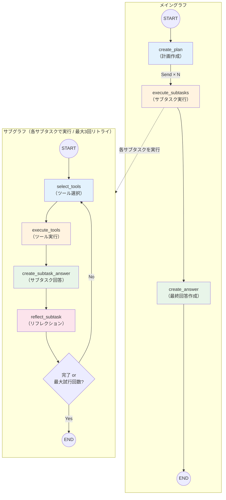
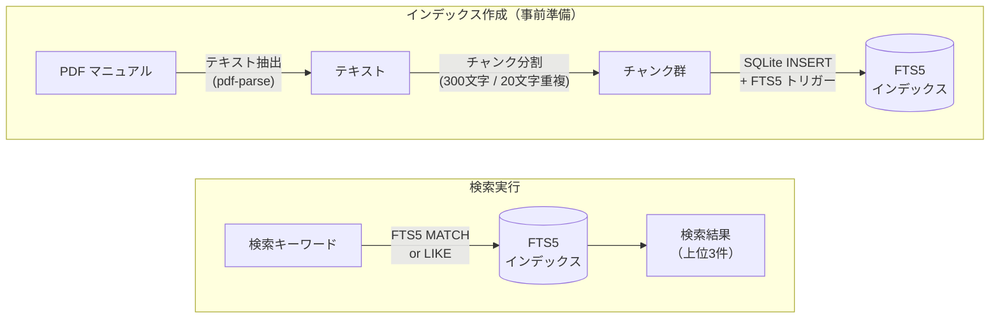
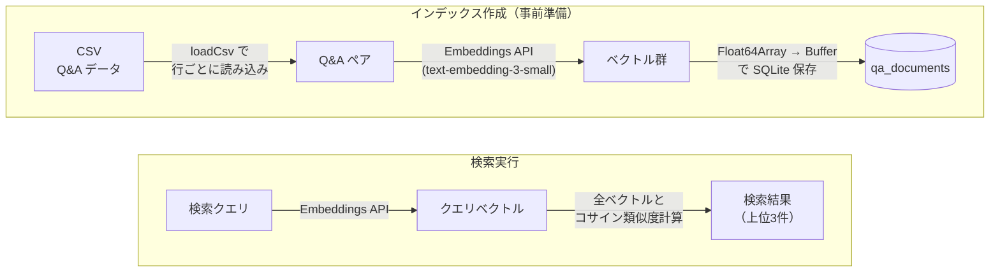
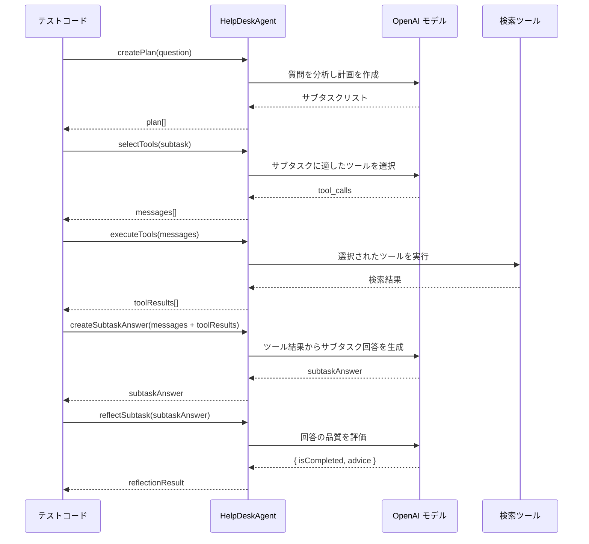
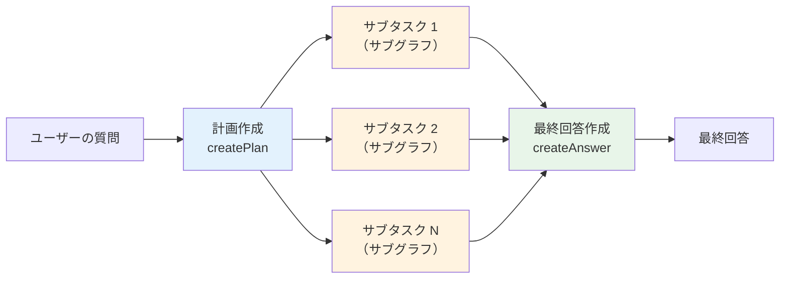
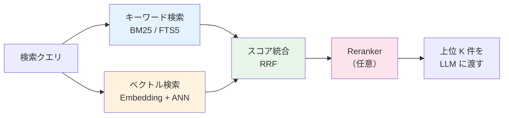

# Chapter 4: ヘルプデスク担当者を支援するAIエージェントの実装

企業のヘルプデスクでは、ユーザーからの問い合わせに対してマニュアルや過去の QA 事例を調べながら回答を作成する必要があります。この作業は人手で行うと時間がかかるうえ、担当者の知識や経験によって回答品質にばらつきが生じます。

この章では、Chapter 2 で学んだ AI エージェントの構成要素（計画・ツール使用・リフレクション）と、Chapter 3 で身につけた LLM API の基本操作を組み合わせて、こうしたヘルプデスク業務を支援する**ヘルプデスクエージェント**を構築します。

具体的には、架空のシステム「XYZ システム」に関する問い合わせに対し、マニュアルや QA データベースを検索しながら自動で回答を生成するエージェントを実装します。ワークフローの制御には **LangGraph**（LangChain が提供するグラフベースのワークフローフレームワーク）を使用します。

:::note この章で学ぶこと

- **LangGraph** のメイングラフとサブグラフによる二層構造のワークフロー設計
- **計画（Plan）→ ツール選択・実行 → 回答生成 → リフレクション**のエージェントループの実装
- **Structured Outputs** を活用した計画立案とリフレクション結果の構造化
- **Send** によるサブタスクの並列実行
- エージェントの各ステップを個別にテスト・デバッグする手法

:::

## 概要

### エージェントのアーキテクチャ

このヘルプデスクエージェントは、**メイングラフ**と**サブグラフ**の二層構造で設計されています。

なぜ二層構造にするのでしょうか？ユーザーの質問は「二段階認証の設定方法」と「バックアップ通知の不具合」のように、複数のトピックを含むことがあります。これらを 1 つのフローで逐次処理すると時間がかかりますが、独立したサブタスクに分解してサブグラフで**並列実行**すれば、処理時間を大幅に短縮できます。また、各サブタスク内でリフレクションによる自己改善ループを回すことで、回答品質を高められます。

具体的には、メイングラフはユーザーの質問を受け取り、計画を立て、サブタスクを並列実行し、最終回答を生成します。各サブタスクはサブグラフ内で「ツール選択 → 実行 → 回答 → リフレクション」のループを最大 3 回まで繰り返します。



### 学習の流れ

| セクション | 内容 |
| --- | --- |
| 4-1 | XYZ マニュアルの全文検索ツール（FTS5）を実装し、キーワード検索でマニュアルから情報を取得できるようにする |
| 4-2 | 過去の QA データをベクトル検索できるツール（Embedding + コサイン類似度）を実装する |
| 4-3 | エージェントの各ステップ（計画・ツール選択・実行・回答・リフレクション）を個別に実行し、動作を確認する |
| 4-4 | エージェント全体を `runAgent()` で一括実行し、ユーザーの質問に対する最終回答を生成する |

:::info 前提条件

- 環境変数 `OPENAI_API_KEY` に OpenAI の API キーが設定されていること
- `@langchain/langgraph` パッケージがインストールされていること（`pnpm install` で自動インストール）
- XYZ マニュアル検索・QA 検索用のインデックス DB が作成済みであること（4-1、4-2 を参照）

:::

### サンプルコードの実行方法

各サンプルは、リポジトリのルートディレクトリから以下のコマンドで実行できます。

```bash
# ルートディレクトリで実行（pnpm tsx は @ai-suburi/core パッケージ内で tsx を実行するエイリアス）
pnpm tsx chapter4/test/<ファイル名>.ts
```

### エージェントの構成ファイル

ヘルプデスクエージェントは、以下のモジュールで構成されています。

| ファイル | 役割 |
| --- | --- |
| `chapter4/agent.ts` | `HelpDeskAgent` クラス（メイングラフ・サブグラフの定義、各ステップの実装） |
| `chapter4/models.ts` | 型定義と Zod スキーマ（`Plan`、`ReflectionResult`、`ToolResult` など） |
| `chapter4/prompts.ts` | プロンプトテンプレート（計画・サブタスク実行・リフレクション・最終回答） |
| `chapter4/configs.ts` | 設定読み込み（OpenAI API キー、モデル名） |
| `chapter4/custom-logger.ts` | タイムスタンプ付きカスタムロガー |
| `chapter4/tools/db.ts` | SQLite データベースの初期化（FTS5 インデックス・QA テーブルの作成） |
| `chapter4/tools/search-xyz-manual/` | マニュアル全文検索ツール（PDF → チャンク分割 → FTS5 検索） |
| `chapter4/tools/search-xyz-qa/` | QA ベクトル検索ツール（CSV → Embedding → コサイン類似度検索） |

#### 設定ファイル (`configs.ts`)

環境変数から OpenAI API の設定を読み込むモジュールです。`OPENAI_API_KEY` は必須で、設定されていない場合はエラーをスローします。モデル名はデフォルトで `gpt-4o` を使用しますが、`OPENAI_MODEL` 環境変数で変更可能です。

```typescript title="chapter4/configs.ts"
export interface Settings {
  openaiApiKey: string;
  openaiApiBase: string;
  openaiModel: string;
}

export function loadSettings(): Settings {
  const openaiApiKey = process.env.OPENAI_API_KEY;
  const openaiApiBase =
    process.env.OPENAI_API_BASE ?? 'https://api.openai.com/v1';
  const openaiModel = process.env.OPENAI_MODEL ?? 'gpt-4o';

  if (!openaiApiKey) {
    throw new Error('OPENAI_API_KEY environment variable is required');
  }

  return { openaiApiKey, openaiApiBase, openaiModel };
}
```

#### カスタムロガー (`custom-logger.ts`)

エージェントの各ステップがどの順序で実行されたかを追跡するため、ISO 8601 タイムスタンプとモジュール名を付加するシンプルなロガーを用意しています。ログレベル（`info` / `debug` / `error`）ごとにメッセージをフォーマットし、デバッグ時に処理の流れを把握しやすくします。

```typescript title="chapter4/custom-logger.ts"
export interface Logger {
  info: (msg: string) => void;
  debug: (msg: string) => void;
  error: (msg: string) => void;
}

export function setupLogger(name: string): Logger {
  const formatMessage = (level: string, msg: string) => {
    const now = new Date().toISOString();
    return `${now} ${level} [${name}] ${msg}`;
  };

  return {
    info: (msg: string) => console.log(formatMessage('INFO', msg)),
    debug: (msg: string) => console.debug(formatMessage('DEBUG', msg)),
    error: (msg: string) => console.error(formatMessage('ERROR', msg)),
  };
}
```

#### 型定義・スキーマ (`models.ts`)

エージェントで使用する型と Zod スキーマを定義します。

OpenAI の **Structured Outputs** は、LLM の出力を JSON スキーマに従った構造化データとして受け取る機能です。通常の自由テキスト応答と異なり、型安全にレスポンスを扱えるため、後続の処理で安定して値を取り出せます。

ここでは `planSchema`（計画のサブタスクリスト）と `reflectionResultSchema`（リフレクション結果の完了判定 + アドバイス）の 2 つの Zod スキーマを定義します。これらのスキーマは `zodResponseFormat` ヘルパー関数（OpenAI Node.js SDK が提供）を通じて OpenAI API の `response_format` パラメータに渡されます。SDK が Zod スキーマを JSON Schema に自動変換し、API レスポンスのパース結果を型付きオブジェクトとして返してくれます。

```typescript title="chapter4/models.ts"
import { z } from 'zod/v4';

/**
 * 検索結果の型定義
 */
export interface SearchOutput {
  fileName: string;
  content: string;
}

/**
 * 計画のZodスキーマ（Structured Output用）
 */
export const planSchema = z.object({
  subtasks: z
    .array(z.string())
    .describe('問題を解決するためのサブタスクリスト'),
});

export type Plan = z.infer<typeof planSchema>;

/**
 * ツール実行結果
 */
export interface ToolResult {
  toolName: string;
  args: string;
  results: SearchOutput[];
}

/**
 * リフレクション結果のZodスキーマ（Structured Output用）
 */
export const reflectionResultSchema = z.object({
  advice: z.string().describe(
    '評価がNGの場合は、別のツールを試す、別の文言でツールを試すなど、なぜNGなのかとどうしたら改善できるかを考えアドバイスを作成してください。' +
      'アドバイスの内容は過去のアドバイスと計画内の他のサブタスクと重複しないようにしてください。' +
      'アドバイスの内容をもとにツール選択・実行からやり直します。',
  ),
  isCompleted: z
    .boolean()
    .describe(
      'ツールの実行結果と回答から、サブタスクに対して正しく回答できているかの評価結果',
    ),
});

export type ReflectionResult = z.infer<typeof reflectionResultSchema>;

/**
 * サブタスク結果
 */
export interface Subtask {
  taskName: string;
  toolResults: ToolResult[][];
  reflectionResults: ReflectionResult[];
  isCompleted: boolean;
  subtaskAnswer: string;
  challengeCount: number;
}

/**
 * エージェント実行結果
 */
export interface AgentResult {
  question: string;
  plan: Plan;
  subtasks: Subtask[];
  answer: string;
}
```

#### プロンプトテンプレート (`prompts.ts`)

エージェントの各ステップで使用するプロンプトを定義します。プロンプトは以下の 4 種類に分かれます。

| プロンプト | 用途 |
| --- | --- |
| **Planner** | ユーザーの質問を分析し、重複のない最小限のサブタスクリストを作成する |
| **Subtask（ツール実行）** | サブタスクに対してツールを選択・実行し、結果から回答を作成する |
| **Subtask（リフレクション）** | サブタスク回答の品質を評価し、不十分なら改善のアドバイスを生成する |
| **最終回答** | 全サブタスクの結果を統合し、ユーザー向けの丁寧な最終回答を作成する |

`HelpDeskAgentPrompts` クラスでデフォルト値を持ちつつ、コンストラクタでカスタマイズも可能な設計です。プロンプト内の `{question}` や `{plan}` はプレースホルダーで、実行時に実際の値に置換されます。

<details>
<summary>chapter4/prompts.ts（クリックで展開）</summary>

```typescript title="chapter4/prompts.ts"
const PLANNER_SYSTEM_PROMPT = `
# 役割
あなたはXYZというシステムのヘルプデスク担当者です。
ユーザーの質問に答えるために以下の指示に従って回答作成の計画を立ててください。

# 絶対に守るべき制約事項
- サブタスクはどんな内容について知りたいのかを具体的かつ詳細に記述すること
- サブタスクは同じ内容を調査しないように重複なく構成すること
- 必要最小限のサブタスクを作成すること

# 例
質問: AとBの違いについて教えて
計画:
- Aとは何かについて調べる
- Bとは何かについて調べる

`;

const PLANNER_USER_PROMPT = `
{question}
`;

const SUBTASK_SYSTEM_PROMPT = `
あなたはXYZというシステムの質問応答のためにサブタスク実行を担当するエージェントです。
回答までの全体の流れは計画立案 → サブタスク実行 [ツール実行 → サブタスク回答 → リフレクション] → 最終回答となります。
サブタスクはユーザーの質問に回答するために考えられた計画の一つです。
最終的な回答は全てのサブタスクの結果を組み合わせて別エージェントが作成します。
あなたは以下の1~3のステップを指示に従ってそれぞれ実行します。各ステップは指示があったら実行し、同時に複数ステップの実行は行わないでください。
なおリフレクションの結果次第で所定の回数までツール選択・実行を繰り返します。

1. ツール選択・実行
サブタスク回答のためのツール選択と選択されたツールの実行を行います。
2回目以降はリフレクションのアドバイスに従って再実行してください。

2. サブタスク回答
ツールの実行結果はあなたしか観測できません。
ツールの実行結果から得られた回答に必要なことは言語化し、最後の回答用エージェントに引き継げるようにしてください。
例えば、概要を知るサブタスクならば、ツールの実行結果から概要を言語化してください。
手順を知るサブタスクならば、ツールの実行結果から手順を言語化してください。
回答できなかった場合は、その旨を言語化してください。

3. リフレクション
ツールの実行結果と回答から、サブタスクに対して正しく回答できているかを評価します。
回答がわからない、情報が見つからないといった内容の場合は評価をNGにし、やり直すようにしてください。
評価がNGの場合は、別のツールを試す、別の文言でツールを試すなど、なぜNGなのかとどうしたら改善できるかを考えアドバイスを作成してください。
アドバイスの内容は過去のアドバイスと計画内の他のサブタスクと重複しないようにしてください。
アドバイスの内容をもとにツール選択・実行からやり直します。
評価がOKの場合は、サブタスク回答を終了します。

`;

const SUBTASK_TOOL_EXECUTION_USER_PROMPT = `
ユーザーの元の質問: {question}
回答のための計画: {plan}
サブタスク: {subtask}

サブタスク実行を開始します。
1.ツール選択・実行, 2サブタスク回答を実行してください
`;

const SUBTASK_REFLECTION_USER_PROMPT = `
3.リフレクションを開始してください
`;

const SUBTASK_RETRY_ANSWER_USER_PROMPT = `
1.ツール選択・実行をリフレクションの結果に従ってやり直してください
`;

const CREATE_LAST_ANSWER_SYSTEM_PROMPT = `
あなたはXYZというシステムのヘルプデスク回答作成担当です。
回答までの全体の流れは計画立案 → サブタスク実行 [ツール実行 → サブタスク回答 → リフレクション] → 最終回答となります。
別エージェントが作成したサブタスクの結果をもとに回答を作成してください。
回答を作成する際は必ず以下の指示に従って回答を作成してください。

- 回答は実際に質問者が読むものです。質問者の意図や理解度を汲み取り、質問に対して丁寧な回答を作成してください
- 回答は聞かれたことに対して簡潔で明確にすることを心がけてください
- あなたが知り得た情報から回答し、不確定な情報や推測を含めないでください
- 調べた結果から回答がわからなかった場合は、その旨を素直に回答に含めた上で引き続き調査することを伝えてください
- 回答の中で質問者に対して別のチームに問い合わせるように促すことは避けてください
`;

const CREATE_LAST_ANSWER_USER_PROMPT = `
ユーザーの質問: {question}

回答のための計画と実行結果: {subtask_results}

回答を作成してください
`;

export class HelpDeskAgentPrompts {
  plannerSystemPrompt: string;
  plannerUserPrompt: string;
  subtaskSystemPrompt: string;
  subtaskToolSelectionUserPrompt: string;
  subtaskReflectionUserPrompt: string;
  subtaskRetryAnswerUserPrompt: string;
  createLastAnswerSystemPrompt: string;
  createLastAnswerUserPrompt: string;

  constructor(
    options: {
      plannerSystemPrompt?: string;
      plannerUserPrompt?: string;
      subtaskSystemPrompt?: string;
      subtaskToolSelectionUserPrompt?: string;
      subtaskReflectionUserPrompt?: string;
      subtaskRetryAnswerUserPrompt?: string;
      createLastAnswerSystemPrompt?: string;
      createLastAnswerUserPrompt?: string;
    } = {},
  ) {
    this.plannerSystemPrompt =
      options.plannerSystemPrompt ?? PLANNER_SYSTEM_PROMPT;
    this.plannerUserPrompt =
      options.plannerUserPrompt ?? PLANNER_USER_PROMPT;
    this.subtaskSystemPrompt =
      options.subtaskSystemPrompt ?? SUBTASK_SYSTEM_PROMPT;
    this.subtaskToolSelectionUserPrompt =
      options.subtaskToolSelectionUserPrompt ??
      SUBTASK_TOOL_EXECUTION_USER_PROMPT;
    this.subtaskReflectionUserPrompt =
      options.subtaskReflectionUserPrompt ?? SUBTASK_REFLECTION_USER_PROMPT;
    this.subtaskRetryAnswerUserPrompt =
      options.subtaskRetryAnswerUserPrompt ??
      SUBTASK_RETRY_ANSWER_USER_PROMPT;
    this.createLastAnswerSystemPrompt =
      options.createLastAnswerSystemPrompt ??
      CREATE_LAST_ANSWER_SYSTEM_PROMPT;
    this.createLastAnswerUserPrompt =
      options.createLastAnswerUserPrompt ?? CREATE_LAST_ANSWER_USER_PROMPT;
  }
}
```

</details>

#### HelpDeskAgent クラス (`agent.ts`)

エージェントの中核となるクラスです。LangGraph の `StateGraph` を使って、メイングラフ（計画 → サブタスク並列実行 → 最終回答）とサブグラフ（ツール選択 → 実行 → 回答 → リフレクション）を定義しています。

このコードで使われている LangGraph の主要な概念を整理します。

| 概念 | 説明 |
| --- | --- |
| **`Annotation`** | グラフの状態（State）の型とデフォルト値、更新ルール（reducer）を宣言的に定義する仕組みです。`reducer` を指定すると、ノードの戻り値が既存の状態にどうマージされるかを制御できます。たとえば `subtaskResults` の reducer `(a, b) => [...a, ...b]` は、新しい結果を既存の配列に追記する動作を定義しています |
| **`StateGraph`** | 状態を持つ有向グラフを構築するクラスです。ノード（処理ステップ）とエッジ（遷移）を `addNode` / `addEdge` で宣言し、`compile()` で実行可能なグラフに変換します |
| **`Send`** | 条件付きエッジから複数のノードインスタンスを**動的に生成・並列実行**するための仕組みです。計画で生成されたサブタスクの数だけ `Send` オブジェクトを返すことで、各サブタスクが並列に実行されます |
| **`addConditionalEdges`** | ノードの出力に基づいて次の遷移先を動的に決定するエッジです。リフレクション結果に応じて「リトライ」か「終了」に分岐する制御フローで使用しています |
| **`convertToOpenAITool`** | `@langchain/core` が提供するユーティリティで、LangChain のツール定義を OpenAI の Function Calling 形式に変換します。`selectTools()` メソッド内でツール一覧を OpenAI API に渡す際に使用しています |

各メソッドは状態（State）を受け取り、更新された状態を返す**純粋な処理ステップ**として設計されているため、個別にテスト・デバッグが可能です（詳しくは 4-3 で確認します）。

なお、OpenAI API の呼び出しでは `temperature: 0` と `seed: 0` を指定しています。`temperature` は生成テキストのランダム性を制御するパラメータで、0 に設定するとモデルが最も確率の高いトークンを選択するようになり、出力の再現性が高まります。`seed` はランダム性のシード値で、同じ値を指定することで同一入力に対して可能な限り同じ出力を得られます（ただし完全な一致は保証されません）。

また、`MAX_CHALLENGE_COUNT = 3` はサブタスクのリフレクションで「不十分」と判定された場合に何回までリトライするかの上限値です。

##### 状態定義（Annotation）

LangGraph の `Annotation.Root` を使って、**メイングラフ**と**サブグラフ**それぞれの状態（State）を定義しています。

**メイングラフの状態（`AgentStateAnnotation`）**:

| フィールド | 型 | 説明 |
| --- | --- | --- |
| `question` | `string` | ユーザーの質問 |
| `plan` | `string[]` | 計画で生成されたサブタスク一覧 |
| `currentStep` | `number` | 現在実行中のサブタスクのインデックス |
| `subtaskResults` | `Subtask[]` | サブタスクの実行結果（reducer で追記） |
| `lastAnswer` | `string` | 最終回答 |

**サブグラフの状態（`AgentSubGraphStateAnnotation`）**:

| フィールド | 型 | 説明 |
| --- | --- | --- |
| `question` | `string` | ユーザーの質問 |
| `plan` | `string[]` | 計画で生成されたサブタスク一覧 |
| `subtask` | `string` | 現在処理中のサブタスク |
| `isCompleted` | `boolean` | リフレクションで「完了」と判定されたか |
| `messages` | `ChatCompletionMessageParam[]` | OpenAI API とのやり取り履歴（last write wins） |
| `challengeCount` | `number` | リトライ回数 |
| `toolResults` | `ToolResult[][]` | ツール実行結果（reducer で追記） |
| `reflectionResults` | `ReflectionResult[]` | リフレクション結果（reducer で追記） |
| `subtaskAnswer` | `string` | サブタスクの回答 |

`messages` の reducer は `(old, newVal) => newVal`（last write wins）で、常に最新の配列で上書きされます。一方、`subtaskResults`・`toolResults`・`reflectionResults` の reducer は `(a, b) => [...a, ...b]` で、既存の配列に新しい値を追記する動作になっています。

:::info reducer の使い分け

LangGraph の `Annotation` で reducer を指定しないフィールド（`question`、`plan` など）は **last write wins**（最後に書き込まれた値で上書き）がデフォルトの動作です。reducer を明示的に指定すると、ノードの戻り値が既存の状態にどうマージされるかを細かく制御できます。蓄積型のデータ（実行結果のログ、リフレクション履歴など）には `(a, b) => [...a, ...b]` の追記パターンが適しています。

:::

```typescript title="chapter4/agent.ts"
// メイングラフの状態定義
const AgentStateAnnotation = Annotation.Root({
  question: Annotation<string>,
  plan: Annotation<string[]>,
  currentStep: Annotation<number>,
  subtaskResults: Annotation<Subtask[]>({
    reducer: (a: Subtask[], b: Subtask[]) => [...a, ...b],
    default: () => [],
  }),
  lastAnswer: Annotation<string>,
});

export type AgentState = typeof AgentStateAnnotation.State;

// サブグラフの状態定義
const AgentSubGraphStateAnnotation = Annotation.Root({
  question: Annotation<string>,
  plan: Annotation<string[]>,
  subtask: Annotation<string>,
  isCompleted: Annotation<boolean>,
  messages: Annotation<ChatCompletionMessageParam[]>({
    // 新しい値で上書き（accumulate不要のためlast write wins）
    reducer: (
      _old: ChatCompletionMessageParam[],
      newVal: ChatCompletionMessageParam[],
    ) => newVal,
    default: () => [],
  }),
  challengeCount: Annotation<number>,
  toolResults: Annotation<ToolResult[][]>({
    reducer: (a: ToolResult[][], b: ToolResult[][]) => [...a, ...b],
    default: () => [],
  }),
  reflectionResults: Annotation<ReflectionResult[]>({
    reducer: (a: ReflectionResult[], b: ReflectionResult[]) => [...a, ...b],
    default: () => [],
  }),
  subtaskAnswer: Annotation<string>,
});

export type AgentSubGraphState = typeof AgentSubGraphStateAnnotation.State;
```

##### `runAgent()` — エージェントの実行

エージェントのエントリーポイントです。`createGraph()` でメイングラフを構築し、`invoke()` でユーザーの質問を渡して実行します。グラフの実行結果（計画・サブタスク結果・最終回答）を `AgentResult` 型に整形して返します。

```typescript title="chapter4/agent.ts"
  async runAgent(question: string): Promise<AgentResult> {
    const app = this.createGraph();
    const result = await app.invoke({
      question,
      currentStep: 0,
    });

    return {
      question,
      plan: { subtasks: result.plan },
      subtasks: result.subtaskResults,
      answer: result.lastAnswer,
    };
  }
```

##### `createGraph()` と `createSubgraph()` — グラフ構築

**`createGraph()`** はメイングラフ（計画 → サブタスク並列実行 → 最終回答）を構築します。`addConditionalEdges` で `create_plan` ノードから `Send` を使った動的並列実行を実現しています。

**`createSubgraph()`** はサブグラフ（ツール選択 → ツール実行 → サブタスク回答 → リフレクション のループ）を構築します。`addConditionalEdges` で `reflect_subtask` ノードからの分岐を定義し、`shouldContinueExecSubtaskFlow()` の結果に応じてリトライか終了かを制御しています。

###### グラフ構築の基本 API

LangGraph でエージェントを構築する際、グラフの構造（ノード間の接続と制御フロー）を明確に定義する必要があります。以下の 3 つの主要なメソッドを使うことで、複雑なワークフローを直感的に表現できます。

**`addNode(name, handler)`**

グラフにノード（処理の単位）を追加します。各ノードは特定の処理を担当し、状態（State）を受け取って更新します。

```typescript
.addNode('create_plan', (state) => this.createPlan(state))
.addNode('execute_subtasks', (state) => this.executeSubgraph(state))
```

第一引数にはノード名（文字列）、第二引数には状態を受け取る処理関数を指定します。

**`addEdge(from, to)`**

2 つのノード間に**無条件の接続**を追加します。`from` ノードの処理が完了すると、必ず `to` ノードへ遷移します。

```typescript
.addEdge(START, 'create_plan')                  // START から必ず create_plan へ
.addEdge('execute_subtasks', 'create_answer')   // execute_subtasks から必ず create_answer へ
.addEdge('create_answer', END)                  // create_answer から必ず END へ
```

`START` と `END` は LangGraph の特殊なノードで、それぞれグラフの開始点と終了点を表します。

**`addConditionalEdges(from, condition, pathMap?)`**

**条件付きの接続**を追加します。`from` ノードの処理が完了した後、`condition` 関数の返り値に応じて次に遷移するノードを動的に決定します。

```typescript
// パターン1: Send を使った動的な並列実行（次のノードを動的に決定）
.addConditionalEdges('create_plan', (state) =>
  this.shouldContinueExecSubtasks(state),
)

// パターン2: pathMap を使った明示的な分岐
.addConditionalEdges(
  'reflect_subtask',
  (state) => this.shouldContinueExecSubtaskFlow(state),
  { continue: 'select_tools', end: END },
)
```

**パターン1（pathMapなし）** は、条件関数が `Send` オブジェクト（または `Send` の配列）を返すことで、実行時に決まる数のノードインスタンスを動的に生成できます。計画で生成されたサブタスクの数だけ並列実行したい場合など、動的なスケーリングが必要な場面で使用します（詳細は後述の「Send による動的並列実行」を参照）。

**パターン2（pathMapあり）** は、条件関数が文字列を返し、その文字列に対応するノードへ遷移します。上記の例では、`'continue'` が返されれば `'select_tools'` へ、`'end'` が返されれば `END` へ遷移します。遷移先が事前に決まっている分岐処理に適しています。

```typescript title="chapter4/agent.ts"
  createGraph() {
    // メソッドチェーンでノードとエッジを追加（型推論のため）
    return new StateGraph(AgentStateAnnotation)
      .addNode('create_plan', (state) => this.createPlan(state))
      .addNode('execute_subtasks', (state) => this.executeSubgraph(state))
      .addNode('create_answer', (state) => this.createAnswer(state))
      .addEdge(START, 'create_plan')
      .addConditionalEdges('create_plan', (state) =>
        this.shouldContinueExecSubtasks(state),
      )
      .addEdge('execute_subtasks', 'create_answer')
      .addEdge('create_answer', END)
      .compile();
  }

  private createSubgraph() {
    // メソッドチェーンでノードとエッジを追加（型推論のため）
    return new StateGraph(AgentSubGraphStateAnnotation)
      .addNode('select_tools', (state) => this.selectTools(state))
      .addNode('execute_tools', (state) => this.executeTools(state))
      .addNode('create_subtask_answer', (state) =>
        this.createSubtaskAnswer(state),
      )
      .addNode('reflect_subtask', (state) => this.reflectSubtask(state))
      .addEdge(START, 'select_tools')
      .addEdge('select_tools', 'execute_tools')
      .addEdge('execute_tools', 'create_subtask_answer')
      .addEdge('create_subtask_answer', 'reflect_subtask')
      .addConditionalEdges(
        'reflect_subtask',
        (state) => this.shouldContinueExecSubtaskFlow(state),
        { continue: 'select_tools', end: END },
      )
      .compile();
  }
```

##### `createPlan()` — 計画の作成

**メイングラフのノード**。ユーザーの質問を受け取り、OpenAI API の **Structured Outputs**（`zodResponseFormat` + `planSchema`）を使って、質問を解決するためのサブタスク一覧を生成します。返却値の `{ plan: string[] }` が `AgentStateAnnotation` の `plan` フィールドに書き込まれ、次のステップで各サブタスクが `Send` によって並列実行されます。

```typescript title="chapter4/agent.ts"
  async createPlan(state: AgentState): Promise<{ plan: string[] }> {
    logger.info('🚀 Starting plan generation process...');

    const systemPrompt = this.prompts.plannerSystemPrompt;
    const userPrompt = this.prompts.plannerUserPrompt.replace(
      '{question}',
      state.question,
    );

    const messages: ChatCompletionMessageParam[] = [
      { role: 'system', content: systemPrompt },
      { role: 'user', content: userPrompt },
    ];
    logger.debug(`Final prompt messages: ${JSON.stringify(messages)}`);

    logger.info('Sending request to OpenAI...');
    const response = await this.client.chat.completions.parse({
      model: this.settings.openaiModel,
      messages,
      response_format: zodResponseFormat(planSchema, 'plan'),
      temperature: 0,
      seed: 0,
    });
    logger.info('✅ Successfully received response from OpenAI.');

    const plan = response.choices[0]?.message.parsed ?? { subtasks: [] };

    logger.info('Plan generation complete!');

    return { plan: plan.subtasks };
  }
```

##### `executeSubgraph()` と制御フローメソッド

**`executeSubgraph()`** はメイングラフの `execute_subtasks` ノードに対応するメソッドです。サブグラフを作成・実行し、結果を `Subtask` オブジェクトとして返します。各サブタスクの質問・計画・実行対象のサブタスクを初期状態として渡しています。

**`shouldContinueExecSubtasks()`** は `create_plan` ノードの条件付きエッジで使われ、計画内の各サブタスクに対して `Send` オブジェクトを生成します。これにより、サブタスクの数だけ `execute_subtasks` ノードが**動的に並列生成**されます。

**`shouldContinueExecSubtaskFlow()`** はサブグラフの `reflect_subtask` ノードの条件付きエッジで使われ、リフレクション結果（`isCompleted`）またはリトライ回数（`challengeCount`）に基づいて「ツール選択に戻ってリトライ」か「終了」かを判定します。

:::tip Send による動的並列実行

LangGraph の `Send` は、条件付きエッジの戻り値として複数の `Send` オブジェクトを返すことで、**実行時に決まる数のノードインスタンスを並列生成**できる仕組みです。通常の `addEdge` では遷移先が静的に 1 つですが、`Send` を使えば「計画で 3 つのサブタスクが生成されたら 3 並列、5 つなら 5 並列」のように動的にスケールします。

:::

```typescript title="chapter4/agent.ts"
  private async executeSubgraph(state: AgentState) {
    const subgraph = this.createSubgraph();

    const result = await subgraph.invoke({
      question: state.question,
      plan: state.plan,
      subtask: state.plan[state.currentStep] ?? '',
      isCompleted: false,
      challengeCount: 0,
    });

    const subtaskResult: Subtask = {
      taskName: result.subtask,
      toolResults: result.toolResults,
      reflectionResults: result.reflectionResults,
      isCompleted: result.isCompleted,
      subtaskAnswer: result.subtaskAnswer,
      challengeCount: result.challengeCount,
    };

    return { subtaskResults: [subtaskResult] };
  }

  private shouldContinueExecSubtasks(state: AgentState): Send[] {
    return state.plan.map(
      (_, idx) =>
        new Send('execute_subtasks', {
          question: state.question,
          plan: state.plan,
          currentStep: idx,
        }),
    );
  }

  private shouldContinueExecSubtaskFlow(
    state: AgentSubGraphState,
  ): 'end' | 'continue' {
    if (state.isCompleted || state.challengeCount >= MAX_CHALLENGE_COUNT) {
      return 'end';
    }
    return 'continue';
  }
```

##### `selectTools()` — ツールの選択

**サブグラフのノード**。サブタスクに対して適切なツールを選ぶステップです。`convertToOpenAITool` で LangChain のツール定義を OpenAI の Function Calling 形式に変換し、API の `tools` パラメータに渡しています。

初回（`challengeCount === 0`）ではサブタスク用のプロンプトを新規作成します。リトライ時（`challengeCount >= 1`）は、過去の対話履歴からツール応答（`role: 'tool'` や `tool_calls` を含むメッセージ）を除外してトークン消費を抑えつつ、リトライ用プロンプトを追加します。

モデルがツールを呼ばずにテキストで応答した場合のフォールバック処理も含まれています。

```typescript title="chapter4/agent.ts"
  async selectTools(
    state: AgentSubGraphState,
  ): Promise<{ messages: ChatCompletionMessageParam[] }> {
    logger.info('🚀 Starting tool selection process...');

    // OpenAI対応のtool定義に変換
    logger.debug('Converting tools for OpenAI format...');
    const openaiTools = this.tools.map((tool) => convertToOpenAITool(tool));

    let messages: ChatCompletionMessageParam[];

    if (state.challengeCount === 0) {
      logger.debug('Creating user prompt for tool selection...');
      const userPrompt = this.prompts.subtaskToolSelectionUserPrompt
        .replace('{question}', state.question)
        .replace('{plan}', JSON.stringify(state.plan))
        .replace('{subtask}', state.subtask);

      messages = [
        { role: 'system', content: this.prompts.subtaskSystemPrompt },
        { role: 'user', content: userPrompt },
      ];
    } else {
      logger.debug('Creating user prompt for tool retry...');

      // リトライされた場合は過去の対話情報にプロンプトを追加する
      // NOTE: トークン数節約のため過去の検索結果は除く
      // roleがtoolまたはtool_callsを持つものは除く
      messages = state.messages.filter(
        (message) => message.role !== 'tool' || !('tool_calls' in message),
      );

      const userRetryPrompt = this.prompts.subtaskRetryAnswerUserPrompt;
      messages.push({ role: 'user', content: userRetryPrompt });
    }

    logger.info('Sending request to OpenAI...');
    const response = await this.client.chat.completions.create({
      model: this.settings.openaiModel,
      messages,
      tools: openaiTools,
      temperature: 0,
      seed: 0,
    });
    logger.info('✅ Successfully received response from OpenAI.');

    const selectChoice = response.choices[0];
    const toolCalls = selectChoice?.message.tool_calls;
    if (!toolCalls || toolCalls.length === 0) {
      // モデルがツールを呼ばずにテキストで応答した場合
      logger.info('No tool calls returned, using text response as fallback.');
      const textContent = selectChoice?.message.content ?? '';
      messages.push({ role: 'assistant', content: textContent });
      return { messages };
    }

    const aiMessage: ChatCompletionMessageParam = {
      role: 'assistant',
      tool_calls: toolCalls,
    };

    logger.info('Tool selection complete!');
    messages.push(aiMessage);

    return { messages };
  }
```

##### `executeTools()` — ツールの実行

**サブグラフのノード**。`selectTools()` で選択されたツールを実際に実行するステップです。直前のメッセージから `tool_calls` を取得し、`toolMap`（コンストラクタで構築した名前→ツールの `Map`）を使って対応するツールを呼び出します。

各ツールの実行結果は `ToolResult` として記録されると同時に、OpenAI のメッセージ形式（`role: 'tool'`）として `messages` にも追加されます。これにより、次の `createSubtaskAnswer()` で LLM がツール実行結果を参照して回答を生成できるようになります。

```typescript title="chapter4/agent.ts"
  async executeTools(state: AgentSubGraphState): Promise<{
    messages: ChatCompletionMessageParam[];
    toolResults: ToolResult[][];
  }> {
    logger.info('🚀 Starting tool execution process...');
    const messages = [...state.messages];

    const lastMessage = messages[messages.length - 1];
    const toolCalls =
      lastMessage?.role === 'assistant' && 'tool_calls' in lastMessage
        ? lastMessage.tool_calls
        : null;

    if (!toolCalls || toolCalls.length === 0) {
      // selectToolsでツールが選択されなかった場合はスキップ
      logger.info('No tool calls found, skipping tool execution.');
      return { messages, toolResults: [[]] };
    }

    const toolResults: ToolResult[] = [];

    for (const toolCall of toolCalls) {
      if (toolCall.type !== 'function') {
        continue;
      }
      const toolName: string = toolCall.function.name;
      const toolArgs: string = toolCall.function.arguments;

      const tool = this.toolMap.get(toolName);
      if (!tool) {
        throw new Error(`Tool not found: ${toolName}`);
      }
      const toolResult: SearchOutput[] = await tool.invoke(
        JSON.parse(toolArgs),
      );

      toolResults.push({
        toolName,
        args: toolArgs,
        results: toolResult,
      });

      messages.push({
        role: 'tool',
        content: JSON.stringify(toolResult),
        tool_call_id: toolCall.id,
      });
    }
    logger.info('Tool execution complete!');
    return { messages, toolResults: [toolResults] };
  }
```

##### `createSubtaskAnswer()` — サブタスク回答の作成

**サブグラフのノード**。ツールの実行結果が含まれた `messages` をそのまま OpenAI API に渡し、サブタスクに対する回答を生成します。ツール結果（`role: 'tool'`）のコンテキストが `messages` に含まれているため、追加のプロンプトなしで LLM がツール結果を踏まえた適切な回答を返せる仕組みになっています。

```typescript title="chapter4/agent.ts"
  async createSubtaskAnswer(state: AgentSubGraphState): Promise<{
    messages: ChatCompletionMessageParam[];
    subtaskAnswer: string;
  }> {
    logger.info('🚀 Starting subtask answer creation process...');
    const messages = [...state.messages];

    logger.info('Sending request to OpenAI...');
    const response = await this.client.chat.completions.create({
      model: this.settings.openaiModel,
      messages,
      temperature: 0,
      seed: 0,
    });
    logger.info('✅ Successfully received response from OpenAI.');

    const subtaskAnswer = response.choices[0]?.message.content ?? '';

    const aiMessage: ChatCompletionMessageParam = {
      role: 'assistant',
      content: subtaskAnswer,
    };
    messages.push(aiMessage);

    logger.info('Subtask answer creation complete!');

    return { messages, subtaskAnswer };
  }
```

##### `reflectSubtask()` — サブタスク回答のリフレクション

**サブグラフのノード**。生成されたサブタスク回答の品質を LLM 自身に評価させるステップです。Structured Outputs（`reflectionResultSchema`）を使い、回答が十分かどうか（`isCompleted`）とアドバイス（`advice`）を構造化データとして返します。

`isCompleted` が `false` の場合、`challengeCount` をインクリメントしてサブグラフのループ先頭（ツール選択）に戻ります。`challengeCount` が `MAX_CHALLENGE_COUNT`（3回）に達しても完了しない場合は強制的に終了し、「回答が見つかりませんでした」というフォールバック回答をセットします。

```typescript title="chapter4/agent.ts"
  async reflectSubtask(state: AgentSubGraphState): Promise<{
    messages: ChatCompletionMessageParam[];
    reflectionResults: ReflectionResult[];
    challengeCount: number;
    isCompleted: boolean;
    subtaskAnswer?: string;
  }> {
    logger.info('🚀 Starting reflection process...');
    const messages = [...state.messages];

    const userPrompt = this.prompts.subtaskReflectionUserPrompt;
    messages.push({ role: 'user', content: userPrompt });

    logger.info('Sending request to OpenAI...');
    const response = await this.client.chat.completions.parse({
      model: this.settings.openaiModel,
      messages,
      response_format: zodResponseFormat(
        reflectionResultSchema,
        'reflection_result',
      ),
      temperature: 0,
      seed: 0,
    });
    logger.info('✅ Successfully received response from OpenAI.');

    const reflectionResult = response.choices[0]?.message.parsed ?? {
      advice: '',
      isCompleted: false,
    };

    messages.push({
      role: 'assistant',
      content: JSON.stringify(reflectionResult),
    });

    const updateState: {
      messages: ChatCompletionMessageParam[];
      reflectionResults: ReflectionResult[];
      challengeCount: number;
      isCompleted: boolean;
      subtaskAnswer?: string;
    } = {
      messages,
      reflectionResults: [reflectionResult],
      challengeCount: state.challengeCount + 1,
      isCompleted: reflectionResult.isCompleted,
    };

    if (
      updateState.challengeCount >= MAX_CHALLENGE_COUNT &&
      !reflectionResult.isCompleted
    ) {
      updateState.subtaskAnswer = `${state.subtask}の回答が見つかりませんでした。`;
    }

    logger.info('Reflection complete!');
    return updateState;
  }
```

##### `createAnswer()` — 最終回答の作成

**メイングラフのノード**。すべてのサブタスクが完了した後に実行され、各サブタスクの回答を統合してユーザーへの最終回答を生成します。`subtaskResults` から各タスクの名前と回答のペアだけを抽出し、専用のシステムプロンプト・ユーザープロンプトと合わせて OpenAI API に渡しています。

```typescript title="chapter4/agent.ts"
  async createAnswer(state: AgentState): Promise<{ lastAnswer: string }> {
    logger.info('🚀 Starting final answer creation process...');
    const systemPrompt = this.prompts.createLastAnswerSystemPrompt;

    // サブタスク結果のうちタスク内容と回答のみを取得
    const subtaskResults = state.subtaskResults.map((result) => [
      result.taskName,
      result.subtaskAnswer,
    ]);
    const userPrompt = this.prompts.createLastAnswerUserPrompt
      .replace('{question}', state.question)
      .replace('{subtask_results}', JSON.stringify(subtaskResults));

    const messages: ChatCompletionMessageParam[] = [
      { role: 'system', content: systemPrompt },
      { role: 'user', content: userPrompt },
    ];

    logger.info('Sending request to OpenAI...');
    const response = await this.client.chat.completions.create({
      model: this.settings.openaiModel,
      messages,
      temperature: 0,
      seed: 0,
    });
    logger.info('✅ Successfully received response from OpenAI.');

    logger.info('Final answer creation complete!');

    return { lastAnswer: response.choices[0]?.message.content ?? '' };
  }
```

## 4-1. マニュアル検索ツールの実装

エージェントが XYZ システムのマニュアルから情報を取得するための検索ツールを実装します。PDF 形式のマニュアルをチャンク分割し、SQLite の **FTS5**（Full-Text Search 5）を使った全文検索でキーワードに一致するドキュメントを取得します。

### なぜ全文検索を使うのか？

マニュアルには「エラーコード E-1001」や「二段階認証」のような固有名詞・技術用語が多く含まれます。こうした正確なキーワードを含むドキュメントを検索するには、ベクトル検索よりも全文検索のほうが適しています。一方、「ログインできなくて困っている」のような自然言語の質問には、次の 4-2 で実装するベクトル検索が有効です。

### マニュアル検索のデータフロー

マニュアル検索ツールは、事前にインデックスを作成しておき、検索時にはそのインデックスを参照します。



### データベース初期化 (`tools/db.ts`)

マニュアル検索と QA 検索で共用する SQLite データベースを初期化するモジュールです。`better-sqlite3` を使用し、以下の要素を作成します。

- **WAL（Write-Ahead Logging）モード**: 変更をまずログファイルに書き込み、その後にデータベース本体へ反映するジャーナリングモードです。これにより読み取りと書き込みを並行実行でき、デフォルトの rollback ジャーナルと比べて読み取り性能が向上します
- **`documents` テーブル**: PDF から分割したテキストチャンクを格納
- **`documents_fts` 仮想テーブル**: FTS5 の **trigram トークナイザー**で日本語全文検索に対応。trigram は文字列を 3 文字ずつスライドしてトークン化する方式です（例: 「二段階認証」→「二段階」「段階認」「階認証」）。形態素解析エンジンが不要なため導入が容易ですが、3 文字未満のキーワードでは検索できない制約があります
- **挿入・更新・削除トリガー**: `documents` テーブルの変更を FTS5 インデックスに自動同期
- **`qa_documents` テーブル**: QA データの Embedding ベクトルを格納（4-2 で使用）

```typescript title="chapter4/tools/db.ts"
import path from 'node:path';
import { fileURLToPath } from 'node:url';
import Database from 'better-sqlite3';

const __dirname = path.dirname(fileURLToPath(import.meta.url));

// デフォルトのデータベースパス
const DEFAULT_DB_PATH = path.resolve(__dirname, './data/xyz-manual-search.db');

/**
 * SQLiteデータベースを開き、テーブルとFTS5インデックスを初期化する
 * @param dbPath - データベースファイルのパス
 * @returns 初期化済みのデータベースインスタンス
 */
export function openDatabase(
  dbPath: string = DEFAULT_DB_PATH,
): Database.Database {
  const db = new Database(dbPath);

  // WALモードを有効にしてパフォーマンスを向上
  db.pragma('journal_mode = WAL');

  // ドキュメント格納テーブル
  db.exec(`
    CREATE TABLE IF NOT EXISTS documents (
      id INTEGER PRIMARY KEY AUTOINCREMENT,
      file_name TEXT NOT NULL,
      content TEXT NOT NULL
    )
  `);

  // FTS5仮想テーブル（trigramトークナイザーで日本語対応）
  db.exec(`
    CREATE VIRTUAL TABLE IF NOT EXISTS documents_fts USING fts5(
      content,
      content='documents',
      content_rowid='id',
      tokenize='trigram'
    )
  `);

  // 挿入トリガー: documentsに追加されたらFTSインデックスも更新
  db.exec(`
    CREATE TRIGGER IF NOT EXISTS documents_ai AFTER INSERT ON documents BEGIN
      INSERT INTO documents_fts(rowid, content) VALUES (new.id, new.content);
    END
  `);

  // 削除トリガー
  db.exec(`
    CREATE TRIGGER IF NOT EXISTS documents_ad AFTER DELETE ON documents BEGIN
      INSERT INTO documents_fts(documents_fts, rowid, content)
        VALUES('delete', old.id, old.content);
    END
  `);

  // 更新トリガー
  db.exec(`
    CREATE TRIGGER IF NOT EXISTS documents_au AFTER UPDATE ON documents BEGIN
      INSERT INTO documents_fts(documents_fts, rowid, content)
        VALUES('delete', old.id, old.content);
      INSERT INTO documents_fts(rowid, content) VALUES (new.id, new.content);
    END
  `);

  // QAドキュメント格納テーブル（ベクトル検索用）
  db.exec(`
    CREATE TABLE IF NOT EXISTS qa_documents (
      id INTEGER PRIMARY KEY AUTOINCREMENT,
      file_name TEXT NOT NULL,
      content TEXT NOT NULL,
      embedding BLOB NOT NULL
    )
  `);

  return db;
}
```

### インデックス作成 (`tools/search-xyz-manual/create-index.ts`)

PDF ファイルを読み込み、テキストをチャンク分割して SQLite に投入するスクリプトです。

`splitText` 関数は、テキストを指定サイズ（デフォルト 300 文字）に分割するユーティリティです。段落区切り（`\n\n`）→ 改行（`\n`）→ 空白（` `）の順にセパレータを試し、できるだけ意味のまとまりを保ったまま分割します。これは Python の LangChain で広く使われている `RecursiveCharacterTextSplitter` と同等のロジックです。

チャンク間にはオーバーラップ（重複）を設けています（デフォルト 20 文字）。たとえば「二段階認証の設定手順は以下のとおりです」という文がチャンク境界にまたがっても、オーバーラップにより前後のチャンクの両方に含まれるため、情報の欠落を防げます。

```typescript title="chapter4/tools/search-xyz-manual/create-index.ts"
import fs from 'node:fs';
import path from 'node:path';
import { fileURLToPath } from 'node:url';
import { PDFParse } from 'pdf-parse';
import { openDatabase } from '../db.js';

const __dirname = path.dirname(fileURLToPath(import.meta.url));
const DATA_DIR = path.resolve(__dirname, '../data');

/**
 * テキストをチャンク分割する（Python の RecursiveCharacterTextSplitter を再現）
 * @param text - 分割対象のテキスト
 * @param chunkSize - 1チャンクの最大文字数
 * @param chunkOverlap - 前のチャンクとの重複文字数
 * @param separators - 分割に使うセパレータの優先順位
 * @returns 分割されたテキストチャンクの配列
 */
function splitText(
  text: string,
  chunkSize = 300,
  chunkOverlap = 20,
  separators = ['\n\n', '\n', ' ', ''],
): string[] {
  if (text.length === 0) return [];
  if (text.length <= chunkSize) return [text];

  // 使用可能な最初のセパレータを見つける
  let separator = '';
  for (const sep of separators) {
    if (sep === '' || text.includes(sep)) {
      separator = sep;
      break;
    }
  }

  // セパレータでテキストを分割
  const parts = separator === '' ? [...text] : text.split(separator);

  const chunks: string[] = [];
  let currentChunk = '';

  for (const part of parts) {
    const candidate = currentChunk ? currentChunk + separator + part : part;

    if (candidate.length > chunkSize && currentChunk) {
      chunks.push(currentChunk.trim());
      // オーバーラップ: 前のチャンクの末尾を次のチャンクの先頭に含める
      const overlapText = currentChunk.slice(-chunkOverlap);
      currentChunk = overlapText + separator + part;
    } else {
      currentChunk = candidate;
    }
  }

  if (currentChunk.trim()) {
    chunks.push(currentChunk.trim());
  }

  return chunks.filter((c) => c.length > 0);
}

/**
 * PDFファイルを読み込み、テキストをチャンク分割してDBに投入する
 */
export async function createIndex(): Promise<void> {
  const db = openDatabase();

  // 既存データをクリア
  db.exec('DELETE FROM documents');
  // FTSインデックスもリビルド
  db.exec("INSERT INTO documents_fts(documents_fts) VALUES('rebuild')");

  const pdfFiles = fs.readdirSync(DATA_DIR).filter((f) => f.endsWith('.pdf'));

  if (pdfFiles.length === 0) {
    console.log(`PDFファイルが見つかりません: ${DATA_DIR}`);
    db.close();
    return;
  }

  const insert = db.prepare(
    'INSERT INTO documents (file_name, content) VALUES (?, ?)',
  );
  const insertMany = db.transaction((rows: Array<[string, string]>) => {
    for (const row of rows) {
      insert.run(...row);
    }
  });

  let totalChunks = 0;

  for (const pdfFile of pdfFiles) {
    const filePath = path.join(DATA_DIR, pdfFile);
    const buffer = fs.readFileSync(filePath);

    // pdf-parse v2: PDFParse クラスで読み込み → getText() でテキスト抽出
    const parser = new PDFParse({ data: new Uint8Array(buffer) });
    const textResult = await parser.getText();
    await parser.destroy();

    // テキストをチャンク分割
    const chunks = splitText(textResult.text, 300, 20);
    const rows = chunks.map((chunk): [string, string] => [pdfFile, chunk]);

    insertMany(rows);
    totalChunks += chunks.length;
    console.log(`${pdfFile}: ${chunks.length} チャンクをインデックスに追加`);
  }

  console.log(`\n合計: ${totalChunks} チャンクをインデックスに追加完了`);
  db.close();
}

// 直接実行された場合のみインデックスを作成
if (fileURLToPath(import.meta.url) === process.argv[1]) {
  createIndex();
}
```

**実行方法:**

```bash
pnpm tsx chapter4/tools/search-xyz-manual/create-index.ts
```

### マニュアル検索ツール (`tools/search-xyz-manual/search-xyz-manual.ts`)

LangChain の `tool` 関数を使って、全文検索機能を**ツール**として定義します。ツール化することで、OpenAI の Function Calling（Chapter 3 で学んだ仕組み）を通じて LLM が質問内容に応じてこの検索機能を自動的に呼び出せるようになります。たとえば「エラーコード E-1001」のような固有名詞を含む質問には、LLM がこのマニュアル検索ツールを選択します。

検索ロジックのポイントは以下のとおりです。

- **FTS5 trigram 検索**: 3 文字以上のキーワードは FTS5 の全文検索インデックスを使用して高速に検索
- **LIKE フォールバック**: trigram トークナイザーは 3 文字未満のキーワードに対応できないため、短いキーワードの場合は `LIKE` による部分一致検索にフォールバック
- **自動インデックス作成**: 検索時にインデックスが空の場合、`createIndex()` を自動実行

```typescript title="chapter4/tools/search-xyz-manual/search-xyz-manual.ts"
import { tool } from '@langchain/core/tools';
import { z } from 'zod/v4';
import { openDatabase } from '../db.js';
import { createIndex } from './create-index.js';

// 検索結果の最大取得数
const MAX_SEARCH_RESULTS = 3;

// 検索結果の型定義
interface SearchOutput {
  fileName: string;
  content: string;
}

// 入力スキーマを定義
const searchKeywordSchema = z.object({
  keywords: z.string().describe('全文検索用のキーワード'),
});

// FTS5 trigramの最小トークン長
const MIN_TRIGRAM_LENGTH = 3;

// LangChainのtool関数を使って、検索機能をツール化
const searchXyzManual = tool(
  async ({ keywords }): Promise<SearchOutput[]> => {
    console.log(`Searching XYZ manual by keyword: ${keywords}`);

    const db = openDatabase();

    // インデックスが未作成の場合は自動で作成
    const count = db.prepare('SELECT COUNT(*) as cnt FROM documents').get() as {
      cnt: number;
    };
    if (count.cnt === 0) {
      db.close();
      console.log('インデックスが空のため、自動作成を開始します...');
      await createIndex();
      // インデックス作成後に再接続
      return searchXyzManual.invoke({ keywords });
    }

    try {
      const terms = keywords.split(/\s+/).filter((k) => k.length > 0);

      if (terms.length === 0) {
        console.log('Search results: 0 hits');
        return [];
      }

      let rows: Array<{ file_name: string; content: string }>;

      // trigram トークナイザーは3文字未満のキーワードに対応できないため、
      // 短いキーワードの場合は LIKE にフォールバック
      const hasShortTerm = terms.some((t) => t.length < MIN_TRIGRAM_LENGTH);

      if (hasShortTerm) {
        // LIKE による部分一致検索にフォールバック
        const conditions = terms.map(() => 'content LIKE ?').join(' AND ');
        const params = terms.map((t) => `%${t}%`);
        rows = db
          .prepare(
            `SELECT file_name, content FROM documents WHERE ${conditions} LIMIT ?`,
          )
          .all(...params, MAX_SEARCH_RESULTS) as Array<{
          file_name: string;
          content: string;
        }>;
      } else {
        // FTS5 trigram 検索: 各キーワードをダブルクォートで囲み AND で結合
        const ftsQuery = terms.map((t) => `"${t}"`).join(' AND ');
        rows = db
          .prepare(
            `
						SELECT d.file_name, d.content
						FROM documents d
						JOIN documents_fts fts ON d.id = fts.rowid
						WHERE documents_fts MATCH ?
						ORDER BY rank
						LIMIT ?
					`,
          )
          .all(ftsQuery, MAX_SEARCH_RESULTS) as Array<{
          file_name: string;
          content: string;
        }>;
      }

      console.log(`Search results: ${rows.length} hits`);

      const outputs: SearchOutput[] = rows.map((row) => ({
        fileName: row.file_name,
        content: row.content,
      }));

      console.log('Finished searching XYZ manual by keyword');
      return outputs;
    } finally {
      db.close();
    }
  },
  {
    name: 'search_xyz_manual',
    description:
      'XYZシステムのドキュメントを調査する関数。エラーコードや固有名詞が質問に含まれる場合は、この関数を使ってキーワード検索を行う。',
    schema: searchKeywordSchema,
  },
);

export { searchXyzManual, type SearchOutput };
```

:::tip LangChain の `tool` 関数

`tool` 関数は、通常の関数を LangChain のツールとしてラップします。`name`・`description`・`schema`（Zod スキーマ）を指定することで、LLM が Function Calling でこのツールを選択する際に必要なメタ情報が自動的に生成されます。`description` はツール選択の精度に大きく影響するため、どのような場面で使うべきかを具体的に記述することが重要です。

:::

### マニュアル検索の動作確認

検索ツールが正しく動作するかを単体で確認します。

```typescript title="chapter4/test/test-search-xyz-manual.ts"
import { searchXyzManual } from '../tools/search-xyz-manual/search-xyz-manual.js';

// テスト用のキーワードで検索を実行
const keyword = 'オンラインヘルプセンター';
console.log(`=== searchXyzManual テスト ===`);
console.log(`検索キーワード: ${keyword}\n`);

const results = await searchXyzManual.invoke({ keywords: keyword });

console.log(`\n=== 検索結果: ${results.length} 件 ===`);
for (const [i, result] of results.entries()) {
  console.log(`\n--- ${i + 1}. ${result.fileName} ---`);
  console.log(result.content.slice(0, 200));
}
```

**実行方法:**

```bash
pnpm tsx chapter4/test/test-search-xyz-manual.ts
```

**実行結果の例:**

```text
=== searchXyzManual テスト ===
検索キーワード: オンラインヘルプセンター

Searching XYZ manual by keyword: オンラインヘルプセンター
Search results: 3 hits
Finished searching XYZ manual by keyword

=== 検索結果: 3 件 ===

--- 1. xyz-manual.pdf ---
オンラインヘルプセンターでは、以下のサービスを提供しています...

--- 2. xyz-manual.pdf ---
お問い合わせの際は、オンラインヘルプセンターのチャットサポートをご利用ください...

--- 3. xyz-manual.pdf ---
ヘルプセンターのFAQページでは、よくある質問と回答を掲載しています...
```

---

## 4-2. QA 検索ツールの実装

エージェントが過去の問い合わせ履歴（QA データ）から類似の質問と回答を検索するためのツールを実装します。CSV 形式の QA データを OpenAI の **Embeddings API** でベクトル化（テキストを数値の配列に変換）し、**コサイン類似度**で意味的に近い文書を検索します。

### なぜベクトル検索を使うのか？

4-1 のキーワード検索は、正確な語句の一致に基づく検索です。一方で「ログインできない」と「認証に失敗する」のように、同じ意味でも異なる表現が使われるケースでは、キーワード検索では見つけられません。

ベクトル検索は、テキストを高次元のベクトル（数値の配列）に変換し、ベクトル間の距離や角度で**意味的な類似性**を計算します。これにより、表現が異なっていても意味が近い文書を検索できます。

| 検索方式 | 得意なケース | 苦手なケース |
| --- | --- | --- |
| **キーワード検索（FTS5）** | エラーコード、固有名詞、正確な語句 | 表現揺れ、言い換え |
| **ベクトル検索（Embedding）** | 自然言語の質問、意味的な類似性 | 正確な語句の一致、数値・コードの検索 |

このエージェントでは両方のツールを LLM に提供し、質問の内容に応じて適切なツールを自動選択させます。

### QA 検索のデータフロー

QA 検索ツールは、事前に Embedding ベクトルを生成・保存しておき、検索時にはクエリもベクトル化してコサイン類似度で比較します。



### QA インデックス作成 (`tools/search-xyz-qa/create-qa-index.ts`)

CSV ファイルの各行（質問と回答のペア）を読み込み、OpenAI の `text-embedding-3-small` モデルで Embedding ベクトルを生成して SQLite に保存します。

Embedding ベクトルは `Float64Array`（64 ビット浮動小数点数の型付き配列）に変換した後、`Buffer` に変換して SQLite の `BLOB`（Binary Large Object）型として格納します。`Float64Array` を使う理由は、JavaScript の通常の `number[]` よりもメモリ効率が高く、数値演算（コサイン類似度の計算）も高速に実行できるためです。検索時には `BLOB` → `Float64Array` に復元してコサイン類似度を計算します。

```typescript title="chapter4/tools/search-xyz-qa/create-qa-index.ts"
import fs from 'node:fs';
import path from 'node:path';
import { fileURLToPath } from 'node:url';
import OpenAI from 'openai';
import { openDatabase } from '../db.js';

const __dirname = path.dirname(fileURLToPath(import.meta.url));
const DATA_DIR = path.resolve(__dirname, '../data');

/**
 * CSVファイルを読み込み、各行を Q&A オブジェクトとして返す
 * @param filePath - 読み込むCSVファイルのパス
 * @returns Q&A オブジェクトの配列
 */
function loadCsv(filePath: string): Array<{ q: string; a: string }> {
  const text = fs.readFileSync(filePath, 'utf-8');
  const lines = text.split('\n').filter((line) => line.trim().length > 0);

  // ヘッダー行をスキップ
  const rows: Array<{ q: string; a: string }> = [];
  for (let i = 1; i < lines.length; i++) {
    const line = lines[i] ?? '';
    // 最初のカンマで分割（A列にカンマが含まれる可能性があるため）
    const commaIndex = line.indexOf(',');
    if (commaIndex === -1) continue;
    const q = line.slice(0, commaIndex);
    const a = line.slice(commaIndex + 1);
    rows.push({ q, a });
  }
  return rows;
}

/**
 * OpenAI API で embedding ベクトルを生成する
 * @param client - OpenAI クライアント
 * @param text - embedding を生成するテキスト
 * @returns embedding ベクトル
 */
async function generateEmbedding(
  client: OpenAI,
  text: string,
): Promise<number[]> {
  const response = await client.embeddings.create({
    model: 'text-embedding-3-small',
    input: text,
  });
  return response.data[0]?.embedding ?? [];
}

/**
 * CSVファイルを読み込み、embeddingを生成してDBに投入する
 */
export async function createQaIndex(): Promise<void> {
  const db = openDatabase();

  // 既存データをクリア
  db.exec('DELETE FROM qa_documents');

  const csvFiles = fs.readdirSync(DATA_DIR).filter((f) => f.endsWith('.csv'));

  if (csvFiles.length === 0) {
    console.log(`CSVファイルが見つかりません: ${DATA_DIR}`);
    db.close();
    return;
  }

  const openaiClient = new OpenAI({ apiKey: process.env.OPENAI_API_KEY });

  const insert = db.prepare(
    'INSERT INTO qa_documents (file_name, content, embedding) VALUES (?, ?, ?)',
  );

  let totalDocs = 0;

  for (const csvFile of csvFiles) {
    const filePath = path.join(DATA_DIR, csvFile);
    const rows = loadCsv(filePath);

    for (const row of rows) {
      // Python版と同様に content を結合（CSVLoaderの出力形式を再現）
      const content = `Q: ${row.q}\nA: ${row.a}`;
      // Python版と同様にスペースを除去
      const cleanContent = content.replace(/ /g, '');

      console.log(
        `[${totalDocs + 1}] embedding生成中: ${cleanContent.slice(0, 50)}...`,
      );
      const embedding = await generateEmbedding(openaiClient, cleanContent);

      // Float64Array → Buffer に変換して BLOB として保存
      const buffer = Buffer.from(new Float64Array(embedding).buffer);
      insert.run(csvFile, cleanContent, buffer);
      totalDocs++;
    }

    console.log(`${csvFile}: ${rows.length} ドキュメントをインデックスに追加`);
  }

  console.log(`\n合計: ${totalDocs} ドキュメントをインデックスに追加完了`);
  db.close();
}

// 直接実行された場合のみインデックスを作成
if (fileURLToPath(import.meta.url) === process.argv[1]) {
  createQaIndex();
}
```

**実行方法:**

```bash
pnpm tsx chapter4/tools/search-xyz-qa/create-qa-index.ts
```

:::caution Embedding 生成の API コスト

`createQaIndex` は QA データの行数だけ OpenAI Embeddings API を呼び出します。データ量が多い場合は API コストに注意してください。`text-embedding-3-small` は比較的安価なモデルですが、大量のデータを扱う場合はバッチ処理やキャッシュの導入を検討してください。

:::

### QA 検索ツール (`tools/search-xyz-qa/search-xyz-qa.ts`)

検索クエリを Embedding ベクトルに変換し、DB 内の全 QA データとの**コサイン類似度**を計算して、類似度が高い順に結果を返すツールです。

コサイン類似度は、2 つのベクトルがなす角のコサイン値で類似性を測る指標です。値の範囲は -1 ～ 1 で、1 に近いほど意味が似ていることを示します。ベクトルの大きさ（ノルム）に影響されないため、文の長さが異なっていても公平に比較できるのが特徴です。

:::info 類似度の計算方法

ベクトル間の類似度を計算する方法は複数あります。用途に応じて使い分けます。

| 指標 | 計算方法 | 値の範囲 | 特徴 |
| --- | --- | --- | --- |
| **コサイン類似度** | ベクトル間の角度のコサイン | -1 ～ 1 | ベクトルの大きさに依存しない。テキスト検索で最も一般的 |
| **ドット積（内積）** | 各要素の積の総和 | -∞ ～ +∞ | 正規化済みベクトルではコサイン類似度と同じ結果になる |
| **ユークリッド距離** | ベクトル間の直線距離 | 0 ～ +∞ | 値が小さいほど類似。画像検索などで使われることが多い |

OpenAI の Embedding モデルは正規化済みベクトルを返すため、コサイン類似度とドット積の結果は一致します。

:::

```typescript title="chapter4/tools/search-xyz-qa/search-xyz-qa.ts"
import { tool } from '@langchain/core/tools';
import OpenAI from 'openai';
import { z } from 'zod/v4';
import { openDatabase } from '../db.js';
import { createQaIndex } from './create-qa-index.js';

// 検索結果の最大取得数
const MAX_SEARCH_RESULTS = 3;

// 検索結果の型定義
interface SearchOutput {
  fileName: string;
  content: string;
}

// 入力スキーマを定義
const searchQuerySchema = z.object({
  query: z.string().describe('検索クエリ'),
});

/**
 * 2つのベクトル間のコサイン類似度を計算する
 * @param a - 比較元のベクトル
 * @param b - 比較先のベクトル
 * @returns コサイン類似度（-1 〜 1）
 */
function cosineSimilarity(a: Float64Array, b: Float64Array): number {
  let dot = 0;
  let normA = 0;
  let normB = 0;
  for (let i = 0; i < a.length; i++) {
    const ai = a[i] ?? 0;
    const bi = b[i] ?? 0;
    dot += ai * bi;
    normA += ai * ai;
    normB += bi * bi;
  }
  return dot / (Math.sqrt(normA) * Math.sqrt(normB));
}

// LangChainのtool関数を使って、検索機能をツール化
const searchXyzQa = tool(
  async ({ query }): Promise<SearchOutput[]> => {
    console.log(`Searching XYZ QA by query: ${query}`);

    const db = openDatabase();

    // インデックスが未作成の場合は自動で作成
    const count = db
      .prepare('SELECT COUNT(*) as cnt FROM qa_documents')
      .get() as { cnt: number };
    if (count.cnt === 0) {
      db.close();
      console.log('QAインデックスが空のため、自動作成を開始します...');
      await createQaIndex();
      return searchXyzQa.invoke({ query });
    }

    try {
      // クエリのembeddingを生成
      console.log('Generating embedding vector from input query');
      const openaiClient = new OpenAI({
        apiKey: process.env.OPENAI_API_KEY,
      });
      const response = await openaiClient.embeddings.create({
        model: 'text-embedding-3-small',
        input: query,
      });
      const firstData = response.data[0];
      if (!firstData) {
        throw new Error('Embedding API からの応答が空です');
      }
      const queryEmbedding = new Float64Array(firstData.embedding);

      // 全ドキュメントを取得してコサイン類似度を計算
      const rows = db
        .prepare('SELECT file_name, content, embedding FROM qa_documents')
        .all() as Array<{
        file_name: string;
        content: string;
        embedding: Buffer;
      }>;

      const scored = rows.map((row) => {
        const embedding = new Float64Array(
          row.embedding.buffer,
          row.embedding.byteOffset,
          row.embedding.byteLength / Float64Array.BYTES_PER_ELEMENT,
        );
        return {
          fileName: row.file_name,
          content: row.content,
          score: cosineSimilarity(queryEmbedding, embedding),
        };
      });

      // スコア降順でソートし、上位を返す
      scored.sort((a, b) => b.score - a.score);

      const outputs: SearchOutput[] = scored
        .slice(0, MAX_SEARCH_RESULTS)
        .map(({ fileName, content }) => ({ fileName, content }));

      console.log(`Search results: ${outputs.length} hits`);
      console.log('Finished searching XYZ QA by query');
      return outputs;
    } finally {
      db.close();
    }
  },
  {
    name: 'search_xyz_qa',
    description: 'XYZシステムの過去の質問回答ペアを検索する関数。',
    schema: searchQuerySchema,
  },
);

export { searchXyzQa, type SearchOutput };
```

### QA 検索の動作確認

ベクトル検索ツールが正しく動作するかを単体で確認します。

```typescript title="chapter4/test/test-search-xyz-qa.ts"
import { searchXyzQa } from '../tools/search-xyz-qa/search-xyz-qa.js';

// テスト用のクエリでベクトル検索を実行
const query = 'パスワードを間違えてロックされました';
console.log(`=== searchXyzQa テスト ===`);
console.log(`検索クエリ: ${query}\n`);

const results = await searchXyzQa.invoke({ query });

console.log(`\n=== 検索結果: ${results.length} 件 ===`);
for (const [i, result] of results.entries()) {
  console.log(`\n--- ${i + 1}. ${result.fileName} ---`);
  console.log(result.content);
}
```

**実行方法:**

```bash
pnpm tsx chapter4/test/test-search-xyz-qa.ts
```

**実行結果の例:**

```text
=== searchXyzQa テスト ===
検索クエリ: パスワードを間違えてロックされました

Searching XYZ QA by query: パスワードを間違えてロックされました
Generating embedding vector from input query
Search results: 3 hits
Finished searching XYZ QA by query

=== 検索結果: 3 件 ===

--- 1. xyz-qa.csv ---
Q: パスワードを連続で間違えてアカウントがロックされました。どうすればいいですか？
A: アカウントロックは30分後に自動解除されます。すぐに解除したい場合は...

--- 2. xyz-qa.csv ---
Q: パスワードを忘れてしまいました。リセット方法を教えてください。
A: ログイン画面の「パスワードを忘れた方」リンクから...

--- 3. xyz-qa.csv ---
Q: ログイン時に認証エラーが発生します。
A: 以下の点をご確認ください。1. Caps Lockがオフになっているか...
```

キーワード検索（4-1）では「パスワード ロック」のような正確なキーワードが必要ですが、ベクトル検索では「パスワードを間違えてロックされました」という自然な文章でも、意味的に関連する QA を検索できていることがわかります。

---

## 4-3. エージェントの各ステップの個別実行

エージェント全体を一度に実行すると、問題が発生したときに「どのステップでおかしくなったのか？」を特定しにくくなります。たとえば、最終回答の品質が低い場合、原因は計画の粒度かもしれませんし、ツール選択の誤りかもしれませんし、リフレクションの評価基準かもしれません。

そこでこのセクションでは、`HelpDeskAgent` クラスの各メソッドを**個別に**呼び出し、各ステップの入出力と状態の変化を一つずつ確認します。この手法は本番環境でのトラブルシューティングにも有効です。

### 実行フロー

以下の 5 つのステップを順番に実行します。



### 各ステップの概要

| ステップ | メソッド | 入力 | 出力 |
| --- | --- | --- | --- |
| 1. 計画作成 | `createPlan()` | ユーザーの質問 | サブタスクのリスト |
| 2. ツール選択 | `selectTools()` | サブタスク、利用可能ツール一覧 | `tool_calls`（Function Calling） |
| 3. ツール実行 | `executeTools()` | `tool_calls` | 検索結果（`ToolResult[]`） |
| 4. サブタスク回答 | `createSubtaskAnswer()` | メッセージ履歴 + ツール結果 | サブタスクの回答テキスト |
| 5. リフレクション | `reflectSubtask()` | メッセージ履歴 + 回答 | 完了判定 + 改善アドバイス |

### サンプルの実装内容

このサンプルでは以下を行います。

- `HelpDeskAgent` を検索ツール（マニュアル検索・QA 検索）付きで初期化
- XYZ システムの二段階認証とバックアップ通知に関する質問を入力として使用
- `createPlan()` で質問をサブタスクに分解
- 最初のサブタスクに対して `selectTools()` → `executeTools()` → `createSubtaskAnswer()` → `reflectSubtask()` を順に実行
- 各ステップの出力をコンソールに表示し、状態の変化を確認

```typescript title="chapter4/test/test-agent.ts"
import type { AgentState, AgentSubGraphState } from '../agent.js';
import { HelpDeskAgent } from '../agent.js';
import { loadSettings } from '../configs.js';
import { searchXyzManual } from '../tools/search-xyz-manual/search-xyz-manual.js';
import { searchXyzQa } from '../tools/search-xyz-qa/search-xyz-qa.js';

const settings = loadSettings();

const agent = new HelpDeskAgent(settings, [searchXyzManual, searchXyzQa]);

const question = `
お世話になっております。

現在、XYZシステムを利用しており、以下の点についてご教示いただければと存じます。

1. 二段階認証の設定について
SMS認証が使えない環境のため、認証アプリを利用した二段階認証の設定手順を教えていただけますでしょうか。

2. バックアップ失敗時の通知について
バックアップ監視機能で通知を設定しているにもかかわらず、バックアップ失敗時に通知が届きません。確認すべき箇所を教えていただけますでしょうか。

お忙しいところ恐縮ですが、ご対応のほどよろしくお願い申し上げます。
`;

// 計画ステップ
const inputDataPlan: AgentState = {
  question,
  plan: [],
  currentStep: 0,
  subtaskResults: [],
  lastAnswer: '',
};

const planResult = await agent.createPlan(inputDataPlan);

console.log('=== Plan ===');
console.log(planResult.plan);

// ツール選択ステップ
const inputDataSelectTool: AgentSubGraphState = {
  question,
  plan: planResult.plan,
  subtask: planResult.plan[0] ?? '',
  challengeCount: 0,
  isCompleted: false,
  messages: [],
  toolResults: [],
  reflectionResults: [],
  subtaskAnswer: '',
};

const selectToolResult = await agent.selectTools(inputDataSelectTool);
console.log('\n=== Select Tool Result ===');
console.log(selectToolResult);
console.log(
  '\n=== Last Message ===',
  selectToolResult.messages[selectToolResult.messages.length - 1],
);
console.log('\n=== All Messages ===', selectToolResult.messages);

// ツール実行ステップ
const inputDataExecuteTool: AgentSubGraphState = {
  question,
  plan: planResult.plan,
  subtask: planResult.plan[0] ?? '',
  challengeCount: 0,
  messages: selectToolResult.messages,
  isCompleted: false,
  toolResults: [],
  reflectionResults: [],
  subtaskAnswer: '',
};

const toolResults = await agent.executeTools(inputDataExecuteTool);
console.log('\n=== Tool Results ===');
console.log(toolResults.toolResults[0]?.[0]?.results);
console.log(toolResults);

// サブタスク回答
const inputDataSubtaskAnswer: AgentSubGraphState = {
  question,
  plan: planResult.plan,
  subtask: planResult.plan[0] ?? '',
  challengeCount: 0,
  messages: toolResults.messages,
  toolResults: toolResults.toolResults,
  isCompleted: false,
  reflectionResults: [],
  subtaskAnswer: '',
};

const subtaskAnswer = await agent.createSubtaskAnswer(inputDataSubtaskAnswer);
console.log('\n=== Subtask Answer ===');
console.log(subtaskAnswer);
console.log('\n=== Subtask Answer Text ===');
console.log(subtaskAnswer.subtaskAnswer);

// リフレクション
const inputDataReflection: AgentSubGraphState = {
  question,
  plan: planResult.plan,
  subtask: planResult.plan[0] ?? '',
  challengeCount: 0,
  messages: subtaskAnswer.messages,
  toolResults: toolResults.toolResults,
  isCompleted: false,
  reflectionResults: [],
  subtaskAnswer: subtaskAnswer.subtaskAnswer,
};

const reflectionResult = await agent.reflectSubtask(inputDataReflection);
console.log('\n=== Reflection Result ===');
console.log(reflectionResult);

// 最初に選択されたツールを確認
const thirdMessage = reflectionResult.messages[2];
if (thirdMessage?.role === 'assistant' && 'tool_calls' in thirdMessage) {
  const firstToolCall = thirdMessage.tool_calls?.[0];
  if (firstToolCall?.type === 'function') {
    console.log(
      '\n=== Selected Tool Name ===',
      firstToolCall.function.name,
    );
  }
}

// リフレクション結果の確認
console.log(
  'is_completed =',
  reflectionResult.reflectionResults[0]?.isCompleted,
);
console.log('advice =', reflectionResult.reflectionResults[0]?.advice);
```

**実行方法:**

```bash
pnpm tsx chapter4/test/test-agent.ts
```

**実行結果の例:**

```text
=== Plan ===
[
  '認証アプリを利用した二段階認証の設定手順について調べる',
  'バックアップ監視機能で通知が届かない場合の確認すべき箇所について調べる'
]

=== Select Tool Result ===
{ messages: [ ... ] }

=== Last Message ===
{
  role: 'assistant',
  tool_calls: [
    {
      id: 'call_xxx',
      type: 'function',
      function: {
        name: 'search_xyz_manual',
        arguments: '{"keywords":"二段階認証 認証アプリ 設定手順"}'
      }
    }
  ]
}

=== Tool Results ===
[
  {
    fileName: 'xyz-manual.pdf',
    content: '二段階認証の設定手順...'
  }
]

=== Subtask Answer Text ===
認証アプリを利用した二段階認証の設定手順は以下のとおりです...

=== Reflection Result ===
is_completed = true
advice = サブタスクに対して正しく回答できています。
```

:::info 出力の読み方

- **Plan**: `createPlan()` が質問を分析して生成したサブタスクのリストです。質問内の 2 つのトピック（二段階認証・バックアップ通知）がそれぞれ独立したサブタスクに分解されています
- **Last Message**: `selectTools()` が選択したツールの情報です。`function.name` でどのツールが選ばれたか、`arguments` でどんな検索キーワードが使われたかを確認できます
- **Reflection Result**: `is_completed = true` はリフレクションで回答品質が十分と判定されたことを示します。`false` の場合はリトライが発生します

:::

:::tip ステップごとのデバッグのコツ

各ステップの出力を確認することで、以下のような問題を特定できます。

- **計画が不適切**: `createPlan()` の出力でサブタスクの粒度や重複を確認
- **ツール選択ミス**: `selectTools()` の出力で `tool_calls` の関数名と引数を確認
- **検索結果が不十分**: `executeTools()` の出力で検索結果の中身を確認
- **回答品質が低い**: `createSubtaskAnswer()` の出力でサブタスク回答の内容を確認
- **リフレクションが厳しすぎる/甘すぎる**: `reflectSubtask()` の `isCompleted` と `advice` を確認

:::

## 4-4. エージェントの一括実行

4-3 では各ステップを個別に実行し、計画作成からリフレクションまでの一連の処理を一つずつ検証しました。各ステップが期待どおりに動作することを確認できたので、ここからはこれらを LangGraph のグラフとしてまとめて一括実行します。

`HelpDeskAgent` の `runAgent()` メソッドは、LangGraph のメイングラフとサブグラフを内部で構築・実行し、質問の受け取りから最終回答の生成までを自動的に行います。開発者は質問テキストを渡すだけで、計画作成・サブタスクの並列実行・リフレクションによる品質改善・最終回答の統合がすべて自動実行されます。

### 実行フローの全体像

`runAgent()` は内部で以下のフローを自動実行します。



**ポイント:**

- 計画で生成されたサブタスクは `Send` を使って**並列実行**されます。`Send` は `addConditionalEdges` のコールバックから返すことで、指定したノードのインスタンスを動的に生成します。たとえば質問に 2 つのトピックが含まれていれば 2 つの `Send` が返され、`execute_subtasks` ノードが 2 つ並列に実行されます。質問に含まれるトピック数が変わっても、コードの変更なしに対応できます
- 各サブタスクはサブグラフ内で「ツール選択 → 実行 → 回答 → リフレクション」のループを最大 3 回まで実行します。回答品質が十分であれば 1 回で完了します
- すべてのサブタスク結果が揃った後、`createAnswer` ノードが結果を統合して最終回答を生成します

### 一括実行のサンプル

このサンプルでは以下を行います。

- `HelpDeskAgent` を検索ツール付きで初期化
- `runAgent()` にユーザーの質問を渡し、エージェント全体を一括実行
- 生成された最終回答をコンソールに表示

```typescript title="chapter4/test/test-run-agent.ts"
import { HelpDeskAgent } from '../agent.js';
import { loadSettings } from '../configs.js';
import { searchXyzManual } from '../tools/search-xyz-manual/search-xyz-manual.js';
import { searchXyzQa } from '../tools/search-xyz-qa/search-xyz-qa.js';

const settings = loadSettings();

const agent = new HelpDeskAgent(settings, [searchXyzManual, searchXyzQa]);

// const question = `
// お世話になっております。
//
// 現在、XYZシステムの利用を検討しており、以下の2点についてご教示いただければと存じます。
//
// 1. パスワードに利用可能な文字の制限について
// 当該システムにてパスワードを設定する際、使用可能な文字の範囲（例：英数字、記号、文字数制限など）について詳しい情報をいただけますでしょうか。安全かつシステムでの認証エラーを防ぐため、具体的な仕様を確認したいと考えております。
//
// 2. 最新リリースの取得方法について
// 最新のアップデート情報をどのように確認・取得できるかについてもお教えいただけますと幸いです。
//
// お忙しいところ恐縮ですが、ご対応のほどよろしくお願い申し上げます。
// `;

const question = `
お世話になっております。

現在、XYZシステムを利用しており、以下の点についてご教示いただければと存じます。

1. 二段階認証の設定について
SMS認証が使えない環境のため、認証アプリを利用した二段階認証の設定手順を教えていただけますでしょうか。

2. バックアップ失敗時の通知について
バックアップ監視機能で通知を設定しているにもかかわらず、バックアップ失敗時に通知が届きません。確認すべき箇所を教えていただけますでしょうか。

お忙しいところ恐縮ですが、ご対応のほどよろしくお願い申し上げます。
`;

const result = await agent.runAgent(question);
// 回答
console.log(result.answer);
```

**実行方法:**

```bash
pnpm tsx chapter4/test/test-run-agent.ts
```

**実行結果の例:**

```text
お問い合わせいただきありがとうございます。以下、ご質問に回答いたします。

■ 1. 認証アプリを利用した二段階認証の設定手順

1. XYZ システムにログインし、「設定」→「セキュリティ」→「二段階認証」を開きます
2. 認証方式で「認証アプリ」を選択します
3. 画面に表示される QR コードを認証アプリ（Google Authenticator 等）でスキャンします
4. アプリに表示される 6 桁のコードを入力し、設定を完了します

■ 2. バックアップ失敗時の通知が届かない場合の確認ポイント

1. 「設定」→「通知」→「バックアップ監視」で通知が「有効」になっているか確認してください
2. 通知先のメールアドレスが正しく設定されているか確認してください
3. メールの迷惑メールフォルダをご確認ください

ご不明な点がございましたら、お気軽にお問い合わせください。
```

:::caution LLM の応答は毎回異なる

上記はあくまで出力の一例です。LLM は確率的にテキストを生成するため、同じ質問でも実行のたびに回答の表現や構成が変わります。`temperature: 0` と `seed: 0` を指定することで再現性を高めていますが、完全に同一の出力が保証されるわけではありません。

:::

---

## まとめ

この章では、LangGraph を使って以下の要素を組み合わせたヘルプデスクエージェントを実装しました。

| 要素 | 実装内容 | 該当セクション |
| --- | --- | --- |
| **検索ツール** | FTS5 全文検索（マニュアル）+ Embedding ベクトル検索（QA） | 4-1, 4-2 |
| **計画作成** | Structured Outputs で質問をサブタスクに分解 | 4-3 |
| **ツール選択・実行** | Function Calling で LLM が適切なツールを自動選択 | 4-3 |
| **リフレクション** | Structured Outputs で回答品質を自己評価し、不十分なら自動リトライ | 4-3 |
| **並列実行** | Send でサブタスクを同時に処理し、最終回答を統合 | 4-4 |

Chapter 2 で学んだ「計画 → ツール使用 → リフレクション」のエージェントパターンを、LangGraph のグラフ構造で表現しました。Chapter 3 で扱った OpenAI API の基本操作（Chat Completions、Function Calling、Structured Outputs）が、エージェントの各ステップでどのように活用されているかも確認できました。

具体的には、Function Calling によるツールの自動選択、Structured Outputs による構造化された計画・リフレクション、そして `messages` 配列によるコンテキストの蓄積（Chapter 2 で紹介した短期メモリの仕組み）を組み合わせることで、実用的なアプリケーションとして動作することを確認できました。

---

## 発展：本番環境で使われるマニュアル検索の技術スタック

この章ではヘルプデスクエージェントの基本的な仕組みを学びましたが、実際のプロダクション環境ではより高度な技術スタックが使われています。ここでは、マニュアル検索（RAG: Retrieval-Augmented Generation）を本番運用する際に一般的に採用される技術要素を紹介します。

### 2 つの検索アプローチ

本章では**キーワード検索**（FTS5 によるマニュアル全文検索）と**セマンティック検索**（Embedding によるQAベクトル検索）を別々のツールとして実装しました。本番環境でもこの 2 つが検索の基本軸ですが、それぞれに専用の技術スタックが存在します。

| アプローチ | 仕組み | 得意なケース | 本章の実装 |
| --- | --- | --- | --- |
| **キーワード検索** | テキストを単語やN-gramに分割してインデックスを作り、クエリとの一致度でランキングする | 型番・エラーコード・固有名詞など、正確な文字列の一致が重要な検索 | FTS5（trigram）によるマニュアル検索 |
| **セマンティック検索** | テキストを Embedding ベクトルに変換し、ベクトル間の類似度で検索する | 「ログインできない」→「認証エラーの対処法」のような、表現が異なるが意味的に近い検索 | OpenAI Embedding による QA 検索 |

以降では、この 2 つのアプローチごとに本番環境で使われる技術を整理します。

### キーワード検索の技術スタック

#### 全文検索エンジン

本章では SQLite FTS5 を使用しました。FTS5 は仕組みの理解には最適ですが、本番環境ではスケーラビリティ・同時接続数・日本語の形態素解析対応などの要件から、専用の全文検索エンジンを採用するのが一般的です。

| エンジン | 特徴 |
| --- | --- |
| **Elasticsearch / OpenSearch** | 分散型でスケーラブル。`kuromoji` プラグインで日本語の形態素解析に対応。BM25 ランキング、ファセット検索、ハイライト表示など本番運用に必要な機能が揃っている。最も広く採用されている |
| **Apache Solr** | Elasticsearch と同じく Lucene ベース。設定がファイルベースで堅い運用に向く。`kuromoji` トークナイザーに対応 |
| **Meilisearch / Typesense** | セットアップが容易で高速。タイポ耐性があり、SaaS のサイト内検索やドキュメントサイトに適している |
| **PostgreSQL**（pg_bigm / PGroonga） | 既存の PostgreSQL に全文検索機能を追加できる。別途検索エンジンを立てる必要がなく、運用負荷が低い |

#### 日本語トークナイズ

全文検索の精度を左右する重要な要素が**トークナイザー**（テキストを検索単位に分割する処理）です。本章では FTS5 の trigram トークナイザーを使用しましたが、日本語では方式の選択が検索品質に直結します。

| 方式 | 仕組み | メリット | デメリット |
| --- | --- | --- | --- |
| **N-gram**（trigram / bigram） | 文字列を N 文字ずつスライドしてトークン化する。本章の FTS5 はこの方式 | 未知語にも対応でき、実装が簡単 | ノイズが多い（「京都」で「東京都」がヒットする） |
| **形態素解析**（kuromoji / MeCab） | 辞書ベースで単語単位に分割する | 精度が高く、自然な検索結果が得られる | 辞書にない新語・固有名詞に弱い |
| **ハイブリッド** | N-gram と形態素解析を併用する | 両方の長所を活かせる | インデックスサイズが大きくなる |

本番環境では **kuromoji（形態素解析）をベースにしつつ、業務固有の用語はユーザー辞書でカスタマイズする**パターンが多く見られます。例えば「XYZ システム」のような製品名を 1 つの単語として正しく認識させるには、辞書への登録が有効です。

### セマンティック検索の技術スタック

#### Embedding モデル

本章では OpenAI の `text-embedding-3-small` を使用しましたが、用途やコスト要件に応じてさまざまな選択肢があります。

| サービス / モデル | 特徴 |
| --- | --- |
| **OpenAI** `text-embedding-3-small/large` | 精度と速度のバランスが良く、最も広く使われている |
| **Cohere** `embed-v4` | 多言語対応に強く、Rerank API とセットで使える |
| **Google** `text-embedding-004` | Google Cloud との統合が容易 |
| **Voyage AI** `voyage-3` | コード検索に特化した Embedding を提供 |
| **OSS**（`intfloat/multilingual-e5-large` 等） | セルフホストが可能で、ランニングコストを抑えられる |

#### Vector Database（ベクトルデータベース）

本章では SQLite に BLOB としてベクトルを保存し、コサイン類似度を自前で計算しました。これは仕組みを理解するには最適ですが、本番環境では高速な近似最近傍探索（ANN）やメタデータフィルタリングをサポートする専用のベクトルデータベースを使用するのが一般的です。

| DB | 特徴 |
| --- | --- |
| **Pinecone** | フルマネージドで、スケーラビリティに優れる。最も導入事例が多い |
| **Weaviate** | GraphQL ベースの API、モジュラーなベクトル化パイプライン |
| **Qdrant** | Rust 製で高速、メタデータフィルタリングが柔軟 |
| **Chroma** | 軽量でプロトタイピングに適している |
| **pgvector**（PostgreSQL 拡張） | 既存の PostgreSQL にベクトル検索機能を追加でき、運用負荷が低い |

### 両方を統合できるプラットフォーム

キーワード検索とセマンティック検索はそれぞれ得意分野が異なるため、本番環境では**両方を 1 つのエンジンで扱えるプラットフォーム**が選ばれるケースも増えています。

| プラットフォーム | キーワード検索 | セマンティック検索 | 特徴 |
| --- | --- | --- | --- |
| **Elasticsearch / OpenSearch** | BM25（Lucene） | kNN search（ベクトル検索） | 本章で別ツールに分かれている全文検索とベクトル検索を 1 つのエンジンに統合できる。マネージドサービス（Elastic Cloud / Amazon OpenSearch Service）も充実 |
| **Azure AI Search** | フルテキスト検索 | ベクトル検索 + セマンティックランキング | Azure エコシステムとの統合が強い。AI ランキング機能が組み込まれている |
| **PostgreSQL** + pgvector + PGroonga | PGroonga / pg_bigm | pgvector | 1 つの DB でキーワード検索もベクトル検索も完結する。追加インフラ不要で運用がシンプル |
| **Weaviate** | BM25 検索 | ベクトル検索 | ハイブリッド検索をネイティブサポートしており、設定が簡単 |

:::tip どのパターンを選ぶか

- **小〜中規模で運用をシンプルにしたい** → PostgreSQL + pgvector + PGroonga（DB を増やさずに済む）
- **大規模で高度な検索機能が必要** → Elasticsearch / OpenSearch（実績・エコシステムが最も充実）
- **Azure 環境で素早く立ち上げたい** → Azure AI Search（フルマネージドで AI 機能が組み込み済み）
- **ベクトル検索が主体でキーワード検索は補助的** → Weaviate / Pinecone + 軽量な全文検索

:::

### Chunking（文書分割）

キーワード検索・セマンティック検索のどちらでも、マニュアル PDF のような長い文書は**チャンキング**（適切なサイズへの分割）が検索精度を左右します。本章の QA 検索では 1 つの Q&A ペアを 1 ドキュメントとして扱い、マニュアル検索では固定長で分割しました。

| 手法 | 概要 |
| --- | --- |
| **固定サイズチャンキング** | 500〜1,000 トークン単位で機械的に分割する。実装が簡単 |
| **セマンティックチャンキング** | 文意の区切り（段落・セクション境界）で分割し、意味的なまとまりを保つ |
| **再帰的チャンキング** | 見出し → 段落 → 文の順に再帰的に分割する（LangChain の `RecursiveCharacterTextSplitter` が代表例） |
| **親子チャンキング** | 小さなチャンクで検索し、ヒットしたチャンクの親（より大きな範囲）を LLM に渡す。検索精度とコンテキスト量のバランスが良い |

### Retrieval の高度化テクニック

キーワード検索とセマンティック検索の基盤を整えたうえで、以下のテクニックを組み合わせることで検索精度をさらに向上させられます。

#### ハイブリッド検索

ベクトル検索（意味的類似性）とキーワード検索（BM25 / TF-IDF）の両方を実行し、スコアを統合してランキングする手法です。本章では FTS5 全文検索と Embedding ベクトル検索が別ツールになっていますが、本番ではこれを 1 つのパイプライン内で統合し、Reciprocal Rank Fusion（RRF）などのアルゴリズムでスコアをマージします。



#### Reranker（リランカー）

初回検索で多めの候補（例: 20 件）を取得し、**Rerank モデル**で関連度の高い順に並べ替えてから上位数件を LLM に渡す手法です。Cohere Rerank や Cross-encoder モデル（`cross-encoder/ms-marco-MiniLM-L-6-v2` など）が広く使われています。

#### Query Transformation（クエリ変換）

ユーザーの質問をそのまま検索に使うのではなく、検索に適した形に変換する手法です。

| 手法 | 概要 |
| --- | --- |
| **HyDE** | ユーザーの質問から仮の回答を LLM で生成し、その回答テキストで検索する。質問文よりも回答文の方がドキュメントと類似しやすい性質を利用する |
| **Multi-query** | 1 つの質問を複数のバリエーションに書き換えて検索し、結果を統合する |
| **Step-back prompting** | 具体的な質問を一段抽象化してから検索する。例:「XYZ のバックアップ設定方法」→「XYZ のシステム管理機能」 |

### 本章の実装との比較

| 項目 | 本章の実装 | 本番構成の例 |
| --- | --- | --- |
| キーワード検索 | SQLite FTS5（trigram） | Elasticsearch / OpenSearch（kuromoji） |
| セマンティック検索 | SQLite + 自前コサイン類似度 | Pinecone / pgvector / Qdrant 等の専用 DB |
| Embedding | OpenAI `text-embedding-3-small` | 用途に応じて選定（OpenAI / Cohere / OSS 等） |
| 両検索の統合 | 別ツールとして独立 | 1 つのエンジン内でハイブリッド検索 + Reranker |
| トークナイザー | trigram（N-gram） | kuromoji（形態素解析）+ ユーザー辞書 |
| チャンキング | Q&A 単位 / PDF を固定トークン数で分割 | セマンティック / 再帰的 / 親子チャンキング |
| オーケストレーション | LangGraph（メイングラフ + サブグラフ） | LangGraph / LlamaIndex / Haystack 等 |
| 品質保証 | Structured Outputs によるリフレクション | リフレクション + Hallucination Check |

本章で実装した「LangGraph によるサブタスク分割 → 並列実行 → リフレクション」のパターンは、本番環境でもそのまま応用できる設計です。まずは本章の実装で全体の流れを理解したうえで、検索精度の向上が必要になった段階でハイブリッド検索や Reranker の導入を検討するとよいでしょう。

---

## 参考文献

- WiseLibs. [better-sqlite3](https://www.npmjs.com/package/better-sqlite3) - SQLite3 の Node.js バインディング（4-1）
- WiseLibs. [better-sqlite3 GitHub](https://github.com/WiseLibs/better-sqlite3) - better-sqlite3 のソースコードと詳細な API ドキュメント（4-1）
- autokent. [pdf-parse](https://www.npmjs.com/package/pdf-parse) - PDF テキスト抽出ライブラリ（4-1）
- SQLite. [FTS5](https://www.sqlite.org/fts5.html) - SQLite の全文検索エンジン FTS5 の公式ドキュメント（4-1）
- OpenAI. [Embeddings API](https://platform.openai.com/docs/api-reference/embeddings) - Embedding ベクトル生成の API リファレンス（4-2）
- OpenAI. [Embeddings ガイド](https://platform.openai.com/docs/guides/embeddings) - Embedding の概念・使い方・ベストプラクティス（4-2）
- LangChain. [Tools](https://js.langchain.com/docs/concepts/tools/) - LangChain.js のツール概念と `tool` 関数の使い方（4-1, 4-2）
- Zod. [Zod v4](https://zod.dev/v4) - スキーマバリデーションライブラリ Zod の公式ドキュメント（4-1, 4-2）
- LangChain. [LangGraph.js](https://langchain-ai.github.io/langgraphjs/) - LangGraph の公式ドキュメント（4-3, 4-4）
- OpenAI. [Function Calling](https://platform.openai.com/docs/guides/function-calling) - Function Calling の公式ドキュメント（4-3）
- OpenAI. [Structured Outputs](https://platform.openai.com/docs/guides/structured-outputs) - Structured Outputs の公式ドキュメント（4-3）
- openai/openai-node. [Helpers（zodResponseFormat）](https://github.com/openai/openai-node/blob/master/helpers.md) - OpenAI Node.js SDK の Zod ヘルパー関数（4-3）
- Pinecone. [What is a Vector Database?](https://www.pinecone.io/learn/vector-database/) - ベクトルデータベースの概要（発展）
- Cohere. [Rerank](https://docs.cohere.com/docs/rerank) - Cohere Rerank の公式ドキュメント（発展）
- Gao et al. [Precise Zero-Shot Dense Retrieval without Relevance Labels (HyDE)](https://arxiv.org/abs/2212.10496) - HyDE の原論文（発展）
- pgvector. [pgvector](https://github.com/pgvector/pgvector) - PostgreSQL 用のベクトル検索拡張（発展）
- LlamaIndex. [LlamaIndex](https://docs.llamaindex.ai/) - RAG に特化したフレームワークの公式ドキュメント（発展）
- Elastic. [Elasticsearch](https://www.elastic.co/guide/en/elasticsearch/reference/current/index.html) - Elasticsearch の公式ドキュメント（発展）
- Elastic. [Kuromoji analysis plugin](https://www.elastic.co/guide/en/elasticsearch/plugins/current/analysis-kuromoji.html) - Elasticsearch の日本語形態素解析プラグイン（発展）
- PGroonga. [PGroonga](https://pgroonga.github.io/ja/) - PostgreSQL 用の高速全文検索エンジン（発展）
- Meilisearch. [Meilisearch](https://www.meilisearch.com/docs) - 軽量で高速な全文検索エンジンの公式ドキュメント（発展）
