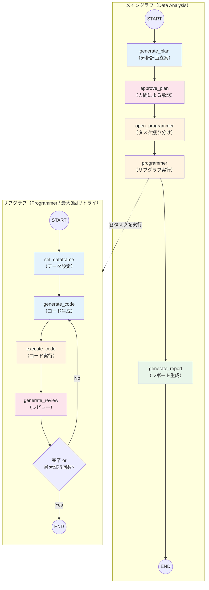
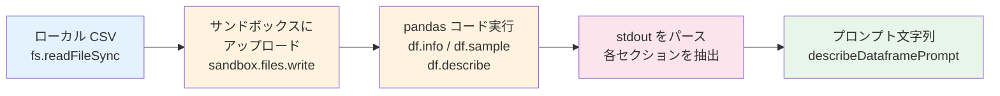
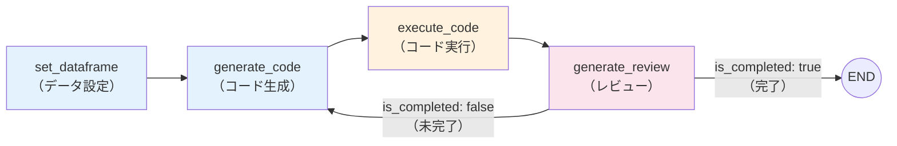
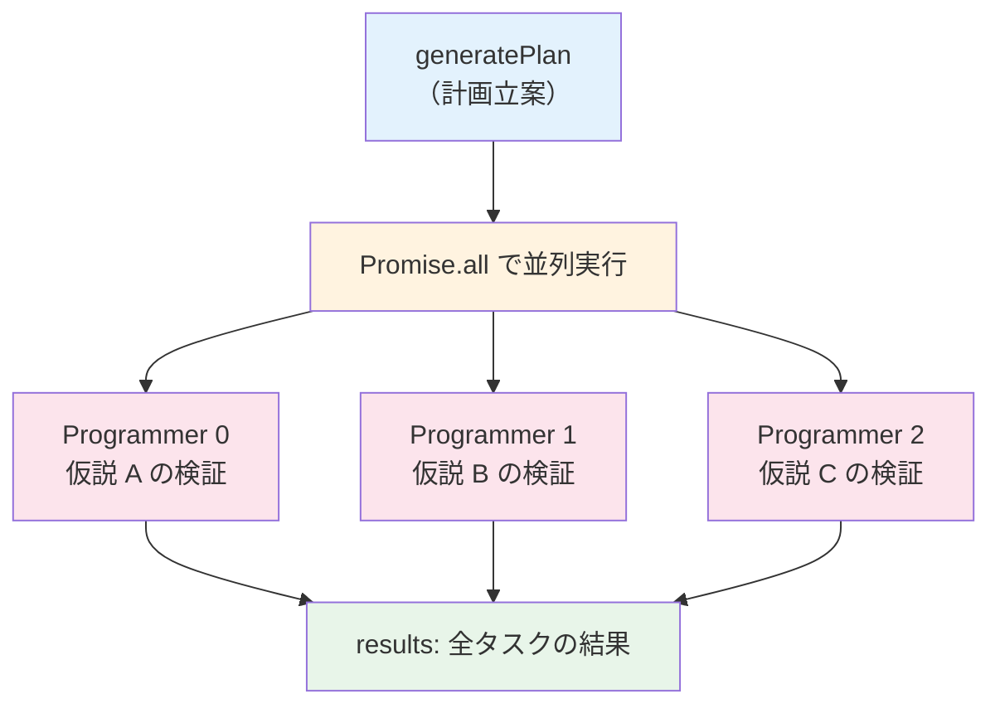
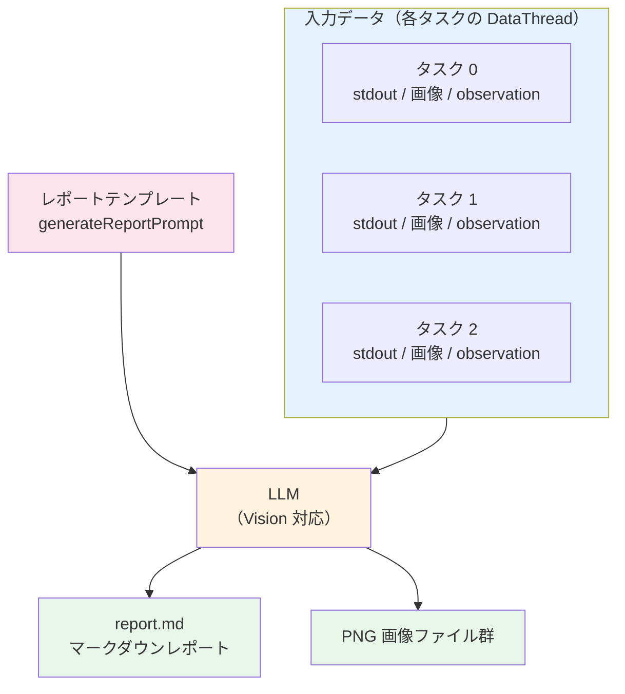
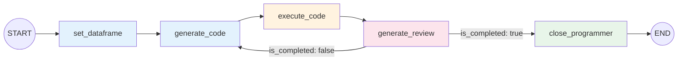
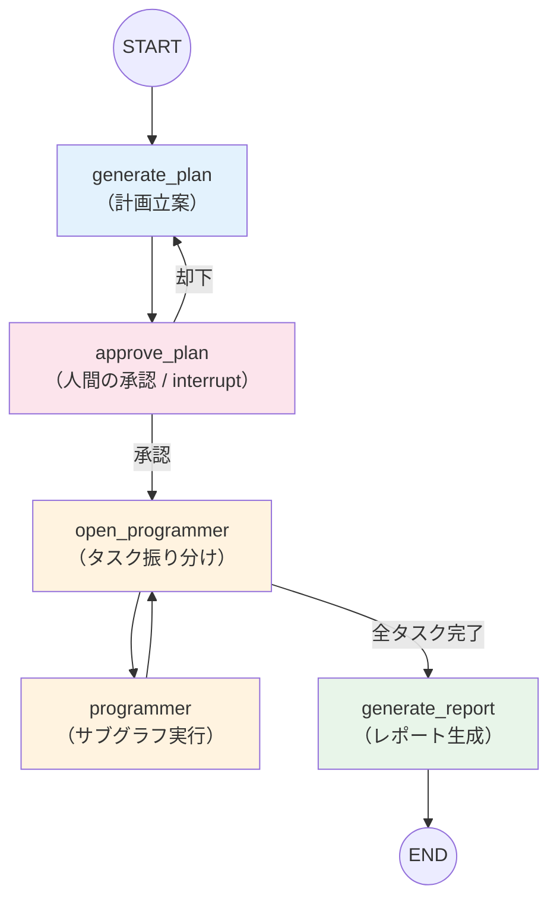

# Chapter 5: データ分析AIエージェントの実装

企業のデータ分析では、CSV ファイルなどのデータを読み込み、仮説を立て、Python コードで分析を実行し、結果をレビューしてレポートにまとめるという一連の工程があります。

例えば「月次売上データから、売上が低迷している曜日や時期のパターンを見つけて改善策を提案して」という依頼を受けた場合、分析者はデータの前処理、複数の仮説に基づくグラフ作成、統計的検定、そして考察のまとめを数時間かけて行います。この作業を手動で行うと時間がかかるうえ、分析者のスキルによって品質にばらつきが生じるという課題があります。

Chapter 4 では「テキスト検索 + LLM」でヘルプデスク業務を自動化しました。この章では対象を**コード実行を伴うデータ分析**に拡げ、LLM が生成した Python コードをクラウド上のサンドボックスで安全に動かすエージェントを構築します。

具体的には、以下の 3 つの技術を組み合わせて**データ分析 AI エージェント**を実装します。

- **E2B（Code Interpreter）** — LLM が生成した Python コードをクラウド上のサンドボックスで安全に実行する
- **OpenAI Responses API（Structured Outputs）** — 計画・コード・レビューの出力を Zod スキーマ（TypeScript 向けのバリデーションライブラリ）で型安全に構造化する
- **LangGraph** — メイングラフとサブグラフでワークフローを宣言的に制御する

:::note この章で学ぶこと

- **E2B Code Interpreter** を使ったサンドボックス内での安全な Python コード実行
- **OpenAI Responses API** と **Zod スキーマ** による Structured Outputs（計画・コード・レビュー）
- コード生成 → 実行 → レビューの**自己修正ループ**（Programmer サブグラフ）
- 仮説ベースの**分析計画立案**と `Promise.all()` による**並列実行**
- **LangGraph** のメイングラフ + サブグラフ + `interrupt()` による human-in-the-loop
- 分析結果を集約した**マークダウンレポート**の自動生成

:::

## 概要

### エージェントのアーキテクチャ

このデータ分析エージェントは、Chapter 4 と同様に**メイングラフ（Data Analysis）** と **サブグラフ（Programmer）** の二層構造で設計されています。

なぜ二層構造にするのでしょうか？ユーザーの分析要求は「売上との相関分析」と「顧客セグメント別の比較」のように、複数の仮説を検証する必要があります。これらを 1 つのフローで逐次処理すると時間がかかります。独立したサブグラフで**並列実行**すれば、処理時間を大幅に短縮できます。

加えて、各サブグラフ内ではコード生成 → 実行 → レビューの**自己修正ループ**を回します。これにより、LLM が生成したコードにエラーがあっても自動修正され、分析品質が向上します。

それぞれの役割を整理すると以下の通りです。

- **メイングラフ**: ユーザーの分析要求から仮説ベースの計画を立案し、各タスクをサブグラフに割り振り、最終的にレポートにまとめる
- **サブグラフ**: 1 つのタスクに対してコード生成 → E2B サンドボックスでの実行 → LLM によるレビューのループを最大 3 回まで繰り返す



### 学習の流れ

| セクション | 内容 | キーワード |
| --- | --- | --- |
| 5-1 | E2B サンドボックスの基本操作とテンプレートリテラルによるプロンプト構築 | E2B, テンプレートリテラル |
| 5-2 | CSV ファイルのアップロードとデータフレームの概要取得（describe） | pandas, setDataframe |
| 5-3 | LLM によるコード生成（Structured Outputs）と E2B でのコード実行 | Structured Outputs, executeCode |
| 5-4 | コード実行結果のレビュー生成と自己修正ループ（Programmer） | Vision, self-correction |
| 5-5 | 仮説ベースの分析計画立案と `Promise.all()` による並列実行 | generatePlan, Promise.all |
| 5-6 | 分析結果の集約とマークダウンレポートの自動生成 | generateReport |
| 5-7 | LangGraph によるグラフベースのワークフロー構築 | StateGraph, interrupt, Command |

:::info 前提条件

- 環境変数 `OPENAI_API_KEY` に OpenAI の API キーが設定されていること
- 環境変数 `E2B_API_KEY` に E2B の API キーが設定されていること
- `@e2b/code-interpreter` パッケージがインストールされていること（`pnpm install` で自動インストール）
- `@langchain/langgraph` パッケージがインストールされていること（`pnpm install` で自動インストール）

:::

### サンプルコードの実行方法

各サンプルは、リポジトリのルートディレクトリから以下のコマンドで実行できます。

```bash
# ルートディレクトリで実行（pnpm tsx は @ai-suburi/core パッケージ内で tsx を実行するエイリアス）
pnpm tsx chapter5/test/<ファイル名>.ts
```

### エージェントの構成ファイル

データ分析エージェントは、以下のモジュールで構成されています。

| ファイル | 役割 |
| --- | --- |
| `chapter5/configs.ts` | 設定読み込み（OpenAI API キー、E2B API キー、モデル名） |
| `chapter5/custom-logger.ts` | タイムスタンプ付きカスタムロガー（warn / success 追加） |
| `chapter5/models.ts` | 型定義と Zod スキーマ（`Program`、`Review`、`Plan`、`DataThread` など） |
| `chapter5/prompts.ts` | プロンプトテンプレート（5 種類） |
| `chapter5/llm.ts` | OpenAI Responses API ラッパー（テキスト + Structured Outputs） |
| `chapter5/modules/set-dataframe.ts` | E2B サンドボックスへの CSV アップロード |
| `chapter5/modules/describe-dataframe.ts` | pandas によるデータフレーム概要取得 |
| `chapter5/modules/execute-code.ts` | E2B サンドボックスでの Python コード実行 |
| `chapter5/modules/generate-code.ts` | LLM によるコード生成（Structured Outputs: `Program`） |
| `chapter5/modules/generate-review.ts` | LLM によるレビュー生成（Vision 対応） |
| `chapter5/modules/generate-plan.ts` | LLM による分析計画立案（Structured Outputs: `Plan`） |
| `chapter5/modules/generate-report.ts` | 分析結果の集約とマークダウンレポート生成 |
| `chapter5/graph/state.ts` | LangGraph 状態定義（`ProgrammerState`、`DataAnalysisState`） |
| `chapter5/graph/nodes/` | グラフノード関数（7 種類） |
| `chapter5/graph/programmer.ts` | Programmer サブグラフの構築と実行 |
| `chapter5/graph/data-analysis.ts` | メイングラフの構築と実行（human-in-the-loop 対応） |

#### 設定ファイル (`configs.ts`)

環境変数から OpenAI API と E2B の設定を読み込むモジュールです。`OPENAI_API_KEY` と `E2B_API_KEY` は必須で、設定されていない場合はエラーをスローします。モデル名はデフォルトで `gpt-4o-2024-11-20` を使用しますが、`OPENAI_MODEL` 環境変数で変更可能です。

```typescript title="chapter5/configs.ts"
export interface Settings {
  openaiApiKey: string;
  e2bApiKey: string;
  openaiModel: string;
}

export function loadSettings(): Settings {
  const openaiApiKey = process.env.OPENAI_API_KEY;
  const e2bApiKey = process.env.E2B_API_KEY;
  const openaiModel = process.env.OPENAI_MODEL ?? 'gpt-4o-2024-11-20';

  if (!openaiApiKey) {
    throw new Error('OPENAI_API_KEY environment variable is required');
  }
  if (!e2bApiKey) {
    throw new Error('E2B_API_KEY environment variable is required');
  }

  return { openaiApiKey, e2bApiKey, openaiModel };
}
```

#### カスタムロガー (`custom-logger.ts`)

エージェントの各ステップがどの順序で実行されたかを追跡するため、ISO 8601 タイムスタンプとモジュール名を付加するロガーです。Chapter 4 のロガーに `warn`（警告）と `success`（成功）のログレベルを追加しています。

```typescript title="chapter5/custom-logger.ts"
export interface Logger {
  info: (msg: string) => void;
  debug: (msg: string) => void;
  error: (msg: string) => void;
  warn: (msg: string) => void;
  success: (msg: string) => void;
}

export function setupLogger(name: string): Logger {
  const formatMessage = (level: string, msg: string) => {
    const now = new Date().toISOString();
    return `${now} ${level} [${name}] ${msg}`;
  };

  return {
    info: (msg: string) => console.log(formatMessage('INFO', msg)),
    debug: (msg: string) => console.debug(formatMessage('DEBUG', msg)),
    error: (msg: string) => console.error(formatMessage('ERROR', msg)),
    warn: (msg: string) => console.warn(formatMessage('WARNING', msg)),
    success: (msg: string) => console.log(formatMessage('SUCCESS', msg)),
  };
}
```

#### 型定義・スキーマ (`models.ts`)

エージェントで使用する型と Zod スキーマを定義します。

OpenAI の **Structured Outputs** を使い、LLM の出力を型安全に受け取ります。`programSchema`（コード生成）、`reviewSchema`（レビュー結果）、`planSchema`（分析計画）の 3 つの Zod スキーマを定義し、`zodTextFormat` ヘルパー関数を通じて OpenAI Responses API に渡します。

このほか、以下の型も定義しています。

| 型 | 用途 |
| --- | --- |
| `DataThread` | コード実行結果を保持するスレッド。`processId` や `threadId` を含み、5-1〜5-6 のモジュール間でやり取りする |
| `GraphDataThread` | LangGraph グラフ用の軽量版 `DataThread`。`processId` / `threadId` を省き、グラフの状態管理に最適化 |
| `SubTask` | 分析計画の各タスクに完了状態（`state`）を持たせたラッパー型。メイングラフで未完了タスクを追跡する |
| `LLMResponse<T>` | LLM レスポンスのジェネリック型。トークン使用量やコスト情報を含む |

```typescript title="chapter5/models.ts"
import { z } from 'zod/v4';

// === Program（コード生成の構造化出力） ===
export const programSchema = z.object({
  achievement_condition: z.string().describe('要求の達成条件'),
  execution_plan: z.string().describe('実行計画'),
  code: z.string().describe('生成対象となるコード'),
});
export type Program = z.infer<typeof programSchema>;

// === Review（レビュー結果の構造化出力） ===
export const reviewSchema = z.object({
  observation: z
    .string()
    .describe(
      'まずはコードの実行結果に対する客観的な事実を記述する。' +
        'その後、コードの実行結果がユーザーから与えられた要求に対して最低限担保できているかを評価する。' +
        '要求を満たさない場合は、その修正方針を追記する。',
    ),
  is_completed: z
    .boolean()
    .describe(
      '実行結果がユーザーから与えられた要求に対して最低限担保できているかを評価する。' +
        'タスク要求を満たさない場合はFalse、改善点はあれど最低限要求を満たす場合はTrueとする。',
    ),
});
export type Review = z.infer<typeof reviewSchema>;

// === Task（分析タスク） ===
export const taskSchema = z.object({
  hypothesis: z.string().describe('検証可能な仮説を、その推測理由とともに詳細に記述する。'),
  purpose: z.string().describe('この仮説を検証することで明らかにしたい課題や目的を具体的に記述する。'),
  description: z.string().describe('どのような分析手法を用いるか記述する。'),
  chart_type: z.string().describe('想定する可視化の種類を記述する。'),
});
export type Task = z.infer<typeof taskSchema>;

// === Plan（分析計画全体） ===
export const planSchema = z.object({
  purpose: z.string().describe('タスク要求から解釈される問い合わせ目的'),
  archivement: z.string().describe('タスク要求から推測されるタスク達成条件'),
  tasks: z.array(taskSchema),
});
export type Plan = z.infer<typeof planSchema>;

// === SubTask（サブタスク：完了状態を持つタスク） ===
export interface SubTask {
  state: boolean;
  task: Task;
}

// === DataThread（コード実行結果スレッド） ===
export interface DataThread {
  processId: string;
  threadId: number;
  userRequest: string | null;
  code: string | null;
  error: string | null;
  stderr: string | null;
  stdout: string | null;
  isCompleted: boolean;
  observation: string | null;
  results: Array<{ type: string; content: string }>;
  pathes: Record<string, string>;
}

// === GraphDataThread（LangGraph 用の軽量版 DataThread） ===
export interface GraphDataThread {
  userRequest: string | null;
  code: string | null;
  error: string | null;
  stderr: string | null;
  stdout: string | null;
  isCompleted: boolean;
  observation: string | null;
  results: Array<{ type: string; content: string }>;
  pathes: Record<string, string>;
}

// === LLMResponse（LLM レスポンスのジェネリック型） ===
export interface LLMResponse<T = string> {
  messages: unknown[];
  content: T;
  model: string;
  createdAt: number;
  inputTokens: number;
  outputTokens: number;
  cost: number | null;
}
```

#### プロンプトテンプレート (`prompts.ts`)

各モジュールで使用するプロンプトを生成する関数群です。Python 版では Jinja2 テンプレートを使用していますが、TypeScript 版ではテンプレートリテラルで実装しています（詳細は 5-1 で解説）。

| 関数名 | 用途 | 使用セクション |
| --- | --- | --- |
| `describeDataframePrompt` | `df.info()` / `df.sample()` / `df.describe()` の結果を整形してプロンプト文字列にする | 5-2 |
| `generateCodePrompt` | データサイエンティストとしてのシステムプロンプトと、コード生成の制約条件を定義する | 5-3 |
| `generateReviewPrompt` | コード実行結果の評価基準と出力形式を定義する | 5-4 |
| `generatePlanPrompt` | 仮説ベースの分析計画を立案するためのシステムプロンプトを定義する | 5-5 |
| `generateReportPrompt` | 分析レポートの要件とテンプレート（マークダウン形式）を定義する | 5-6 |

各プロンプト関数は `dataInfo`（データフレームの概要情報）をオプションで受け取り、テンプレートリテラルの条件分岐でプロンプトに埋め込みます。

#### OpenAI Responses API ラッパー (`llm.ts`)

OpenAI Responses API を呼び出すラッパー関数です。テキスト応答と Structured Outputs の両方に対応するため、**関数オーバーロード**を使って型安全に実装しています。

- `generateResponse(messages, model)` — テキスト応答（`LLMResponse<string>`）
- `generateResponse(messages, model, responseFormat)` — Structured Outputs（`LLMResponse<T | null>`）

トークン使用量とコスト計算も自動で行います。`responseFormat` が渡されない場合はテキスト応答、渡された場合は `responses.parse()` で Structured Outputs を返します。

<details>
<summary>chapter5/llm.ts（クリックで展開）</summary>

```typescript title="chapter5/llm.ts"
import OpenAI from 'openai';
import type { AutoParseableTextFormat } from 'openai/lib/parser';
import { zodTextFormat } from 'openai/helpers/zod';

import type { LLMResponse } from './models.js';

export { zodTextFormat };

const client = new OpenAI();

// --- コスト計算 ---
const MODEL_COST: Record<string, { input: number; output: number }> = {
  'gpt-4o-2024-11-20': { input: 2.5, output: 10.0 },
  'gpt-4o-mini-2024-07-18': { input: 0.15, output: 0.6 },
};

function calcCost(
  model: string,
  inputTokens: number,
  outputTokens: number,
): number | null {
  const cost = MODEL_COST[model];
  if (!cost) return null;
  return (
    (inputTokens / 1_000_000) * cost.input +
    (outputTokens / 1_000_000) * cost.output
  );
}

// --- オーバーロード ---
export async function generateResponse(
  messages: OpenAI.Responses.ResponseInputItem[],
  model?: string,
): Promise<LLMResponse>;
export async function generateResponse<T>(
  messages: OpenAI.Responses.ResponseInputItem[],
  model: string,
  responseFormat: AutoParseableTextFormat<T>,
): Promise<LLMResponse<T | null>>;
export async function generateResponse(
  messages: OpenAI.Responses.ResponseInputItem[],
  model: string = 'gpt-4o-2024-11-20',
  responseFormat?: AutoParseableTextFormat<unknown>,
): Promise<LLMResponse<unknown>> {
  // ... テキスト応答 or Structured Outputs を判定して実行
}
```

</details>

## 5-1. E2B サンドボックスとテンプレートリテラル

### E2B Code Interpreter とは

LLM が生成した Python コードをホストマシンで直接実行すると、ファイルの削除や無限ループなど予期しない副作用が発生する恐れがあります。[E2B](https://e2b.dev/) は、こうしたリスクを回避するために、AI エージェントが生成したコードをクラウド上の**サンドボックス**（隔離された仮想環境）で安全に実行できるサービスです。

E2B サンドボックスの主な特徴は以下の通りです。

| 特徴 | 説明 |
| --- | --- |
| **安全な隔離環境** | ホストマシンとは完全に分離されたクラウド環境でコードを実行する。ファイル削除や無限ループなどの副作用がホストに影響しない |
| **Python ライブラリが利用可能** | pandas、matplotlib、seaborn、scikit-learn などのデータ分析ライブラリがプリインストールされている。`pip install` で追加も可能 |
| **画像出力のサポート** | matplotlib で生成したグラフを PNG 画像として取得できる。画像は base64（バイナリデータをテキスト文字列に変換するエンコード方式）で返されるため、そのまま LLM の Vision API に渡して画像を評価できる（5-4 で活用） |
| **ファイル操作** | `sandbox.files.write()` でファイルをアップロードし、サンドボックス内で参照できる。CSV データのアップロードに使用する |

:::tip サンドボックスのライフサイクル

E2B サンドボックスはクラウドリソースを消費するため、使い終わったら必ず `Sandbox.kill()` で破棄してください。`try...finally` パターンを使えば、エラーが発生しても確実にクリーンアップできます。

:::

### E2B サンドボックスの基本操作

このサンプルでは、E2B サンドボックスの基本的なライフサイクル（作成 → コード実行 → 破棄）を確認します。

- `Sandbox.create()` でサンドボックスを作成
- `sandbox.runCode()` で Python コードを実行し、標準出力を取得
- `Sandbox.kill()` でサンドボックスを破棄

```typescript title="chapter5/test/test-01-e2b-sandbox.ts"
// プログラムリスト5.3: E2B Sandbox の使い方
import { Sandbox } from '@e2b/code-interpreter';

import { setupLogger } from '../custom-logger.js';

const logger = setupLogger('test-01');

async function main(): Promise<void> {
  const sandbox = await Sandbox.create();
  try {
    const execution = await sandbox.runCode("print('Hello World!')");
    logger.info(execution.logs.stdout.join('\n'));
  } finally {
    await Sandbox.kill(sandbox.sandboxId);
  }
}

main();
```

**実行方法:**

```bash
pnpm tsx chapter5/test/test-01-e2b-sandbox.ts
```

**実行結果の例:**

```text
2026-02-21T23:44:37.968Z INFO [test-01] Hello World!
```

### テンプレートリテラルによるプロンプト構築

LLM に渡すプロンプトには、データ情報やユーザーの要求などの動的な値を埋め込む必要があります。Python 版では Jinja2 テンプレートエンジンを使用していますが、TypeScript では言語組み込みの**テンプレートリテラル**（バッククォート `` ` `` で囲む記法）で同等の処理を実現できます。条件分岐は三項演算子（`条件 ? 真の値 : 偽の値`）で表現し、Jinja2 の `` に相当する処理を行います。

```typescript title="chapter5/test/test-02-template.ts"
// テンプレートエンジンの使い方（TypeScript テンプレートリテラル版）

function renderTemplate(message?: string): string {
  return message ? `メッセージがあります: ${message}` : '';
}

function main(): void {
  // 1. 引数に message を指定した場合
  console.log('1.', renderTemplate('hello'));
  // 2. 引数に message を指定しなかった場合
  console.log('2.', renderTemplate());
}

main();
```

**実行方法:**

```bash
pnpm tsx chapter5/test/test-02-template.ts
```

**実行結果の例:**

```text
1. メッセージがあります: hello
2.
```

## 5-2. データフレームの概要取得

5-1 で E2B サンドボックスの基本操作を確認しました。ここからは、実際のデータ分析に必要な**データの読み込みと概要取得**の仕組みを構築します。

### CSV ファイルのアップロード（`setDataframe`）

`setDataframe()` 関数は、ローカルの CSV ファイルを E2B サンドボックスにアップロードし、pandas の `DataFrame`（表形式のデータ構造、変数名 `df`）として読み込みます。この `df` は後続のコード生成で参照されるため、サンドボックスのセッション内で共有されます。

```typescript title="chapter5/modules/set-dataframe.ts"
import * as fs from 'node:fs';

import type { Sandbox } from '@e2b/code-interpreter';

export async function setDataframe(
  sandbox: Sandbox,
  filePath: string,
  timeout: number = 1200,
  remoteDataPath: string = '/home/data.csv',
): Promise<void> {
  const fileContent = fs.readFileSync(filePath, 'utf-8');
  await sandbox.files.write(remoteDataPath, fileContent);
  await sandbox.runCode(
    `import pandas as pd; df = pd.read_csv('${remoteDataPath}')`,
    { timeoutMs: timeout * 1000 },
  );
}
```

### データフレームの describe

LLM にデータ分析コードを生成させるには、分析対象のデータがどのような構造を持つか（カラム名、データ型、欠損値の有無、統計量など）を伝える必要があります。この情報がないと、LLM は存在しないカラム名を使ったり、データ型に合わない処理を生成したりします。

`describeDataframe()` 関数は、E2B サンドボックス内で pandas を使い、CSV ファイルの概要情報を取得します。取得した情報はプロンプトテンプレート（`describeDataframePrompt`）に埋め込まれ、後続の LLM 呼び出し（コード生成・計画立案・レビューなど）でデータの全体像を伝えるために使用されます。



処理の流れ:

1. ローカルの CSV ファイルを `fs.readFileSync()` で読み込み
2. `sandbox.files.write()` でサンドボックスにアップロード
3. サンドボックス内で pandas コードを実行し、stdout をパースして各セクションを取得

```typescript title="chapter5/modules/describe-dataframe.ts"
import * as fs from 'node:fs';

import type { Sandbox } from '@e2b/code-interpreter';

import { describeDataframePrompt } from '../prompts.js';

export async function describeDataframe(
  sandbox: Sandbox,
  filePath: string,
  remoteDataPath: string = '/home/data.csv',
): Promise<string> {
  // sandbox にファイルをアップロード
  const fileContent = fs.readFileSync(filePath, 'utf-8');
  await sandbox.files.write(remoteDataPath, fileContent);

  // sandbox 内で pandas describe を実行（tabulate は to_markdown() に必要）
  await sandbox.runCode(
    'import subprocess; subprocess.run(["pip", "install", "-q", "tabulate"])',
  );

  const code = `
import pandas as pd
import io

df = pd.read_csv('${remoteDataPath}')

buf = io.StringIO()
df.info(buf=buf)
df_info = buf.getvalue()

df_sample = df.sample(5).to_markdown()
df_describe = df.describe().to_markdown()

print("===DF_INFO===")
print(df_info)
print("===DF_SAMPLE===")
print(df_sample)
print("===DF_DESCRIBE===")
print(df_describe)
`;
  const execution = await sandbox.runCode(code);
  const stdout = execution.logs.stdout.join('');

  // stdout をパースして各セクションを取得
  const infoMatch = stdout.match(
    /===DF_INFO===\n([\s\S]*?)===DF_SAMPLE===/,
  );
  const sampleMatch = stdout.match(
    /===DF_SAMPLE===\n([\s\S]*?)===DF_DESCRIBE===/,
  );
  const describeMatch = stdout.match(/===DF_DESCRIBE===\n([\s\S]*?)$/);

  const dfInfo = infoMatch?.[1]?.trim() ?? '';
  const dfSample = sampleMatch?.[1]?.trim() ?? '';
  const dfDescribe = describeMatch?.[1]?.trim() ?? '';

  return describeDataframePrompt({ dfInfo, dfSample, dfDescribe });
}
```

:::tip なぜ df.info / df.sample / df.describe の 3 つを取得するのか

それぞれ異なる観点の情報を提供します。`df.info()` はカラムの型と欠損値の有無、`df.sample()` は実際のデータの具体例、`df.describe()` は統計量（平均・標準偏差・四分位数など）です。これら 3 つを組み合わせることで、LLM がデータの全体像を正確に把握できます。

:::

テストスクリプトでは、サンドボックスを作成して `describeDataframe()` を実行し、取得したデータフレーム概要を表示します。

```typescript title="chapter5/test/test-03-describe-dataframe.ts"
import { Sandbox } from '@e2b/code-interpreter';

import { setupLogger } from '../custom-logger.js';
import { describeDataframe } from '../modules/describe-dataframe.js';

const logger = setupLogger('test-03');

async function main(): Promise<void> {
  const dataFile = 'chapter5/data/sample.csv';
  const sandbox = await Sandbox.create();
  try {
    const dataInfo = await describeDataframe(sandbox, dataFile);
    logger.info(dataInfo);
  } finally {
    await Sandbox.kill(sandbox.sandboxId);
  }
}

main();
```

**実行方法:**

```bash
pnpm tsx chapter5/test/test-03-describe-dataframe.ts
```

**実行結果の例:**

```text
>>> df.info()
<class 'pandas.core.frame.DataFrame'>
RangeIndex: 100 entries, 0 to 99
Data columns (total 5 columns):
 #   Column    Non-Null Count  Dtype
---  ------    --------------  -----
 0   date      100 non-null    object
 1   day       100 non-null    object
 2   category  100 non-null    object
 3   score     100 non-null    int64
 4   value     100 non-null    float64
dtypes: float64(1), int64(1), object(3)

>>> df.sample(5).to_markdown()
|    | date       | day   | category   |   score |   value |
|---:|:-----------|:------|:-----------|--------:|--------:|
| 42 | 2024-02-12 | Mon   | A          |      78 |   12.34 |
...

>>> df.describe()
|       |    score |    value |
|:------|---------:|---------:|
| count | 100      | 100      |
| mean  |  65.23   |  15.67   |
...
```

## 5-3. コード生成とコード実行

5-2 でデータの概要情報を取得できるようになりました。ここでは、その情報をもとに LLM に Python コードを生成させ、E2B サンドボックスで実行する仕組みを構築します。

### LLM によるコード生成（Structured Outputs）

LLM の自由テキスト応答からコード部分だけを抜き出す方法として、正規表現によるパースが考えられます。しかし、LLM の出力フォーマットが毎回安定しないため、パースに失敗するリスクがあります。

OpenAI の **Structured Outputs** を使えば、Zod スキーマで出力の JSON 構造を指定でき、LLM の応答を型安全なオブジェクトとして確実に受け取れます。

この章では、OpenAI の **Responses API**（`openai.responses.parse()`）と `zodTextFormat` ヘルパーを組み合わせて Structured Outputs を実現しています。Chapter 4 で使用した Chat Completions API（`openai.chat.completions.parse()`）の `zodResponseFormat` とは異なる API ですが、Zod スキーマで出力構造を定義するという基本的なアプローチは共通しています。

| 項目 | Chat Completions API（Chapter 4） | Responses API（Chapter 5） |
| --- | --- | --- |
| メソッド | `openai.chat.completions.parse()` | `openai.responses.parse()` |
| Zod ヘルパー | `zodResponseFormat(schema, name)` | `zodTextFormat(schema, name)` |
| 入力形式 | `messages` 配列 | `input`（`ResponseInputItem[]`） |
| パース結果 | `choice.message.parsed` | `output[].content[].parsed` |

:::info Responses API と Chat Completions API の使い分け

Responses API は OpenAI の新しい API で、Chat Completions API の後継として位置づけられています。新規プロジェクトでは Responses API の使用が推奨されています。既存の Chat Completions API も引き続きサポートされるため、Chapter 4 のコードをそのまま使い続けることも可能です。

:::

`generateCode` 関数では `programSchema` を指定し、LLM の出力を以下の 3 フィールドに構造化します。`achievement_condition` と `execution_plan` をコードと一緒に出力させることで、LLM に「何を達成するか」「どう実行するか」を明示的に考えさせ、コードの品質を向上させています（Chain of Thought 的な効果）。

| フィールド | 説明 |
| --- | --- |
| `achievement_condition` | タスク要求の達成条件 |
| `execution_plan` | コードの実行計画 |
| `code` | 生成された Python コード |

前回の `DataThread`（実行結果 + レビュー）がある場合は、そのフィードバックをメッセージに追加して**自己修正**を行います。具体的には、前回の stdout / stderr とレビューの `observation`（修正方針）を会話履歴に含めることで、LLM が失敗の原因を把握し、改善コードを生成できます。

```typescript title="chapter5/modules/generate-code.ts"
import type OpenAI from 'openai';

import { generateResponse, zodTextFormat } from '../llm.js';
import type { DataThread, LLMResponse, Program } from '../models.js';
import { programSchema } from '../models.js';
import { generateCodePrompt } from '../prompts.js';

export async function generateCode(
  dataInfo: string,
  userRequest: string,
  remoteSaveDir: string = 'outputs/process_id/id',
  previousThread: DataThread | null = null,
  model: string = 'gpt-4o-mini-2024-07-18',
): Promise<LLMResponse<Program | null>> {
  const systemMessage = generateCodePrompt({ dataInfo, remoteSaveDir });
  const messages: OpenAI.Responses.ResponseInputItem[] = [
    { role: 'system', content: systemMessage },
    { role: 'user', content: `タスク要求: ${userRequest}` },
  ];
  // 自己修正：前回のレビュー結果があれば反映する
  if (previousThread) {
    messages.push({ role: 'assistant', content: previousThread.code ?? '' });
    if (previousThread.stdout && previousThread.stderr) {
      messages.push(
        { role: 'system', content: `stdout: ${previousThread.stdout}` },
        { role: 'system', content: `stderr: ${previousThread.stderr}` },
      );
    }
    if (previousThread.observation) {
      messages.push({
        role: 'user',
        content: `以下を参考にして、ユーザー要求を満たすコードを再生成してください: ${previousThread.observation}`,
      });
    }
  }
  return generateResponse(messages, model, zodTextFormat(programSchema, 'program'));
}
```

**実行方法:**

```bash
pnpm tsx chapter5/test/test-05-generate-code.ts
```

**実行結果の例:**

```json
{
    "achievement_condition": "データの概要を提供すること",
    "execution_plan": "データの基本情報、記述統計、サンプルデータを表示する",
    "code": "print(df.info())\nprint(df.describe())\nprint(df.sample(5))"
}
```

### E2B サンドボックスでのコード実行

コード生成と実行を別のモジュールに分離しているのは、5-4 の自己修正ループで「生成だけやり直し、実行は別ステップで行う」という柔軟な制御が必要なためです。

`executeCode()` 関数は、生成された Python コードを E2B サンドボックス上で実行し、stdout・stderr・実行結果（画像など）を `DataThread` として収集します。PNG 画像は base64 文字列として `results` 配列に格納されます。

```typescript title="chapter5/modules/execute-code.ts"
import type { Sandbox } from '@e2b/code-interpreter';

import { setupLogger } from '../custom-logger.js';
import type { DataThread } from '../models.js';

const logger = setupLogger('execute-code');

export async function executeCode(
  sandbox: Sandbox,
  processId: string,
  threadId: number,
  code: string,
  userRequest: string | null = null,
  timeout: number = 1200,
): Promise<DataThread> {
  const execution = await sandbox.runCode(code, {
    timeoutMs: timeout * 1000,
  });
  logger.debug(`execution=${JSON.stringify(execution.toJSON())}`);

  const results = execution.results.map((r) =>
    r.png
      ? { type: 'png', content: r.png }
      : { type: 'raw', content: r.text ?? '' },
  );

  return {
    processId,
    threadId,
    userRequest,
    code,
    error: execution.error?.traceback ?? null,
    stderr: execution.logs.stderr.join('').trim(),
    stdout: execution.logs.stdout.join('').trim(),
    isCompleted: false,
    observation: null,
    results,
    pathes: {},
  };
}
```

**実行方法:**

```bash
pnpm tsx chapter5/test/test-06-execute-code.ts
```

**実行結果の例:**

```json
{
    "processId": "06_execute_code",
    "threadId": 0,
    "userRequest": null,
    "code": "print(df.shape)",
    "error": null,
    "stderr": "",
    "stdout": "(100, 5)",
    "isCompleted": false,
    "observation": null,
    "results": [],
    "pathes": {}
}
```

`stdout` にデータフレームの行数（100）とカラム数（5）が返されています。`isCompleted` と `observation` はレビュー後に更新されるため、この時点では初期値のままです。

## 5-4. レビュー生成と Programmer ループ

5-3 ではコードの生成と実行を行いました。しかし、LLM が生成したコードが一度で正しく動くとは限りません。ここでは、実行結果を**自動的に評価**し、問題があればコード生成に**フィードバック**する仕組みを構築します。

### レビュー生成

なぜ人手ではなく LLM にレビューさせるのでしょうか？手動レビューではデータ分析の自動化が止まってしまいます。LLM による自動レビューを導入することで、コード生成 → 実行 → レビューの**ループを無人で回せる**ようになります。

`generateReview()` 関数は、コード実行結果を LLM でレビューし、タスク要求を達成しているかを判定します。実行結果に画像（matplotlib のグラフなど）がある場合は、base64 エンコードで LLM に送信して **Vision（画像認識）** も活用します。

これにより、「グラフのラベルが文字化けしている」「凡例が欠けている」といった視覚的な問題もテキスト出力とあわせて総合的に評価できます。

出力は `reviewSchema`（観察結果 + 完了判定）に従った Structured Outputs です。`is_completed` が `true` ならタスク完了、`false` なら `observation`（修正方針）をフィードバックとしてコード生成に戻します。

```typescript title="chapter5/modules/generate-review.ts"
import type OpenAI from 'openai';
import type { ResponseInputContent } from 'openai/resources/responses/responses';

import { generateResponse, zodTextFormat } from '../llm.js';
import type { DataThread, LLMResponse, Review } from '../models.js';
import { reviewSchema } from '../models.js';
import { generateReviewPrompt } from '../prompts.js';

export async function generateReview(
  dataInfo: string,
  userRequest: string,
  dataThread: DataThread,
  hasResults: boolean = false,
  remoteSaveDir: string = 'outputs/process_id/id',
  model: string = 'gpt-4o-mini-2024-07-18',
): Promise<LLMResponse<Review | null>> {
  const systemInstruction = generateReviewPrompt({ dataInfo });

  let resultsContent: ResponseInputContent[] = [];
  if (hasResults) {
    resultsContent = dataThread.results.map((res): ResponseInputContent =>
      res.type === 'png'
        ? {
            type: 'input_image',
            image_url: `data:image/jpeg;base64,${res.content}`,
            detail: 'auto',
          }
        : { type: 'input_text', text: res.content },
    );
  }

  const systemResultsItems: OpenAI.Responses.ResponseInputItem[] = hasResults
    ? [{ role: 'system', content: resultsContent }]
    : [];

  const messages: OpenAI.Responses.ResponseInputItem[] = [
    { role: 'system', content: systemInstruction },
    { role: 'user', content: userRequest },
    { role: 'assistant', content: dataThread.code ?? '' },
    ...systemResultsItems,
    { role: 'system', content: `stdout: ${dataThread.stdout}` },
    { role: 'system', content: `stderr: ${dataThread.stderr}` },
    { role: 'user', content: '実行結果に対するフィードバックを提供してください。' },
  ];

  return generateResponse(messages, model, zodTextFormat(reviewSchema, 'review'));
}
```

**実行方法:**

```bash
pnpm tsx chapter5/test/test-07-generate-review.ts
```

**実行結果の例:**

```json
{
    "observation": "正常に終了し、データの基本情報が表示された。df.info()、df.describe()、df.sample(5) の結果が得られ、データの概要を把握できた。",
    "is_completed": true
}
```

### Programmer ループ（自己修正）

LLM が生成したコードは、一度で正しく動くとは限りません。構文エラーやライブラリの使い方の誤り、要求とは異なるグラフの出力など、さまざまな問題が発生します。この問題を人手で修正していては自動化の意味が薄れてしまいます。

そこで、**自己修正ループ**（self-correction loop）パターンを導入します。コード生成 → 実行 → レビューのサイクルを最大 N 回繰り返すことで、LLM 自身がエラーの原因を分析し、コードを改善します。

具体的なシナリオを見てみましょう。「曜日ごとのスコア分布を箱ひげ図で可視化して」という要求に対して、以下のように自己修正が行われます。

1. **1 回目**: LLM が `sns.boxplot(x='day', y='score', data=df)` を生成するが、曜日の順序がアルファベット順になってしまう
2. **レビュー**: 「曜日が月〜日の自然な順序で並んでいない」と指摘（`is_completed: false`）
3. **2 回目**: レビューのフィードバックを受けて、`pd.Categorical` で曜日の順序を指定したコードを再生成 → レビューで `is_completed: true` となり完了



自己修正の仕組みは次の通りです。

1. `generate_code` で Python コードを生成する
2. `execute_code` でサンドボックス上で実行し、stdout / stderr / 画像を取得する
3. `generate_review` で実行結果を評価し、`observation`（修正方針）と `is_completed`（完了判定）を返す
4. `is_completed: false` の場合、前回の `DataThread`（コード + 実行結果 + レビュー）を `generate_code` にフィードバックし、改善コードを再生成する

`programmerNode` 関数は、このサイクルを最大 `nTrial` 回（デフォルト: 3 回）繰り返します。レビューで `is_completed: true` が返されるか、最大試行回数に達するとループを終了します。

```typescript title="chapter5/test/programmer-node.ts"
import { Sandbox } from '@e2b/code-interpreter';

import { setupLogger } from '../custom-logger.js';
import type { DataThread, Program, Review } from '../models.js';
import { describeDataframe } from '../modules/describe-dataframe.js';
import { executeCode } from '../modules/execute-code.js';
import { generateCode } from '../modules/generate-code.js';
import { generateReview } from '../modules/generate-review.js';
import { setDataframe } from '../modules/set-dataframe.js';

const logger = setupLogger('programmer-node');

export async function programmerNode(
  dataFile: string,
  userRequest: string,
  processId: string,
  model: string = 'gpt-4o-mini-2024-07-18',
  nTrial: number = 3,
  idx: number = 0,
): Promise<[number, DataThread[]]> {
  const sandbox = await Sandbox.create();
  try {
    const dataInfo = await describeDataframe(sandbox, dataFile);
    await setDataframe(sandbox, dataFile);
    const dataThreads: DataThread[] = [];
    for (let threadId = 0; threadId < nTrial; threadId++) {
      // 5.4.1. コード生成
      const previousThread =
        dataThreads.length > 0
          ? dataThreads[dataThreads.length - 1]!
          : null;
      const codeResponse = await generateCode(
        dataInfo, userRequest, undefined, previousThread, model,
      );
      if (codeResponse.content === null) {
        throw new Error('Failed to parse code generation output');
      }
      const program: Program = codeResponse.content;
      // 5.4.2. コード実行
      const dataThread = await executeCode(
        sandbox, processId, threadId, program.code, userRequest,
      );
      // 5.4.3. レビュー生成
      const reviewResponse = await generateReview(
        dataInfo, userRequest, dataThread, undefined, undefined, model,
      );
      if (reviewResponse.content === null) {
        throw new Error('Failed to parse review output');
      }
      const review: Review = reviewResponse.content;
      // data_thread を更新
      dataThread.observation = review.observation;
      dataThread.isCompleted = review.is_completed;
      dataThreads.push(dataThread);
      // 終了条件
      if (dataThread.isCompleted) {
        logger.success(`userRequest=${userRequest}`);
        break;
      }
    }
    return [idx, dataThreads];
  } finally {
    await Sandbox.kill(sandbox.sandboxId);
  }
}
```

**実行方法:**

```bash
pnpm tsx chapter5/test/test-08-programmer.ts
```

## 5-5. 分析計画の立案と並列実行

5-4 までで、1 つのタスクに対するコード生成 → 実行 → レビューのサイクルが完成しました。ここからは、**複数のタスクを計画的に立案・並列実行**する仕組みを構築します。

### なぜ「計画立案」が必要か

ユーザーの分析要求は「売上データを分析して」のように抽象的な場合が多く、1 つのコード実行だけでは多角的な分析ができません。人間のデータサイエンティストも、分析に取りかかる前にまず「何を検証するか」を計画します。

例えば「score と曜日の関係について分析して」という要求に対して、以下のような複数の仮説を立てて検証する必要があります。

- **仮説 1**: 特定の曜日にスコアが高くなる傾向がある → 箱ひげ図で可視化
- **仮説 2**: 曜日とスコアの間に統計的に有意な差がある → 分散分析（ANOVA）で検定
- **仮説 3**: 曜日ごとのスコアの分散に違いがある → ヒストグラムで分布を比較

`generatePlan` 関数は、LLM にデータの概要情報とユーザーの要求を渡し、このような検証すべき仮説のリストを自動生成します。各タスクには仮説（`hypothesis`）、目的（`purpose`）、分析手法（`description`）、可視化の種類（`chart_type`）が含まれます。

### 分析計画の立案

出力は `planSchema`（目的・達成条件・タスク配列）に従った Structured Outputs です。

```typescript title="chapter5/modules/generate-plan.ts"
import type OpenAI from 'openai';

import { generateResponse, zodTextFormat } from '../llm.js';
import type { LLMResponse, Plan } from '../models.js';
import { planSchema } from '../models.js';
import { generatePlanPrompt } from '../prompts.js';

export async function generatePlan(
  dataInfo: string,
  userRequest: string,
  model: string = 'gpt-4o-mini-2024-07-18',
): Promise<LLMResponse<Plan | null>> {
  const systemMessage = generatePlanPrompt({ dataInfo });
  const messages: OpenAI.Responses.ResponseInputItem[] = [
    { role: 'system', content: systemMessage },
    { role: 'user', content: `タスク要求: ${userRequest}` },
  ];
  return generateResponse(messages, model, zodTextFormat(planSchema, 'plan'));
}
```

**実行方法:**

```bash
pnpm tsx chapter5/test/test-09-generate-plan.ts
```

**実行結果の例:**

```json
{
    "purpose": "scoreと曜日の関係性を明らかにし、戦略的意思決定に活用する",
    "archivement": "曜日ごとのスコア傾向を統計的に把握し、施策の方向性を提示する",
    "tasks": [
        {
            "hypothesis": "特定の曜日にスコアが高くなる傾向がある",
            "purpose": "曜日ごとのスコア分布を把握し、パフォーマンスの高い曜日を特定する",
            "description": "曜日ごとにスコアの平均値・中央値・標準偏差を算出し、箱ひげ図で可視化する",
            "chart_type": "箱ひげ図"
        }
    ]
}
```

### 計画の並列実行

立案された計画の各タスクを `Promise.all()` で並列に実行します。Python 版では `concurrent.futures.ThreadPoolExecutor` を使用していますが、TypeScript では `Promise.all()` でよりシンプルに並列処理を実現できます。

各タスクは独立した E2B サンドボックスで Programmer ループ（コード生成 → 実行 → レビュー）を走らせるため、タスク間で環境が干渉しません。例えば、タスク A が `import seaborn` でエラーになっても、タスク B の matplotlib を使った処理には影響しません。

:::tip 計画立案とコード生成でモデルを使い分ける

サンプルコードでは、計画立案（`generatePlan`）には `gpt-4o-mini` を、コード実行（`programmerNode`）には `gpt-4o` を使用しています。計画立案は構造化テキストの生成が主であるため軽量モデルで十分ですが、コード生成では複雑なデータ処理や可視化を正確に記述する必要があるため、高性能モデルが適しています。

:::



```typescript title="chapter5/test/test-10-execute-plan.ts"
// 計画生成
const response = await generatePlan(dataInfo, userRequest, 'gpt-4o-mini-2024-07-18');
const plan: Plan = response.content;

// 各計画の並行実行
const promises = plan.tasks.map((task, idx) =>
  programmerNode(dataFile, task.hypothesis, `sample-${idx}`, 'gpt-4o-2024-11-20', 3, idx),
);
const results = await Promise.all(promises);
```

:::caution E2B サンドボックスの同時起動数

`Promise.all()` はすべてのタスクを同時に起動するため、タスク数が多いと E2B の同時サンドボックス数の上限に達する可能性があります。E2B の無料プランでは同時実行数に制限があるため、タスク数が多い場合は逐次実行や並列数の制限を検討してください。

:::

**実行方法:**

```bash
pnpm tsx chapter5/test/test-10-execute-plan.ts
```

## 5-6. レポート生成

5-5 で複数の仮説を並列に検証できるようになりました。最後に、すべてのタスクの実行結果を 1 つのレポートにまとめる仕組みを構築します。

### なぜレポート生成を自動化するのか

各タスクの実行結果（stdout のテキスト・matplotlib のグラフ画像・レビューの観察結果）はバラバラの形式で得られます。これらを人が手動でレポートにまとめるのは時間がかかる作業です。`generateReport` 関数は、すべてのタスクの実行結果を LLM に渡し、一貫した構成の分析レポートをマークダウン形式で自動生成します。

### マークダウンレポートの自動生成

レポート生成では、各 `DataThread` の実行結果をテキストと画像（Vision API）として LLM に送信し、事前に定義したレポートテンプレートに沿ったレポートを出力させます。レポートには、データセット説明・仮説ごとの分析結果・まとめと考察・ネクストアクションが含まれます。画像は PNG ファイルとして出力ディレクトリに書き出し、レポート内で `` 形式で参照します。



```typescript title="chapter5/modules/generate-report.ts"
import * as fs from 'node:fs';

import type OpenAI from 'openai';
import type { ResponseInputContent } from 'openai/resources/responses/responses';

import { setupLogger } from '../custom-logger.js';
import { generateResponse } from '../llm.js';
import type { DataThread, LLMResponse } from '../models.js';
import { generateReportPrompt } from '../prompts.js';

const logger = setupLogger('generate-report');

export async function generateReport(
  dataInfo: string,
  userRequest: string,
  processDataThreads: DataThread[] = [],
  model: string = 'gpt-4o-mini-2024-07-18',
  outputDir: string = 'outputs/sample',
): Promise<LLMResponse> {
  fs.mkdirSync(outputDir, { recursive: true });

  const systemMessage = generateReportPrompt({ dataInfo });
  const messages: OpenAI.Responses.ResponseInputItem[] = [
    { role: 'system', content: systemMessage },
    { role: 'user', content: `タスク要求: ${userRequest}` },
  ];

  // 実行結果の追加（画像は Vision メッセージとして送信）
  for (const dataThread of processDataThreads) {
    const userContents: ResponseInputContent[] = [
      { type: 'input_text', text: `instruction: ${dataThread.userRequest}` },
      { type: 'input_text', text: `stdout: ${dataThread.stdout}` },
      { type: 'input_text', text: `observation: ${dataThread.observation}` },
    ];

    for (let rix = 0; rix < dataThread.results.length; rix++) {
      const res = dataThread.results[rix]!;
      if (res.type === 'png') {
        const imageData = Buffer.from(res.content, 'base64');
        const imagePath = `${dataThread.processId}_${dataThread.threadId}_${rix}.png`;
        fs.writeFileSync(`${outputDir}/${imagePath}`, imageData);
        userContents.push(
          { type: 'input_text', text: `画像パス: "${imagePath}", 画像:` },
          {
            type: 'input_image',
            image_url: `data:image/png;base64,${res.content}`,
            detail: 'auto',
          },
        );
      } else {
        userContents.push({ type: 'input_text', text: `実行結果: ${res.content}` });
      }
    }
    messages.push({ role: 'user', content: userContents });
  }

  const llmResponse = await generateResponse(messages, model);
  fs.writeFileSync(`${outputDir}/report.md`, llmResponse.content);
  logger.success(`WRITE ... ${outputDir}/report.md`);

  return llmResponse;
}
```

全体パイプライン（計画 → 並列実行 → レポート生成）の E2E（End-to-End）テストです。`test-11-generate-report.ts` は計画立案から並列実行、レポート生成までの全工程を通して実行します。このテストにより、5-2 から 5-6 までのモジュールが正しく連携することを確認できます。

**実行方法:**

```bash
pnpm tsx chapter5/test/test-11-generate-report.ts
```

実行すると `outputs/sample/` ディレクトリに以下のファイルが出力されます。

- `report.md` — 仮説・分析結果・考察・ネクストアクションを含むマークダウンレポート
- `sample-N_M_R.png` — 各タスクが生成したグラフ画像（N: タスク番号、M: 試行回数、R: 結果インデックス）

## 5-7. LangGraph によるグラフベースのワークフロー

5-1 から 5-6 までは、各モジュールを関数として直接呼び出していました。この方法はシンプルですが、以下のような課題があります。

- **人間の介入が困難**: 計画を人間が確認してから実行に進む、といった制御が関数呼び出しだけでは複雑になる
- **状態管理が煩雑**: 各関数間で受け渡すデータ（`DataThread` やサンドボックス ID など）を手動で管理する必要がある
- **エラーからの復帰が困難**: 途中で失敗した場合、最初からやり直す必要がある

LangGraph を使うと、各処理を**ノード**（関数）として定義し、ノード間の遷移を**グラフ**として宣言的に記述できます。これにより、以下のような高度なワークフロー制御が実現できます。

- **条件分岐・ループ**: レビュー結果に応じてコード再生成に戻る、といった動的な制御
- **サブグラフの入れ子**: メイングラフから Programmer サブグラフを呼び出す階層構造
- **human-in-the-loop**: `interrupt()` で一時停止し、人間の承認を得てから再開
- **チェックポインター**: 状態を保存し、中断した地点から再開可能

### LangGraph の主要概念

LangGraph で使用する主な構成要素を以下にまとめます。

| 概念 | 説明 |
| --- | --- |
| `Annotation.Root` | グラフの状態（State）を定義する。各フィールドの型と更新方法（`reducer`）を指定する |
| `StateGraph` | ノードとエッジで構成されるグラフ。状態の `Annotation` を引数に取る |
| `Command` | ノードの戻り値。次の遷移先（`goto`）と状態の更新内容（`update`）を指定する |
| `interrupt` | ワークフローを一時停止し、人間の入力を待つ。`Command.resume` で再開する |
| `MemorySaver` | グラフの状態をメモリに保存するチェックポインター。`interrupt` の再開に必要 |

### 状態定義 (`graph/state.ts`)

LangGraph の `Annotation` を使い、グラフの状態を定義します。Programmer サブグラフ用の `ProgrammerStateAnnotation` とメイングラフ用の `DataAnalysisStateAnnotation` の 2 つを定義します。

`reducer` は、ノードが `Command` の `update` で返した値をどのように既存の状態と統合するかを定義する関数です。`reducer` を指定したフィールド（`dataThreads`、`subTasks` など）は、ノードが値を返すたびに `reducer` 関数が呼ばれます。

ここでは `(_prev, next) => next` で「常に新しい値で上書き」する戦略を取っています。例えば、配列に要素を追加したい場合は `(prev, next) => [...prev, ...next]` のように書くこともできます。

```typescript title="chapter5/graph/state.ts"
import { Annotation } from '@langchain/langgraph';

import type { GraphDataThread, SubTask } from '../models.js';

export const ProgrammerStateAnnotation = Annotation.Root({
  dataFile: Annotation<string>,
  dataInfo: Annotation<string>,
  userRequest: Annotation<string>,
  dataThreads: Annotation<GraphDataThread[]>({
    reducer: (_prev, next) => next,
    default: () => [],
  }),
  sandboxId: Annotation<string>,
  nextNode: Annotation<string>,
  subTasks: Annotation<SubTask[]>({
    reducer: (_prev, next) => next,
    default: () => [],
  }),
  subTaskThreads: Annotation<GraphDataThread[]>({
    reducer: (_prev, next) => next,
    default: () => [],
  }),
});

export type ProgrammerState = typeof ProgrammerStateAnnotation.State;

export const DataAnalysisStateAnnotation = Annotation.Root({
  dataFile: Annotation<string>,
  dataInfo: Annotation<string>,
  userGoal: Annotation<string>,
  userRequest: Annotation<string>,
  subTasks: Annotation<SubTask[]>({
    reducer: (_prev, next) => next,
    default: () => [],
  }),
  dataThreads: Annotation<GraphDataThread[]>({
    reducer: (_prev, next) => next,
    default: () => [],
  }),
  subTaskThreads: Annotation<GraphDataThread[]>({
    reducer: (_prev, next) => next,
    default: () => [],
  }),
  report: Annotation<string>,
  userFeedback: Annotation<string>,
  userApproval: Annotation<boolean>,
  sandboxId: Annotation<string>,
  nextNode: Annotation<string>,
});

export type DataAnalysisState = typeof DataAnalysisStateAnnotation.State;
```

### Programmer サブグラフ (`graph/programmer.ts`)

5-4 で実装した自己修正ループを LangGraph のサブグラフとして構築します。各ステップ（データフレーム設定・コード生成・実行・レビュー）がそれぞれ独立したノード関数になり、`Command` オブジェクトで次の遷移先を返します。



ノードの遷移は `Command` オブジェクトで制御します。`Command` は `goto`（次の遷移先ノード名）と `update`（状態の更新内容）の 2 つを指定します。5-4 のモジュール版では `if` 文で遷移を制御していましたが、`Command` を使うことで遷移ロジックと状態更新を 1 つのオブジェクトにまとめられます。

例えば、レビューノードでは結果に応じてコード再生成か終了かを動的に切り替えます。

```typescript title="chapter5/graph/nodes/generate-review-node.ts"
export async function generateReviewNode(state: ProgrammerState) {
  // ... レビュー生成処理 ...
  if (review.is_completed) {
    return new Command({
      goto: 'close_programmer',
      update: { dataThreads: threads, nextNode: 'close_programmer' },
    });
  }
  return new Command({
    goto: 'generate_code',
    update: { dataThreads: threads, nextNode: 'generate_code' },
  });
}
```

サブグラフは `buildProgrammerGraph` 関数で構築します。`addNode` でノードを登録し、各ノードの `ends` で遷移可能な先を宣言します。

```typescript title="chapter5/graph/programmer.ts"
export function buildProgrammerGraph(
  closeProgrammerFn?: (state: ProgrammerState) => Command,
): CompiledStateGraph<any, any, any, any> {
  const graph = new StateGraph(ProgrammerStateAnnotation)
    .addNode('set_dataframe', setDataframeNode, {
      ends: ['generate_code'],
    })
    .addNode('generate_code', generateCodeNode, {
      ends: ['execute_code'],
    })
    .addNode('execute_code', executeCodeNode, {
      ends: ['generate_review'],
    })
    .addNode('generate_review', generateReviewNode, {
      ends: ['close_programmer', 'generate_code'],
    })
    .addNode(
      'close_programmer',
      closeProgrammerFn ?? closeProgrammerNode,
      { ends: [END] },
    )
    .addEdge('__start__', 'set_dataframe');
  return graph.compile();
}
```

:::tip サブグラフの終了ノードをカスタマイズする

`buildProgrammerGraph` は `closeProgrammerFn` を引数に取ります。メイングラフから呼ぶ場合は、`Command.PARENT` を使って親グラフに結果を返すカスタム関数を渡します。単体テストでは引数なしでデフォルトの終了ノード（サンドボックスの破棄 + `END` への遷移）を使います。

:::

### Data Analysis メイングラフ (`graph/data-analysis.ts`)

メイングラフは以下の 5 つのノードで構成されます。



各ノードの役割を詳しく見ていきます。

| ノード | 役割 |
| --- | --- |
| `generate_plan` | サンドボックスでデータ概要を取得し、LLM で仮説ベースの分析計画を立案する |
| `approve_plan` | `interrupt()` でワークフローを一時停止し、人間の承認を待つ |
| `open_programmer` | 未完了のサブタスクを選択してサブグラフに振り分ける。全タスク完了ならレポート生成へ遷移する |
| `programmer` | Programmer サブグラフを実行する。終了時に `Command.PARENT` で親グラフに結果を返す |
| `generate_report` | 全タスクの結果を集約し、LLM でマークダウンレポートを生成する |

#### タスク振り分け: `open_programmer` ノード

`open_programmer` ノードは、サブタスクの一覧から未完了のタスクを 1 つ選び、`programmer` サブグラフに振り分けます。全タスクが完了している場合は `generate_report` に遷移します。この仕組みにより、サブグラフが 1 タスクを処理するたびに親グラフに戻り、次のタスクを選択するという**逐次実行ループ**を実現しています。

:::tip LangGraph 版とモジュール直接呼び出し版の並列実行の違い

5-5 のモジュール直接呼び出し版では `Promise.all()` でタスクを並列実行しましたが、LangGraph 版では `open_programmer → programmer → open_programmer` のループで逐次実行しています。LangGraph のチェックポインターによる状態永続化と `interrupt()` による human-in-the-loop を両立するために、この設計を採用しています。

:::

#### human-in-the-loop: `interrupt()` パターン

`approve_plan` ノードでは LangGraph の `interrupt()` を使い、計画を人間が確認してから実行に進むフローを実現しています。`interrupt()` が呼ばれるとワークフローが一時停止し、ユーザーの入力を待ちます。`Command.resume` で入力を渡すとワークフローが再開します。

```typescript title="chapter5/graph/nodes/approve-plan-node.ts"
import { Command, interrupt } from '@langchain/langgraph';

export async function approvePlan(state: DataAnalysisState) {
  // ワークフローを一時停止し、サブタスクの一覧をユーザーに提示する
  const isApproval = interrupt({
    subTasks: state.subTasks,
  });
  // ユーザーが "y" と入力したら承認、それ以外は計画を再生成
  if (
    typeof isApproval === 'string' &&
    isApproval.toLowerCase() === 'y'
  ) {
    return new Command({
      goto: 'open_programmer',
      update: { userApproval: true, nextNode: 'open_programmer' },
    });
  }
  return new Command({
    goto: 'generate_plan',
    update: { userApproval: false, nextNode: 'generate_plan' },
  });
}
```

:::info MemorySaver とチェックポイント

`interrupt()` を使うには、グラフのコンパイル時に `checkpointer`（`MemorySaver`）を指定する必要があります。チェックポインターはグラフの状態を保存し、`Command.resume` で再開する際に中断時の状態を復元します。本番環境ではデータベースベースのチェックポインターを使うことが推奨されます。

:::

#### サブグラフから親グラフへの結果返却

サブグラフの終了ノード（`closeProgrammer`）では、`Command.PARENT` を使って親グラフに実行結果を返します。`goto: 'open_programmer'` で親グラフの `open_programmer` ノードに遷移し、次の未完了タスクを処理するか、全タスク完了ならレポート生成に進みます。

```typescript title="chapter5/graph/data-analysis.ts（closeProgrammer 関数）"
function closeProgrammer(state: ProgrammerState) {
  if (state.sandboxId) {
    Sandbox.kill(state.sandboxId);
  }
  const subTaskThreads = [...(state.subTaskThreads ?? [])];
  const dataThreads = state.dataThreads ?? [];
  if (dataThreads.length > 0) {
    subTaskThreads.push(dataThreads[dataThreads.length - 1]!);
  }
  return new Command({
    graph: Command.PARENT,  // 親グラフに結果を返す
    goto: 'open_programmer',
    update: {
      nextNode: 'open_programmer',
      subTaskThreads,
      dataThreads: [],
      subTasks: (state.subTasks ?? []).slice(1),  // 完了タスクを除外
    },
  });
}
```

#### メイングラフの構築と実行

`buildDataAnalysisGraph` 関数でメイングラフを構築します。`MemorySaver` をチェックポインターとして渡し、`interrupt()` による一時停止・再開を可能にします。

```typescript title="chapter5/graph/data-analysis.ts（buildDataAnalysisGraph 関数）"
export function buildDataAnalysisGraph(): CompiledStateGraph<any, any, any, any> {
  const checkpointer = new MemorySaver();
  const graph = new StateGraph(DataAnalysisStateAnnotation)
    .addNode('generate_plan', generatePlanNode, {
      ends: ['approve_plan'],
    })
    .addNode('approve_plan', approvePlan, {
      ends: ['open_programmer', 'generate_plan'],
    })
    .addNode('programmer', buildProgrammerGraph(closeProgrammer), {
      ends: ['open_programmer'],
    })
    .addNode('open_programmer', openProgrammer, {
      ends: ['programmer', 'generate_report'],
    })
    .addNode('generate_report', generateReportNode, {
      ends: [END],
    })
    .addEdge('__start__', 'generate_plan');
  return graph.compile({ checkpointer });
}
```

**実行方法:**

```bash
# Programmer サブグラフの単体実行
pnpm tsx chapter5/graph/programmer.ts chapter5/data/sample.csv "scoreと曜日の関係について分析してください"

# メイングラフの実行（human-in-the-loop 付き）
pnpm tsx chapter5/graph/data-analysis.ts chapter5/data/sample.csv "scoreと曜日の関係について分析してください"
```

メイングラフを実行すると、計画立案後に `interrupt()` で一時停止し、ユーザーの承認を求めます。`y` を入力すると分析が開始され、すべてのタスク完了後にレポートが出力されます。

**実行結果の例（抜粋）:**

```text
2026-02-22T10:00:00.000Z INFO [generate-plan-node] |--> generate_plan
2026-02-22T10:00:05.000Z INFO [approve-plan-node] |--> approve_plan
User Feedback: Approval? (y/n): y
2026-02-22T10:00:10.000Z INFO [set-dataframe-node] |--> set_dataframe
2026-02-22T10:00:15.000Z INFO [generate-code-node] |--> generate_code
2026-02-22T10:00:20.000Z INFO [execute-code-node] |--> execute_code
2026-02-22T10:00:25.000Z INFO [generate-review-node] |--> generate_review
2026-02-22T10:00:25.500Z SUCCESS [generate-review-node] observation: 正常に終了し、箱ひげ図が生成された。
...
2026-02-22T10:01:00.000Z SUCCESS [generate-report] WRITE ... outputs/graph/report.md
```

---

## 参考文献

- E2B. [E2B Code Interpreter SDK](https://e2b.dev/docs) - E2B の公式ドキュメント（5-1, 5-2, 5-3）
- E2B. [E2B Code Interpreter JS SDK](https://www.npmjs.com/package/@e2b/code-interpreter) - npm パッケージ（5-1）
- OpenAI. [Responses API](https://platform.openai.com/docs/api-reference/responses) - OpenAI Responses API の公式リファレンス（5-3, 5-4, 5-5）
- OpenAI. [Structured Outputs](https://platform.openai.com/docs/guides/structured-outputs) - Structured Outputs の公式ドキュメント（5-3, 5-4, 5-5）
- OpenAI. [Vision](https://platform.openai.com/docs/guides/vision) - OpenAI Vision API の公式ドキュメント（5-4, 5-6）
- openai/openai-node. [Helpers（zodTextFormat）](https://github.com/openai/openai-node/blob/master/helpers.md) - OpenAI Node.js SDK の Zod ヘルパー関数（5-3）
- Zod. [Zod v4](https://zod.dev/v4) - スキーマバリデーションライブラリ Zod の公式ドキュメント（5-3, 5-4, 5-5）
- LangChain. [LangGraph.js](https://langchain-ai.github.io/langgraphjs/) - LangGraph の公式ドキュメント（5-7）
- LangChain. [State management](https://langchain-ai.github.io/langgraphjs/concepts/low_level/#state) - LangGraph の Annotation による状態管理（5-7）
- LangChain. [Command](https://langchain-ai.github.io/langgraphjs/concepts/low_level/#command) - LangGraph の Command によるノード遷移制御（5-7）
- LangChain. [Subgraphs](https://langchain-ai.github.io/langgraphjs/concepts/low_level/#subgraphs) - LangGraph のサブグラフ概念（5-7）
- LangChain. [Human-in-the-loop](https://langchain-ai.github.io/langgraphjs/concepts/human_in_the_loop/) - LangGraph の human-in-the-loop 概念（5-7）
- LangChain. [Persistence](https://langchain-ai.github.io/langgraphjs/concepts/persistence/) - LangGraph の MemorySaver / チェックポインターによる状態永続化（5-7）
- pandas. [pandas documentation](https://pandas.pydata.org/docs/) - pandas の公式ドキュメント（5-2）
- matplotlib. [matplotlib documentation](https://matplotlib.org/stable/) - matplotlib の公式ドキュメント（5-3, 5-4, 5-6）
