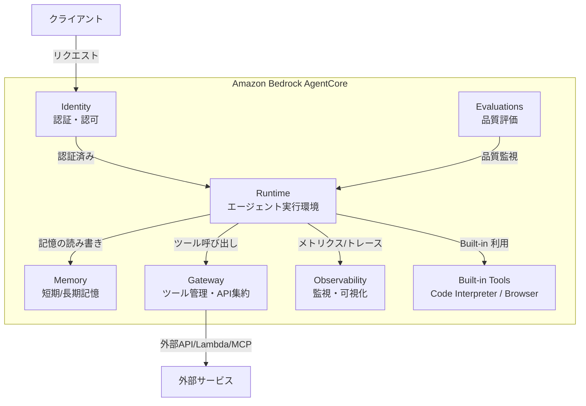
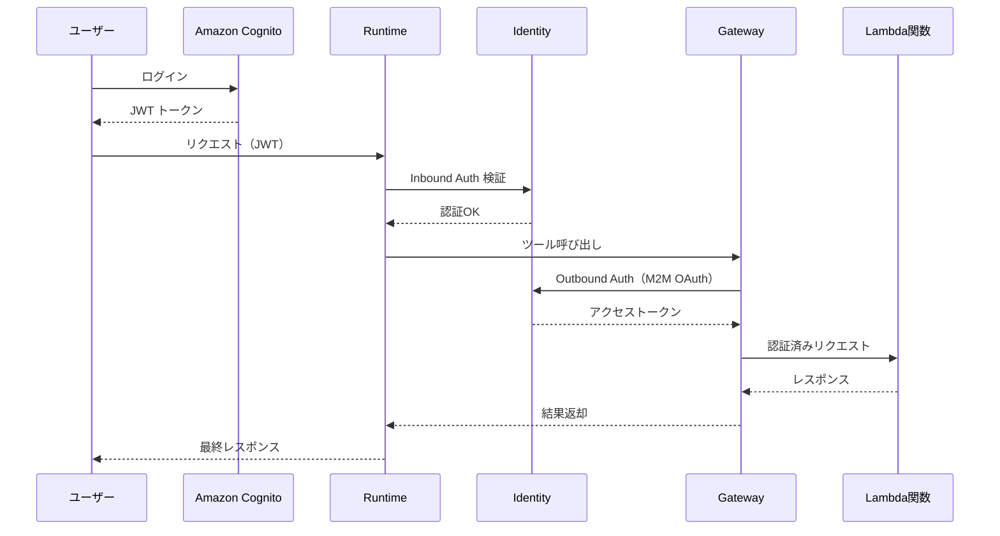
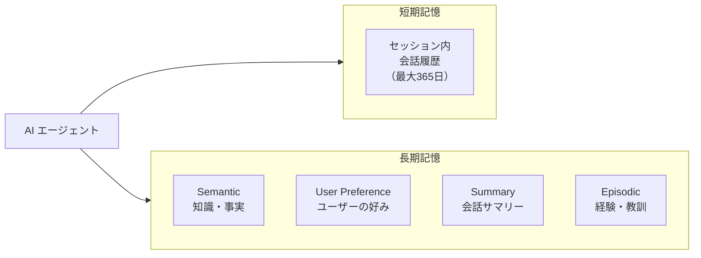
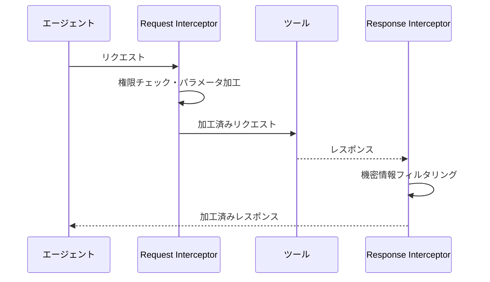
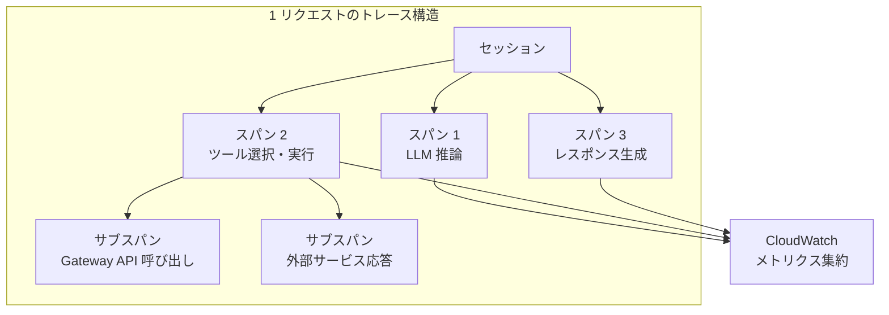
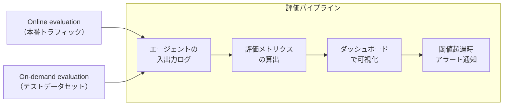
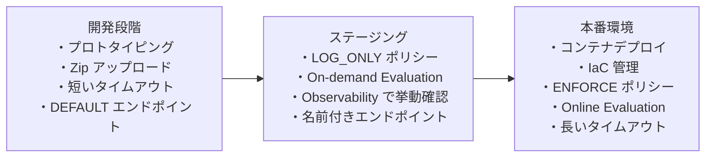

# Bedrock AgentCore とは？

AI エージェントを開発する際、モデルの選定やプロンプト設計に注目しがちですが、本番環境でエージェントを安定して動かすためには、インフラの構築・認証管理・監視・評価といった多くの運用課題を解決する必要があります。Amazon Bedrock AgentCore は、これらの課題をまとめて解決するフルマネージドサービスです。インフラ管理の負担を排除し、開発者がエージェントのロジック構築に専念できる環境を提供します。

:::note この章で学ぶこと

- Bedrock AgentCore の全体像と各コンポーネントの役割
- Runtime / Identity / Memory / Gateway / Observability / Evaluations の詳細
- Built-in Tools（Code Interpreter・Browser）の活用方法
- デプロイ方式と運用のベストプラクティス
:::

---

## 全体アーキテクチャ

Bedrock AgentCore は複数のコンポーネントで構成されており、AI エージェントの開発からデプロイ・運用・評価までのライフサイクル全体をカバーします。各コンポーネントは独立して利用できるため、プロジェクトの要件に応じて必要な機能だけを段階的に導入できます。



:::info AgentCore のコンセプト
LLM が「脳」だとすると、AgentCore の Runtime は「身体」にあたります。エージェントが外界とやり取りし、実際にアクションを起こすための実行基盤です。脳（LLM）がどれだけ優秀でも、身体（Runtime）がなければ現実世界に働きかけることはできません。
:::

---

## Runtime

### なぜ Runtime が必要か？

AI エージェントをセルフホストする場合、スケーリング、セキュリティ分離、セッション管理などを自前で構築・運用する必要があります。Runtime はこれらをサーバーレスで提供し、セッションごとに専用のマイクロ VM（軽量な仮想マシン）を割り当てることで、エージェント間のセキュリティ分離を確保します。開発者はエージェントのビジネスロジックだけに集中できます。

### 対応フレームワーク

Runtime は特定のフレームワークに依存せず、複数の主要フレームワークに対応しています。

| フレームワーク | 特徴 |
| --- | --- |
| **Strands Agents** | AWS 公式のエージェントフレームワーク。シンプルな API で素早くエージェントを構築可能 |
| **LangGraph** | LangChain ベースのグラフ型ワークフロー構築。複雑な分岐・ループ処理に強い |
| **Mastra** | TypeScript ネイティブのエージェントフレームワーク。フロントエンド開発者と親和性が高い |

:::tip フレームワークの選び方
AWS エコシステムを中心に使うなら Strands Agents、既存の LangChain 資産を活用するなら LangGraph、TypeScript で統一したいなら Mastra が適しています。いずれのフレームワークも Runtime にデプロイ可能です。
:::

### 対応プロトコル

- **HTTPS** — 標準的な REST API 通信。最もシンプルな連携方式
- **MCP（Model Context Protocol）** — Anthropic が策定したツール連携の標準プロトコル。エージェントと外部ツールの接続を標準化する
- **A2A（Agent-to-Agent）** — Google が主導するエージェント間通信プロトコル。異なるフレームワークで構築されたエージェント同士が連携可能
- **WebSocket** — リアルタイム双方向通信。音声エージェントなどのストリーミング用途に適する

### HTTP エンドポイント要件

Runtime にデプロイするエージェントは、以下の HTTP 要件を満たす必要があります。Runtime はこのエンドポイントに対してリクエストを転送します。

| 項目 | 値 |
| --- | --- |
| ホスト | `0.0.0.0` |
| ポート | `8080`（固定） |
| 必須エンドポイント | `POST /invocations`（推論リクエスト）、`GET /ping`（ヘルスチェック） |

:::caution ポート番号は固定
Runtime のポートは `8080` で固定されており、変更できません。エージェントのアプリケーションは必ずこのポートでリッスンしてください。
:::

### Runtime Endpoints

Runtime には 2 種類のエンドポイントがあり、開発フェーズに応じて使い分けます。

| エンドポイント種別 | 説明 | 用途 |
| --- | --- | --- |
| **DEFAULT** | 最新バージョンが自動的に割り当てられる | 開発・テスト環境向け。デプロイのたびに自動更新 |
| **名前付きエンドポイント** | 特定バージョンを固定して指定可能 | 本番環境向け。意図しないバージョン変更を防止 |

### ライフサイクル設定

セッションの有効期間を制御するパラメータです。用途に応じて適切に設定することで、コストと安定性のバランスを調整できます。

| パラメータ | デフォルト値 | 説明 |
| --- | --- | --- |
| `idleRuntimeSessionTimeout` | 15 分 | アイドル状態でのセッションタイムアウト |
| `maxLifetime` | 8 時間 | セッションの最大存続時間 |

:::tip 環境別のライフサイクル設定
開発環境ではタイムアウトを短めに設定してコストを抑え、本番環境では長めに設定して安定性を確保するのがベストプラクティスです。
:::

---

## Identity

### なぜ Identity が必要か？

AI エージェントは人間に代わって外部サービスを呼び出すため、「誰がエージェントを使えるか」と「エージェントがどのサービスにアクセスできるか」の両方を厳密に管理する必要があります。Identity は、このインバウンド（受信側）とアウトバウンド（送信側）の認証・認可を一元管理するマネージドサービスです。API キーなどのシークレット情報は AWS Secrets Manager で安全に保管されます。

### Inbound Auth（受信側認証）

エージェントへのアクセスを制御します。「誰がこのエージェントを呼び出せるか」を定義します。

| 認証方式 | 説明 | 適した用途 |
| --- | --- | --- |
| **IAM 認証** | AWS IAM ポリシーベースのアクセス制御 | AWS 内部のサービス間連携 |
| **JWT（Cognito）** | Amazon Cognito によるトークンベース認証 | AWS 環境のユーザー認証 |
| **JWT（Auth0）** | Auth0 などの外部 IdP によるトークンベース認証 | 既存の認証基盤との統合 |

### Outbound Auth（送信側認証）

エージェントが外部サービスを呼び出す際の認証を管理します。「エージェントがどのサービスに、どの権限でアクセスできるか」を制御します。

| 認証方式 | 説明 | 適した用途 |
| --- | --- | --- |
| **API Key** | API キーによる認証（Secrets Manager で安全に管理） | サードパーティ API の呼び出し |
| **OAuth M2M** | Machine-to-Machine の OAuth クライアントクレデンシャルフロー | バックエンドサービス間の通信 |
| **OAuth ユーザー委任** | ユーザーの権限を委任した OAuth フロー | ユーザーに代わった操作（メール送信など） |

### セキュリティアーキテクチャ例

Inbound Auth と Outbound Auth を組み合わせることで、エンドツーエンドでセキュアな構成を実現できます。以下は、ユーザーが Cognito で認証し、エージェントが M2M OAuth で外部サービスを呼び出す典型的なパターンです。



:::info Identity と Gateway の連携
Identity の Outbound Auth は Gateway と密接に連携しています。Gateway がツールを呼び出す際、Identity が自動的に認証トークンを付与するため、エージェントのコード内で認証処理を記述する必要はありません。
:::

---

## Memory

### なぜ Memory が必要か？

AI エージェントが真に役立つためには、過去の会話内容やユーザーの好みを記憶し、文脈に沿った応答を返す必要があります。しかし、LLM 自体には永続的な記憶がなく、コンテキストウィンドウの制約もあります。Memory はこの課題を解決し、短期記憶と長期記憶を自動管理することで、パーソナライズされた一貫性のある応答を実現します。

### 短期記憶（Short-term Memory）

セッション中の会話履歴を保持する仕組みです。同一セッション内であれば、過去のやり取りを参照しながら応答を生成できます。最大 **365 日間** 保存可能です。

:::info 短期記憶の役割
短期記憶は人間の「ワーキングメモリ」に相当します。たとえば「さっき聞いた質問の続きなんだけど…」といった文脈依存の会話を可能にします。
:::

### 長期記憶（Long-term Memory）

複数のセッションにまたがって情報を蓄積・活用する仕組みです。4 つの戦略（Strategy）が用意されており、用途に応じて組み合わせて使用します。

| 戦略 | 記憶する対象 | 具体例 | 適した場面 |
| --- | --- | --- | --- |
| **Semantic Memory** | 知識・事実 | 「ユーザーは TypeScript で開発している」 | ユーザー属性や背景情報の蓄積 |
| **User Preference** | ユーザーの好み | 「出力は日本語が好み」「コード例は短めが良い」 | パーソナライズされた応答の生成 |
| **Summary Memory** | 会話の要約 | 過去の会話の要点を圧縮して保持 | 長い会話履歴の効率的な参照 |
| **Episodic Memory** | 経験からの教訓 | 「前回 X を試して失敗したので Y に切り替えた」 | 試行錯誤の学習と繰り返し防止 |



:::tip Memory 戦略の選び方
まずは **Semantic Memory** と **User Preference** から導入するのがおすすめです。この 2 つだけでも、ユーザーごとにパーソナライズされた応答が実現できます。会話が長期化するユースケースでは **Summary Memory** を、試行錯誤が多いタスク（コード生成・デバッグなど）では **Episodic Memory** を追加するのが効果的です。
:::

---

## Gateway

### なぜ Gateway が必要か？

AI エージェントが利用するツール（API、Lambda 関数、MCP Server など）が増えてくると、個別に接続管理・認証・アクセス制御を行うのは煩雑になります。Gateway は、これらのツールを中央集約的に管理し、セキュリティとスケーラビリティを提供する仕組みです。エージェントは Gateway を通じてすべてのツールにアクセスするため、ツールの追加・変更時にエージェント側のコードを修正する必要がありません。

### 主要機能

#### MCP ツール化とツール集約

既存の API や Lambda 関数を MCP（Model Context Protocol）ツールとして統合管理できます。MCP はツールの入出力スキーマを標準化するプロトコルで、エージェントがツールの使い方を自動的に理解できるようになります。

#### Semantic Search

エージェントが利用できるツールが大量に登録されている場合、すべてのツール定義をプロンプトに含めると、コンテキストウィンドウを圧迫し、エージェントの判断精度が低下します（コンテキスト汚染）。Semantic Search は、エージェントのリクエスト内容を意味的に分析し、最適なツールを動的に選択する機能です。

:::tip コンテキスト汚染の回避
たとえば 100 個のツールが登録されている環境でも、Semantic Search を使えば、各リクエストに関連する 5〜10 個のツールだけがエージェントに提示されます。これにより、トークン消費を抑えつつ、ツール選択の精度を維持できます。
:::

#### Gateway Policy（Preview）

Cedar 言語（AWS が開発したオープンソースのポリシー記述言語）による宣言的なポリシー定義で、きめ細かいアクセス制御を実現します。「どのエージェントが、どのツールを、どの条件で使えるか」を明確に定義できます。

| モード | 説明 | 用途 |
| --- | --- | --- |
| **LOG_ONLY** | ポリシー違反をログに記録するが、実行はブロックしない | 導入初期の挙動検証 |
| **ENFORCE** | ポリシー違反時に実行を拒否する | 本番環境でのアクセス制御 |

:::info 安全な導入ステップ
まず `LOG_ONLY` モードでポリシーの挙動を検証し、CloudWatch でポリシー評価結果を確認します。意図したとおりに動作していることを確認できたら、`ENFORCE` モードに切り替えて実際のアクセス制御を有効にします。
:::

#### Interceptors

リクエスト/レスポンスに Lambda 関数で介入できる仕組みです。Gateway Policy がルールベースの静的な制御であるのに対し、Interceptors はプログラマブルな動的制御を実現します。

| 種類 | タイミング | 活用例 |
| --- | --- | --- |
| **Request Interceptor** | ツール実行前 | ユーザー権限の検証、リクエストパラメータの加工・マスキング |
| **Response Interceptor** | ツール実行後 | 機密情報のフィルタリング、権限に応じた結果の制限 |



---

## Observability

### なぜ Observability が必要か？

AI エージェントは従来のアプリケーションと異なり、LLM の判断を介した非決定的な処理フローを持ちます。同じ入力でも異なるツールを呼び出したり、異なる順序で処理を進めたりするため、問題が発生した際の原因特定が困難です。Observability は、エージェントの動作をセッション・トレース・スパンの階層構造で可視化し、「なぜその判断をしたか」を追跡可能にします。

### 監視機能一覧

| 機能 | 説明 |
| --- | --- |
| **CloudWatch ダッシュボード** | レイテンシ、エラー率、トークン使用量などのメトリクスを一元的に可視化 |
| **セッション管理** | ユーザーセッション単位でエージェントの振る舞いを追跡 |
| **トレース・スパン** | 1 回のリクエスト内の処理ステップ（ツール選択→API 呼び出し→レスポンス生成）を階層的に可視化 |
| **OpenTelemetry 対応** | 業界標準の分散トレーシングプロトコルとの互換性。既存の監視基盤と統合可能 |



:::tip Observability と Evaluations の連携
Observability で収集したトレースデータは、後述の Evaluations の入力としても活用できます。定常的にメトリクスを監視（Observability）しつつ、品質の自動評価（Evaluations）を組み合わせることで、問題の早期発見と継続的な改善サイクルが実現します。
:::

---

## Evaluations（Preview）

### なぜ Evaluations が必要か？

AI エージェントの品質を手動でテストし続けるのは現実的ではありません。プロンプトの変更、モデルのアップデート、ツールの追加などが品質に与える影響を、自動的かつ継続的に評価する仕組みが必要です。Evaluations は、エージェントの精度や安全性を複数の観点から自動評価し、品質の劣化を早期に検知できます。

### 評価方式

| 方式 | 説明 | 適した場面 |
| --- | --- | --- |
| **Online evaluation** | 本番環境のトラフィックを継続的にモニタリング | 本番環境での品質監視・劣化検知 |
| **On-demand evaluation** | Starter Toolkit を使ってオンデマンドで実行 | リリース前のリグレッションテスト |

### 評価項目

| 評価項目 | 説明 |
| --- | --- |
| **Goal Success Rate** | エージェントが目標を達成できた割合。最も重要な総合指標 |
| **Tool Selection Accuracy** | タスクに対して適切なツールを選択できた精度 |
| **Tool Parameter Accuracy** | 選択したツールに渡すパラメータの正確性 |
| **Coherence** | 応答の一貫性・論理的整合性。文脈に沿った自然な応答かを評価 |
| **Correctness** | 応答内容の事実としての正確性 |
| **Harmfulness** | 有害・不適切なコンテンツが含まれていないか |



:::caution 評価指標の優先順位
すべての評価項目を同じ重みで見るのではなく、ユースケースに応じた優先順位付けが重要です。たとえば、カスタマーサポートエージェントでは **Correctness** と **Harmfulness** を最優先にし、開発支援エージェントでは **Tool Selection Accuracy** と **Goal Success Rate** を重視するのが効果的です。
:::

---

## Built-in Tools

AgentCore には、エージェントが追加設定なしで利用できる 2 つの組み込みツールが用意されています。これらは Runtime 上で安全にサンドボックス実行されます。

### Code Interpreter

エージェントにコード実行能力を付与する組み込みツールです。データ分析、計算処理、ファイル変換などのタスクで、エージェントが自らコードを書いて実行できるようになります。

| 項目 | 詳細 |
| --- | --- |
| **対応言語** | Python / JavaScript / TypeScript |
| **利用可能ライブラリ** | pandas、numpy 等のデータサイエンスライブラリがプリインストール |
| **データサイズ** | インライン: 100MB まで、S3 経由: 5GB まで |
| **実行時間** | デフォルト 15 分、最大 8 時間 |

### Browser

Web ブラウザの自動操作をエージェントに提供する組み込みツールです。Web ページの閲覧、フォーム入力、スクリーンショット取得などが可能です。

| 項目 | 詳細 |
| --- | --- |
| **主な機能** | Web ページの自動操作、フォーム入力、スクリーンショット取得 |
| **検索** | 検索には Tavily 等の MCP サーバーの併用を推奨 |
| **CAPTCHA 対策** | Web Bot Auth（Preview）で対応可能 |

:::caution Browser ツールの注意点
Browser ツール単体では Web 検索機能は提供されません。Web 検索が必要な場合は、Tavily などの検索系 MCP サーバーを Gateway に登録し、組み合わせて使用してください。
:::

### Built-in Tools の比較

| 観点 | Code Interpreter | Browser |
| --- | --- | --- |
| **主な用途** | データ分析・計算処理・ファイル変換 | Web 情報取得・フォーム操作 |
| **入力** | コード（Python / JS / TS） | URL・操作指示 |
| **出力** | 実行結果・生成ファイル | ページ内容・スクリーンショット |
| **実行時間** | 最大 8 時間 | セッション依存 |

---

## デプロイ

### なぜ AgentCore でデプロイするのか？

AI エージェントのデプロイには、通常のアプリケーションにはない課題があります。セッション単位のセキュリティ分離、長時間実行への対応、モデルやツールのバージョン管理などです。AgentCore の Starter Toolkit を使えば、これらの課題を意識することなく、数コマンドでデプロイが完了します。

### Starter Toolkit

3 つのコマンドでエージェントのデプロイを完全自動化できます。

```bash
# 1. 設定ファイル生成（対話型ウィザード）
agentcore configure

# 2. AWS 環境へのデプロイ
agentcore deploy

# 3. エージェントの呼び出しテスト
agentcore invoke
```

### デプロイ方式の比較

プロジェクトの規模と成熟度に応じて、2 つのデプロイ方式を使い分けます。

| 方式 | サイズ上限 | 特徴 | 推奨用途 |
| --- | --- | --- | --- |
| **Zip アップロード** | 250MB 以下 | 高速な更新が可能。依存関係が少ないプロジェクト向け | 開発・プロトタイピング |
| **コンテナ** | 1GB まで | Docker イメージによるデプロイ。複雑な依存関係に対応 | 本番環境 |

### IaC 対応

インフラをコードで管理するため、以下の Infrastructure as Code ツールに対応しています。本番環境では IaC を使ってデプロイ構成を管理し、再現性と変更追跡を確保することを推奨します。

- **AWS CDK** — TypeScript / Python でインフラを定義
- **Terraform** — マルチクラウド対応の IaC ツール
- **CloudFormation** — AWS ネイティブの IaC サービス

---

## Strands Agents との連携

Strands Agents は AWS が開発したオープンソースのエージェントフレームワークで、AgentCore との親和性が最も高い選択肢です。Python 版に加え、TypeScript 版（Preview）も提供されています。

### なぜ Strands Agents か？

他のフレームワークも Runtime にデプロイ可能ですが、Strands Agents は AgentCore の各コンポーネント（Memory、Gateway、Identity など）とネイティブに統合されており、最小限のコードで AgentCore の機能をフル活用できます。

### 主な特徴

- **シンプルな実装** — 数行のコードでエージェントを構築・実行可能
- **デコレータによる自動エンドポイント生成** — `BedrockAgentCoreApp` ラッパーで、Runtime が要求する HTTP エンドポイント（`/invocations`、`/ping`）を自動生成
- **Session Manager 連携** — AgentCore Memory との統合が組み込まれており、短期・長期記憶を簡単に利用可能
- **ツール定義の簡潔さ** — 関数デコレータでツールのスキーマ定義を自動化

---

## 運用のベストプラクティス

### 開発から本番への流れ

AgentCore の各機能を段階的に導入し、開発→検証→本番の流れで成熟度を高めていくのが推奨されるアプローチです。



### チェックリスト

| フェーズ | 推奨事項 |
| --- | --- |
| **開発** | Zip アップロードで高速イテレーション。タイムアウトは短めに設定してコスト最適化 |
| **検証** | `LOG_ONLY` で Gateway Policy の挙動を確認。On-demand Evaluation で品質をチェック |
| **本番** | コンテナへ移行し IaC で管理。`ENFORCE` でポリシーを適用。名前付きエンドポイントでバージョン固定 |
| **運用** | Observability で定期的に監視。Online Evaluation で品質を継続的に自動評価 |
| **ツール管理** | Semantic Search でコンテキスト汚染を回避。Interceptors で動的な権限制御を実装 |

:::tip すべての機能を使う必要はない
AgentCore は多くの機能を提供していますが、すべてを一度に導入する必要はありません。まずは Runtime でエージェントをデプロイし、必要に応じて Memory、Gateway、Observability と段階的に追加していくのが効果的です。
:::

---

## 参考資料

- [Amazon Bedrock AgentCore 公式ドキュメント](https://docs.aws.amazon.com/bedrock-agentcore/latest/devguide/what-is-bedrock-agentcore.html)
- [Amazon Bedrock AgentCore 製品ページ](https://aws.amazon.com/bedrock/agentcore/)
- [AgentCore Starter Toolkit](https://aws.github.io/bedrock-agentcore-starter-toolkit/index.html)
- [Strands Agents 公式ドキュメント](https://strandsagents.com/latest/)
- [Strands Agents GitHub リポジトリ](https://github.com/strands-agents)
- [Cedar Policy Language リファレンスガイド](https://docs.cedarpolicy.com/)
- [Model Context Protocol（MCP）仕様](https://modelcontextprotocol.io/specification/2025-06-18)
- [Agent-to-Agent（A2A）プロトコル仕様](https://a2a-protocol.org/latest/specification/)
- [2025年 Amazon Bedrock AgentCore まとめ - Speaker Deck](https://speakerdeck.com/yuu551/2025nian-amazon-bedrock-agentcorematome)
