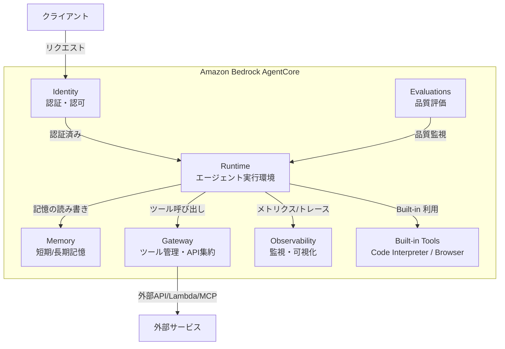
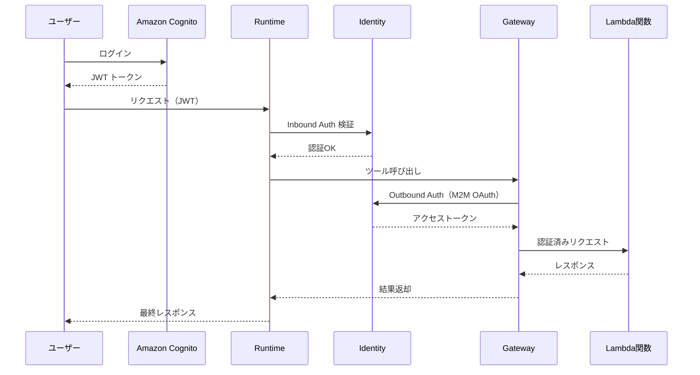
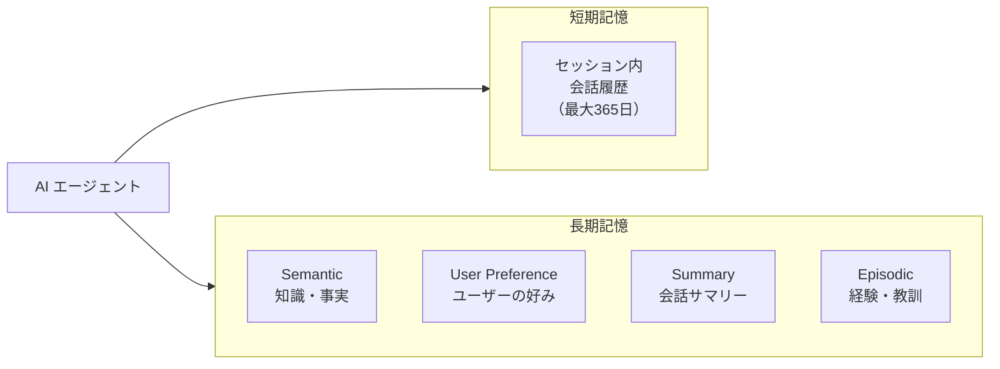
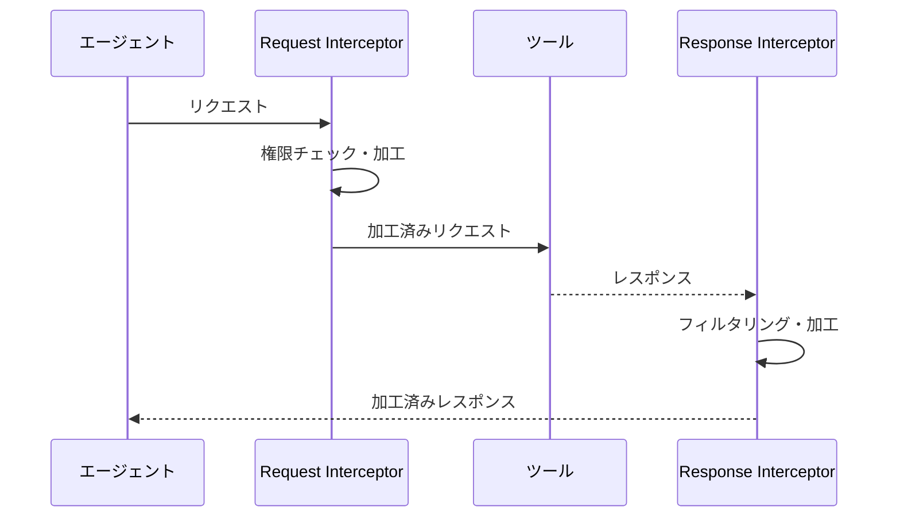
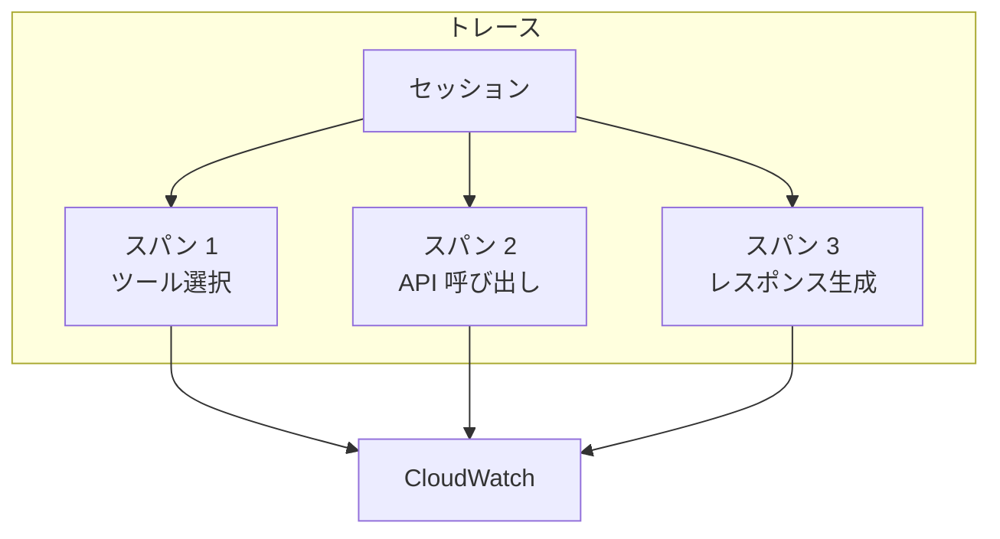
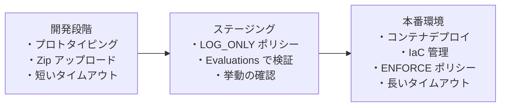

# Bedrock AgentCore とは？

Amazon Bedrock AgentCore は、AI エージェントを本番環境にデプロイ・運用するためのフルマネージドサービスです。インフラ管理の負担を排除し、開発者がエージェントのロジック構築に専念できる環境を提供します。

:::note この章で学ぶこと

- Bedrock AgentCore の全体像と各コンポーネントの役割
- Runtime / Identity / Memory / Gateway / Observability / Evaluations の詳細
- Built-in Tools（Code Interpreter・Browser）の活用方法
- デプロイ方式とベストプラクティス
:::

---

## 全体アーキテクチャ

Bedrock AgentCore は複数のコンポーネントで構成されており、AI エージェントの開発からデプロイ・運用・評価までのライフサイクル全体をカバーします。



:::info AgentCore のコンセプト
LLM が「脳」だとすると、AgentCore の Runtime は「身体」にあたります。エージェントが外界とやり取りし、実際にアクションを起こすための実行基盤です。
:::

---

## Runtime

Runtime は AI エージェントの実行環境を提供するコア機能です。サーバーレスで自動スケールし、セッションごとに専用のマイクロ VM を提供します。

### 対応フレームワーク

| フレームワーク | 特徴 |
| --- | --- |
| **Strands Agents** | AWS 公式のエージェントフレームワーク。3 行で実行可能なシンプルさ |
| **LangGraph** | LangChain ベースのグラフ型ワークフロー構築 |
| **Mastra** | TypeScript ネイティブのエージェントフレームワーク |

### 対応プロトコル

- **HTTPS** — 標準的な REST API 通信
- **MCP（Model Context Protocol）** — ツール連携の標準プロトコル
- **A2A（Agent-to-Agent）** — エージェント間通信プロトコル
- **WebSocket** — リアルタイム双方向通信

### HTTP エンドポイント要件

Runtime にデプロイするエージェントは、以下の HTTP 要件を満たす必要があります。

| 項目 | 値 |
| --- | --- |
| ホスト | `0.0.0.0` |
| ポート | `8080`（固定） |
| 必須エンドポイント | `POST /invocations`、`GET /ping` |

:::caution ポート番号は固定
Runtime のポートは `8080` で固定されており、変更できません。エージェントのアプリケーションは必ずこのポートでリッスンしてください。
:::

### Runtime Endpoints

Runtime には 2 種類のエンドポイントがあります。

| エンドポイント種別 | 説明 | 用途 |
| --- | --- | --- |
| **DEFAULT** | 最新バージョンが自動的に割り当てられる | 開発・テスト環境 |
| **名前付きエンドポイント** | 特定バージョンを固定して指定可能 | 本番環境 |

### ライフサイクル設定

| パラメータ | デフォルト値 | 説明 |
| --- | --- | --- |
| `idleRuntimeSessionTimeout` | 15 分 | アイドル状態でのセッションタイムアウト |
| `maxLifetime` | 8 時間 | セッションの最大存続時間 |

:::tip 環境別のライフサイクル設定
開発環境ではタイムアウトを短めに設定してコストを抑え、本番環境では長めに設定して安定性を確保するのがベストプラクティスです。
:::

---

## Identity

Identity は AI エージェントの認証・認可機能を実現するマネージドサービスです。インバウンド（誰がエージェントにアクセスできるか）とアウトバウンド（エージェントが外部サービスにアクセスする際の認証）の両方をカバーします。

### Inbound Auth（受信側認証）

エージェントへのアクセスを制御します。

| 認証方式 | 説明 |
| --- | --- |
| **IAM 認証** | AWS IAM ポリシーベースのアクセス制御 |
| **JWT（Cognito）** | Amazon Cognito によるトークンベース認証 |
| **JWT（Auth0）** | Auth0 などの外部 IdP によるトークンベース認証 |

### Outbound Auth（送信側認証）

エージェントが外部サービスを呼び出す際の認証を管理します。

| 認証方式 | 説明 |
| --- | --- |
| **API Key** | API キーによる認証（Secrets Manager で安全に管理） |
| **OAuth M2M** | Machine-to-Machine の OAuth フロー |
| **OAuth ユーザー委任** | ユーザーの権限を委任した OAuth フロー |

### セキュリティアーキテクチャ例

Inbound Auth と Outbound Auth を組み合わせたセキュアな構成例です。



---

## Memory

Memory は AI エージェントの短期記憶と長期記憶を自動管理する機能です。会話の文脈を保持し、パーソナライズされた応答を実現します。

### 短期記憶（Short-term Memory）

セッション中の会話履歴を保持します。最大 **365 日間** 保存可能です。

### 長期記憶（Long-term Memory）

複数のセッションにまたがって情報を蓄積・活用する仕組みです。4 つの戦略（Strategy）が用意されています。

| 戦略 | 説明 | 例 |
| --- | --- | --- |
| **Semantic Memory Strategy** | 知識・事実を記憶 | 「ユーザーは TypeScript プロジェクトで開発している」 |
| **User Preference Strategy** | ユーザーの好みを記憶 | 「出力は日本語を好む」「コード例は短めが良い」 |
| **Summary Memory Strategy** | 会話のサマリーを記憶 | 過去の会話の要約を保持して文脈を維持 |
| **Episodic Memory Strategy** | 経験からの教訓を記憶 | 「前回 X を試してうまくいかなかったので Y に切り替えた」 |



---

## Gateway

Gateway は既存の API、Lambda 関数、MCP Server を中央集約的に管理する機能です。エージェントが利用するツールを一元管理し、セキュリティとスケーラビリティを提供します。

### 主要機能

#### MCP ツール化とツール集約

既存の API や Lambda 関数を MCP ツールとして統合管理できます。エージェントは Gateway を通じてすべてのツールにアクセスします。

#### Semantic Search

大量のツールが登録されている場合に、エージェントのリクエストに最適なツールを自動的に検索・選択します。

:::tip コンテキスト汚染の回避
ツールが大量にある場合、すべてのツール情報をプロンプトに含めるとコンテキストが汚染されます。Semantic Search を使うことで、必要なツールだけを動的に選択でき、エージェントの精度を維持できます。
:::

#### Gateway Policy（Preview）

Cedar 言語による宣言的なポリシー定義で、きめ細かいアクセス制御を実現します。

| モード | 説明 |
| --- | --- |
| **LOG_ONLY** | ポリシー違反をログに記録するが、実行はブロックしない |
| **ENFORCE** | ポリシー違反時に実行を拒否する |

:::info 安全な導入ステップ
まず `LOG_ONLY` モードでポリシーの挙動を検証し、問題がないことを確認してから `ENFORCE` モードに切り替えるのが推奨されます。CloudWatch でポリシー評価結果を可視化できます。
:::

#### Interceptors

リクエスト/レスポンスに Lambda 関数で介入する仕組みです。

| 種類 | 説明 | 活用例 |
| --- | --- | --- |
| **Request Interceptor** | ツール実行前にリクエストを加工・検証 | ユーザー権限の検証後にツール実行を制御 |
| **Response Interceptor** | ツール実行後にレスポンスを加工・フィルタ | 権限に応じたツール一覧のフィルタリング |



---

## Observability

Observability は各種メトリクス、トレース、スパンを可視化する機能です。エージェントの動作を詳細に監視・分析できます。

### 監視機能一覧

| 機能 | 説明 |
| --- | --- |
| **CloudWatch ダッシュボード** | メトリクスの一元的な可視化 |
| **セッション管理** | セッション単位でのトレース確認 |
| **トレース・スパン** | 処理の階層構造を可視化 |
| **OpenTelemetry 対応** | 標準的なトレーシングプロトコルとの互換性 |



---

## Evaluations（Preview）

Evaluations は AI エージェントの品質を自動評価する機能です。エージェントの精度や安全性を継続的にモニタリングできます。

### 評価方式

| 方式 | 説明 |
| --- | --- |
| **Online evaluation** | 本番環境で継続的にモニタリング |
| **On-demand evaluation** | Starter Toolkit を使ってオンデマンドで実行 |

### 評価項目

| 評価項目 | 説明 |
| --- | --- |
| **Goal Success Rate** | エージェントが目標を達成できた割合 |
| **Tool Selection Accuracy** | 適切なツールを選択できた精度 |
| **Tool Parameter Accuracy** | ツールに渡すパラメータの正確性 |
| **Coherence** | 応答の一貫性・論理的整合性 |
| **Correctness** | 応答の正確性 |
| **Harmfulness** | 有害なコンテンツが含まれていないか |

---

## Built-in Tools

AgentCore には 2 つの組み込みツールが用意されています。

### Code Interpreter

コードの実行環境を提供する組み込みツールです。

| 項目 | 詳細 |
| --- | --- |
| **対応言語** | Python / JavaScript / TypeScript |
| **利用可能ライブラリ** | pandas、numpy 等のデータサイエンスライブラリ |
| **データサイズ** | インライン: 100MB まで、S3 経由: 5GB まで |
| **実行時間** | デフォルト 15 分、最大 8 時間 |

### Browser

Web ブラウザの自動操作を提供する組み込みツールです。

| 項目 | 詳細 |
| --- | --- |
| **主な機能** | Web ページの自動操作、フォーム入力 |
| **検索** | 検索には Tavily 等の MCP サーバーの併用を推奨 |
| **CAPTCHA 対策** | Web Bot Auth（Preview）で対応 |

:::caution Browser ツールの注意点
Browser ツール単体では Web 検索機能は提供されません。検索が必要な場合は Tavily などの検索系 MCP サーバーと組み合わせて使用してください。
:::

---

## デプロイ

### Starter Toolkit

3 つのコマンドでエージェントのデプロイを完全自動化できます。

```bash
# 1. 設定ファイル生成（対話型）
agentcore configure

# 2. AWS 環境へのデプロイ
agentcore deploy

# 3. エージェント呼び出し
agentcore invoke
```

### デプロイ方式の比較

| 方式 | サイズ上限 | 特徴 | 推奨用途 |
| --- | --- | --- | --- |
| **Zip アップロード** | 250MB 以下 | 高速な更新が可能 | 開発・プロトタイピング |
| **コンテナ** | 1GB まで | 複雑な依存関係に対応 | 本番環境 |

### IaC 対応

以下の Infrastructure as Code ツールに対応しています。

- **AWS CDK**
- **Terraform**
- **CloudFormation**

---

## Strands Agents との連携

Strands Agents は AWS 公式のエージェントフレームワークで、AgentCore との親和性が非常に高いです。

### 特徴

- **3 行で実行可能** なシンプルな実装
- デコレータで自動エンドポイント生成
- Session Manager でメモリー連携
- ツール定義も簡潔に実装可能

---

## 運用のベストプラクティス

### 開発から本番への流れ



### チェックリスト

| フェーズ | 推奨事項 |
| --- | --- |
| **開発** | Zip アップロードで高速イテレーション、タイムアウトは短めに設定 |
| **検証** | `LOG_ONLY` で Gateway Policy の挙動を確認、Evaluations で品質チェック |
| **本番** | コンテナへ移行、IaC で管理、`ENFORCE` でポリシーを適用 |
| **運用** | Observability で定期的に監視、Evaluations で品質を自動評価 |
| **ツール管理** | Semantic Search でコンテキスト汚染を回避、Interceptors で権限制御 |

:::tip すべての機能を使う必要はない
AgentCore は多くの機能を提供していますが、すべてを使う必要はありません。プロジェクトの要件に応じて必要な機能を選択し、段階的に導入していくのが効果的です。
:::

---

## 参考資料

- [Amazon Bedrock AgentCore 公式ドキュメント](https://docs.aws.amazon.com/bedrock/latest/userguide/agentcore.html)
- [2025年 Amazon Bedrock AgentCoreまとめ - Speaker Deck](https://speakerdeck.com/yuu551/2025nian-amazon-bedrock-agentcorematome)
