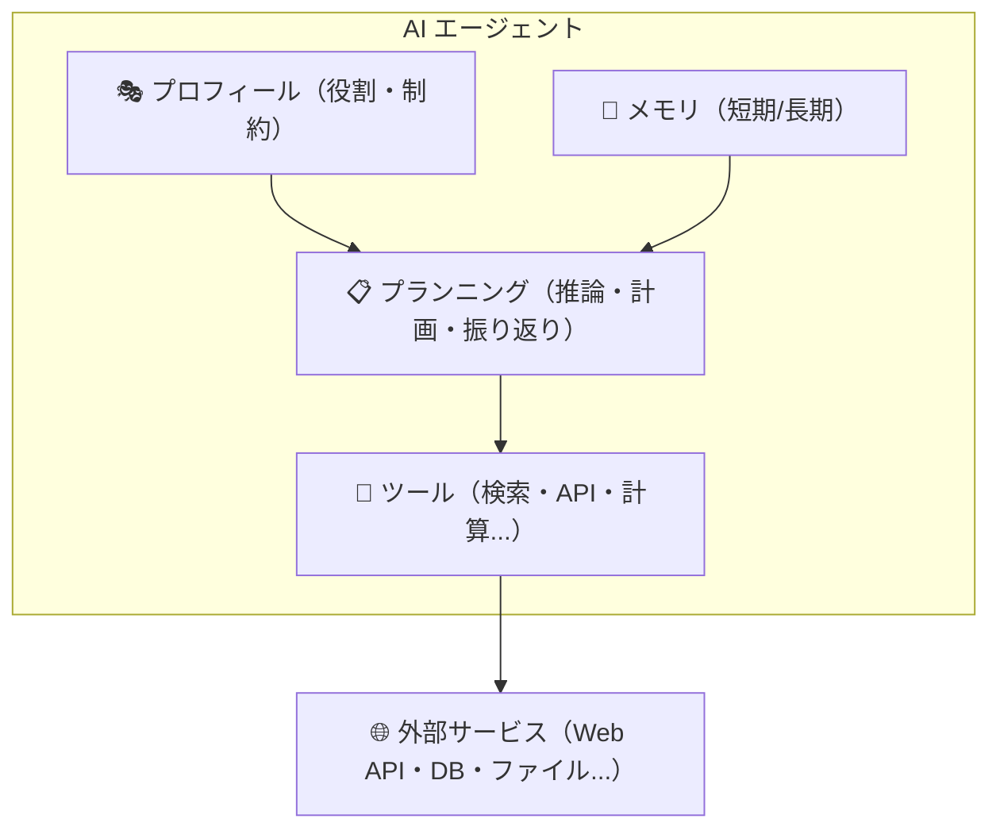
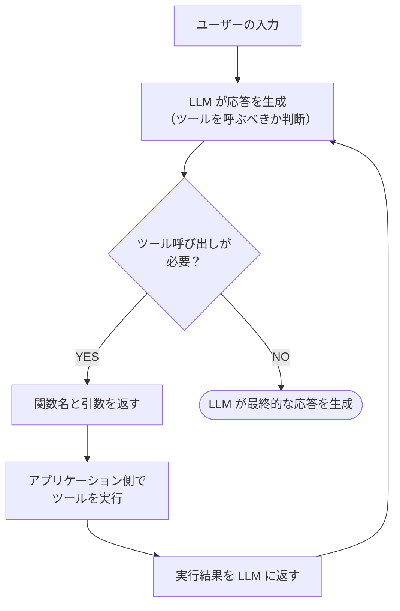
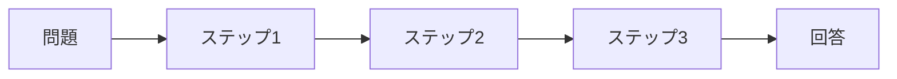
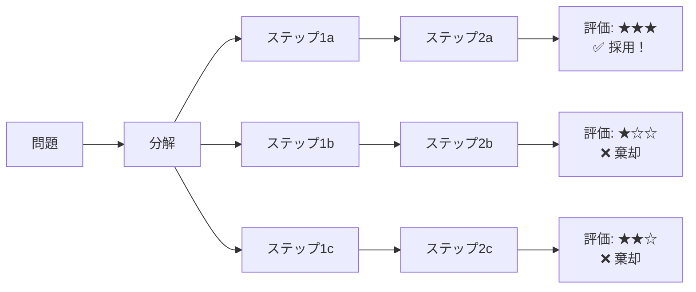
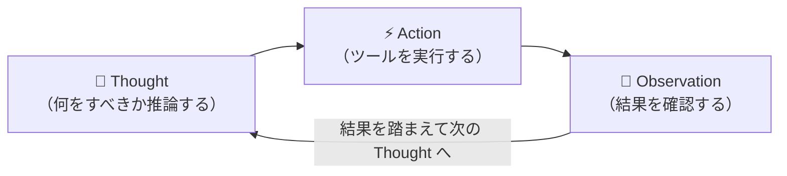
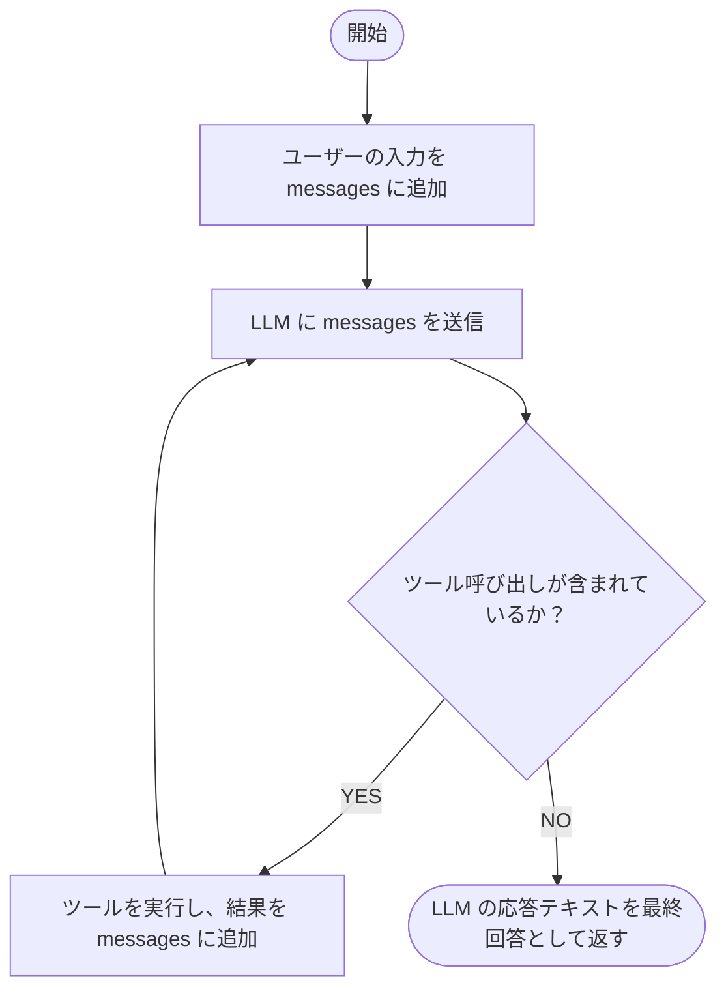
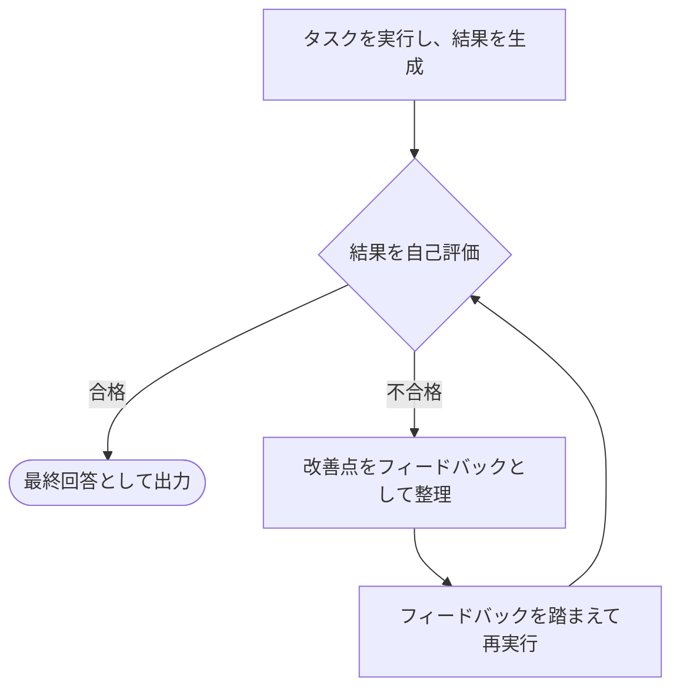

# Chapter 2: AIエージェントの構成

この章では、AI エージェントの内部構成について解説します。
「AI エージェント」と聞くと高度な仕組みを想像するかもしれませんが、その内部は明確な役割を持ったコンポーネントの組み合わせで成り立っています。各コンポーネントの役割を理解することで、目的に応じたエージェントを設計・実装できるようになります。

:::note この章で学ぶこと

- AI エージェントを構成する 4 つのコンポーネントの役割と関係性
- **プロフィール**（システムプロンプト）によるエージェントの人格設計
- **メモリ**（短期 / 長期）の仕組みと実装パターン
- **ツール**（Function Calling）の定義方法と設計指針
- **プランニング**によるタスク分解と、ReAct パターンを用いた自律的な実行サイクル

:::

AI エージェントは一般的に以下の 4 つの主要コンポーネントで構成されます。



プロフィールがエージェントの「人格」を定め、メモリが「記憶」を担い、プランニングが「思考」を司り、ツールが「行動」を実行する——この 4 つが連携することで、エージェントは複雑なタスクを自律的に遂行します。

| コンポーネント | 説明 |
| --- | --- |
| **プロフィール** | エージェントの役割・人格・行動指針を定義する |
| **メモリ** | 過去の対話や情報を記憶・参照する仕組み |
| **ツール** | 外部 API やデータベースなど、エージェントが利用できる機能 |
| **プランニング** | タスクを分解し、実行計画を立てる能力 |

## プロフィール

**プロフィール**は、AI エージェントに「何者であるか」を定義するコンポーネントです。
LLM に対するシステムプロンプトとして実装されることが多く、エージェントの振る舞いの土台となります。

### プロフィールの構成要素

プロフィールは主に以下の 3 つの要素で構成されます。

| 要素 | 説明 | 例 |
| --- | --- | --- |
| **役割（Role）** | エージェントが担う職務や専門性 | 「あなたはシニアソフトウェアエンジニアです」 |
| **目標（Goal）** | エージェントが達成すべき目的 | 「ユーザーのコードレビューを支援すること」 |
| **制約（Constraints）** | 行動の境界線やルール | 「機密情報を外部に漏らさないこと」 |

### なぜプロフィールが重要なのか？

プロフィールを適切に設計することで、以下のメリットが得られます。

- **一貫性のある応答** - 役割が明確なため、文脈に応じたブレのない回答を生成できる
- **専門性の発揮** - 特定ドメインの知識やトーンに特化した応答が可能になる
- **安全性の確保** - 制約を設けることで、不適切な応答や危険な行動を抑制できる

### 実装例

以下は、コードレビューを行う AI エージェントのプロフィール定義の例です。

```typescript
import OpenAI from "openai";

const client = new OpenAI({ apiKey: process.env.OPENAI_API_KEY });

const systemPrompt = `あなたはシニアソフトウェアエンジニアです。

## 役割
- ユーザーから提示されたコードをレビューし、改善点を提案します
- バグの可能性がある箇所を指摘します
- ベストプラクティスに基づいたアドバイスを提供します

## 制約
- コードの全面的な書き換えではなく、具体的な改善ポイントに絞って指摘してください
- セキュリティ上の懸念がある場合は、最優先で報告してください
- 推測ではなく、根拠に基づいたレビューを行ってください`;

const response = await client.chat.completions.create({
  model: "gpt-4o",
  messages: [
    { role: "system", content: systemPrompt },
    { role: "user", content: "以下のコードをレビューしてください:\n..." },
  ],
});

console.log(response.choices[0]?.message.content);
```

:::tip
プロフィールの設計は**プロンプトエンジニアリング**の一部です。役割・目標・制約を明確に記述することで、エージェントの出力品質が大幅に向上します。曖昧な指示よりも、具体的で構造化された指示の方が効果的です。
:::

---

## メモリ

**メモリ**は、AI エージェントが過去の情報を保持・参照するためのコンポーネントです。
LLM は本来ステートレス（状態を持たない）であり、API コールごとに過去の会話を忘れてしまいます。メモリを導入することで、文脈を踏まえた一貫性のある対話や、過去の経験を活かした意思決定が可能になります。

### メモリの種類

エージェントのメモリは、人間の記憶モデルになぞらえて大きく 2 種類に分類されます。

| 種類 | 説明 | 人間の記憶との対応 |
| --- | --- | --- |
| **短期メモリ（Short-term Memory）** | 現在の会話セッション内の情報を保持する | 作業記憶（ワーキングメモリ） |
| **長期メモリ（Long-term Memory）** | セッションをまたいで永続的に情報を保持する | 長期記憶 |

### 短期メモリ

短期メモリは、現在進行中の会話の履歴そのものです。
Chat Completions API では `messages` 配列に過去のやりとりを含めることで実現します。

```typescript
import type OpenAI from "openai";

const messages: OpenAI.ChatCompletionMessageParam[] = [
  { role: "system", content: "あなたは旅行プランナーです。" },
  { role: "user", content: "来月、京都に旅行したいです。" },
  { role: "assistant", content: "京都旅行いいですね！何泊の予定ですか？" },
  { role: "user", content: "2泊3日で考えています。" },
  // ↑ これまでの会話をすべて含めることで、文脈を維持する
];
```

ただし、LLM にはコンテキストウィンドウ（入力トークン数の上限）があるため、会話が長くなると過去のメッセージをすべて含められなくなります。

#### コンテキストウィンドウの管理手法

長い会話を扱うための代表的な手法を紹介します。

| 手法 | 説明 | メリット / デメリット |
| --- | --- | --- |
| **スライディングウィンドウ** | 直近の N 件のメッセージのみを保持する | 実装が簡単だが、古い情報が失われる |
| **要約（Summarization）** | 過去の会話を LLM で要約し、圧縮して保持する | 情報を圧縮できるが、要約時に詳細が失われる可能性がある |
| **トークンカウント** | トークン数を計算し、上限に収まるように古いメッセージを削除する | 精密な制御が可能だが、トークン計算のコストがかかる |

```typescript
import type OpenAI from "openai";

// スライディングウィンドウの簡易実装例
function trimMessages(
  messages: OpenAI.ChatCompletionMessageParam[],
  maxMessages: number,
): OpenAI.ChatCompletionMessageParam[] {
  // システムメッセージは常に保持
  const systemMessage = messages.find((m) => m.role === "system");
  const nonSystemMessages = messages.filter((m) => m.role !== "system");

  // 直近の maxMessages 件のみ残す
  const trimmed = nonSystemMessages.slice(-maxMessages);

  return systemMessage ? [systemMessage, ...trimmed] : trimmed;
}
```

### 長期メモリ

長期メモリは、会話セッションを超えて情報を永続化する仕組みです。
ユーザーの好みや過去のタスク結果などを保存しておくことで、パーソナライズされた体験を提供できます。

#### 長期メモリの実装方式

| 方式 | 説明 | ユースケース |
| --- | --- | --- |
| **キーバリューストア** | キーと値のペアでシンプルに保存する | ユーザー設定、環境情報の保存 |
| **ベクトルデータベース** | テキストを埋め込みベクトルに変換し、類似検索で関連情報を取得する | 過去の会話からの知識検索、FAQ 検索 |
| **ナレッジグラフ** | エンティティとリレーションの関係をグラフ構造で保存する | 複雑な関係性の管理、推論 |

```typescript
// ベクトルデータベースを用いた長期メモリの概念例
import OpenAI from "openai";

const client = new OpenAI({ apiKey: process.env.OPENAI_API_KEY });

// テキストを埋め込みベクトルに変換
async function createEmbedding(text: string): Promise<number[]> {
  const response = await client.embeddings.create({
    model: "text-embedding-3-small",
    input: text,
  });
  return response.data[0]!.embedding;
}

// メモリの保存（実際にはベクトル DB に保存する）
async function saveMemory(content: string): Promise<void> {
  const embedding = await createEmbedding(content);
  // ベクトル DB に embedding と content を保存
  console.log(`メモリを保存: ${content}（次元数: ${embedding.length}）`);
}

// メモリの検索（実際にはベクトル DB で類似検索する）
async function searchMemory(query: string): Promise<void> {
  const queryEmbedding = await createEmbedding(query);
  // ベクトル DB で queryEmbedding に近いベクトルを検索
  console.log(`クエリ "${query}" で関連メモリを検索（次元数: ${queryEmbedding.length}）`);
}
```

:::info メモリ設計のポイント

- **短期メモリだけでも十分なケースは多い** - シンプルな Q&A や単発タスクでは、長期メモリは不要な場合がほとんど
- **長期メモリはコストとのトレードオフ** - 埋め込みの生成やベクトル DB の運用にはコストがかかるため、本当に必要な情報だけを保存する
- **プライバシーに配慮する** - ユーザーの個人情報を長期メモリに保存する場合は、適切なアクセス制御と削除機能を実装する

:::

---

## ツール

**ツール**は、AI エージェントが外部の機能やサービスを呼び出すためのコンポーネントです。
LLM 単体では「テキストの生成」しかできませんが、ツールを組み合わせることで、Web 検索・データベース操作・ファイル操作・API 呼び出しなど、現実世界に作用するアクションが可能になります。

### ツールの分類

エージェントが利用するツールは、大きく以下の 3 種類に分類できます。

| 種類 | 説明 | 例 |
| --- | --- | --- |
| **情報取得（Retrieval）** | 外部から情報を取得する | Web 検索、データベースクエリ、ファイル読み込み |
| **アクション実行（Action）** | 外部システムに対して変更を加える | メール送信、ファイル書き込み、API へのリクエスト |
| **計算・変換（Computation）** | データの加工や演算を行う | 数値計算、フォーマット変換、コード実行 |

### ツールの定義方法

OpenAI の Function Calling を利用する場合、ツールは JSON Schema 形式で定義します。
モデルに「どんなツールが使えるか」「どんな引数を受け取るか」を伝えることで、モデルが適切なタイミングでツールを選択・呼び出します。

```typescript
import type OpenAI from "openai";

const tools: OpenAI.ChatCompletionTool[] = [
  {
    type: "function",
    function: {
      name: "search_web",
      description: "指定されたクエリでWeb検索を行い、結果を返します",
      parameters: {
        type: "object",
        properties: {
          query: {
            type: "string",
            description: "検索クエリ",
          },
          maxResults: {
            type: "number",
            description: "取得する検索結果の最大件数",
          },
        },
        required: ["query"],
      },
    },
  },
];
```

### ツール呼び出しのフロー

エージェントにおけるツール呼び出しは、以下のサイクルで行われます。



このサイクルは 1 回で終わるとは限りません。複雑なタスクでは、LLM がツールを複数回呼び出し、それぞれの結果を踏まえて次のアクションを決定する**マルチステップ推論**が行われます。この「推論 → ツール実行 → 結果の観察 → 次の推論」という繰り返しを体系化したものが、後述する[プランニング](#プランニング)の **ReAct パターン**です。

### ツール設計のポイント

ツールの定義はエージェントの能力を大きく左右します。以下のポイントを意識して設計しましょう。

- **`description` を具体的に書く** - モデルがツールを選択する際の判断材料になる。「いつ」「何のために」使うかを明記する
- **パラメータを最小限にする** - 必須パラメータは本当に必要なものだけに絞り、オプショナルなものは `required` に含めない
- **1 つのツールに 1 つの責務** - 複数の機能を 1 つのツールに詰め込まず、単一責務の原則を守る
- **エラーハンドリングを考慮する** - ツール実行が失敗した場合の挙動を想定しておく

:::caution
ツールにアクション実行系（メール送信、データ削除など）を含める場合は、**人間による確認ステップ（Human-in-the-Loop）** を組み込むことを強く推奨します。エージェントが意図しない操作を行うリスクを軽減できます。
:::

:::note 次の章との関連
ツールの具体的な実装（Function Calling や Tavily Search）については、[Chapter 3: AIエージェントの開発準備](../chapter3/index.md) で詳しく解説しています。
:::

---

## プランニング

**プランニング**は、AI エージェントが複雑なタスクを小さなステップに分解し、実行計画を立てるコンポーネントです。
人間が大きな仕事に取り組むときに「まず何をして、次に何をするか」を考えるように、エージェントもタスクを構造化して順序立てて実行する能力を持ちます。

プランニングは、前述の**メモリ**と**ツール**を活用して動作します。メモリに蓄積された文脈をもとに、ツールを「いつ・どの順番で」呼び出すかを判断し、次のアクションを決定します。

### なぜプランニングが必要なのか？

LLM に複雑なタスクを一度に処理させると、以下の問題が発生しやすくなります。

- **手順の抜け漏れ** - 必要なステップを飛ばしてしまう
- **順序の誤り** - 前提条件を満たさないまま次のステップに進んでしまう
- **全体像の見失い** - 途中で目的からずれた行動を取ってしまう

プランニングを導入することで、エージェントはタスクを体系的に処理し、各ステップの結果を踏まえて次のアクションを判断できるようになります。

### プランニングの手法

代表的なプランニング手法を紹介します。

| 手法 | 説明 |
| --- | --- |
| **Chain of Thought（CoT）** | 「ステップバイステップで考えて」と指示し、推論過程を明示的に出力させる |
| **Tree of Thoughts（ToT）** | 複数の推論パスを並列に探索し、最も有望なものを選択する |
| **ReAct** | Reasoning（推論）と Action（行動）を交互に繰り返し、観察結果を次の推論に反映する |

この中でも **ReAct** は、ツール呼び出しと組み合わせることでエージェントの「自律的な行動」を実現するパターンとして最も実用的です。CoT は主にプロンプト設計のテクニックとして、ToT は探索的な問題解決に適していますが、外部ツールと連携して現実世界のタスクを遂行するエージェントには ReAct が最もフィットします。

以下では CoT、ToT、ReAct の順にそれぞれ詳しく解説していきます。

### Chain of Thought（CoT）

**Chain of Thought（CoT）** は、LLM に「ステップバイステップで考えて」と指示することで、いきなり最終回答を出すのではなく、**推論の過程を明示的に出力させる**プロンプティング手法です。

#### CoT が解決する問題

LLM は複雑な問題に対して、推論をショートカットして誤った回答を返すことがあります。例えば、数学の問題や論理的な判断が必要なタスクで、途中の計算過程を飛ばして間違った結論に至るケースです。

CoT を導入すると、モデルが中間ステップを明示的に生成するため、以下のメリットが得られます。

- **推論精度の向上** - 中間ステップを踏むことで、複雑な問題でも正確な回答に到達しやすくなる
- **透明性の確保** - 思考過程が可視化されるため、回答の根拠を人間が確認・検証できる
- **デバッグの容易さ** - 推論のどこで間違えたかを特定しやすくなる

#### CoT の種類

CoT にはいくつかのバリエーションがあります。

| 種類 | 説明 |
| --- | --- |
| **Zero-shot CoT** | 「ステップバイステップで考えてください」と指示するだけで推論過程を引き出す。例示不要で手軽に使える |
| **Few-shot CoT** | 推論過程を含んだ例（数ショット）をプロンプトに含め、同じ形式での推論を誘導する |

#### 実装例：CoT によるプロンプティング

以下は、Zero-shot CoT を使ってタスクの判断精度を向上させる例です。

```typescript
import OpenAI from "openai";

const client = new OpenAI({ apiKey: process.env.OPENAI_API_KEY });

// CoT なし: いきなり回答を求める
async function withoutCoT(question: string): Promise<string> {
  const response = await client.chat.completions.create({
    model: "gpt-4o",
    messages: [{ role: "user", content: question }],
  });
  return response.choices[0]?.message.content ?? "";
}

// CoT あり: ステップバイステップで考えさせる
async function withCoT(question: string): Promise<string> {
  const response = await client.chat.completions.create({
    model: "gpt-4o",
    messages: [
      {
        role: "system",
        content:
          "与えられた問題に対して、ステップバイステップで考えてから回答してください。",
      },
      { role: "user", content: question },
    ],
  });
  return response.choices[0]?.message.content ?? "";
}

// 例: 論理的な推論が必要な問題
const question =
  "ある会社には300人の社員がいます。60%がリモートワーク、残りがオフィス勤務です。オフィス勤務の社員のうち25%が管理職です。管理職は何人ですか？";

console.log("--- CoT なし ---");
console.log(await withoutCoT(question));

console.log("\n--- CoT あり ---");
console.log(await withCoT(question));
```

**実行結果の例:**

```text
--- CoT なし ---
管理職は30人です。

--- CoT あり ---
ステップ1: 全社員は300人です。
ステップ2: リモートワークの社員は300 × 0.6 = 180人です。
ステップ3: オフィス勤務の社員は300 - 180 = 120人です。
ステップ4: オフィス勤務の管理職は120 × 0.25 = 30人です。
答え: 管理職は30人です。
```

CoT なしでも正解に至る場合はありますが、CoT ありでは**推論過程が可視化される**ため、回答の根拠を確認できる点が大きな違いです。より複雑な問題では、推論をステップ分けすることで正答率が向上します。

#### 実装例：Few-shot CoT によるプロンプティング

Few-shot CoT では、推論過程を含んだ具体例をプロンプトに埋め込みます。モデルは与えられた例の「思考パターン」を模倣して、新しい問題にも同じ形式で推論を展開します。

```typescript
import OpenAI from "openai";

const client = new OpenAI({ apiKey: process.env.OPENAI_API_KEY });

async function fewShotCoT(question: string): Promise<string> {
  const response = await client.chat.completions.create({
    model: "gpt-4o",
    messages: [
      {
        role: "user",
        content: `以下の例を参考に、ステップバイステップで考えて回答してください。

## 例1
Q: 店に15個のりんごがありました。8個売れて、その後12個入荷しました。りんごは何個ありますか？
A: ステップ1: 最初のりんごの数は15個です。
ステップ2: 8個売れたので、15 - 8 = 7個になります。
ステップ3: 12個入荷したので、7 + 12 = 19個になります。
答え: 19個

## 例2
Q: ある学校に200人の生徒がいます。40%が男子で、男子の30%がサッカー部です。サッカー部の男子は何人ですか？
A: ステップ1: 全生徒は200人です。
ステップ2: 男子は200 × 0.4 = 80人です。
ステップ3: サッカー部の男子は80 × 0.3 = 24人です。
答え: 24人

## 問題
Q: ${question}
A:`,
      },
    ],
  });
  return response.choices[0]?.message.content ?? "";
}

const question =
  "ある図書館には500冊の本があります。30%が小説で、小説の20%が海外文学です。海外文学の小説は何冊ですか？";

console.log(await fewShotCoT(question));
```

Zero-shot CoT は手軽に使える一方、Few-shot CoT は例示によって**推論のフォーマットや粒度をコントロールできる**のが強みです。出力形式を揃えたい場合や、特定のドメインでの推論パターンを誘導したい場合に有効です。

#### CoT とエージェントの関係

CoT はプロンプト設計の手法ですが、エージェントにおいても重要な役割を果たします。

- **プランニングの基礎** - エージェントがタスクを分解する際に、CoT 的な推論が内部で行われている
- **ReAct の Thought 部分** - ReAct パターンの「Thought（思考）」ステップは、まさに CoT による推論そのもの
- **システムプロンプトへの組み込み** - エージェントのプロフィールに「段階的に考えてから行動してください」と指示することで、判断の質が向上する

つまり、CoT は単独のプロンプトテクニックとしても有用ですが、エージェントの推論能力を支える**基盤的な手法**として位置づけられます。

:::tip
CoT は万能ではなく、単純なタスク（事実の検索や定型的な応答）では効果が薄い場合もあります。推論のステップが本質的に必要なタスク——数学的計算、論理的判断、複数条件の評価など——で最も威力を発揮します。
:::

### Tree of Thoughts（ToT）

**Tree of Thoughts（ToT）** は、CoT を拡張した手法です。CoT が 1 本の推論パスを直線的にたどるのに対し、ToT は**複数の推論パスを木構造で並列に探索**し、各パスを評価して最も有望なものを選択します。

#### CoT との違い

CoT と ToT の違いを図で示します。

CoT は 1 本の直線的な推論パスをたどります。



一方、ToT は木構造で複数の推論パスを並列に探索し、評価の高いものを採用します。



CoT は一度推論を始めると最後まで直進しますが、ToT は**途中で「この方向は有望か？」を評価**し、見込みのないパスを早期に打ち切ることができます。

| 特徴 | CoT | ToT |
| --- | --- | --- |
| **推論パス** | 1 本（直線的） | 複数（木構造） |
| **途中評価** | なし | あり（各ステップで評価） |
| **バックトラック** | できない | できる（別のパスに切り替え） |
| **API コール数** | 少ない | 多い（パス数 × ステップ数） |
| **適したタスク** | 段階的な計算、論理推論 | 創造的な問題解決、計画立案、パズル |

#### ToT が有効なケース

ToT は以下のような、**探索的なアプローチが必要なタスク**で特に有効です。

- **複数の戦略を比較検討する必要がある問題** - 例: 旅行プランの立案、アーキテクチャ設計
- **試行錯誤が必要なパズル的問題** - 例: 24 ゲーム（4 つの数字で 24 を作る）、クロスワード
- **最初のアプローチが失敗する可能性が高い問題** - 例: 複雑な制約を満たす組み合わせの探索

#### 実装例：ToT による問題解決

以下は、ToT の考え方を LLM で簡易的に再現する例です。複数の候補を生成し、それぞれを評価して最良のものを選択します。

```typescript
import OpenAI from "openai";

const client = new OpenAI({ apiKey: process.env.OPENAI_API_KEY });

// ステップ1: 複数の推論パス（候補）を生成する
async function generateCandidates(
  problem: string,
  numCandidates: number,
): Promise<string[]> {
  const response = await client.chat.completions.create({
    model: "gpt-4o",
    messages: [
      {
        role: "system",
        content: `あなたは問題解決の専門家です。与えられた問題に対して、${numCandidates}つの異なるアプローチを提案してください。それぞれのアプローチを --- で区切って出力してください。`,
      },
      { role: "user", content: problem },
    ],
  });
  const content = response.choices[0]?.message.content ?? "";
  return content.split("---").map((c) => c.trim()).filter(Boolean);
}

// ステップ2: 各候補を評価する
async function evaluateCandidate(
  problem: string,
  candidate: string,
): Promise<{ score: number; reasoning: string }> {
  const response = await client.chat.completions.create({
    model: "gpt-4o",
    temperature: 0,
    messages: [
      {
        role: "system",
        content:
          "あなたは提案を評価する審査員です。問題に対するアプローチを1〜10で評価してください。",
      },
      {
        role: "user",
        content: `## 問題\n${problem}\n\n## 提案されたアプローチ\n${candidate}\n\nJSON形式で回答してください: { "score": 数値, "reasoning": "評価理由" }`,
      },
    ],
    response_format: { type: "json_object" },
  });
  return JSON.parse(response.choices[0]?.message.content ?? "{}");
}

// ステップ3: 最良の候補を選択して最終回答を生成する
async function treeOfThoughts(problem: string): Promise<string> {
  console.log("候補を生成中...");
  const candidates = await generateCandidates(problem, 3);

  console.log(`${candidates.length}つの候補を評価中...`);
  const evaluations = await Promise.all(
    candidates.map(async (candidate, i) => {
      const evaluation = await evaluateCandidate(problem, candidate);
      console.log(`候補${i + 1}: スコア ${evaluation.score}/10`);
      return { candidate, ...evaluation };
    }),
  );

  // 最高スコアの候補を選択
  const best = evaluations.reduce((a, b) => (a.score > b.score ? a : b));
  console.log(`\n最良の候補を選択（スコア: ${best.score}/10）`);

  return best.candidate;
}

const problem =
  "小規模なチーム（5人）でWebアプリケーションを3ヶ月で開発する必要があります。技術スタックの選定方針を提案してください。";

console.log(await treeOfThoughts(problem));
```

**実行結果の例:**

```text
候補を生成中...
3つの候補を評価中...
候補1: スコア 8/10
候補2: スコア 6/10
候補3: スコア 7/10

最良の候補を選択（スコア: 8/10）
アプローチ: フロントエンドにNext.js（React）、バックエンドにNode.js...
```

:::tip
ToT は強力ですが、**候補の生成と評価に多くの API コールが必要**になるため、レイテンシとコストが増加します。すべての問題に ToT を適用するのではなく、CoT で十分な場合はシンプルに CoT を使い、探索的なアプローチが必要な場合にのみ ToT を検討するのが実践的です。
:::

### ReAct パターン

**ReAct（Reasoning + Acting）** は、LLM の「推論」と「行動」を交互に繰り返すことで、エージェントが自律的にタスクを遂行するパターンです。エージェント実装において最も広く使われる設計パターンの一つであり、前述の CoT や ToT が「考え方」を改善する手法だったのに対し、ReAct は**「考えること」と「実際に行動すること」を組み合わせる**点が大きく異なります。

| 手法 | 得意なこと | 限界 |
| --- | --- | --- |
| **CoT** | 推論精度の向上 | 外部情報にアクセスできない（思考だけで完結する） |
| **ToT** | 複数の方針の比較検討 | 候補の評価に留まり、外部にアクションを起こせない |
| **ReAct** | 推論に基づく外部ツール呼び出しとその結果の活用 | ループの制御やエラーハンドリングの設計が必要 |

つまり、ReAct は CoT の推論力を活かしつつ、ツール呼び出しという**現実世界への作用**を加えたパターンです。

#### Thought → Action → Observation サイクル

ReAct の核心は、**Thought（思考）→ Action（行動）→ Observation（観察）** の 3 ステップを繰り返すサイクルです。



具体的な例で見てみましょう。ユーザーが「来週の東京出張に傘は必要？」と質問した場合、エージェントは以下のように動作します。

```plaintext
Thought 1: ユーザーは来週の東京出張に傘が必要か知りたい。
           まず来週の東京の天気予報を確認する必要がある。
Action 1:  get_weather({ location: "東京", date: "next_week" })
Observation 1: 月〜水: 晴れ（降水確率10%）、木〜金: 曇りのち雨（降水確率70%）

Thought 2: 週の後半に雨の予報が出ている。出張の日程を確認して、
           雨の日と重なるか判断したい。
Action 2:  search_calendar({ query: "東京出張" })
Observation 2: 東京出張: 木曜〜金曜

Thought 3: 出張は木〜金で、ちょうど雨予報の日と重なっている。
           傘が必要だとユーザーに伝えよう。
Action 3:  ユーザーに最終回答を返す
→ 「来週の東京出張（木〜金）は曇りのち雨の予報で、降水確率70%です。
    折りたたみ傘を持っていくのがおすすめです！」
```

このように、ReAct では各ステップで**推論（Thought）に基づいて次のアクションを決定**し、その**結果（Observation）を次の推論に反映**します。1 回の API 呼び出しで完結するのではなく、必要な情報が揃うまでサイクルを繰り返すのがポイントです。

#### エージェントループの仕組み

ReAct パターンをコードで実現する際の中核が**エージェントループ**です。以下のフローチャートに示すように、LLM がツール呼び出しを要求しなくなるまでループを繰り返します。



ループ内で `messages` 配列にやりとりを蓄積していくことで、LLM は過去の Thought・Action・Observation の流れを踏まえた推論が可能になります。これはまさに前述の**短期メモリ**の仕組みを活用しています。

#### 実装例：ReAct パターンによるエージェントループ

以下は、ReAct パターンのエージェントループを TypeScript で実装した例です。

```typescript
import OpenAI from "openai";

const client = new OpenAI({ apiKey: process.env.OPENAI_API_KEY });

// ツールの実行結果を返す関数（実際にはツールごとに実装する）
function executeTool(name: string, args: Record<string, unknown>): string {
  console.log(`ツール実行: ${name}(${JSON.stringify(args)})`);
  return `${name} の実行結果`;
}

async function agentLoop(userMessage: string): Promise<string> {
  const messages: OpenAI.ChatCompletionMessageParam[] = [
    {
      role: "system",
      content:
        "あなたはタスクを段階的に解決するAIアシスタントです。必要に応じてツールを使用してください。",
    },
    { role: "user", content: userMessage },
  ];

  const tools: OpenAI.ChatCompletionTool[] = [
    /* ツール定義 */
  ];

  // エージェントループ: ツール呼び出しがなくなるまで繰り返す
  const MAX_ITERATIONS = 10;
  for (let i = 0; i < MAX_ITERATIONS; i++) {
    const response = await client.chat.completions.create({
      model: "gpt-4o",
      messages,
      tools,
    });

    const message = response.choices[0]!.message;
    // LLM の応答（Thought + Action）を履歴に追加
    messages.push(message);

    // ツール呼び出しがなければ、最終応答として返す
    if (!message.tool_calls || message.tool_calls.length === 0) {
      return message.content ?? "";
    }

    // ツールを実行し、結果（Observation）をメッセージに追加
    for (const toolCall of message.tool_calls) {
      const args = JSON.parse(toolCall.function.arguments);
      const result = executeTool(toolCall.function.name, args);
      messages.push({
        role: "tool",
        tool_call_id: toolCall.id,
        content: result,
      });
    }
    // → ループの先頭に戻り、Observation を踏まえた次の Thought へ
  }

  return "最大反復回数に達しました。";
}
```

`MAX_ITERATIONS` による上限設定は重要です。ツール呼び出しが無限に続くことを防ぎ、予期しないコストの増大やエージェントの暴走を回避します。

:::caution
ReAct ループの各イテレーションで LLM API コールが発生します。ツール呼び出しの回数が増えるほどレイテンシとコストが増加するため、**ツール設計の段階で 1 回の呼び出しで十分な情報を返せるようにする**ことが実践上のポイントです。
:::

### リフレクション（振り返り）

**リフレクション**は、エージェントが自身の行動結果を振り返り、**「うまくいったか？改善すべき点はあるか？」を自己評価**して次のアクションに活かす仕組みです。

人間も仕事の後に「あの対応は良かったか？次はこうしよう」と振り返ることで成長します。エージェントにも同様の仕組みを組み込むことで、出力品質を向上させたり、同じ失敗を繰り返さないようにできます。

#### なぜリフレクションが必要なのか？

ReAct パターンでエージェントはツールを使って行動できるようになりますが、それだけでは以下の問題が残ります。

- **出力品質のばらつき** - LLM の応答が常に最適とは限らない。不正確な情報や不十分な回答が返る場合がある
- **同じ失敗の繰り返し** - 過去に失敗したアプローチを何度も試してしまう
- **改善の機会の見逃し** - より良い回答ができたはずなのに、最初の出力をそのまま返してしまう

リフレクションを導入することで、エージェントは自身の出力を**批判的に評価**し、必要に応じて修正・再生成を行えるようになります。

#### リフレクションの流れ

リフレクションは、ReAct のエージェントループに「評価 → 修正」のステップを追加したものと捉えることができます。



#### リフレクションの手法

リフレクションにはいくつかの代表的な手法があります。

| 手法 | 説明 | ユースケース |
| --- | --- | --- |
| **自己評価（Self-Evaluation）** | LLM に自分の出力を評価させ、不十分であれば再生成する | 単発の出力品質を向上させたい場合 |
| **Reflexion** | 過去の失敗を言語的フィードバックとしてメモリに保存し、次の試行に活かす | 複数回の試行を通じて段階的に改善したい場合 |
| **外部フィードバック** | ツールの実行結果やユーザーからのフィードバックを次の計画に反映する | テスト結果やユーザーレビューを基に修正する場合 |

#### 実装例：自己評価による出力品質の向上

以下は、エージェントの出力を自己評価し、基準を満たさない場合にフィードバックを踏まえて再生成するパターンです。

```typescript
import OpenAI from "openai";

const client = new OpenAI({ apiKey: process.env.OPENAI_API_KEY });

// 自己評価: タスクに対する回答の品質を判定する
async function selfEvaluate(
  task: string,
  result: string,
): Promise<{ isAcceptable: boolean; feedback: string }> {
  const response = await client.chat.completions.create({
    model: "gpt-4o",
    temperature: 0,
    messages: [
      {
        role: "system",
        content:
          "あなたはAIアシスタントの出力を評価する品質管理担当です。",
      },
      {
        role: "user",
        content: `以下のタスクに対する回答を評価してください。

## タスク
${task}

## 回答
${result}

## 評価基準
- タスクの要件を満たしているか
- 情報に誤りがないか
- 回答が十分に具体的か

JSON形式で回答してください: { "isAcceptable": boolean, "feedback": "改善点があれば記述" }`,
      },
    ],
    response_format: { type: "json_object" },
  });

  return JSON.parse(response.choices[0]?.message.content ?? "{}");
}

// リフレクション付きのタスク実行
async function executeWithReflection(
  task: string,
  maxRetries: number = 3,
): Promise<string> {
  let result = "";
  let feedback = "";

  for (let i = 0; i < maxRetries; i++) {
    // タスクを実行（前回のフィードバックがあれば含める）
    const prompt =
      feedback !== ""
        ? `${task}\n\n## 前回のフィードバック（これを踏まえて改善してください）\n${feedback}`
        : task;

    const response = await client.chat.completions.create({
      model: "gpt-4o",
      messages: [{ role: "user", content: prompt }],
    });
    result = response.choices[0]?.message.content ?? "";

    // 自己評価
    const evaluation = await selfEvaluate(task, result);
    console.log(`試行 ${i + 1}: ${evaluation.isAcceptable ? "合格" : "不合格"}`);

    if (evaluation.isAcceptable) {
      return result; // 品質基準を満たしたので返す
    }

    // フィードバックを次の試行に引き継ぐ
    feedback = evaluation.feedback;
    console.log(`フィードバック: ${feedback}`);
  }

  // 最大リトライ回数に達した場合は最後の結果を返す
  return result;
}
```

#### 実装例：Reflexion パターンによる経験の蓄積

Reflexion は自己評価をさらに発展させた手法です。過去の試行から得た教訓を**言語的なフィードバック（メモ）としてメモリに蓄積**し、次の試行時にそのメモを参照することで同じ失敗を避けます。

```typescript
import OpenAI from "openai";

const client = new OpenAI({ apiKey: process.env.OPENAI_API_KEY });

// 過去の試行から得た教訓を蓄積するメモリ
const reflexionMemory: string[] = [];

// 失敗から教訓を抽出する
async function extractLesson(
  task: string,
  failedResult: string,
  feedback: string,
): Promise<string> {
  const response = await client.chat.completions.create({
    model: "gpt-4o",
    messages: [
      {
        role: "user",
        content: `以下の失敗から、次回同様のタスクで活かせる教訓を1〜2文で簡潔にまとめてください。

## タスク
${task}

## 失敗した回答
${failedResult}

## 指摘された問題点
${feedback}`,
      },
    ],
  });
  return response.choices[0]?.message.content ?? "";
}

// Reflexion パターンによるタスク実行
async function executeWithReflexion(
  task: string,
  maxRetries: number = 3,
): Promise<string> {
  for (let i = 0; i < maxRetries; i++) {
    // 過去の教訓をプロンプトに含める
    const lessonsContext =
      reflexionMemory.length > 0
        ? `\n\n## 過去の教訓（同じ失敗を繰り返さないこと）\n${reflexionMemory.map((l, j) => `${j + 1}. ${l}`).join("\n")}`
        : "";

    const response = await client.chat.completions.create({
      model: "gpt-4o",
      messages: [{ role: "user", content: task + lessonsContext }],
    });
    const result = response.choices[0]?.message.content ?? "";

    // 自己評価
    const evaluation = await selfEvaluate(task, result);
    if (evaluation.isAcceptable) {
      return result;
    }

    // 失敗した場合、教訓をメモリに蓄積
    const lesson = await extractLesson(task, result, evaluation.feedback);
    reflexionMemory.push(lesson);
    console.log(`教訓を蓄積: ${lesson}`);
  }

  return "最大試行回数に達しました。";
}
```

自己評価が「その場限りのやり直し」であるのに対し、Reflexion は**教訓をメモリに蓄積する**ことで、異なるタスクにも過去の経験を活かせる点が特徴です。これは前述の**長期メモリ**の概念と直接つながっています。

#### 外部フィードバック

外部フィードバックは、LLM の自己評価ではなく、**外部のシステムやユーザーからの実際の結果**を基に改善を行うアプローチです。具体的には以下のようなケースで活用されます。

- **テスト駆動の改善** - エージェントが生成したコードをテストフレームワークで実行し、テストが失敗すればエラーメッセージをフィードバックとして再生成する
- **ユーザーレビュー** - エージェントの出力をユーザーに提示し、修正指示を受けて再実行する（Human-in-the-Loop）
- **外部 API の結果検証** - ツール実行の結果が期待と異なる場合、その差分を次のアクションに反映する

自己評価や Reflexion が「LLM 自身の判断」に基づくのに対し、外部フィードバックは**客観的な評価基準**（テスト結果、ユーザーの判断など）を用いる点が異なります。コード生成のように正解を明確に検証できるタスクでは特に効果的です。

#### リフレクションの使い分け

| 手法 | コスト | 適した場面 |
| --- | --- | --- |
| **自己評価** | 低（評価 1 回 + 再生成） | 出力の正確さを手軽に向上させたい場合 |
| **Reflexion** | 中（評価 + 教訓抽出 + メモリ管理） | 同じ種類のタスクを繰り返し実行する場合 |
| **外部フィードバック** | 状況による | テスト実行や人間のレビューを組み込む場合 |

:::tip
リフレクションはすべてのタスクに必要なわけではありません。単純な質問応答では過剰な仕組みになります。**出力品質が特に重要なタスク**（コード生成、レポート作成、意思決定支援など）や、**同じ種類のタスクを繰り返し実行するケース**で導入を検討するのが実践的です。
:::

---

## まとめ

この章では、AI エージェントを構成する 4 つのコンポーネントを解説しました。

| コンポーネント | キーワード | この章で学んだこと |
| --- | --- | --- |
| **プロフィール** | 役割・目標・制約 | システムプロンプトでエージェントの人格を定義する方法 |
| **メモリ** | 短期（会話履歴）・長期（ベクトル DB） | コンテキストウィンドウの管理と永続化の手法 |
| **ツール** | Function Calling・ツール設計・Human-in-the-Loop | 外部機能をツールとして定義し、LLM から呼び出す仕組み |
| **プランニング** | ReAct・エージェントループ・リフレクション | タスク分解と自律的な実行サイクルの実装方法 |

これらのコンポーネントは独立して存在するのではなく、互いに連携して動作します。プロフィールが定めた役割に従い、メモリから文脈を取得し、プランニングで計画を立て、ツールで実行する——この一連の流れが AI エージェントの基本動作です。

実際にエージェントを構築する際には、すべてのコンポーネントを一度に実装する必要はありません。まずはプロフィール（システムプロンプト）とツール（Function Calling）から始め、必要に応じてメモリやプランニングの仕組みを追加していくのが現実的なアプローチです。

次の [Chapter 3](../chapter3/index.md) では、これらの概念を踏まえて OpenAI API を使った開発準備と基本的な実装に進みます。

---

## 参考文献

- Wang, L. et al. (2023). [A Survey on Large Language Model based Autonomous Agents](https://arxiv.org/abs/2308.11432) - AI エージェントの構成要素（プロフィール・メモリ・プランニング・アクション）を体系的に整理したサーベイ論文。本章の 4 コンポーネント分類はこの論文に基づいています
- Yao, S. et al. (2023). [ReAct: Synergizing Reasoning and Acting in Language Models](https://arxiv.org/abs/2210.03629) - Reasoning と Acting を交互に行う ReAct パターンを提案した論文
- Wei, J. et al. (2022). [Chain-of-Thought Prompting Elicits Reasoning in Large Language Models](https://arxiv.org/abs/2201.11903) - 「ステップバイステップで考えて」と指示する Chain of Thought プロンプティングの原論文
- Yao, S. et al. (2023). [Tree of Thoughts: Deliberate Problem Solving with Large Language Models](https://arxiv.org/abs/2305.10601) - 複数の推論パスを木構造で探索する Tree of Thoughts の原論文
- Shinn, N. et al. (2023). [Reflexion: Language Agents with Verbal Reinforcement Learning](https://arxiv.org/abs/2303.11366) - 過去の失敗を言語的フィードバックとして活用する Reflexion の原論文
- OpenAI. [Function Calling](https://platform.openai.com/docs/guides/function-calling) - OpenAI API における Function Calling の公式ドキュメント
- OpenAI. [Embeddings](https://platform.openai.com/docs/guides/embeddings) - テキスト埋め込み（Embeddings）API の公式ドキュメント。長期メモリのベクトルデータベース実装で使用
